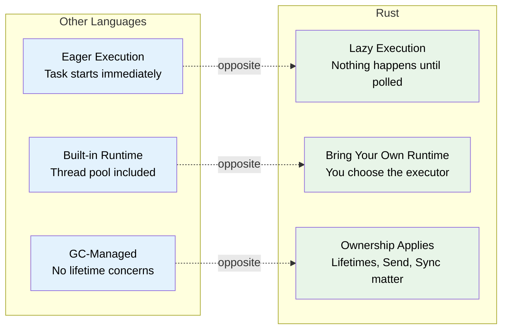
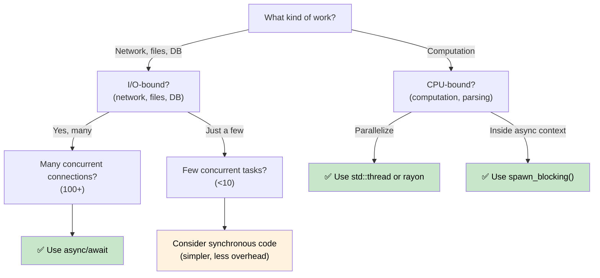

# 1. 为什么 Rust 的异步与众不同 🟢

> **你将学到：**
> - 为什么 Rust 没有内置异步运行时（以及这对你意味着什么）
> - 三个关键特性：惰性执行、无运行时、零成本抽象
> - 何时适合使用异步（以及何时会更慢）
> - Rust 的模型与 C#、Go、Python 和 JavaScript 的对比

## 根本区别

大多数带有 `async/await` 的语言都隐藏了底层机制。C# 有 CLR 线程池。JavaScript 有事件循环。Go 有 goroutine 和内置于运行时中的调度器。Python 有 `asyncio`。

**Rust 什么都没有。**

没有内置运行时，没有线程池，没有事件循环。`async` 关键字是一种零成本的编译策略——它将你的函数转换为一个实现 `Future` trait 的状态机。必须有其他东西（一个*执行器*）来驱动这个状态机向前运行。

### Rust 异步的三个关键特性



### 无内置运行时

```rust
// 这段代码能编译但什么都不做：
async fn fetch_data() -> String {
    "hello".to_string()
}

fn main() {
    let future = fetch_data(); // 创建了 Future，但没有执行它
    // future 只是一个放在栈上的结构体
    // 没有输出，没有副作用，什么都没发生
    drop(future); // 被静默丢弃——工作从未开始
}
```

对比 C# 中 `Task` 是立即启动的：

```csharp
// C# — 这会立即开始执行：
async Task<string> FetchData() => "hello";

var task = FetchData(); //已经在运行了！
var result = await task; // 只是等待完成
```

### 惰性 Future vs 积极 Task

这是最需要转变的心态：

| | C# / JavaScript / Python | Go | Rust |
|---|---|---|---|
| **创建** | `Task` 立即开始执行 | Goroutine 立即开始执行 | `Future` 在被轮询之前什么都不做 |
| **丢弃** | 分离的 Task 继续运行 | Goroutine 运行直到返回 | 丢弃 Future 会取消它 |
| **运行时** | 内置于语言/VM | 内置于二进制文件中（M:N 调度器） | 自己选择（tokio、smol 等） |
| **调度** | 自动（线程池） | 自动（GMP 调度器） | 显式（`spawn`、`block_on`） |
| **取消** | `CancellationToken`（协作式） | `context.Context`（协作式） | 丢弃 future（立即生效） |

```rust
// 要实际运行一个 future，你需要执行器：
#[tokio::main]
async fn main() {
    let result = fetch_data().await; // 现在才执行
    println!("{result}");
}
```

### 何时使用异步（何时不使用）



**经验法则**：异步用于 I/O 并发（在等待时同时做很多事情），而不是 CPU 并行（让一件事变得更快）。如果你有 10,000 个网络连接，异步就大放异彩。如果你是在做数值计算，使用 `rayon` 或 OS 线程。

### 异步何时会*更慢*

异步并非免费的。对于低并发工作负载，同步代码可能优于异步：

| 成本 | 原因 |
|------|------|
| **状态机开销** | 每个 `.await` 添加一个枚举变体；深层嵌套的 futures 产生大型复杂状态机 |
| **动态分派** | `Box<dyn Future>` 添加了间接层，阻止了内联 |
| **上下文切换** | 协作式调度仍有成本——执行器必须管理任务队列、waker 和 I/O 注册 |
| **编译时间** | 异步代码生成更复杂的类型，减慢编译速度 |
| **可调试性** | 状态机的栈追踪更难阅读（见第 12 章） |

**基准测试指南**：如果少于约 10 个并发 I/O 操作，在决定使用异步之前先做性能分析。在现代 Linux 上，每个连接一个简单的 `std::thread::spawn` 可以轻松扩展到数百个线程。

### 练习：何时使用异步？

<details>
<summary>🏋️ 练习（点击展开）</summary>

对于以下每个场景，决定是否适合使用异步并解释原因：

1. 一个处理 10,000 个并发 WebSocket 连接的 Web 服务器
2. 一个压缩单个大文件的 CLI 工具
3. 一个查询 5 个不同数据库并合并结果的服务
4. 一个以 60 FPS 运行物理模拟的游戏引擎

<details>
<summary>🔑 答案</summary>

1. **异步** — I/O 密集型且并发量巨大。每个连接大部分时间都在等待数据。线程方式需要 10K 个栈。
2. **同步/线程** — CPU 密集型，单一任务。异步增加开销但没有好处。使用 `rayon` 进行并行压缩。
3. **异步** — 五个并发 I/O 等待。`tokio::join!` 同时运行所有五个查询。
4. **同步/线程** — CPU 密集型，延迟敏感。异步的协作式调度可能引入帧抖动。

</details>
</details>

> **核心要点 — 为什么异步与众不同**
> - Rust futures 是**惰性的**——在被执行器轮询之前什么都不做
> - **没有内置运行时**——你自己选择（或构建）运行时
> - 异步是一种**零成本编译策略**，生成状态机
> - 异步在 **I/O 密集型并发**场景大放异彩；对于 CPU 密集型工作，使用线程或 rayon

> **另见：** [第 2 章 — Future Trait](ch02-the-future-trait.md) 了解使这一切工作的 trait，[第 7 章 — 执行器和运行时](ch07-executors-and-runtimes.md) 了解如何选择运行时

***
