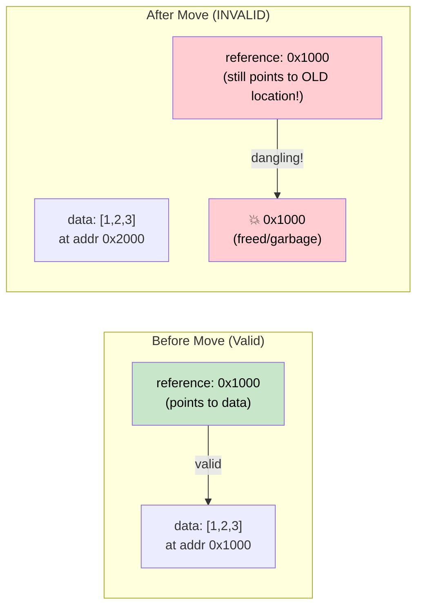

# 4. Pin and Unpin 🔴

> **What you'll learn:**
> - Why self-referential structs break when moved in memory
> - What `Pin<P>` guarantees and how it prevents moves
> - The three practical pinning patterns: `Box::pin()`, `tokio::pin!()`, `Pin::new()`
> - When `Unpin` gives you an escape hatch

## Why Pin Exists

This is the most confusing concept in async Rust. Let's build the intuition step by step.

### The Problem: Self-Referential Structs

When the compiler transforms an `async fn` into a state machine, that state machine may contain references to its own fields. This creates a *self-referential struct* — and moving it in memory would invalidate those internal references.

```rust
// What the compiler generates (simplified) for:
// async fn example() {
//     let data = vec![1, 2, 3];
//     let reference = &data;       // Points to data above
//     use_ref(reference).await;
// }

// Becomes something like:
enum ExampleStateMachine {
    State0 {
        data: Vec<i32>,
        // reference: &Vec<i32>,  // PROBLEM: points to `data` above
        //                        // If this struct moves, the pointer is dangling!
    },
    State1 {
        data: Vec<i32>,
        reference: *const Vec<i32>, // Internal pointer to data field
    },
    Complete,
}
```



### Self-Referential Structs

This isn't an academic concern. Every `async fn` that holds a reference across an `.await` point creates a self-referential state machine:

```rust
async fn problematic() {
    let data = String::from("hello");
    let slice = &data[..]; // slice borrows data
    
    some_io().await; // <-- .await point: state machine stores both data AND slice
    
    println!("{slice}"); // uses the reference after await
}
// The generated state machine has `data: String` and `slice: &str`
// where slice points INTO data. Moving the state machine = dangling pointer.
```

### Pin in Practice

`Pin<P>` is a wrapper that prevents moving the value behind the pointer:

```rust
use std::pin::Pin;

let mut data = String::from("hello");

// Pin it — now it can't be moved
let pinned: Pin<&mut String> = Pin::new(&mut data);

// Can still use it:
println!("{}", pinned.as_ref().get_ref()); // "hello"

// But we can't get &mut String back (which would allow mem::swap):
// let mutable: &mut String = Pin::into_inner(pinned); // Only if String: Unpin
// String IS Unpin, so this actually works for String.
// But for self-referential state machines (which are !Unpin), it's blocked.
```

In real code, you mostly encounter Pin in three places:

```rust
// 1. poll() signature — all futures are polled through Pin
fn poll(self: Pin<&mut Self>, cx: &mut Context<'_>) -> Poll<Output>;

// 2. Box::pin() — heap-allocate and pin a future
let future: Pin<Box<dyn Future<Output = i32>>> = Box::pin(async { 42 });

// 3. tokio::pin!() — pin a future on the stack
tokio::pin!(my_future);
// Now my_future: Pin<&mut impl Future>
```

### The Unpin Escape Hatch

Most types in Rust are `Unpin` — they don't contain self-references, so pinning is a no-op. Only compiler-generated state machines (from `async fn`) are `!Unpin`.

```rust
// These are all Unpin — pinning them does nothing special:
// i32, String, Vec<T>, HashMap<K,V>, Box<T>, &T, &mut T

// These are !Unpin — they MUST be pinned before polling:
// The state machines generated by `async fn` and `async {}`

// Practical implication:
// If you write a Future by hand and it has NO self-references,
// implement Unpin to make it easier to work with:
impl Unpin for MySimpleFuture {} // "I'm safe to move, trust me"
```

### Quick Reference

| What | When | How |
|------|------|-----|
| Pin a future on the heap | Storing in a collection, returning from function | `Box::pin(future)` |
| Pin a future on the stack | Local use in `select!` or manual polling | `tokio::pin!(future)` or `pin_mut!` from `pin-utils` |
| Pin in function signature | Accepting pinned futures | `future: Pin<&mut F>` |
| Require Unpin | When you need to move a future after creation | `F: Future + Unpin` |

<details>
<summary><strong>🏋️ Exercise: Pin and Move</strong> (click to expand)</summary>

**Challenge**: Which of these code snippets compile? For each one that doesn't, explain why and fix it.

```rust
// Snippet A
let fut = async { 42 };
let pinned = Box::pin(fut);
let moved = pinned; // Move the Box
let result = moved.await;

// Snippet B
let fut = async { 42 };
tokio::pin!(fut);
let moved = fut; // Move the pinned future
let result = moved.await;

// Snippet C
use std::pin::Pin;
let mut fut = async { 42 };
let pinned = Pin::new(&mut fut);
```

<details>
<summary>🔑 Solution</summary>

**Snippet A**: ✅ **Compiles.** `Box::pin()` puts the future on the heap. Moving the `Box` moves the *pointer*, not the future itself. The future stays pinned in its heap location.

**Snippet B**: ❌ **Does not compile.** `tokio::pin!` pins the future to the stack and rebinds `fut` as `Pin<&mut ...>`. You can't move out of a pinned reference. **Fix**: Don't move it — use it in place:
```rust
let fut = async { 42 };
tokio::pin!(fut);
let result = fut.await; // Use directly, don't reassign
```

**Snippet C**: ❌ **Does not compile.** `Pin::new()` requires `T: Unpin`. Async blocks generate `!Unpin` types. **Fix**: Use `Box::pin()` or `unsafe Pin::new_unchecked()`:
```rust
let fut = async { 42 };
let pinned = Box::pin(fut); // Heap-pin — works with !Unpin
```

**Key takeaway**: `Box::pin()` is the safe, easy way to pin `!Unpin` futures. `tokio::pin!()` pins on the stack but the future can't be moved after. `Pin::new()` only works with `Unpin` types.

</details>
</details>

> **Key Takeaways — Pin and Unpin**
> - `Pin<P>` is a wrapper that **prevents the pointee from being moved** — essential for self-referential state machines
> - `Box::pin()` is the safe, easy default for pinning futures on the heap
> - `tokio::pin!()` pins on the stack — cheaper but the future can't be moved afterward
> - `Unpin` is an auto-trait opt-out: types that implement `Unpin` can be moved even when pinned (most types are `Unpin`; async blocks are not)

> **See also:** [Ch 2 — The Future Trait](ch02-the-future-trait.md) for `Pin<&mut Self>` in poll, [Ch 5 — The State Machine Reveal](ch05-the-state-machine-reveal.md) for why async state machines are self-referential

***


