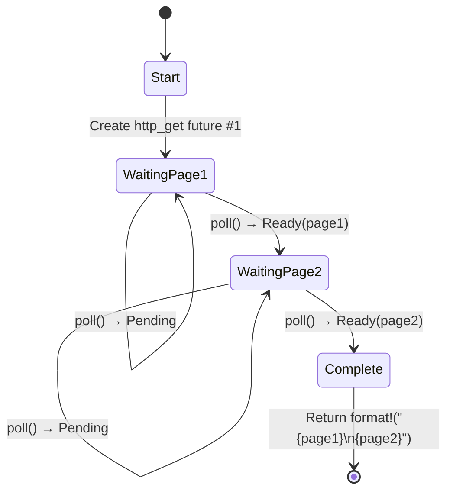

# 5. The State Machine Reveal 🟢

> **What you'll learn:**
> - How the compiler transforms `async fn` into an enum state machine
> - Side-by-side comparison: source code vs generated states
> - Why large stack allocations in `async fn` blow up future sizes
> - The drop optimization: values drop as soon as they're no longer needed

## What the Compiler Actually Generates

When you write `async fn`, the compiler transforms your sequential-looking code into an enum-based state machine. Understanding this transformation is the key to understanding async Rust's performance characteristics and many of its quirks.

### Side-by-Side: async fn vs State Machine

```rust
// What you write:
async fn fetch_two_pages() -> String {
    let page1 = http_get("https://example.com/a").await;
    let page2 = http_get("https://example.com/b").await;
    format!("{page1}\n{page2}")
}
```

The compiler generates something conceptually like this:

```rust
enum FetchTwoPagesStateMachine {
    // State 0: About to call http_get for page1
    Start,

    // State 1: Waiting for page1, holding the future
    WaitingPage1 {
        fut1: HttpGetFuture,
    },

    // State 2: Got page1, waiting for page2
    WaitingPage2 {
        page1: String,
        fut2: HttpGetFuture,
    },

    // Terminal state
    Complete,
}

impl Future for FetchTwoPagesStateMachine {
    type Output = String;

    fn poll(mut self: Pin<&mut Self>, cx: &mut Context<'_>) -> Poll<String> {
        loop {
            match self.as_mut().get_mut() {
                Self::Start => {
                    let fut1 = http_get("https://example.com/a");
                    *self.as_mut().get_mut() = Self::WaitingPage1 { fut1 };
                }
                Self::WaitingPage1 { fut1 } => {
                    let page1 = match Pin::new(fut1).poll(cx) {
                        Poll::Ready(v) => v,
                        Poll::Pending => return Poll::Pending,
                    };
                    let fut2 = http_get("https://example.com/b");
                    *self.as_mut().get_mut() = Self::WaitingPage2 { page1, fut2 };
                }
                Self::WaitingPage2 { page1, fut2 } => {
                    let page2 = match Pin::new(fut2).poll(cx) {
                        Poll::Ready(v) => v,
                        Poll::Pending => return Poll::Pending,
                    };
                    let result = format!("{page1}\n{page2}");
                    *self.as_mut().get_mut() = Self::Complete;
                    return Poll::Ready(result);
                }
                Self::Complete => panic!("polled after completion"),
            }
        }
    }
}
```

> **Note**: This desugaring is *conceptual*. The real compiler output uses
> `unsafe` pin projections — the `get_mut()` calls shown here require
> `Unpin`, but async state machines are `!Unpin`. The goal is to illustrate
> state transitions, not produce compilable code.



> **State contents:**
> - **WaitingPage1** — stores `fut1: HttpGetFuture` (page2 not yet allocated)
> - **WaitingPage2** — stores `page1: String`, `fut2: HttpGetFuture` (fut1 has been dropped)

### Why This Matters for Performance

**Zero-cost**: The state machine is a stack-allocated enum. No heap allocation per future, no garbage collector, no boxing — unless you explicitly use `Box::pin()`.

**Size**: The enum's size is the maximum of all its variants. Each `.await` point creates a new variant. This means:

```rust
async fn small() {
    let a: u8 = 0;
    yield_now().await;
    let b: u8 = 0;
    yield_now().await;
}
// Size ≈ max(size_of(u8), size_of(u8)) + discriminant + future sizes
//      ≈ small!

async fn big() {
    let buf: [u8; 1_000_000] = [0; 1_000_000]; // 1MB on the stack!
    some_io().await;
    process(&buf);
}
// Size ≈ 1MB + inner future sizes
// ⚠️ Don't stack-allocate huge buffers in async functions!
// Use Vec<u8> or Box<[u8]> instead.
```

**Drop optimization**: When a state machine transitions, it drops values no longer needed. In the example above, `fut1` is dropped when we transition from `WaitingPage1` to `WaitingPage2` — the compiler inserts the drop automatically.

> **Practical rule**: Large stack allocations in `async fn` blow up the future's
> size. If you see stack overflows in async code, check for large arrays or
> deeply nested futures. Use `Box::pin()` to heap-allocate sub-futures if needed.

### Exercise: Predict the State Machine

<details>
<summary>🏋️ Exercise (click to expand)</summary>

**Challenge**: Given this async function, sketch the state machine the compiler generates. How many states (enum variants) does it have? What values are stored in each?

```rust
async fn pipeline(url: &str) -> Result<usize, Error> {
    let response = fetch(url).await?;
    let body = response.text().await?;
    let parsed = parse(body).await?;
    Ok(parsed.len())
}
```

<details>
<summary>🔑 Solution</summary>

Four states:

1. **Start** — stores `url`
2. **WaitingFetch** — stores `url`, `fetch` future
3. **WaitingText** — stores `response`, `text()` future
4. **WaitingParse** — stores `body`, `parse` future
5. **Done** — returned `Ok(parsed.len())`

Each `.await` creates a yield point = a new enum variant. The `?` adds early-exit paths but doesn't add extra states — it's just a `match` on the `Poll::Ready` value.

</details>
</details>

> **Key Takeaways — The State Machine Reveal**
> - `async fn` compiles to an enum with one variant per `.await` point
> - The future's **size** = max of all variant sizes — large stack values blow it up
> - The compiler inserts **drops** at state transitions automatically
> - Use `Box::pin()` or heap allocation when future size becomes a problem

> **See also:** [Ch 4 — Pin and Unpin](ch04-pin-and-unpin.md) for why the generated enum needs pinning, [Ch 6 — Building Futures by Hand](ch06-building-futures-by-hand.md) to build these state machines yourself

***


