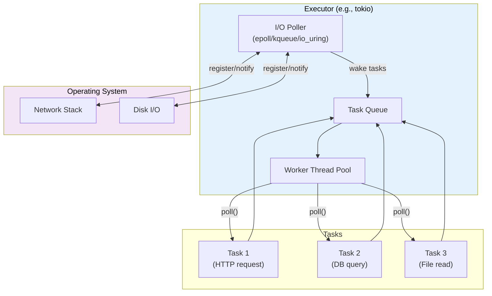
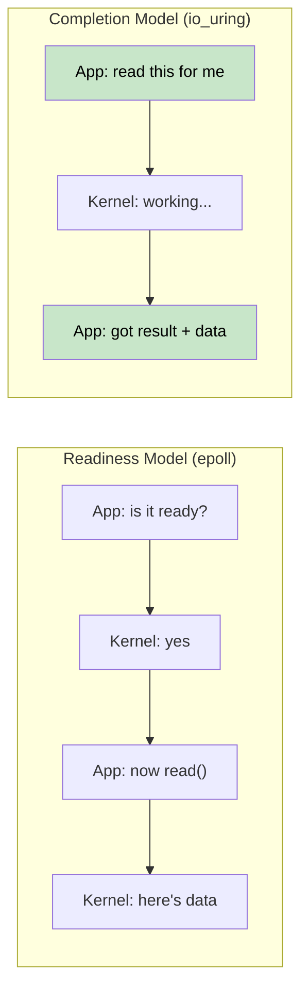
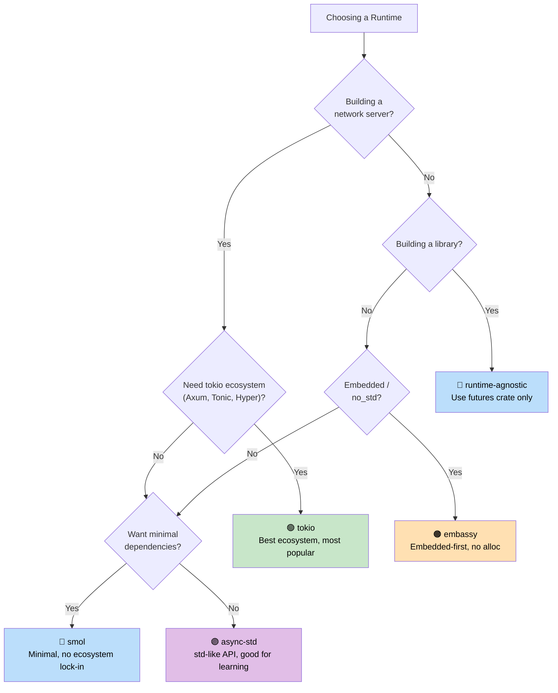

# 7. Executors and Runtimes 🟡

> **What you'll learn:**
> - What an executor does: poll + sleep efficiently
> - The six major runtimes: mio, io_uring, tokio, async-std, smol, embassy
> - A decision tree for choosing the right runtime
> - Why runtime-agnostic library design matters

## What an Executor Does

An executor has two jobs:
1. **Poll futures** when they're ready to make progress
2. **Sleep efficiently** when no futures are ready (using OS I/O notification APIs)



### mio: The Foundation Layer

[mio](https://github.com/tokio-rs/mio) (Metal I/O) is not an executor — it's the lowest-level cross-platform I/O notification library. It wraps `epoll` (Linux), `kqueue` (macOS/BSD), and IOCP (Windows).

```rust
// Conceptual mio usage (simplified):
use mio::{Events, Interest, Poll, Token};
use mio::net::TcpListener;

let mut poll = Poll::new()?;
let mut events = Events::with_capacity(128);

let mut server = TcpListener::bind("0.0.0.0:8080")?;
poll.registry().register(&mut server, Token(0), Interest::READABLE)?;

// Event loop — blocks until something happens
loop {
    poll.poll(&mut events, None)?; // Sleeps until I/O event
    for event in events.iter() {
        match event.token() {
            Token(0) => { /* server has a new connection */ }
            _ => { /* other I/O ready */ }
        }
    }
}
```

Most developers never touch mio directly — tokio and smol build on top of it.

### io_uring: The Completion-Based Future

Linux's `io_uring` (kernel 5.1+) represents a fundamental shift from the readiness-based I/O model that mio/epoll use:

```text
Readiness-based (epoll / mio / tokio):
  1. Ask: "Is this socket readable?"     → epoll_wait()
  2. Kernel: "Yes, it's ready"           → EPOLLIN event
  3. App:   read(fd, buf)                → might still block briefly!

Completion-based (io_uring):
  1. Submit: "Read from this socket into this buffer"  → SQE
  2. Kernel: does the read asynchronously
  3. App:   gets completed result with data            → CQE
```



**The ownership challenge**: io_uring requires the kernel to own the buffer until the operation completes. This conflicts with Rust's standard `AsyncRead` trait which borrows the buffer. That's why `tokio-uring` has different I/O traits:

```rust
// Standard tokio (readiness-based) — borrows the buffer:
let n = stream.read(&mut buf).await?;  // buf is borrowed

// tokio-uring (completion-based) — takes ownership of the buffer:
let (result, buf) = stream.read(buf).await;  // buf is moved in, returned back
let n = result?;
```

```rust
// Cargo.toml: tokio-uring = "0.5"
// NOTE: Linux-only, requires kernel 5.1+

fn main() {
    tokio_uring::start(async {
        let file = tokio_uring::fs::File::open("data.bin").await.unwrap();
        let buf = vec![0u8; 4096];
        let (result, buf) = file.read_at(buf, 0).await;
        let bytes_read = result.unwrap();
        println!("Read {} bytes: {:?}", bytes_read, &buf[..bytes_read]);
    });
}
```

| Aspect | epoll (tokio) | io_uring (tokio-uring) |
|--------|--------------|----------------------|
| **Model** | Readiness notification | Completion notification |
| **Syscalls** | epoll_wait + read/write | Batched SQE/CQE ring |
| **Buffer ownership** | App retains (&mut buf) | Ownership transfer (move buf) |
| **Platform** | Linux, macOS (kqueue), Windows (IOCP) | Linux 5.1+ only |
| **Zero-copy** | No (userspace copy) | Yes (registered buffers) |
| **Maturity** | Production-ready | Experimental |

> **When to use io_uring**: High-throughput file I/O or networking where syscall overhead is the bottleneck (databases, storage engines, proxies serving 100k+ connections). For most applications, standard tokio with epoll is the right choice.

### tokio: The Batteries-Included Runtime

The dominant async runtime in the Rust ecosystem. Used by Axum, Hyper, Tonic, and most production Rust servers.

```rust
// Cargo.toml:
// [dependencies]
// tokio = { version = "1", features = ["full"] }

#[tokio::main]
async fn main() {
    // Spawns a multi-threaded runtime with work-stealing scheduler
    let handle = tokio::spawn(async {
        tokio::time::sleep(std::time::Duration::from_secs(1)).await;
        "done"
    });

    let result = handle.await.unwrap();
    println!("{result}");
}
```

**tokio features**: Timer, I/O, TCP/UDP, Unix sockets, signal handling, sync primitives (Mutex, RwLock, Semaphore, channels), fs, process, tracing integration.

### async-std: The Standard Library Mirror

Mirrors the `std` API with async versions. Less popular than tokio but simpler for beginners.

```rust
// Cargo.toml:
// [dependencies]
// async-std = { version = "1", features = ["attributes"] }

#[async_std::main]
async fn main() {
    use async_std::fs;
    let content = fs::read_to_string("hello.txt").await.unwrap();
    println!("{content}");
}
```

### smol: The Minimalist Runtime

Small, zero-dependency async runtime. Great for libraries that want async without pulling in tokio.

```rust
// Cargo.toml:
// [dependencies]
// smol = "2"

fn main() {
    smol::block_on(async {
        let result = smol::unblock(|| {
            // Runs blocking code on a thread pool
            std::fs::read_to_string("hello.txt")
        }).await.unwrap();
        println!("{result}");
    });
}
```

### embassy: Async for Embedded (no_std)

Async runtime for embedded systems. No heap allocation, no `std` required.

```rust
// Runs on microcontrollers (e.g., STM32, nRF52, RP2040)
#[embassy_executor::main]
async fn main(spawner: embassy_executor::Spawner) {
    // Blink an LED with async/await — no RTOS needed!
    let mut led = Output::new(p.PA5, Level::Low, Speed::Low);
    loop {
        led.set_high();
        Timer::after(Duration::from_millis(500)).await;
        led.set_low();
        Timer::after(Duration::from_millis(500)).await;
    }
}
```

### Runtime Decision Tree



### Runtime Comparison Table

| Feature | tokio | async-std | smol | embassy |
|---------|-------|-----------|------|---------|
| **Ecosystem** | Dominant | Small | Minimal | Embedded |
| **Multi-threaded** | ✅ Work-stealing | ✅ | ✅ | ❌ (single-core) |
| **no_std** | ❌ | ❌ | ❌ | ✅ |
| **Timer** | ✅ Built-in | ✅ Built-in | Via `async-io` | ✅ HAL-based |
| **I/O** | ✅ Own abstractions | ✅ std mirror | ✅ Via `async-io` | ✅ HAL drivers |
| **Channels** | ✅ Rich set | ✅ | Via `async-channel` | ✅ |
| **Learning curve** | Medium | Low | Low | High (HW) |
| **Binary size** | Large | Medium | Small | Tiny |

<details>
<summary><strong>🏋️ Exercise: Runtime Comparison</strong> (click to expand)</summary>

**Challenge**: Write the same program using three different runtimes (tokio, smol, and async-std). The program should:
1. Fetch a URL (simulate with a sleep)
2. Read a file (simulate with a sleep)
3. Print both results

This exercise demonstrates that the async/await code is the same — only the runtime setup differs.

<details>
<summary>🔑 Solution</summary>

```rust
// ----- tokio version -----
// Cargo.toml: tokio = { version = "1", features = ["full"] }
#[tokio::main]
async fn main() {
    let (url_result, file_result) = tokio::join!(
        async {
            tokio::time::sleep(std::time::Duration::from_millis(100)).await;
            "Response from URL"
        },
        async {
            tokio::time::sleep(std::time::Duration::from_millis(50)).await;
            "Contents of file"
        },
    );
    println!("URL: {url_result}, File: {file_result}");
}

// ----- smol version -----
// Cargo.toml: smol = "2", futures-lite = "2"
fn main() {
    smol::block_on(async {
        let (url_result, file_result) = futures_lite::future::zip(
            async {
                smol::Timer::after(std::time::Duration::from_millis(100)).await;
                "Response from URL"
            },
            async {
                smol::Timer::after(std::time::Duration::from_millis(50)).await;
                "Contents of file"
            },
        ).await;
        println!("URL: {url_result}, File: {file_result}");
    });
}

// ----- async-std version -----
// Cargo.toml: async-std = { version = "1", features = ["attributes"] }
#[async_std::main]
async fn main() {
    let (url_result, file_result) = futures::future::join(
        async {
            async_std::task::sleep(std::time::Duration::from_millis(100)).await;
            "Response from URL"
        },
        async {
            async_std::task::sleep(std::time::Duration::from_millis(50)).await;
            "Contents of file"
        },
    ).await;
    println!("URL: {url_result}, File: {file_result}");
}
```

**Key takeaway**: The async business logic is identical across runtimes. Only the entry point and timer/IO APIs differ. This is why writing runtime-agnostic libraries (using only `std::future::Future`) is valuable.

</details>
</details>

> **Key Takeaways — Executors and Runtimes**
> - An executor's job: poll futures when woken, sleep efficiently using OS I/O APIs
> - **tokio** is the default for servers; **smol** for minimal footprint; **embassy** for embedded
> - Your business logic should depend on `std::future::Future`, not a specific runtime
> - io_uring (Linux 5.1+) is the future of high-perf I/O but the ecosystem is still maturing

> **See also:** [Ch 8 — Tokio Deep Dive](ch08-tokio-deep-dive.md) for tokio specifics, [Ch 9 — When Tokio Isn't the Right Fit](ch09-when-tokio-isnt-the-right-fit.md) for alternatives

***


