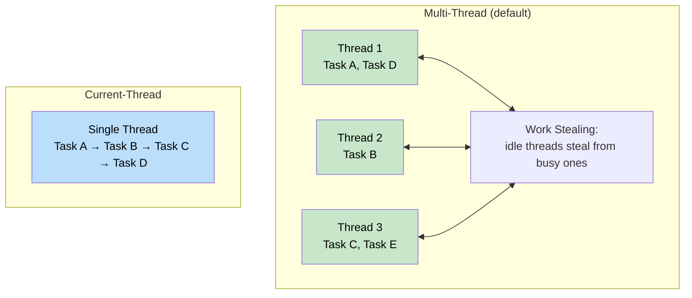
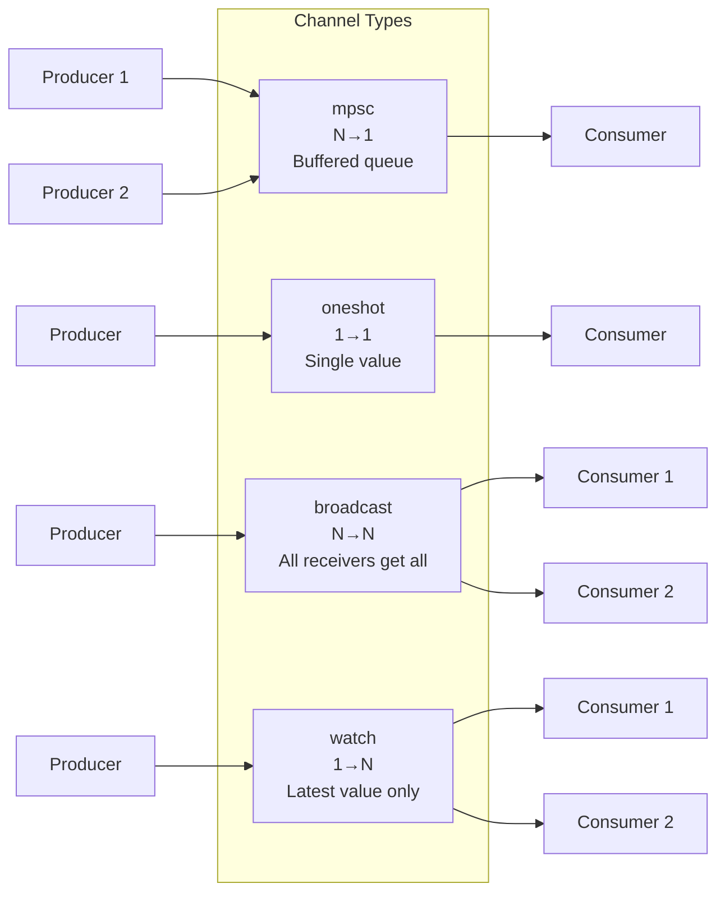
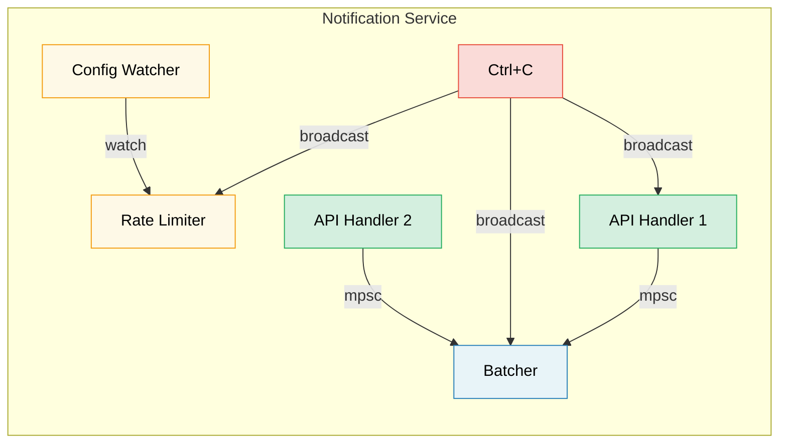

# 8. Tokio Deep Dive 🟡

> **What you'll learn:**
> - Runtime flavors: multi-thread vs current-thread and when to use each
> - `tokio::spawn`, the `'static` requirement, and `JoinHandle`
> - Task cancellation semantics (cancel-on-drop)
> - Sync primitives: Mutex, RwLock, Semaphore, and all four channel types

## Runtime Flavors: Multi-Thread vs Current-Thread

Tokio offers two runtime configurations:

```rust
// Multi-threaded (default with #[tokio::main])
// Uses a work-stealing thread pool — tasks can move between threads
#[tokio::main]
async fn main() {
    // N worker threads (default = number of CPU cores)
    // Tasks are Send + 'static
}

// Current-thread — everything runs on one thread
#[tokio::main(flavor = "current_thread")]
async fn main() {
    // Single-threaded — tasks don't need to be Send
    // Lighter weight, good for simple tools or WASM
}

// Manual runtime construction:
let rt = tokio::runtime::Builder::new_multi_thread()
    .worker_threads(4)
    .enable_all()
    .build()
    .unwrap();

rt.block_on(async {
    println!("Running on custom runtime");
});
```



### tokio::spawn and the 'static Requirement

`tokio::spawn` puts a future onto the runtime's task queue. Because it might run on *any* worker thread at *any* time, the future must be `Send + 'static`:

```rust
use tokio::task;

async fn example() {
    let data = String::from("hello");

    // ✅ Works: move ownership into the task
    let handle = task::spawn(async move {
        println!("{data}");
        data.len()
    });

    let len = handle.await.unwrap();
    println!("Length: {len}");
}

async fn problem() {
    let data = String::from("hello");

    // ❌ FAILS: data is borrowed, not 'static
    // task::spawn(async {
    //     println!("{data}"); // borrows `data` — not 'static
    // });

    // ❌ FAILS: Rc is not Send
    // let rc = std::rc::Rc::new(42);
    // task::spawn(async move {
    //     println!("{rc}"); // Rc is !Send — can't cross thread boundary
    // });
}
```

**Why `'static`?** The spawned task runs independently — it might outlive the scope that created it. The compiler can't prove the references will remain valid, so it requires owned data.

**Why `Send`?** The task might be resumed on a different thread than where it was suspended. All data held across `.await` points must be safe to send between threads.

```rust
// Common pattern: clone shared data into the task
let shared = Arc::new(config);

for i in 0..10 {
    let shared = Arc::clone(&shared); // Clone the Arc, not the data
    tokio::spawn(async move {
        process_item(i, &shared).await;
    });
}
```

### JoinHandle and Task Cancellation

```rust
use tokio::task::JoinHandle;
use tokio::time::{sleep, Duration};

async fn cancellation_example() {
    let handle: JoinHandle<String> = tokio::spawn(async {
        sleep(Duration::from_secs(10)).await;
        "completed".to_string()
    });

    // Cancel the task by dropping the handle? NO — task keeps running!
    // drop(handle); // Task continues in the background

    // To actually cancel, call abort():
    handle.abort();

    // Awaiting an aborted task returns JoinError
    match handle.await {
        Ok(val) => println!("Got: {val}"),
        Err(e) if e.is_cancelled() => println!("Task was cancelled"),
        Err(e) => println!("Task panicked: {e}"),
    }
}
```

> **Important**: Dropping a `JoinHandle` does NOT cancel the task in tokio.
> The task becomes *detached* and keeps running. You must explicitly call
> `.abort()` to cancel it. This is different from dropping a `Future` directly,
> which does cancel/drop the underlying computation.

### Tokio Sync Primitives

Tokio provides async-aware synchronization primitives. The key principle: **don't use `std::sync::Mutex` across `.await` points**.

```rust
use tokio::sync::{Mutex, RwLock, Semaphore, mpsc, oneshot, broadcast, watch};

// --- Mutex ---
// Async mutex: the lock() method is async and won't block the thread
let data = Arc::new(Mutex::new(vec![1, 2, 3]));
{
    let mut guard = data.lock().await; // Non-blocking lock
    guard.push(4);
} // Guard dropped here — lock released

// --- Channels ---
// mpsc: Multiple producer, single consumer
let (tx, mut rx) = mpsc::channel::<String>(100); // Bounded buffer

tokio::spawn(async move {
    tx.send("hello".into()).await.unwrap();
});

let msg = rx.recv().await.unwrap();

// oneshot: Single value, single consumer
let (tx, rx) = oneshot::channel::<i32>();
tx.send(42).unwrap(); // No await needed — either sends or fails
let val = rx.await.unwrap();

// broadcast: Multiple producers, multiple consumers (all get every message)
let (tx, _) = broadcast::channel::<String>(100);
let mut rx1 = tx.subscribe();
let mut rx2 = tx.subscribe();

// watch: Single value, multiple consumers (only latest value)
let (tx, rx) = watch::channel(0u64);
tx.send(42).unwrap();
println!("Latest: {}", *rx.borrow());
```



## Case Study: Choosing the Right Channel for a Notification Service

You're building a notification service where:
- Multiple API handlers produce events
- A single background task batches and sends them
- A config watcher updates rate limits at runtime
- A shutdown signal must reach all components

**Which channels for each?**

| Requirement | Channel | Why |
|-------------|---------|-----|
| API handlers → Batcher | `mpsc` (bounded) | N producers, 1 consumer. Bounded for backpressure — if the batcher falls behind, API handlers slow down instead of OOM |
| Config watcher → Rate limiter | `watch` | Only the latest config matters. Multiple readers (each worker) see the current value |
| Shutdown signal → All components | `broadcast` | Every component must receive the shutdown notification independently |
| Single health-check response | `oneshot` | Request/response pattern — one value, then done |



<details>
<summary><strong>🏋️ Exercise: Build a Task Pool</strong> (click to expand)</summary>

**Challenge**: Build a function `run_with_limit` that accepts a list of async closures and a concurrency limit, executing at most N tasks simultaneously. Use `tokio::sync::Semaphore`.

<details>
<summary>🔑 Solution</summary>

```rust
use std::future::Future;
use std::sync::Arc;
use tokio::sync::Semaphore;

async fn run_with_limit<F, Fut, T>(tasks: Vec<F>, limit: usize) -> Vec<T>
where
    F: FnOnce() -> Fut + Send + 'static,
    Fut: Future<Output = T> + Send + 'static,
    T: Send + 'static,
{
    let semaphore = Arc::new(Semaphore::new(limit));
    let mut handles = Vec::new();

    for task in tasks {
        let permit = Arc::clone(&semaphore);
        let handle = tokio::spawn(async move {
            let _permit = permit.acquire().await.unwrap();
            // Permit is held while task runs, then dropped
            task().await
        });
        handles.push(handle);
    }

    let mut results = Vec::new();
    for handle in handles {
        results.push(handle.await.unwrap());
    }
    results
}

// Usage:
// let tasks: Vec<_> = urls.into_iter().map(|url| {
//     move || async move { fetch(url).await }
// }).collect();
// let results = run_with_limit(tasks, 10).await; // Max 10 concurrent
```

**Key takeaway**: `Semaphore` is the standard way to limit concurrency in tokio. Each task acquires a permit before starting work. When the semaphore is full, new tasks wait asynchronously (non-blocking) until a slot opens.

</details>
</details>

> **Key Takeaways — Tokio Deep Dive**
> - Use `multi_thread` for servers (default); `current_thread` for CLI tools, tests, or `!Send` types
> - `tokio::spawn` requires `'static` futures — use `Arc` or channels to share data
> - Dropping a `JoinHandle` does **not** cancel the task — call `.abort()` explicitly
> - Choose sync primitives by need: `Mutex` for shared state, `Semaphore` for concurrency limits, `mpsc`/`oneshot`/`broadcast`/`watch` for communication

> **See also:** [Ch 9 — When Tokio Isn't the Right Fit](ch09-when-tokio-isnt-the-right-fit.md) for alternatives to spawn, [Ch 12 — Common Pitfalls](ch12-common-pitfalls.md) for MutexGuard-across-await bugs

***


