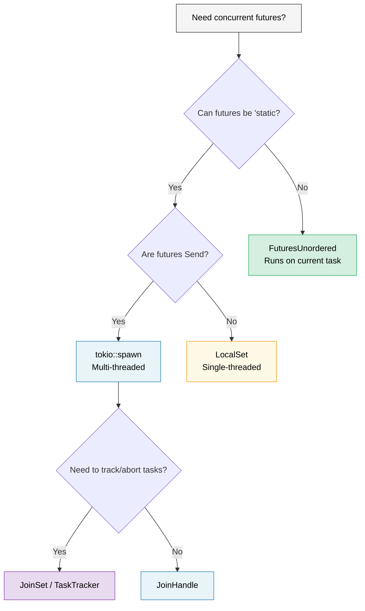

# 9. When Tokio Isn't the Right Fit 🟡

> **What you'll learn:**
> - The `'static` problem: when `tokio::spawn` forces you into `Arc` everywhere
> - `LocalSet` for `!Send` futures
> - `FuturesUnordered` for borrow-friendly concurrency (no spawn needed)
> - `JoinSet` for managed task groups
> - Writing runtime-agnostic libraries



## The 'static Future Problem

Tokio's `spawn` requires `'static` futures. This means you can't borrow local data in spawned tasks:

```rust
async fn process_items(items: &[String]) {
    // ❌ Can't do this — items is borrowed, not 'static
    // for item in items {
    //     tokio::spawn(async {
    //         process(item).await;
    //     });
    // }

    // 😐 Workaround 1: Clone everything
    for item in items {
        let item = item.clone();
        tokio::spawn(async move {
            process(&item).await;
        });
    }

    // 😐 Workaround 2: Use Arc
    let items = Arc::new(items.to_vec());
    for i in 0..items.len() {
        let items = Arc::clone(&items);
        tokio::spawn(async move {
            process(&items[i]).await;
        });
    }
}
```

This is annoying! In Go, you can just `go func() { use(item) }` with a closure. In Rust, the ownership system forces you to think about who owns what and how long it lives.

### Scoped Tasks and Alternatives

Several solutions exist for the `'static` problem:

```rust
// 1. tokio::task::LocalSet — run !Send futures on current thread
use tokio::task::LocalSet;

let local_set = LocalSet::new();
local_set.run_until(async {
    tokio::task::spawn_local(async {
        // Can use Rc, Cell, and other !Send types here
        let rc = std::rc::Rc::new(42);
        println!("{rc}");
    }).await.unwrap();
}).await;

// 2. FuturesUnordered — concurrent without spawning
use futures::stream::{FuturesUnordered, StreamExt};

async fn process_items(items: &[String]) {
    let futures: FuturesUnordered<_> = items
        .iter()
        .map(|item| async move {
            // ✅ Can borrow item — no spawn, no 'static needed!
            process(item).await
        })
        .collect();

    // Drive all futures to completion
    futures.for_each(|result| async {
        println!("Result: {result:?}");
    }).await;
}

// 3. tokio JoinSet (tokio 1.21+) — managed set of spawned tasks
use tokio::task::JoinSet;

async fn with_joinset() {
    let mut set = JoinSet::new();

    for i in 0..10 {
        set.spawn(async move {
            tokio::time::sleep(Duration::from_millis(100)).await;
            i * 2
        });
    }

    while let Some(result) = set.join_next().await {
        println!("Task completed: {:?}", result.unwrap());
    }
}
```

### Lightweight Runtimes for Libraries

If you're writing a library — don't force users into tokio:

```rust
// ❌ BAD: Library forces tokio on users
pub async fn my_lib_function() {
    tokio::time::sleep(Duration::from_secs(1)).await;
    // Now your users MUST use tokio
}

// ✅ GOOD: Library is runtime-agnostic
pub async fn my_lib_function() {
    // Use only types from std::future and futures crate
    do_computation().await;
}

// ✅ GOOD: Accept a generic future for I/O operations
pub async fn fetch_with_retry<F, Fut, T, E>(
    operation: F,
    max_retries: usize,
) -> Result<T, E>
where
    F: Fn() -> Fut,
    Fut: Future<Output = Result<T, E>>,
{
    for attempt in 0..max_retries {
        match operation().await {
            Ok(val) => return Ok(val),
            Err(e) if attempt == max_retries - 1 => return Err(e),
            Err(_) => continue,
        }
    }
    unreachable!()
}
```

> **Rule of thumb**: Libraries should depend on `futures` crate, not `tokio`.
> Applications should depend on `tokio` (or their chosen runtime).
> This keeps the ecosystem composable.

<details>
<summary><strong>🏋️ Exercise: FuturesUnordered vs Spawn</strong> (click to expand)</summary>

**Challenge**: Write the same function two ways — once using `tokio::spawn` (requires `'static`) and once using `FuturesUnordered` (borrows data). The function receives `&[String]` and returns the length of each string after a simulated async lookup.

Compare: Which approach requires `.clone()`? Which can borrow the input slice?

<details>
<summary>🔑 Solution</summary>

```rust
use futures::stream::{FuturesUnordered, StreamExt};
use tokio::time::{sleep, Duration};

// Version 1: tokio::spawn — requires 'static, must clone
async fn lengths_with_spawn(items: &[String]) -> Vec<usize> {
    let mut handles = Vec::new();
    for item in items {
        let owned = item.clone(); // Must clone — spawn requires 'static
        handles.push(tokio::spawn(async move {
            sleep(Duration::from_millis(10)).await;
            owned.len()
        }));
    }

    let mut results = Vec::new();
    for handle in handles {
        results.push(handle.await.unwrap());
    }
    results
}

// Version 2: FuturesUnordered — borrows data, no clone needed
async fn lengths_without_spawn(items: &[String]) -> Vec<usize> {
    let futures: FuturesUnordered<_> = items
        .iter()
        .map(|item| async move {
            sleep(Duration::from_millis(10)).await;
            item.len() // ✅ Borrows item — no clone!
        })
        .collect();

    futures.collect().await
}

#[tokio::test]
async fn test_both_versions() {
    let items = vec!["hello".into(), "world".into(), "rust".into()];

    let v1 = lengths_with_spawn(&items).await;
    // Note: v1 preserves insertion order (sequential join)

    let mut v2 = lengths_without_spawn(&items).await;
    v2.sort(); // FuturesUnordered returns in completion order

    assert_eq!(v1, vec![5, 5, 4]);
    assert_eq!(v2, vec![4, 5, 5]);
}
```

**Key takeaway**: `FuturesUnordered` avoids the `'static` requirement by running all futures on the current task (no thread migration). The trade-off: all futures share one task — if one blocks, the others stall. Use `spawn` for CPU-heavy work that should run on separate threads.

</details>
</details>

> **Key Takeaways — When Tokio Isn't the Right Fit**
> - `FuturesUnordered` runs futures concurrently on the current task — no `'static` requirement
> - `LocalSet` enables `!Send` futures on a single-threaded executor
> - `JoinSet` (tokio 1.21+) provides managed task groups with automatic cleanup
> - For libraries: depend only on `std::future::Future` + `futures` crate, not tokio directly

> **See also:** [Ch 8 — Tokio Deep Dive](ch08-tokio-deep-dive.md) for when spawn is the right tool, [Ch 11 — Streams](ch11-streams-and-asynciterator.md) for `buffer_unordered()` as another concurrency limiter

***


