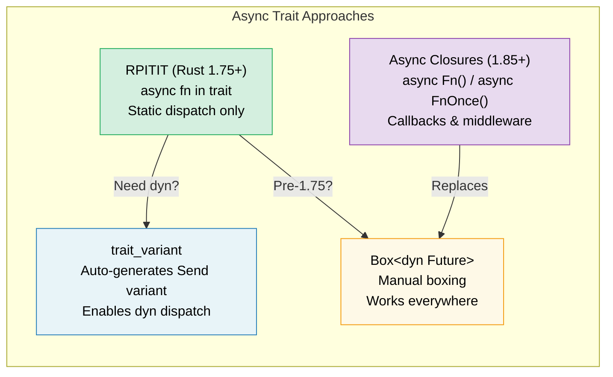

# 10. Async Traits 🟡

> **What you'll learn:**
> - Why async methods in traits took years to stabilize
> - RPITIT: native async trait methods (Rust 1.75+)
> - The dyn dispatch challenge and `trait_variant` workaround
> - Async closures (Rust 1.85+): `async Fn()` and `async FnOnce()`



## The History: Why It Took So Long

Async methods in traits were Rust's most requested feature for years. The problem:

```rust
// This didn't compile until Rust 1.75 (Dec 2023):
trait DataStore {
    async fn get(&self, key: &str) -> Option<String>;
}
// Why? Because async fn returns `impl Future<Output = T>`,
// and `impl Trait` in trait return position wasn't supported.
```

The fundamental challenge: when a trait method returns `impl Future`, each implementor returns a *different concrete type*. The compiler needs to know the size of the return type, but trait methods are dynamically dispatched.

### RPITIT: Return Position Impl Trait in Trait

Since Rust 1.75, this just works for static dispatch:

```rust
trait DataStore {
    async fn get(&self, key: &str) -> Option<String>;
    // Desugars to:
    // fn get(&self, key: &str) -> impl Future<Output = Option<String>>;
}

struct InMemoryStore {
    data: std::collections::HashMap<String, String>,
}

impl DataStore for InMemoryStore {
    async fn get(&self, key: &str) -> Option<String> {
        self.data.get(key).cloned()
    }
}

// ✅ Works with generics (static dispatch):
async fn lookup<S: DataStore>(store: &S, key: &str) {
    if let Some(val) = store.get(key).await {
        println!("{key} = {val}");
    }
}
```

### dyn Dispatch and Send Bounds

The limitation: you can't use `dyn DataStore` directly because the compiler doesn't know the size of the returned future:

```rust
// ❌ Doesn't work:
// async fn lookup_dyn(store: &dyn DataStore, key: &str) { ... }
// Error: the trait `DataStore` is not dyn-compatible because method `get`
//        is `async`

// ✅ Workaround: Return a boxed future
trait DynDataStore {
    fn get(&self, key: &str) -> Pin<Box<dyn Future<Output = Option<String>> + Send + '_>>;
}

// Or use the trait_variant macro (see below)
```

**The Send problem**: In multi-threaded runtimes, spawned tasks must be `Send`. But async trait methods don't automatically add `Send` bounds:

```rust
trait Worker {
    async fn run(&self); // Future might or might not be Send
}

struct MyWorker;

impl Worker for MyWorker {
    async fn run(&self) {
        // If this uses !Send types, the future is !Send
        let rc = std::rc::Rc::new(42);
        some_work().await;
        println!("{rc}");
    }
}

// ❌ This fails if the future isn't Send:
// tokio::spawn(worker.run()); // Requires Send + 'static
```

### The trait_variant Crate

The `trait_variant` crate (from the Rust async working group) generates a `Send` variant automatically:

```rust
// Cargo.toml: trait-variant = "0.1"

#[trait_variant::make(SendDataStore: Send)]
trait DataStore {
    async fn get(&self, key: &str) -> Option<String>;
    async fn set(&self, key: &str, value: String);
}

// Now you have two traits:
// - DataStore: no Send bound on the futures
// - SendDataStore: all futures are Send
// Both have the same methods, implementors implement DataStore
// and get SendDataStore for free if their futures are Send.

// Use SendDataStore when you need to spawn:
async fn spawn_lookup(store: Arc<dyn SendDataStore>) {
    tokio::spawn(async move {
        store.get("key").await;
    });
}
```

### Quick Reference: Async Traits

| Approach | Static Dispatch | Dynamic Dispatch | Send | Syntax Overhead |
|----------|:---:|:---:|:---:|---|
| Native `async fn` in trait | ✅ | ❌ | Implicit | None |
| `trait_variant` | ✅ | ✅ | Explicit | `#[trait_variant::make]` |
| Manual `Box::pin` | ✅ | ✅ | Explicit | High |
| `async-trait` crate | ✅ | ✅ | `#[async_trait]` | Medium (proc macro) |

> **Recommendation**: For new code (Rust 1.75+), use native async traits with
> `trait_variant` when you need `dyn` dispatch. The `async-trait` crate is still
> widely used but boxes every future — the native approach is zero-cost for
> static dispatch.

### Async Closures (Rust 1.85+)

Since Rust 1.85, `async closures` are stable — closures that capture their environment and return a future:

```rust
// Before 1.85: awkward workaround
let urls = vec!["https://a.com", "https://b.com"];
let fetchers: Vec<_> = urls.iter().map(|url| {
    let url = url.to_string();
    // Returns a non-async closure that returns an async block
    move || async move { reqwest::get(&url).await }
}).collect();

// After 1.85: async closures just work
let fetchers: Vec<_> = urls.iter().map(|url| {
    async move || { reqwest::get(url).await }
    // ↑ This is an async closure — captures url, returns a Future
}).collect();
```

Async closures implement the new `AsyncFn`, `AsyncFnMut`, and `AsyncFnOnce` traits, which mirror `Fn`, `FnMut`, `FnOnce`:

```rust
// Generic function accepting an async closure
async fn retry<F>(max: usize, f: F) -> Result<String, Error>
where
    F: AsyncFn() -> Result<String, Error>,
{
    for _ in 0..max {
        if let Ok(val) = f().await {
            return Ok(val);
        }
    }
    f().await
}
```

> **Migration tip**: If you have code using `Fn() -> impl Future<Output = T>`,
> consider switching to `AsyncFn() -> T` for cleaner signatures.

<details>
<summary><strong>🏋️ Exercise: Design an Async Service Trait</strong> (click to expand)</summary>

**Challenge**: Design a `Cache` trait with async `get` and `set` methods. Implement it twice: once with a `HashMap` (in-memory) and once with a simulated Redis backend (use `tokio::time::sleep` to simulate network latency). Write a generic function that works with both.

<details>
<summary>🔑 Solution</summary>

```rust
use std::collections::HashMap;
use std::sync::Arc;
use tokio::sync::Mutex;
use tokio::time::{sleep, Duration};

trait Cache {
    async fn get(&self, key: &str) -> Option<String>;
    async fn set(&self, key: &str, value: String);
}

// --- In-memory implementation ---
struct MemoryCache {
    store: Mutex<HashMap<String, String>>,
}

impl MemoryCache {
    fn new() -> Self {
        MemoryCache {
            store: Mutex::new(HashMap::new()),
        }
    }
}

impl Cache for MemoryCache {
    async fn get(&self, key: &str) -> Option<String> {
        self.store.lock().await.get(key).cloned()
    }

    async fn set(&self, key: &str, value: String) {
        self.store.lock().await.insert(key.to_string(), value);
    }
}

// --- Simulated Redis implementation ---
struct RedisCache {
    store: Mutex<HashMap<String, String>>,
    latency: Duration,
}

impl RedisCache {
    fn new(latency_ms: u64) -> Self {
        RedisCache {
            store: Mutex::new(HashMap::new()),
            latency: Duration::from_millis(latency_ms),
        }
    }
}

impl Cache for RedisCache {
    async fn get(&self, key: &str) -> Option<String> {
        sleep(self.latency).await; // Simulate network round-trip
        self.store.lock().await.get(key).cloned()
    }

    async fn set(&self, key: &str, value: String) {
        sleep(self.latency).await;
        self.store.lock().await.insert(key.to_string(), value);
    }
}

// --- Generic function working with any Cache ---
async fn cache_demo<C: Cache>(cache: &C, label: &str) {
    cache.set("greeting", "Hello, async!".into()).await;
    let val = cache.get("greeting").await;
    println!("[{label}] greeting = {val:?}");
}

#[tokio::main]
async fn main() {
    let mem = MemoryCache::new();
    cache_demo(&mem, "memory").await;

    let redis = RedisCache::new(50);
    cache_demo(&redis, "redis").await;
}
```

**Key takeaway**: The same generic function works with both implementations through static dispatch. No boxing, no allocation overhead. For dynamic dispatch, add `trait_variant::make(SendCache: Send)`.

</details>
</details>

> **Key Takeaways — Async Traits**
> - Since Rust 1.75, you can write `async fn` directly in traits (no `#[async_trait]` crate needed)
> - `trait_variant::make` auto-generates a `Send` variant for dynamic dispatch
> - Async closures (`async Fn()`) stabilized in 1.85 — use for callbacks and middleware
> - Prefer static dispatch (`<S: Service>`) over `dyn` for performance-critical code

> **See also:** [Ch 13 — Production Patterns](ch13-production-patterns.md) for Tower's `Service` trait, [Ch 6 — Building Futures by Hand](ch06-building-futures-by-hand.md) for manual trait implementations

***


