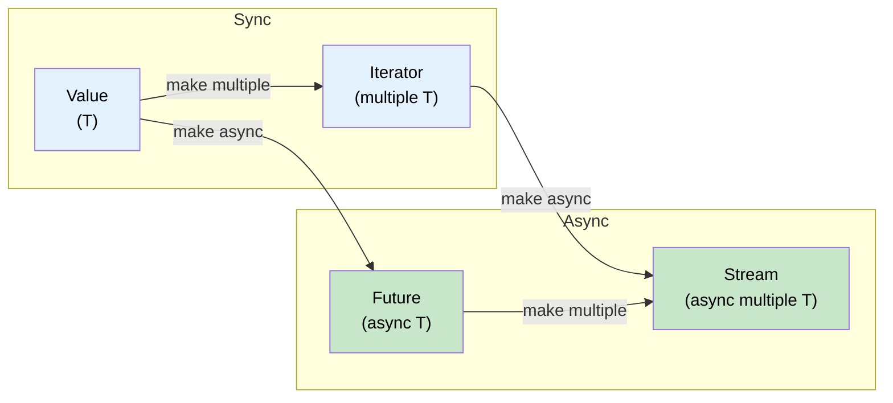

# 11. Streams and AsyncIterator 🟡

> **What you'll learn:**
> - The `Stream` trait: async iteration over multiple values
> - Creating streams: `stream::iter`, `async_stream`, `unfold`
> - Stream combinators: `map`, `filter`, `buffer_unordered`, `fold`
> - Async I/O traits: `AsyncRead`, `AsyncWrite`, `AsyncBufRead`

## Stream Trait Overview

A `Stream` is to `Iterator` what `Future` is to a single value — it yields multiple values asynchronously:

```rust
// std::iter::Iterator (synchronous, multiple values)
trait Iterator {
    type Item;
    fn next(&mut self) -> Option<Self::Item>;
}

// futures::Stream (async, multiple values)
trait Stream {
    type Item;
    fn poll_next(self: Pin<&mut Self>, cx: &mut Context<'_>) -> Poll<Option<Self::Item>>;
}
```



### Creating Streams

```rust
use futures::stream::{self, StreamExt};
use tokio::time::{interval, Duration};
use tokio_stream::wrappers::IntervalStream;

// 1. From an iterator
let s = stream::iter(vec![1, 2, 3]);

// 2. From an async generator (using async_stream crate)
// Cargo.toml: async-stream = "0.3"
use async_stream::stream;

fn countdown(from: u32) -> impl futures::Stream<Item = u32> {
    stream! {
        for i in (0..=from).rev() {
            tokio::time::sleep(Duration::from_millis(500)).await;
            yield i;
        }
    }
}

// 3. From a tokio interval
let tick_stream = IntervalStream::new(interval(Duration::from_secs(1)));

// 4. From a channel receiver (tokio_stream::wrappers)
let (tx, rx) = tokio::sync::mpsc::channel::<String>(100);
let rx_stream = tokio_stream::wrappers::ReceiverStream::new(rx);

// 5. From unfold (generate from async state)
let s = stream::unfold(0u32, |state| async move {
    if state >= 5 {
        None // Stream ends
    } else {
        let next = state + 1;
        Some((state, next)) // yield `state`, new state is `next`
    }
});
```

### Consuming Streams

```rust
use futures::stream::{self, StreamExt};

async fn stream_examples() {
    let s = stream::iter(vec![1, 2, 3, 4, 5]);

    // for_each — process each item
    s.for_each(|x| async move {
        println!("{x}");
    }).await;

    // map + collect
    let doubled: Vec<i32> = stream::iter(vec![1, 2, 3])
        .map(|x| x * 2)
        .collect()
        .await;

    // filter
    let evens: Vec<i32> = stream::iter(1..=10)
        .filter(|x| futures::future::ready(x % 2 == 0))
        .collect()
        .await;

    // buffer_unordered — process N items concurrently
    let results: Vec<_> = stream::iter(vec!["url1", "url2", "url3"])
        .map(|url| async move {
            // Simulate HTTP fetch
            tokio::time::sleep(Duration::from_millis(100)).await;
            format!("response from {url}")
        })
        .buffer_unordered(10) // Up to 10 concurrent fetches
        .collect()
        .await;

    // take, skip, zip, chain — just like Iterator
    let first_three: Vec<i32> = stream::iter(1..=100)
        .take(3)
        .collect()
        .await;
}
```

### Comparison with C# IAsyncEnumerable

| Feature | Rust `Stream` | C# `IAsyncEnumerable<T>` |
|---------|--------------|--------------------------|
| **Syntax** | `stream! { yield x; }` | `await foreach` / `yield return` |
| **Cancellation** | Drop the stream | `CancellationToken` |
| **Backpressure** | Consumer controls poll rate | Consumer controls `MoveNextAsync` |
| **Built-in** | No (needs `futures` crate) | Yes (since C# 8.0) |
| **Combinators** | `.map()`, `.filter()`, `.buffer_unordered()` | LINQ + `System.Linq.Async` |
| **Error handling** | `Stream<Item = Result<T, E>>` | Throw in async iterator |

```rust
// Rust: Stream of database rows
// NOTE: try_stream! (not stream!) is required when using ? inside the body.
// stream! doesn't propagate errors — try_stream! yields Err(e) and ends.
fn get_users(db: &Database) -> impl Stream<Item = Result<User, DbError>> + '_ {
    try_stream! {
        let mut cursor = db.query("SELECT * FROM users").await?;
        while let Some(row) = cursor.next().await {
            yield User::from_row(row?);
        }
    }
}

// Consume:
let mut users = pin!(get_users(&db));
while let Some(result) = users.next().await {
    match result {
        Ok(user) => println!("{}", user.name),
        Err(e) => eprintln!("Error: {e}"),
    }
}
```

```csharp
// C# equivalent:
async IAsyncEnumerable<User> GetUsers() {
    await using var reader = await db.QueryAsync("SELECT * FROM users");
    while (await reader.ReadAsync()) {
        yield return User.FromRow(reader);
    }
}

// Consume:
await foreach (var user in GetUsers()) {
    Console.WriteLine(user.Name);
}
```

<details>
<summary><strong>🏋️ Exercise: Build an Async Stats Aggregator</strong> (click to expand)</summary>

**Challenge**: Given a stream of sensor readings `Stream<Item = f64>`, write an async function that consumes the stream and returns `(count, min, max, average)`. Use `StreamExt` combinators — don't just collect into a Vec.

*Hint*: Use `.fold()` to accumulate state across the stream.

<details>
<summary>🔑 Solution</summary>

```rust
use futures::stream::{self, StreamExt};

#[derive(Debug)]
struct Stats {
    count: usize,
    min: f64,
    max: f64,
    sum: f64,
}

impl Stats {
    fn average(&self) -> f64 {
        if self.count == 0 { 0.0 } else { self.sum / self.count as f64 }
    }
}

async fn compute_stats<S: futures::Stream<Item = f64> + Unpin>(stream: S) -> Stats {
    stream
        .fold(
            Stats { count: 0, min: f64::INFINITY, max: f64::NEG_INFINITY, sum: 0.0 },
            |mut acc, value| async move {
                acc.count += 1;
                acc.min = acc.min.min(value);
                acc.max = acc.max.max(value);
                acc.sum += value;
                acc
            },
        )
        .await
}

#[tokio::test]
async fn test_stats() {
    let readings = stream::iter(vec![23.5, 24.1, 22.8, 25.0, 23.9]);
    let stats = compute_stats(readings).await;

    assert_eq!(stats.count, 5);
    assert!((stats.min - 22.8).abs() < f64::EPSILON);
    assert!((stats.max - 25.0).abs() < f64::EPSILON);
    assert!((stats.average() - 23.86).abs() < 0.01);
}
```

**Key takeaway**: Stream combinators like `.fold()` process items one-at-a-time without collecting into memory — essential for processing large or unbounded data streams.

</details>
</details>

### Async I/O Traits: AsyncRead, AsyncWrite, AsyncBufRead

Just as `std::io::Read`/`Write` are the foundation of synchronous I/O, their async counterparts are the foundation of async I/O. These traits are provided by `tokio::io` (or `futures::io` for runtime-agnostic code):

```rust
// tokio::io — the async versions of std::io traits

/// Read bytes from a source asynchronously
pub trait AsyncRead {
    fn poll_read(
        self: Pin<&mut Self>,
        cx: &mut Context<'_>,
        buf: &mut ReadBuf<'_>,  // Tokio's safe wrapper around uninitialized memory
    ) -> Poll<io::Result<()>>;
}

/// Write bytes to a sink asynchronously
pub trait AsyncWrite {
    fn poll_write(
        self: Pin<&mut Self>,
        cx: &mut Context<'_>,
        buf: &[u8],
    ) -> Poll<io::Result<usize>>;

    fn poll_flush(self: Pin<&mut Self>, cx: &mut Context<'_>) -> Poll<io::Result<()>>;
    fn poll_shutdown(self: Pin<&mut Self>, cx: &mut Context<'_>) -> Poll<io::Result<()>>;
}

/// Buffered reading with line support
pub trait AsyncBufRead: AsyncRead {
    fn poll_fill_buf(self: Pin<&mut Self>, cx: &mut Context<'_>) -> Poll<io::Result<&[u8]>>;
    fn consume(self: Pin<&mut Self>, amt: usize);
}
```

**In practice**, you rarely call these `poll_*` methods directly. Instead, use the extension traits `AsyncReadExt` and `AsyncWriteExt` which provide `.await`-friendly helper methods:

```rust
use tokio::io::{AsyncReadExt, AsyncWriteExt, AsyncBufReadExt};
use tokio::net::TcpStream;
use tokio::io::BufReader;

async fn io_examples() -> tokio::io::Result<()> {
    let mut stream = TcpStream::connect("127.0.0.1:8080").await?;

    // AsyncWriteExt: write_all, write_u32, write_buf, etc.
    stream.write_all(b"GET / HTTP/1.0\r\n\r\n").await?;

    // AsyncReadExt: read, read_exact, read_to_end, read_to_string
    let mut response = Vec::new();
    stream.read_to_end(&mut response).await?;

    // AsyncBufReadExt: read_line, lines(), split()
    let file = tokio::fs::File::open("config.txt").await?;
    let reader = BufReader::new(file);
    let mut lines = reader.lines();
    while let Some(line) = lines.next_line().await? {
        println!("{line}");
    }

    Ok(())
}
```

**Implementing custom async I/O** — wrap a protocol over raw TCP:

```rust
use tokio::io::{AsyncRead, AsyncWrite, ReadBuf};
use std::pin::Pin;
use std::task::{Context, Poll};

/// A length-prefixed protocol: [u32 length][payload bytes]
struct FramedStream<T> {
    inner: T,
}

impl<T: AsyncRead + AsyncReadExt + Unpin> FramedStream<T> {
    /// Read one complete frame
    async fn read_frame(&mut self) -> tokio::io::Result<Vec<u8>>
    {
        // Read the 4-byte length prefix
        let len = self.inner.read_u32().await? as usize;

        // Read exactly that many bytes
        let mut payload = vec![0u8; len];
        self.inner.read_exact(&mut payload).await?;
        Ok(payload)
    }
}

impl<T: AsyncWrite + AsyncWriteExt + Unpin> FramedStream<T> {
    /// Write one complete frame
    async fn write_frame(&mut self, data: &[u8]) -> tokio::io::Result<()>
    {
        self.inner.write_u32(data.len() as u32).await?;
        self.inner.write_all(data).await?;
        self.inner.flush().await?;
        Ok(())
    }
}
```

| Sync Trait | Async Trait (tokio) | Async Trait (futures) | Extension Trait |
|-----------|--------------------|-----------------------|----------------|
| `std::io::Read` | `tokio::io::AsyncRead` | `futures::io::AsyncRead` | `AsyncReadExt` |
| `std::io::Write` | `tokio::io::AsyncWrite` | `futures::io::AsyncWrite` | `AsyncWriteExt` |
| `std::io::BufRead` | `tokio::io::AsyncBufRead` | `futures::io::AsyncBufRead` | `AsyncBufReadExt` |
| `std::io::Seek` | `tokio::io::AsyncSeek` | `futures::io::AsyncSeek` | `AsyncSeekExt` |

> **tokio vs futures I/O traits**: They're similar but not identical — tokio's `AsyncRead` uses `ReadBuf` (handles uninitialized memory safely), while `futures::AsyncRead` uses `&mut [u8]`. Use `tokio_util::compat` to convert between them.

> **Copy utilities**: `tokio::io::copy(&mut reader, &mut writer)` is the async equivalent of `std::io::copy` — useful for proxy servers or file transfers. `tokio::io::copy_bidirectional` copies both directions concurrently.

<details>
<summary><strong>🏋️ Exercise: Build an Async Line Counter</strong> (click to expand)</summary>

**Challenge**: Write an async function that takes any `AsyncBufRead` source and returns the number of non-empty lines. It should work with files, TCP streams, or any buffered reader.

*Hint*: Use `AsyncBufReadExt::lines()` and count lines where `!line.is_empty()`.

<details>
<summary>🔑 Solution</summary>

```rust
use tokio::io::AsyncBufReadExt;

async fn count_non_empty_lines<R: tokio::io::AsyncBufRead + Unpin>(
    reader: R,
) -> tokio::io::Result<usize> {
    let mut lines = reader.lines();
    let mut count = 0;
    while let Some(line) = lines.next_line().await? {
        if !line.is_empty() {
            count += 1;
        }
    }
    Ok(count)
}

// Works with any AsyncBufRead:
// let file = tokio::io::BufReader::new(tokio::fs::File::open("data.txt").await?);
// let count = count_non_empty_lines(file).await?;
//
// let tcp = tokio::io::BufReader::new(TcpStream::connect("...").await?);
// let count = count_non_empty_lines(tcp).await?;
```

**Key takeaway**: By programming against `AsyncBufRead` instead of a concrete type, your I/O code is reusable across files, sockets, pipes, and even in-memory buffers (`tokio::io::BufReader::new(std::io::Cursor::new(data))`).

</details>
</details>

> **Key Takeaways — Streams and AsyncIterator**
> - `Stream` is the async equivalent of `Iterator` — yields `Poll::Ready(Some(item))` or `Poll::Ready(None)`
> - `.buffer_unordered(N)` processes N stream items concurrently — the key concurrency tool for streams
> - `async_stream::stream!` is the easiest way to create custom streams (uses `yield`)
> - `AsyncRead`/`AsyncBufRead` enable generic, reusable I/O code across files, sockets, and pipes

> **See also:** [Ch 9 — When Tokio Isn't the Right Fit](ch09-when-tokio-isnt-the-right-fit.md) for `FuturesUnordered` (related pattern), [Ch 13 — Production Patterns](ch13-production-patterns.md) for backpressure with bounded channels

***


