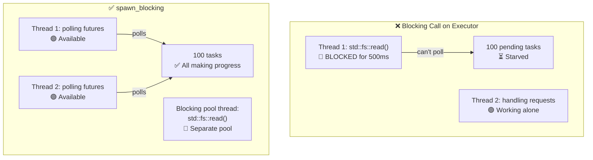

# 12. Common Pitfalls 🔴

> **What you'll learn:**
> - 9 common async Rust bugs and how to fix each one
> - Why blocking the executor is the #1 mistake (and how `spawn_blocking` fixes it)
> - Cancellation hazards: what happens when a future is dropped mid-await
> - Debugging: `tokio-console`, `tracing`, `#[instrument]`
> - Testing: `#[tokio::test]`, `time::pause()`, trait-based mocking

## Blocking the Executor

The #1 mistake in async Rust: running blocking code on the async executor thread. This starves other tasks.

```rust
// ❌ WRONG: Blocks the entire executor thread
async fn bad_handler() -> String {
    let data = std::fs::read_to_string("big_file.txt").unwrap(); // BLOCKS!
    process(&data)
}

// ✅ CORRECT: Offload blocking work to a dedicated thread pool
async fn good_handler() -> String {
    let data = tokio::task::spawn_blocking(|| {
        std::fs::read_to_string("big_file.txt").unwrap()
    }).await.unwrap();
    process(&data)
}

// ✅ ALSO CORRECT: Use tokio's async fs
async fn also_good_handler() -> String {
    let data = tokio::fs::read_to_string("big_file.txt").await.unwrap();
    process(&data)
}
```



### std::thread::sleep vs tokio::time::sleep

```rust
// ❌ WRONG: Blocks the executor thread for 5 seconds
async fn bad_delay() {
    std::thread::sleep(Duration::from_secs(5)); // Thread can't poll anything else!
}

// ✅ CORRECT: Yields to the executor, other tasks can run
async fn good_delay() {
    tokio::time::sleep(Duration::from_secs(5)).await; // Non-blocking!
}
```

### Holding MutexGuard Across .await

```rust
use std::sync::Mutex; // std Mutex — NOT async-aware

// ❌ WRONG: MutexGuard held across .await
async fn bad_mutex(data: &Mutex<Vec<String>>) {
    let mut guard = data.lock().unwrap();
    guard.push("item".into());
    some_io().await; // 💥 Guard is held here — blocks other threads from locking!
    guard.push("another".into());
}
// Also: std::sync::MutexGuard is !Send, so this won't compile
// with tokio's multi-threaded runtime.

// ✅ FIX 1: Scope the guard to drop before .await
async fn good_mutex_scoped(data: &Mutex<Vec<String>>) {
    {
        let mut guard = data.lock().unwrap();
        guard.push("item".into());
    } // Guard dropped here
    some_io().await; // Safe — lock is released
    {
        let mut guard = data.lock().unwrap();
        guard.push("another".into());
    }
}

// ✅ FIX 2: Use tokio::sync::Mutex (async-aware)
use tokio::sync::Mutex as AsyncMutex;

async fn good_async_mutex(data: &AsyncMutex<Vec<String>>) {
    let mut guard = data.lock().await; // Async lock — doesn't block the thread
    guard.push("item".into());
    some_io().await; // OK — tokio Mutex guard is Send
    guard.push("another".into());
}
```

> **When to use which Mutex**:
> - `std::sync::Mutex`: Short critical sections with no `.await` inside
> - `tokio::sync::Mutex`: When you must hold the lock across `.await` points
> - `parking_lot::Mutex`: Drop-in `std` replacement, faster, smaller, still no `.await`

### Cancellation Hazards

Dropping a future cancels it — but this can leave things in an inconsistent state:

```rust
// ❌ DANGEROUS: Resource leak on cancellation
async fn transfer(from: &Account, to: &Account, amount: u64) {
    from.debit(amount).await;  // If cancelled HERE...
    to.credit(amount).await;   // ...money vanishes!
}

// ✅ SAFE: Make operations atomic or use compensation
async fn safe_transfer(from: &Account, to: &Account, amount: u64) -> Result<(), Error> {
    // Use a database transaction (all-or-nothing)
    let tx = db.begin_transaction().await?;
    tx.debit(from, amount).await?;
    tx.credit(to, amount).await?;
    tx.commit().await?; // Only commits if everything succeeded
    Ok(())
}

// ✅ ALSO SAFE: Use tokio::select! with cancellation awareness
tokio::select! {
    result = transfer(from, to, amount) => {
        // Transfer completed
    }
    _ = shutdown_signal() => {
        // Don't cancel mid-transfer — let it finish
        // Or: roll back explicitly
    }
}
```

### No Async Drop

Rust's `Drop` trait is synchronous — you **cannot** `.await` inside `drop()`. This is a frequent source of confusion:

```rust
struct DbConnection { /* ... */ }

impl Drop for DbConnection {
    fn drop(&mut self) {
        // ❌ Can't do this — drop() is sync!
        // self.connection.shutdown().await;

        // ✅ Workaround 1: Spawn a cleanup task (fire-and-forget)
        let conn = self.connection.take();
        tokio::spawn(async move {
            let _ = conn.shutdown().await;
        });

        // ✅ Workaround 2: Use a synchronous close
        // self.connection.blocking_close();
    }
}
```

**Best practice**: Provide an explicit `async fn close(self)` method and document that callers should use it. Rely on `Drop` only as a safety net, not the primary cleanup path.

### select! Fairness and Starvation

```rust
use tokio::sync::mpsc;

// ❌ UNFAIR: busy_stream always wins, slow_stream starves
async fn unfair(mut fast: mpsc::Receiver<i32>, mut slow: mpsc::Receiver<i32>) {
    loop {
        tokio::select! {
            Some(v) = fast.recv() => println!("fast: {v}"),
            Some(v) = slow.recv() => println!("slow: {v}"),
            // If both are ready, tokio randomly picks one.
            // But if `fast` is ALWAYS ready, `slow` rarely gets polled.
        }
    }
}

// ✅ FAIR: Use biased select or drain in batches
async fn fair(mut fast: mpsc::Receiver<i32>, mut slow: mpsc::Receiver<i32>) {
    loop {
        tokio::select! {
            biased; // Always check in order — explicit priority

            Some(v) = slow.recv() => println!("slow: {v}"),  // Priority!
            Some(v) = fast.recv() => println!("fast: {v}"),
        }
    }
}
```

### Accidental Sequential Execution

```rust
// ❌ SEQUENTIAL: Takes 2 seconds total
async fn slow() {
    let a = fetch("url_a").await; // 1 second
    let b = fetch("url_b").await; // 1 second (waits for a to finish first!)
}

// ✅ CONCURRENT: Takes 1 second total
async fn fast() {
    let (a, b) = tokio::join!(
        fetch("url_a"), // Both start immediately
        fetch("url_b"),
    );
}

// ✅ ALSO CONCURRENT: Using let + join
async fn also_fast() {
    let fut_a = fetch("url_a"); // Create future (lazy — not started yet)
    let fut_b = fetch("url_b"); // Create future
    let (a, b) = tokio::join!(fut_a, fut_b); // NOW both run concurrently
}
```

> **Trap**: `let a = fetch(url).await; let b = fetch(url).await;` is sequential!
> The second `.await` doesn't start until the first finishes. Use `join!` or
> `spawn` for concurrency.

## Case Study: Debugging a Hung Production Service

A real-world scenario: a service handles requests fine for 10 minutes, then stops responding. No errors in logs. CPU at 0%.

**Diagnosis steps:**

1. **Attach `tokio-console`** — reveals 200+ tasks stuck in `Pending` state
2. **Check task details** — all waiting on the same `Mutex::lock().await`
3. **Root cause** — one task held a `std::sync::MutexGuard` across an `.await` and panicked, poisoning the mutex. All other tasks now fail on `lock().unwrap()`

**The fix:**

| Before (broken) | After (fixed) |
|-----------------|---------------|
| `std::sync::Mutex` | `tokio::sync::Mutex` |
| `.lock().unwrap()` across `.await` | Scope lock before `.await` |
| No timeout on lock acquisition | `tokio::time::timeout(dur, mutex.lock())` |
| No recovery on poisoned mutex | `tokio::sync::Mutex` doesn't poison |

**Prevention checklist:**
- [ ] Use `tokio::sync::Mutex` if the guard crosses any `.await`
- [ ] Add `#[tracing::instrument]` to async functions for span tracking
- [ ] Run `tokio-console` in staging to catch hung tasks early
- [ ] Add health check endpoints that verify task responsiveness

<details>
<summary><strong>🏋️ Exercise: Spot the Bugs</strong> (click to expand)</summary>

**Challenge**: Find all the async pitfalls in this code and fix them.

```rust
use std::sync::Mutex;

async fn process_requests(urls: Vec<String>) -> Vec<String> {
    let results = Mutex::new(Vec::new());
    
    for url in &urls {
        let response = reqwest::get(url).await.unwrap().text().await.unwrap();
        std::thread::sleep(std::time::Duration::from_millis(100)); // Rate limit
        let mut guard = results.lock().unwrap();
        guard.push(response);
        expensive_parse(&guard).await; // Parse all results so far
    }
    
    results.into_inner().unwrap()
}
```

<details>
<summary>🔑 Solution</summary>

**Bugs found:**

1. **Sequential fetches** — URLs are fetched one at a time instead of concurrently
2. **`std::thread::sleep`** — Blocks the executor thread
3. **MutexGuard held across `.await`** — `guard` is alive when `expensive_parse` is awaited
4. **No concurrency** — Should use `join!` or `FuturesUnordered`

```rust
use tokio::sync::Mutex;
use std::sync::Arc;
use futures::stream::{self, StreamExt};

async fn process_requests(urls: Vec<String>) -> Vec<String> {
    // Fix 4: Process URLs concurrently with buffer_unordered
    let results: Vec<String> = stream::iter(urls)
        .map(|url| async move {
            let response = reqwest::get(&url).await.unwrap().text().await.unwrap();
            // Fix 2: Use tokio::time::sleep instead of std::thread::sleep
            tokio::time::sleep(std::time::Duration::from_millis(100)).await;
            response
        })
        .buffer_unordered(10) // Up to 10 concurrent requests
        .collect()
        .await;

    // Fix 3: Parse after collecting — no mutex needed at all!
    for result in &results {
        expensive_parse(result).await;
    }

    results
}
```

**Key takeaway**: Often you can restructure async code to eliminate mutexes entirely. Collect results with streams/join, then process. Simpler, faster, no deadlock risk.

</details>
</details>

---

### Debugging Async Code

Async stack traces are notoriously cryptic — they show the executor's poll loop rather than your logical call chain. Here are the essential debugging tools.

#### tokio-console: Real-Time Task Inspector

[tokio-console](https://github.com/tokio-rs/console) gives you an `htop`-like view of every spawned task: its state, poll duration, waker activity, and resource usage.

```toml
# Cargo.toml
[dependencies]
console-subscriber = "0.4"
tokio = { version = "1", features = ["full", "tracing"] }
```

```rust
#[tokio::main]
async fn main() {
    console_subscriber::init(); // Replaces the default tracing subscriber
    // ... rest of your application
}
```

Then in another terminal:

```bash
$ RUSTFLAGS="--cfg tokio_unstable" cargo run   # Required compile-time flag
$ tokio-console                                # Connects to 127.0.0.1:6669
```

#### tracing + #[instrument]: Structured Logging for Async

The [`tracing`](https://docs.rs/tracing) crate understands `Future` lifetimes. Spans stay open across `.await` points, giving you a logical call stack even when the OS thread has moved on:

```rust
use tracing::{info, instrument};

#[instrument(skip(db_pool), fields(user_id = %user_id))]
async fn handle_request(user_id: u64, db_pool: &Pool) -> Result<Response> {
    info!("looking up user");
    let user = db_pool.get_user(user_id).await?;  // span stays open across .await
    info!(email = %user.email, "found user");
    let orders = fetch_orders(user_id).await?;     // still the same span
    Ok(build_response(user, orders))
}
```

Output (with `tracing_subscriber::fmt::json()`):

```json
{"timestamp":"...","level":"INFO","span":{"name":"handle_request","user_id":"42"},"message":"looking up user"}
{"timestamp":"...","level":"INFO","span":{"name":"handle_request","user_id":"42"},"fields":{"email":"a@b.com"},"message":"found user"}
```

#### Debugging Checklist

| Symptom | Likely Cause | Tool |
|---------|-------------|------|
| Task hangs forever | Missing `.await` or deadlocked `Mutex` | `tokio-console` task view |
| Low throughput | Blocking call on async thread | `tokio-console` poll-time histogram |
| `Future is not Send` | Non-Send type held across `.await` | Compiler error + `#[instrument]` to locate |
| Mysterious cancellation | Parent `select!` dropped a branch | `tracing` span lifecycle events |

> **Tip**: Enable `RUSTFLAGS="--cfg tokio_unstable"` to get task-level metrics
> in tokio-console. This is a compile-time flag, not a runtime one.

### Testing Async Code

Async code introduces unique testing challenges — you need a runtime, time control, and strategies for testing concurrent behavior.

**Basic async tests** with `#[tokio::test]`:

```rust
// Cargo.toml
// [dev-dependencies]
// tokio = { version = "1", features = ["full", "test-util"] }

#[tokio::test]
async fn test_basic_async() {
    let result = fetch_data().await;
    assert_eq!(result, "expected");
}

// Single-threaded test (useful for !Send types):
#[tokio::test(flavor = "current_thread")]
async fn test_single_threaded() {
    let rc = std::rc::Rc::new(42);
    let val = async { *rc }.await;
    assert_eq!(val, 42);
}

// Multi-threaded with explicit worker count:
#[tokio::test(flavor = "multi_thread", worker_threads = 2)]
async fn test_concurrent_behavior() {
    // Tests race conditions with real concurrency
    let counter = std::sync::Arc::new(std::sync::atomic::AtomicU32::new(0));
    let c1 = counter.clone();
    let c2 = counter.clone();
    let (a, b) = tokio::join!(
        tokio::spawn(async move { c1.fetch_add(1, std::sync::atomic::Ordering::SeqCst) }),
        tokio::spawn(async move { c2.fetch_add(1, std::sync::atomic::Ordering::SeqCst) }),
    );
    a.unwrap();
    b.unwrap();
    assert_eq!(counter.load(std::sync::atomic::Ordering::SeqCst), 2);
}
```

**Time manipulation** — test timeouts without actually waiting:

```rust
use tokio::time::{self, Duration, Instant};

#[tokio::test]
async fn test_timeout_behavior() {
    // Pause time — sleep() advances instantly, no real wall-clock delay
    time::pause();

    let start = Instant::now();
    time::sleep(Duration::from_secs(3600)).await; // "waits" 1 hour — takes 0ms
    assert!(start.elapsed() >= Duration::from_secs(3600));
    // Test ran in milliseconds, not an hour!
}

#[tokio::test]
async fn test_retry_timing() {
    time::pause();

    // Test that our retry logic waits the expected durations
    let start = Instant::now();
    let result = retry_with_backoff(|| async {
        Err::<(), _>("simulated failure")
    }, 3, Duration::from_secs(1))
    .await;

    assert!(result.is_err());
    // 1s + 2s + 4s = 7s of backoff (exponential)
    assert!(start.elapsed() >= Duration::from_secs(7));
}

#[tokio::test]
async fn test_deadline_exceeded() {
    time::pause();

    let result = tokio::time::timeout(
        Duration::from_secs(5),
        async {
            // Simulate slow operation
            time::sleep(Duration::from_secs(10)).await;
            "done"
        }
    ).await;

    assert!(result.is_err()); // Timed out
}
```

**Mocking async dependencies** — use trait objects or generics:

```rust
// Define a trait for the dependency:
trait Storage {
    async fn get(&self, key: &str) -> Option<String>;
    async fn set(&self, key: &str, value: String);
}

// Production implementation:
struct RedisStorage { /* ... */ }
impl Storage for RedisStorage {
    async fn get(&self, key: &str) -> Option<String> {
        // Real Redis call
        todo!()
    }
    async fn set(&self, key: &str, value: String) {
        todo!()
    }
}

// Test mock:
struct MockStorage {
    data: std::sync::Mutex<std::collections::HashMap<String, String>>,
}

impl MockStorage {
    fn new() -> Self {
        MockStorage { data: std::sync::Mutex::new(std::collections::HashMap::new()) }
    }
}

impl Storage for MockStorage {
    async fn get(&self, key: &str) -> Option<String> {
        self.data.lock().unwrap().get(key).cloned()
    }
    async fn set(&self, key: &str, value: String) {
        self.data.lock().unwrap().insert(key.to_string(), value);
    }
}

// Tested function is generic over Storage:
async fn cache_lookup<S: Storage>(store: &S, key: &str) -> String {
    match store.get(key).await {
        Some(val) => val,
        None => {
            let val = "computed".to_string();
            store.set(key, val.clone()).await;
            val
        }
    }
}

#[tokio::test]
async fn test_cache_miss_then_hit() {
    let mock = MockStorage::new();

    // First call: miss → computes and stores
    let val = cache_lookup(&mock, "key1").await;
    assert_eq!(val, "computed");

    // Second call: hit → returns stored value
    let val = cache_lookup(&mock, "key1").await;
    assert_eq!(val, "computed");
    assert!(mock.data.lock().unwrap().contains_key("key1"));
}
```

**Testing channels and task communication**:

```rust
#[tokio::test]
async fn test_producer_consumer() {
    let (tx, mut rx) = tokio::sync::mpsc::channel(10);

    tokio::spawn(async move {
        for i in 0..5 {
            tx.send(i).await.unwrap();
        }
        // tx dropped here — channel closes
    });

    let mut received = Vec::new();
    while let Some(val) = rx.recv().await {
        received.push(val);
    }

    assert_eq!(received, vec![0, 1, 2, 3, 4]);
}
```

| Test Pattern | When to Use | Key Tool |
|-------------|-------------|----------|
| `#[tokio::test]` | All async tests | `tokio = { features = ["macros", "rt"] }` |
| `time::pause()` | Testing timeouts, retries, periodic tasks | `tokio::time::pause()` |
| Trait mocking | Testing business logic without I/O | Generic `<S: Storage>` |
| `current_thread` flavor | Testing `!Send` types or deterministic scheduling | `#[tokio::test(flavor = "current_thread")]` |
| `multi_thread` flavor | Testing race conditions | `#[tokio::test(flavor = "multi_thread")]` |

> **Key Takeaways — Common Pitfalls**
> - Never block the executor — use `spawn_blocking` for CPU/sync work
> - Never hold a `MutexGuard` across `.await` — scope locks tightly or use `tokio::sync::Mutex`
> - Cancellation drops the future instantly — use "cancel-safe" patterns for partial operations
> - Use `tokio-console` and `#[tracing::instrument]` for debugging async code
> - Test async code with `#[tokio::test]` and `time::pause()` for deterministic timing

> **See also:** [Ch 8 — Tokio Deep Dive](ch08-tokio-deep-dive.md) for sync primitives, [Ch 13 — Production Patterns](ch13-production-patterns.md) for graceful shutdown and structured concurrency

***


