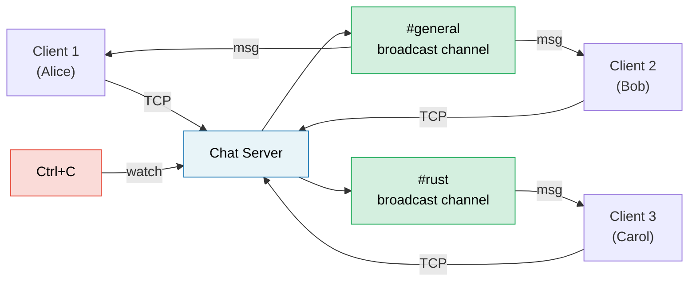

# Capstone Project: Async Chat Server

This project integrates patterns from across the book into a single, production-style application. You'll build a **multi-room async chat server** using tokio, channels, streams, graceful shutdown, and proper error handling.

**Estimated time**: 4–6 hours | **Difficulty**: ★★★

> **What you'll practice:**
> - `tokio::spawn` and the `'static` requirement (Ch 8)
> - Channels: `mpsc` for messages, `broadcast` for rooms, `watch` for shutdown (Ch 8)
> - Streams: reading lines from TCP connections (Ch 11)
> - Common pitfalls: cancellation safety, MutexGuard across `.await` (Ch 12)
> - Production patterns: graceful shutdown, backpressure (Ch 13)
> - Async traits for pluggable backends (Ch 10)

## The Problem

Build a TCP chat server where:

1. **Clients** connect via TCP and join named rooms
2. **Messages** are broadcast to all clients in the same room
3. **Commands**: `/join <room>`, `/nick <name>`, `/rooms`, `/quit`
4. The server shuts down gracefully on Ctrl+C — finishing in-flight messages



## Step 1: Basic TCP Accept Loop

Start with a server that accepts connections and echoes lines back:

```rust
use tokio::io::{AsyncBufReadExt, AsyncWriteExt, BufReader};
use tokio::net::TcpListener;

#[tokio::main]
async fn main() -> anyhow::Result<()> {
    let listener = TcpListener::bind("127.0.0.1:8080").await?;
    println!("Chat server listening on :8080");

    loop {
        let (socket, addr) = listener.accept().await?;
        println!("[{addr}] Connected");

        tokio::spawn(async move {
            let (reader, mut writer) = socket.into_split();
            let mut reader = BufReader::new(reader);
            let mut line = String::new();

            loop {
                line.clear();
                match reader.read_line(&mut line).await {
                    Ok(0) | Err(_) => break,
                    Ok(_) => {
                        let _ = writer.write_all(line.as_bytes()).await;
                    }
                }
            }
            println!("[{addr}] Disconnected");
        });
    }
}
```

**Your job**: Verify this compiles and works with `telnet localhost 8080`.

## Step 2: Room State with Broadcast Channels

Each room is a `broadcast::Sender`. All clients in a room subscribe to receive messages.

```rust
use std::collections::HashMap;
use std::sync::Arc;
use tokio::sync::{broadcast, RwLock};

type RoomMap = Arc<RwLock<HashMap<String, broadcast::Sender<String>>>>;

fn get_or_create_room(rooms: &mut HashMap<String, broadcast::Sender<String>>, name: &str) -> broadcast::Sender<String> {
    rooms.entry(name.to_string())
        .or_insert_with(|| {
            let (tx, _) = broadcast::channel(100); // 100-message buffer
            tx
        })
        .clone()
}
```

**Your job**: Implement room state so that:
- Clients start in `#general`
- `/join <room>` switches rooms (unsubscribe from old, subscribe to new)
- Messages are broadcast to all clients in the sender's current room

<details>
<summary>💡 Hint — Client task structure</summary>

Each client task needs two concurrent loops:
1. **Read from TCP** → parse commands or broadcast to room
2. **Read from broadcast receiver** → write to TCP

Use `tokio::select!` to run both:

```rust
loop {
    tokio::select! {
        // Client sent us a line
        result = reader.read_line(&mut line) => {
            match result {
                Ok(0) | Err(_) => break,
                Ok(_) => {
                    // Parse command or broadcast message
                }
            }
        }
        // Room broadcast received
        result = room_rx.recv() => {
            match result {
                Ok(msg) => {
                    let _ = writer.write_all(msg.as_bytes()).await;
                }
                Err(_) => break,
            }
        }
    }
}
```

</details>

## Step 3: Commands

Implement the command protocol:

| Command | Action |
|---------|--------|
| `/join <room>` | Leave current room, join new room, announce in both |
| `/nick <name>` | Change display name |
| `/rooms` | List all active rooms and member counts |
| `/quit` | Disconnect gracefully |
| Anything else | Broadcast as a chat message |

**Your job**: Parse commands from the input line. For `/rooms`, you'll need to read from the `RoomMap` — use `RwLock::read()` to avoid blocking other clients.

## Step 4: Graceful Shutdown

Add Ctrl+C handling so the server:
1. Stops accepting new connections
2. Sends "Server shutting down..." to all rooms
3. Waits for in-flight messages to drain
4. Exits cleanly

```rust
use tokio::sync::watch;

let (shutdown_tx, shutdown_rx) = watch::channel(false);

// In the accept loop:
loop {
    tokio::select! {
        result = listener.accept() => {
            let (socket, addr) = result?;
            // spawn client task with shutdown_rx.clone()
        }
        _ = tokio::signal::ctrl_c() => {
            println!("Shutdown signal received");
            shutdown_tx.send(true)?;
            break;
        }
    }
}
```

**Your job**: Add `shutdown_rx.changed()` to each client's `select!` loop so clients exit when shutdown is signaled.

## Step 5: Error Handling and Edge Cases

Production-harden the server:

1. **Lagging receivers**: `broadcast::recv()` returns `RecvError::Lagged(n)` if a slow client misses messages. Handle it gracefully (log + continue, don't crash).
2. **Nickname validation**: Reject empty or too-long nicknames.
3. **Backpressure**: The broadcast channel buffer is bounded (100). If a client can't keep up, they get the `Lagged` error.
4. **Timeout**: Disconnect clients that are idle for >5 minutes.

```rust
use tokio::time::{timeout, Duration};

// Wrap the read in a timeout:
match timeout(Duration::from_secs(300), reader.read_line(&mut line)).await {
    Ok(Ok(0)) | Ok(Err(_)) | Err(_) => break, // EOF, error, or timeout
    Ok(Ok(_)) => { /* process line */ }
}
```

## Step 6: Integration Test

Write a test that starts the server, connects two clients, and verifies message delivery:

```rust
#[tokio::test]
async fn two_clients_can_chat() {
    // Start server in background
    let server = tokio::spawn(run_server("127.0.0.1:0")); // Port 0 = OS picks

    // Connect two clients
    let mut client1 = TcpStream::connect(addr).await.unwrap();
    let mut client2 = TcpStream::connect(addr).await.unwrap();

    // Client 1 sends a message
    client1.write_all(b"Hello from client 1\n").await.unwrap();

    // Client 2 should receive it
    let mut buf = vec![0u8; 1024];
    let n = client2.read(&mut buf).await.unwrap();
    let msg = String::from_utf8_lossy(&buf[..n]);
    assert!(msg.contains("Hello from client 1"));
}
```

## Evaluation Criteria

| Criterion | Target |
|-----------|--------|
| Concurrency | Multiple clients in multiple rooms, no blocking |
| Correctness | Messages only go to clients in the same room |
| Graceful shutdown | Ctrl+C drains messages and exits cleanly |
| Error handling | Lagged receivers, disconnections, timeouts handled |
| Code organization | Clean separation: accept loop, client task, room state |
| Testing | At least 2 integration tests |

## Extension Ideas

Once the basic chat server works, try these enhancements:

1. **Persistent history**: Store last N messages per room; replay to new joiners
2. **WebSocket support**: Accept both TCP and WebSocket clients using `tokio-tungstenite`
3. **Rate limiting**: Use `tokio::time::Interval` to limit messages per client per second
4. **Metrics**: Track connected clients, messages/sec, room count via `prometheus` crate
5. **TLS**: Add `tokio-rustls` for encrypted connections

***
