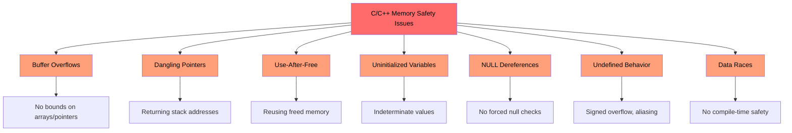
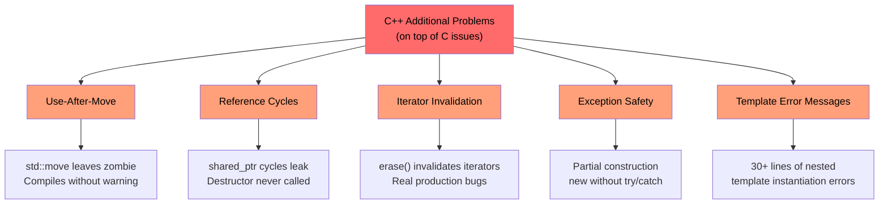
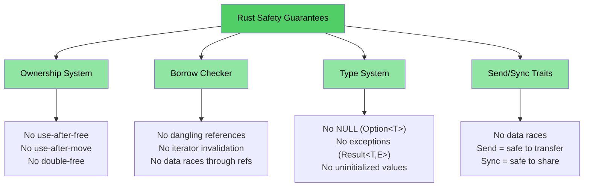

# Why C/C++ Developers Need Rust

> **What you'll learn:**
> - The full list of problems Rust eliminates — memory safety, undefined behavior, data races, and more
> - Why `shared_ptr`, `unique_ptr`, and other C++ mitigations are bandaids, not solutions
> - Concrete C and C++ vulnerability examples that are structurally impossible in safe Rust

> **Want to skip straight to code?** Jump to [Show me some code](ch02-getting-started.md#enough-talk-already-show-me-some-code)

## What Rust Eliminates — The Complete List

Before diving into examples, here's the executive summary. Safe Rust **structurally prevents** every issue in this list — not through discipline, tooling, or code review, but through the type system and compiler:

| **Eliminated Issue** | **C** | **C++** | **How Rust Prevents It** |
|----------------------|:-----:|:-------:|--------------------------|
| Buffer overflows / underflows | ✅ | ✅ | All arrays, slices, and strings carry bounds; indexing is checked at runtime |
| Memory leaks (no GC needed) | ✅ | ✅ | `Drop` trait = RAII done right; automatic cleanup, no Rule of Five |
| Dangling pointers | ✅ | ✅ | Lifetime system proves references outlive their referent at compile time |
| Use-after-free | ✅ | ✅ | Ownership system makes this a compile error |
| Use-after-move | — | ✅ | Moves are **destructive** — the original binding ceases to exist |
| Uninitialized variables | ✅ | ✅ | All variables must be initialized before use; compiler enforces it |
| Integer overflow / underflow UB | ✅ | ✅ | Debug builds panic on overflow; release builds wrap (defined behavior either way) |
| NULL pointer dereferences / SEGVs | ✅ | ✅ | No null pointers; `Option<T>` forces explicit handling |
| Data races | ✅ | ✅ | `Send`/`Sync` traits + borrow checker make data races a compile error |
| Uncontrolled side-effects | ✅ | ✅ | Immutability by default; mutation requires explicit `mut` |
| No inheritance (better maintainability) | — | ✅ | Traits + composition replace class hierarchies; promotes reuse without coupling |
| No exceptions; predictable control flow | — | ✅ | Errors are values (`Result<T, E>`); impossible to ignore, no hidden `throw` paths |
| Iterator invalidation | — | ✅ | Borrow checker forbids mutating a collection while iterating |
| Reference cycles / leaked finalizers | — | ✅ | Ownership is tree-shaped; `Rc` cycles are opt-in and catchable with `Weak` |
| No forgotten mutex unlocks | ✅ | ✅ | `Mutex<T>` wraps the data; lock guard is the only way to access it |
| Undefined behavior (general) | ✅ | ✅ | Safe Rust has **zero** undefined behavior; `unsafe` blocks are explicit and auditable |

> **Bottom line:** These aren't aspirational goals enforced by coding standards. They are **compile-time guarantees**. If your code compiles, these bugs cannot exist.

---

## The Problems Shared by C and C++

> **Want to skip the examples?** Jump to [How Rust Addresses All of This](#how-rust-addresses-all-of-this) or straight to [Show me some code](ch02-getting-started.md#enough-talk-already-show-me-some-code)

Both languages share a core set of memory safety problems that are the root cause of over 70% of CVEs (Common Vulnerabilities and Exposures):

### Buffer overflows

C arrays, pointers, and strings have no intrinsic bounds. It is trivially easy to exceed them:

```c
#include <stdlib.h>
#include <string.h>

void buffer_dangers() {
    char buffer[10];
    strcpy(buffer, "This string is way too long!");  // Buffer overflow

    int arr[5] = {1, 2, 3, 4, 5};
    int *ptr = arr;           // Loses size information
    ptr[10] = 42;             // No bounds check — undefined behavior
}
```

In C++, `std::vector::operator[]` still performs no bounds checking. Only `.at()` does — and who catches the exception?

### Dangling pointers and use-after-free

```c
int *bar() {
    int i = 42;
    return &i;    // Returns address of stack variable — dangling!
}

void use_after_free() {
    char *p = (char *)malloc(20);
    free(p);
    *p = '\0';   // Use after free — undefined behavior
}
```

### Uninitialized variables and undefined behavior

C and C++ both allow uninitialized variables. The resulting values are indeterminate, and reading them is undefined behavior:

```c
int x;               // Uninitialized
if (x > 0) { ... }  // UB — x could be anything
```

Integer overflow is **defined** in C for unsigned types but **undefined** for signed types. In C++, signed overflow is also undefined behavior. Both compilers can and do exploit this for "optimizations" that break programs in surprising ways.

### NULL pointer dereferences

```c
int *ptr = NULL;
*ptr = 42;           // SEGV — but the compiler won't stop you
```

In C++, `std::optional<T>` helps but is verbose and often bypassed with `.value()` which throws.

### The visualization: shared problems



---

## C++ Adds More Problems on Top

> **C audience**: You can [skip ahead to How Rust Addresses These Issues](#how-rust-addresses-all-of-this) if you don't use C++.
>
> **Want to skip straight to code?** Jump to [Show me some code](ch02-getting-started.md#enough-talk-already-show-me-some-code)

C++ introduced smart pointers, RAII, move semantics, and exceptions to address C's problems. These are **bandaids, not cures** — they shift the failure mode from "crash at runtime" to "subtler bug at runtime":

### `unique_ptr` and `shared_ptr` — bandaids, not solutions

C++ smart pointers are a significant improvement over raw `malloc`/`free`, but they don't solve the underlying problems:

| C++ Mitigation | What It Fixes | What It **Doesn't** Fix |
|----------------|---------------|------------------------|
| `std::unique_ptr` | Prevents leaks via RAII | **Use-after-move** still compiles; leaves a zombie nullptr |
| `std::shared_ptr` | Shared ownership | **Reference cycles** leak silently; `weak_ptr` discipline is manual |
| `std::optional` | Replaces some null use | `.value()` **throws** if empty — hidden control flow |
| `std::string_view` | Avoids copies | **Dangling** if the source string is freed — no lifetime checking |
| Move semantics | Efficient transfers | Moved-from objects are in a **"valid but unspecified state"** — UB waiting to happen |
| RAII | Automatic cleanup | Requires the **Rule of Five** to get right; one mistake breaks everything |

```cpp
// unique_ptr: use-after-move compiles cleanly
std::unique_ptr<int> ptr = std::make_unique<int>(42);
std::unique_ptr<int> ptr2 = std::move(ptr);
std::cout << *ptr;  // Compiles! Undefined behavior at runtime.
                     // In Rust, this is a compile error: "value used after move"
```

```cpp
// shared_ptr: reference cycles leak silently
struct Node {
    std::shared_ptr<Node> next;
    std::shared_ptr<Node> parent;  // Cycle! Destructor never called.
};
auto a = std::make_shared<Node>();
auto b = std::make_shared<Node>();
a->next = b;
b->parent = a;  // Memory leak — ref count never reaches 0
                 // In Rust, Rc<T> + Weak<T> makes cycles explicit and breakable
```

### Use-after-move — the silent killer

C++ `std::move` is not a move — it's a cast. The original object remains in a "valid but unspecified state". The compiler lets you keep using it:

```cpp
auto vec = std::make_unique<std::vector<int>>({1, 2, 3});
auto vec2 = std::move(vec);
vec->size();  // Compiles! But dereferencing nullptr — crash at runtime
```

In Rust, moves are **destructive**. The original binding is gone:

```rust
let vec = vec![1, 2, 3];
let vec2 = vec;           // Move — vec is consumed
// vec.len();             // Compile error: value used after move
```

### Iterator invalidation — real bugs from production C++

These aren't contrived examples — they represent **real bug patterns** found in large C++ codebases:

```cpp
// BUG 1: erase without reassigning iterator (undefined behavior)
while (it != pending_faults.end()) {
    if (*it != nullptr && (*it)->GetId() == fault->GetId()) {
        pending_faults.erase(it);   // ← iterator invalidated!
        removed_count++;            //   next loop uses dangling iterator
    } else {
        ++it;
    }
}
// Fix: it = pending_faults.erase(it);
```

```cpp
// BUG 2: index-based erase skips elements
for (auto i = 0; i < entries.size(); i++) {
    if (config_status == ConfigDisable::Status::Disabled) {
        entries.erase(entries.begin() + i);  // ← shifts elements
    }                                         //   i++ skips the shifted one
}
```

```cpp
// BUG 3: one erase path correct, the other isn't
while (it != incomplete_ids.end()) {
    if (current_action == nullptr) {
        incomplete_ids.erase(it);  // ← BUG: iterator not reassigned
        continue;
    }
    it = incomplete_ids.erase(it); // ← Correct path
}
```

**These compile without any warning.** In Rust, the borrow checker makes all three a compile error — you cannot mutate a collection while iterating over it, period.

### Exception safety and the `dynamic_cast`/`new` pattern

Modern C++ codebases still lean heavily on patterns that have no compile-time safety:

```cpp
// Typical C++ factory pattern — every branch is a potential bug
DriverBase* driver = nullptr;
if (dynamic_cast<ModelA*>(device)) {
    driver = new DriverForModelA(framework);
} else if (dynamic_cast<ModelB*>(device)) {
    driver = new DriverForModelB(framework);
}
// What if driver is still nullptr? What if new throws? Who owns driver?
```

In a typical 100K-line C++ codebase you might find hundreds of `dynamic_cast` calls (each a potential runtime failure), hundreds of raw `new` calls (each a potential leak), and hundreds of `virtual`/`override` methods (vtable overhead everywhere).

### Dangling references and lambda captures

```cpp
int& get_reference() {
    int x = 42;
    return x;  // Dangling reference — compiles, UB at runtime
}

auto make_closure() {
    int local = 42;
    return [&local]() { return local; };  // Dangling capture!
}
```

### The visualization: C++ additional problems



---

## How Rust Addresses All of This

Every problem listed above — from both C and C++ — is prevented by Rust's compile-time guarantees:

| Problem | Rust's Solution |
|---------|-----------------|
| Buffer overflows | Slices carry length; indexing is bounds-checked |
| Dangling pointers / use-after-free | Lifetime system proves references are valid at compile time |
| Use-after-move | Moves are destructive — compiler refuses to let you touch the original |
| Memory leaks | `Drop` trait = RAII without the Rule of Five; automatic, correct cleanup |
| Reference cycles | Ownership is tree-shaped; `Rc` + `Weak` makes cycles explicit |
| Iterator invalidation | Borrow checker forbids mutating a collection while borrowing it |
| NULL pointers | No null. `Option<T>` forces explicit handling via pattern matching |
| Data races | `Send`/`Sync` traits make data races a compile error |
| Uninitialized variables | All variables must be initialized; compiler enforces it |
| Integer UB | Debug panics on overflow; release wraps (both defined behavior) |
| Exceptions | No exceptions; `Result<T, E>` is visible in type signatures, propagated with `?` |
| Inheritance complexity | Traits + composition; no Diamond Problem, no vtable fragility |
| Forgotten mutex unlocks | `Mutex<T>` wraps the data; lock guard is the only access path |

```rust
fn rust_prevents_everything() {
    // ✅ No buffer overflow — bounds checked
    let arr = [1, 2, 3, 4, 5];
    // arr[10];  // panic at runtime, never UB

    // ✅ No use-after-move — compile error
    let data = vec![1, 2, 3];
    let moved = data;
    // data.len();  // error: value used after move

    // ✅ No dangling pointer — lifetime error
    // let r;
    // { let x = 5; r = &x; }  // error: x does not live long enough

    // ✅ No null — Option forces handling
    let maybe: Option<i32> = None;
    // maybe.unwrap();  // panic, but you'd use match or if let instead

    // ✅ No data race — compile error
    // let mut shared = vec![1, 2, 3];
    // std::thread::spawn(|| shared.push(4));  // error: closure may outlive
    // shared.push(5);                         //   borrowed value
}
```

### Rust's safety model — the full picture



## Quick Reference: C vs C++ vs Rust

| **Concept** | **C** | **C++** | **Rust** | **Key Difference** |
|-------------|-------|---------|----------|-------------------|
| Memory management | `malloc()/free()` | `unique_ptr`, `shared_ptr` | `Box<T>`, `Rc<T>`, `Arc<T>` | Automatic, no cycles, no zombies |
| Arrays | `int arr[10]` | `std::vector<T>`, `std::array<T>` | `Vec<T>`, `[T; N]` | Bounds checking by default |
| Strings | `char*` with `\0` | `std::string`, `string_view` | `String`, `&str` | UTF-8 guaranteed, lifetime-checked |
| References | `int*` (raw) | `T&`, `T&&` (move) | `&T`, `&mut T` | Lifetime + borrow checking |
| Polymorphism | Function pointers | Virtual functions, inheritance | Traits, trait objects | Composition over inheritance |
| Generics | Macros / `void*` | Templates | Generics + trait bounds | Clear error messages |
| Error handling | Return codes, `errno` | Exceptions, `std::optional` | `Result<T, E>`, `Option<T>` | No hidden control flow |
| NULL safety | `ptr == NULL` | `nullptr`, `std::optional<T>` | `Option<T>` | Forced null checking |
| Thread safety | Manual (pthreads) | Manual (`std::mutex`, etc.) | Compile-time `Send`/`Sync` | Data races impossible |
| Build system | Make, CMake | CMake, Make, etc. | Cargo | Integrated toolchain |
| Undefined behavior | Rampant | Subtle (signed overflow, aliasing) | Zero in safe code | Safety guaranteed |

***
