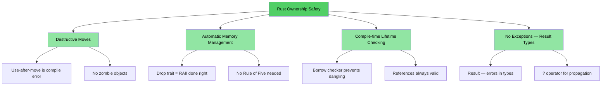
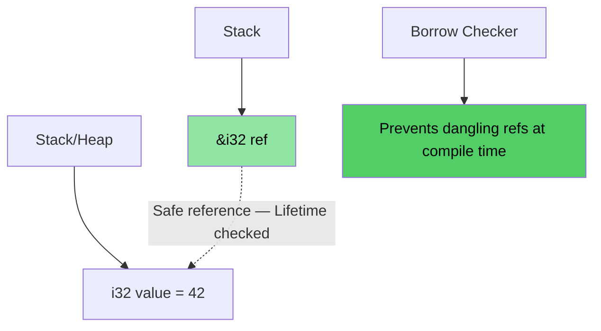
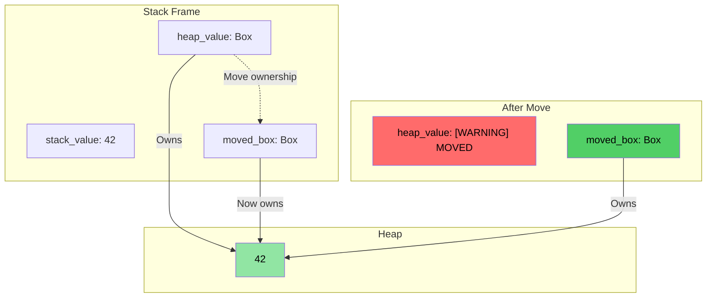
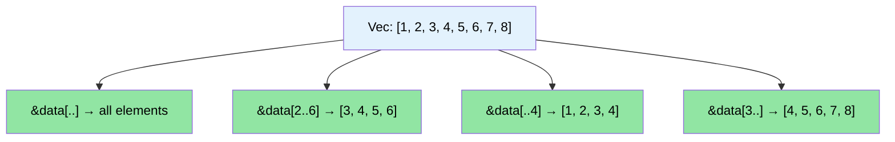

# Speaker intro and general approach

> **What you'll learn:** Course structure, the interactive format, and how familiar C/C++ concepts map to Rust equivalents. This chapter sets expectations and gives you a roadmap for the rest of the book.

- Speaker intro
    - Principal Firmware Architect in Microsoft SCHIE (Silicon and Cloud Hardware Infrastructure Engineering) team
    - Industry veteran with expertise in security, systems programming (firmware, operating systems, hypervisors), CPU and platform architecture, and C++ systems
    - Started programming in Rust in 2017 (@AWS EC2), and have been in love with the language ever since
- This course is intended to be as interactive as possible
    - Assumption: You know C, C++, or both
    - Examples are deliberately designed to map familiar concepts to Rust equivalents
    - **Please feel free to ask clarifying questions at any point of time**
- Speaker is looking forward to continued engagement with teams

# The case for Rust
> **Want to skip straight to code?** Jump to [Show me some code](ch02-getting-started.md#enough-talk-already-show-me-some-code)

Whether you're coming from C or C++, the core pain points are the same: memory safety bugs that compile cleanly but crash, corrupt, or leak at runtime.

- Over **70% of CVEs** are caused by memory safety issues — buffer overflows, dangling pointers, use-after-free
- C++ `shared_ptr`, `unique_ptr`, RAII, and move semantics are steps in the right direction, but they are **bandaids, not cures** — they leave use-after-move, reference cycles, iterator invalidation, and exception safety gaps wide open
- Rust provides the performance you rely on from C/C++, but with **compile-time guarantees** for safety

> **📖 Deep dive:** See [Why C/C++ Developers Need Rust](ch01-1-why-c-cpp-developers-need-rust.md) for concrete vulnerability examples, the complete list of what Rust eliminates, and why C++ smart pointers aren't enough

----

# How does Rust address these issues?

## Buffer overflows and bounds violations
- All Rust arrays, slices, and strings have explicit bounds associated with them. The compiler inserts checks to ensure that any bounds violation results in a **runtime crash** (panic in Rust terms) — never undefined behavior

## Dangling pointers and references
- Rust introduces lifetimes and borrow checking to eliminate dangling references at **compile time**
- No dangling pointers, no use-after-free — the compiler simply won't let you

## Use-after-move
- Rust's ownership system makes moves **destructive** — once you move a value, the compiler **refuses** to let you use the original. No zombie objects, no "valid but unspecified state"

## Resource management
- Rust's `Drop` trait is RAII done right — the compiler automatically frees resources when they go out of scope, and **prevents use-after-move** which C++ RAII cannot
- No Rule of Five needed (no copy ctor, move ctor, copy assign, move assign, destructor to define)

## Error handling
- Rust has no exceptions. All errors are values (`Result<T, E>`), making error handling explicit and visible in the type signature

## Iterator invalidation
- Rust's borrow checker **forbids modifying a collection while iterating over it**. You simply cannot write the bugs that plague C++ codebases:
```rust
// Rust equivalent of erase-during-iteration: retain()
pending_faults.retain(|f| f.id != fault_to_remove.id);

// Or: collect into a new Vec (functional style)
let remaining: Vec<_> = pending_faults
    .into_iter()
    .filter(|f| f.id != fault_to_remove.id)
    .collect();
```

## Data races
- The type system prevents data races at **compile time** through the `Send` and `Sync` traits

## Memory Safety Visualization

### Rust Ownership — Safe by Design

```rust
fn safe_rust_ownership() {
    // Move is destructive: original is gone
    let data = vec![1, 2, 3];
    let data2 = data;           // Move happens
    // data.len();              // Compile error: value used after move
    
    // Borrowing: safe shared access
    let owned = String::from("Hello, World!");
    let slice: &str = &owned;  // Borrow — no allocation
    println!("{}", slice);     // Always safe
    
    // No dangling references possible
    /*
    let dangling_ref;
    {
        let temp = String::from("temporary");
        dangling_ref = &temp;  // Compile error: temp doesn't live long enough
    }
    */
}
```



## Memory Layout: Rust References



### `Box<T>` Heap Allocation Visualization

```rust
fn box_allocation_example() {
    // Stack allocation
    let stack_value = 42;
    
    // Heap allocation with Box
    let heap_value = Box::new(42);
    
    // Moving ownership
    let moved_box = heap_value;
    // heap_value is no longer accessible
}
```



## Slice Operations Visualization

```rust
fn slice_operations() {
    let data = vec![1, 2, 3, 4, 5, 6, 7, 8];
    
    let full_slice = &data[..];        // [1,2,3,4,5,6,7,8]
    let partial_slice = &data[2..6];   // [3,4,5,6]
    let from_start = &data[..4];       // [1,2,3,4]
    let to_end = &data[3..];           // [4,5,6,7,8]
}
```



# Other Rust USPs and features
- No data races between threads (compile-time `Send`/`Sync` checking)
- No use-after-move (unlike C++ `std::move` which leaves zombie objects)
- No uninitialized variables
    - All variables must be initialized before use
- No trivial memory leaks
    - `Drop` trait = RAII done right, no Rule of Five needed
    - Compiler automatically releases memory when it goes out of scope
- No forgotten locks on mutexes
    - Lock guards are the *only* way to access the data (`Mutex<T>` wraps the data, not the access)
- No exception handling complexity
    - Errors are values (`Result<T, E>`), visible in function signatures, propagated with `?`
- Excellent support for type inference, enums, pattern matching, zero cost abstractions
- Built-in support for dependency management, building, testing, formatting, linting
    - `cargo` replaces make/CMake + lint + test frameworks

# Quick Reference: Rust vs C/C++

| **Concept** | **C** | **C++** | **Rust** | **Key Difference** |
|-------------|-------|---------|----------|-------------------|
| Memory management | `malloc()/free()` | `unique_ptr`, `shared_ptr` | `Box<T>`, `Rc<T>`, `Arc<T>` | Automatic, no cycles |
| Arrays | `int arr[10]` | `std::vector<T>`, `std::array<T>` | `Vec<T>`, `[T; N]` | Bounds checking by default |
| Strings | `char*` with `\0` | `std::string`, `string_view` | `String`, `&str` | UTF-8 guaranteed, lifetime-checked |
| References | `int* ptr` | `T&`, `T&&` (move) | `&T`, `&mut T` | Borrow checking, lifetimes |
| Polymorphism | Function pointers | Virtual functions, inheritance | Traits, trait objects | Composition over inheritance |
| Generic programming | Macros (`void*`) | Templates | Generics + trait bounds | Better error messages |
| Error handling | Return codes, `errno` | Exceptions, `std::optional` | `Result<T, E>`, `Option<T>` | No hidden control flow |
| NULL/null safety | `ptr == NULL` | `nullptr`, `std::optional<T>` | `Option<T>` | Forced null checking |
| Thread safety | Manual (pthreads) | Manual synchronization | Compile-time guarantees | Data races impossible |
| Build system | Make, CMake | CMake, Make, etc. | Cargo | Integrated toolchain |
| Undefined behavior | Runtime crashes | Subtle UB (signed overflow, aliasing) | Compile-time errors | Safety guaranteed |
