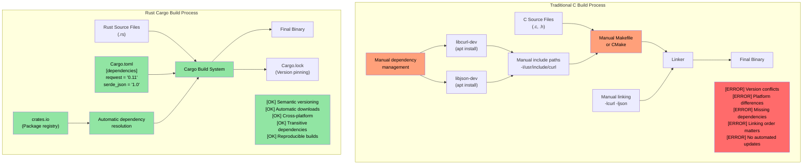
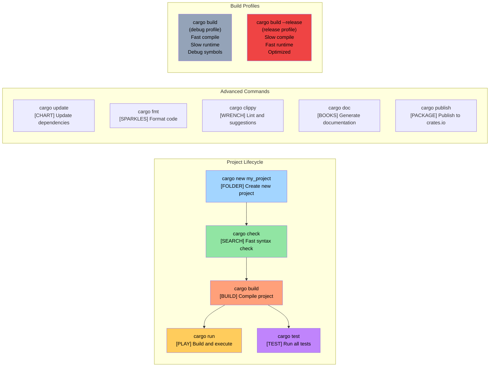

# Enough talk already: Show me some code

> **What you'll learn:** Your first Rust program — `fn main()`, `println!()`, and how Rust macros differ fundamentally from C/C++ preprocessor macros. By the end you'll be able to write, compile, and run simple Rust programs.

```rust
fn main() {
    println!("Hello world from Rust");
}
```
- The above syntax should be similar to anyone familiar with C-style languages
    - All functions in Rust begin with the ```fn``` keyword
    - The default entry point for executables is ```main()```
    - The ```println!``` looks like a function, but is actually a **macro**. Macros in Rust are very different from C/C++ preprocessor macros \u2014 they are hygienic, type-safe, and operate on the syntax tree rather than text substitution
- Two great ways to quickly try out Rust snippets:
    - **Online**: [Rust Playground](https://play.rust-lang.org/) — paste code, hit Run, share results. No install needed
    - **Local REPL**: Install [`evcxr_repl`](https://github.com/evcxr/evcxr) for an interactive Rust REPL (like Python's REPL, but for Rust):
```bash
cargo install --locked evcxr_repl
evcxr   # Start the REPL, type Rust expressions interactively
```

### Rust Local installation
- Rust can be locally installed using the following methods
    - Windows: https://static.rust-lang.org/rustup/dist/x86_64-pc-windows-msvc/rustup-init.exe
    - Linux / WSL: ```curl --proto '=https' --tlsv1.2 -sSf https://sh.rustup.rs | sh```
- The Rust ecosystem is composed of the following components
    - ```rustc``` is the standalone compiler, but it's seldom used directly
    - The preferred tool, ```cargo``` is the Swiss Army knife and is used for dependency management, building, testing, formatting, linting, etc.
    - The Rust toolchain comes in the ```stable```, ```beta``` and ```nightly``` (experimental) channels, but we'll stick with ```stable```. Use the ```rustup update``` command to upgrade the ```stable``` installation that's released every six weeks
- We'll also install the ```rust-analyzer``` plug-in for VSCode

# Rust packages (crates)
- Rust binaries are created using packages (hereby called crates)
    - A crate may either be standalone, or may have dependency on other crates. The crates for the dependencies can be local or remote. Third-party crates are typically downloaded from a centralized repository called ```crates.io```. 
    - The ```cargo``` tool automatically handles the downloading of crates and their dependencies. This is conceptually equivalent to linking to C-libraries
    - Crate dependencies are expressed in a file called ```Cargo.toml```. It also defines the target type for the crate: standalone executable, static library, dynamic library (uncommon)
    - Reference: https://doc.rust-lang.org/cargo/reference/cargo-targets.html

## Cargo vs Traditional C Build Systems

### Dependency Management Comparison



### Cargo Project Structure

```text
my_project/
|-- Cargo.toml          # Project configuration (like package.json)
|-- Cargo.lock          # Exact dependency versions (auto-generated)
|-- src/
|   |-- main.rs         # Main entry point for binary
|   |-- lib.rs          # Library root (if creating a library)
|   `-- bin/            # Additional binary targets
|-- tests/              # Integration tests
|-- examples/           # Example code
|-- benches/            # Benchmarks
`-- target/             # Build artifacts (like C's build/ or obj/)
    |-- debug/          # Debug builds (fast compile, slow runtime)
    `-- release/        # Release builds (slow compile, fast runtime)
```

### Common Cargo Commands



# Example: cargo and crates
- In this example, we have a standalone executable crate with no other dependencies
- Use the following commands to create a new crate called ```helloworld``` 
```bash
cargo new helloworld
cd helloworld
cat Cargo.toml
```
- By default, ```cargo run``` will compile and run the ```debug``` (unoptimized) version of the crate. To execute the ```release``` version, use ```cargo run --release```
- Note that actual binary file resides under the ```target``` folder under the ```debug``` or ```release``` folder 
- We might have also noticed a file called ```Cargo.lock``` in the same folder as the source. It is automatically generated and should not be modified by hand
    - We will revisit the specific purpose of ```Cargo.lock``` later


