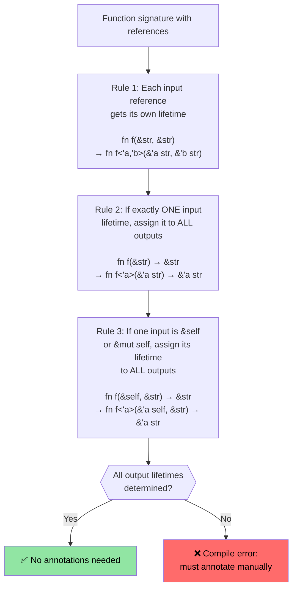

# Rust lifetime and borrowing

> **What you'll learn:** How Rust's lifetime system ensures references never dangle — from implicit lifetimes through explicit annotations to the three elision rules that make most code annotation-free. Understanding lifetimes here is essential before moving on to smart pointers in the next section.

- Rust enforces a single mutable reference and any number of immutable references
    - The lifetime of any reference must be at least as long as the original owning lifetime. These are implicit lifetimes and are inferred by the compiler (see https://doc.rust-lang.org/nomicon/lifetime-elision.html)
```rust
fn borrow_mut(x: &mut u32) {
    *x = 43;
}
fn main() {
    let mut x = 42;
    let y = &mut x;
    borrow_mut(y);
    let _z = &x; // Permitted because the compiler knows y isn't subsequently used
    //println!("{y}"); // Will not compile if this is uncommented
    borrow_mut(&mut x); // Permitted because _z isn't used 
    let z = &x; // Ok -- mutable borrow of x ended after foo() returned
    println!("{z}");
}
```

# Rust lifetime annotations
- Explicit lifetime annotations are needed when dealing with multiple lifetimes
    - Lifetimes are denoted with `'` and can be any identifier (`'a`, `'b`, `'static`, etc.)
    - The compiler needs help when it can't figure out how long references should live
- **Common scenario**: Function returns a reference, but which input does it come from?
```rust
#[derive(Debug)]
struct Point {x: u32, y: u32}

// Without lifetime annotation, this won't compile:
// fn left_or_right(pick_left: bool, left: &Point, right: &Point) -> &Point

// With lifetime annotation - all references share the same lifetime 'a
fn left_or_right<'a>(pick_left: bool, left: &'a Point, right: &'a Point) -> &'a Point {
    if pick_left { left } else { right }
}

// More complex: different lifetimes for inputs
fn get_x_coordinate<'a, 'b>(p1: &'a Point, _p2: &'b Point) -> &'a u32 {
    &p1.x  // Return value lifetime tied to p1, not p2
}

fn main() {
    let p1 = Point {x: 20, y: 30};
    let result;
    {
        let p2 = Point {x: 42, y: 50};
        result = left_or_right(true, &p1, &p2);
        // This works because we use result before p2 goes out of scope
        println!("Selected: {result:?}");
    }
    // This would NOT work - result references p2 which is now gone:
    // println!("After scope: {result:?}");
}
```

# Rust lifetime annotations
- Lifetime annotations are also needed for references in data structures
```rust
use std::collections::HashMap;
#[derive(Debug)]
struct Point {x: u32, y: u32}
struct Lookup<'a> {
    map: HashMap<u32, &'a Point>,
}
fn main() {
    let p = Point{x: 42, y: 42};
    let p1 = Point{x: 50, y: 60};
    let mut m = Lookup {map : HashMap::new()};
    m.map.insert(0, &p);
    m.map.insert(1, &p1);
    {
        let p3 = Point{x: 60, y:70};
        //m.map.insert(3, &p3); // Will not compile
        // p3 is dropped here, but m will outlive
    }
    for (k, v) in m.map {
        println!("{v:?}");
    }
    // m is dropped here
    // p1 and p are dropped here in that order
} 
```

# Exercise: First word with lifetimes

🟢 **Starter** — practice lifetime elision in action

Write a function `fn first_word(s: &str) -> &str` that returns the first whitespace-delimited word from a string. Think about why this compiles without explicit lifetime annotations (hint: elision rule #1 and #2).

<details><summary>Solution (click to expand)</summary>

```rust
fn first_word(s: &str) -> &str {
    // The compiler applies elision rules:
    // Rule 1: input &str gets lifetime 'a → fn first_word(s: &'a str) -> &str
    // Rule 2: single input lifetime → output gets same → fn first_word(s: &'a str) -> &'a str
    match s.find(' ') {
        Some(pos) => &s[..pos],
        None => s,
    }
}

fn main() {
    let text = "hello world foo";
    let word = first_word(text);
    println!("First word: {word}");  // "hello"
    
    let single = "onlyone";
    println!("First word: {}", first_word(single));  // "onlyone"
}
```

</details>

# Exercise: Slice storage with lifetimes

🟡 **Intermediate** — your first encounter with lifetime annotations
- Create a structure that stores references to the slice of a ```&str```
    - Create a long ```&str``` and store references slices from it inside the structure
    - Write a function that accepts the structure and returns the contained slice
```rust
// TODO: Create a structure to store a reference to a slice
struct SliceStore {

}
fn main() {
    let s = "This is long string";
    let s1 = &s[0..];
    let s2 = &s[1..2];
    // let slice = struct SliceStore {...};
    // let slice2 = struct SliceStore {...};
}
```

<details><summary>Solution (click to expand)</summary>

```rust
struct SliceStore<'a> {
    slice: &'a str,
}

impl<'a> SliceStore<'a> {
    fn new(slice: &'a str) -> Self {
        SliceStore { slice }
    }

    fn get_slice(&self) -> &'a str {
        self.slice
    }
}

fn main() {
    let s = "This is a long string";
    let store1 = SliceStore::new(&s[0..4]);   // "This"
    let store2 = SliceStore::new(&s[5..7]);   // "is"
    println!("store1: {}", store1.get_slice());
    println!("store2: {}", store2.get_slice());
}
// Output:
// store1: This
// store2: is
```

</details>

---

## Lifetime Elision Rules Deep Dive

C programmers often ask: "If lifetimes are so important, why don't most Rust functions
have `'a` annotations?" The answer is **lifetime elision** — the compiler applies three
deterministic rules to infer lifetimes automatically.

### The Three Elision Rules

The Rust compiler applies these rules **in order** to function signatures. If all output
lifetimes are determined after applying the rules, no annotations are needed.



### Rule-by-Rule Examples

**Rule 1** — each input reference gets its own lifetime parameter:
```rust
// What you write:
fn first_word(s: &str) -> &str { ... }

// What the compiler sees after Rule 1:
fn first_word<'a>(s: &'a str) -> &str { ... }
// Only one input lifetime → Rule 2 applies
```

**Rule 2** — single input lifetime propagates to all outputs:
```rust
// After Rule 2:
fn first_word<'a>(s: &'a str) -> &'a str { ... }
// ✅ All output lifetimes determined — no annotation needed!
```

**Rule 3** — `&self` lifetime propagates to outputs:
```rust
// What you write:
impl SliceStore<'_> {
    fn get_slice(&self) -> &str { self.slice }
}

// What the compiler sees after Rules 1 + 3:
impl SliceStore<'_> {
    fn get_slice<'a>(&'a self) -> &'a str { self.slice }
}
// ✅ No annotation needed — &self lifetime used for output
```

**When elision fails** — you must annotate:
```rust
// Two input references, no &self → Rules 2 and 3 don't apply
// fn longest(a: &str, b: &str) -> &str  ← WON'T COMPILE

// Fix: tell the compiler which input the output borrows from
fn longest<'a>(a: &'a str, b: &'a str) -> &'a str {
    if a.len() >= b.len() { a } else { b }
}
```

### C Programmer Mental Model

In C, every pointer is independent — the programmer mentally tracks which allocation
each pointer refers to, and the compiler trusts you completely. In Rust, lifetimes make
this tracking **explicit and compiler-verified**:

| C | Rust | What happens |
|---|------|-------------|
| `char* get_name(struct User* u)` | `fn get_name(&self) -> &str` | Rule 3 elides: output borrows from `self` |
| `char* concat(char* a, char* b)` | `fn concat<'a>(a: &'a str, b: &'a str) -> &'a str` | Must annotate — two inputs |
| `void process(char* in, char* out)` | `fn process(input: &str, output: &mut String)` | No output reference — no lifetime needed |
| `char* buf; /* who owns this? */` | Compile error if lifetime is wrong | Compiler catches dangling pointers |

### The `'static` Lifetime

`'static` means the reference is valid for the **entire program duration**. It's the
Rust equivalent of a C global or string literal:

```rust
// String literals are always 'static — they live in the binary's read-only section
let s: &'static str = "hello";  // Same as: static const char* s = "hello"; in C

// Constants are also 'static
static GREETING: &str = "hello";

// Common in trait bounds for thread spawning:
fn spawn<F: FnOnce() + Send + 'static>(f: F) { /* ... */ }
// 'static here means: "the closure must not borrow any local variables"
// (either move them in, or use only 'static data)
```

### Exercise: Predict the Elision

🟡 **Intermediate**

For each function signature below, predict whether the compiler can elide lifetimes.
If not, add the necessary annotations:

```rust
// 1. Can the compiler elide?
fn trim_prefix(s: &str) -> &str { &s[1..] }

// 2. Can the compiler elide?
fn pick(flag: bool, a: &str, b: &str) -> &str {
    if flag { a } else { b }
}

// 3. Can the compiler elide?
struct Parser { data: String }
impl Parser {
    fn next_token(&self) -> &str { &self.data[..5] }
}

// 4. Can the compiler elide?
fn split_at(s: &str, pos: usize) -> (&str, &str) {
    (&s[..pos], &s[pos..])
}
```

<details><summary>Solution (click to expand)</summary>

```rust,ignore
// 1. YES — Rule 1 gives 'a to s, Rule 2 propagates to output
fn trim_prefix(s: &str) -> &str { &s[1..] }

// 2. NO — Two input references, no &self. Must annotate:
fn pick<'a>(flag: bool, a: &'a str, b: &'a str) -> &'a str {
    if flag { a } else { b }
}

// 3. YES — Rule 1 gives 'a to &self, Rule 3 propagates to output
impl Parser {
    fn next_token(&self) -> &str { &self.data[..5] }
}

// 4. YES — Rule 1 gives 'a to s (only one input reference),
//    Rule 2 propagates to BOTH outputs. Both slices borrow from s.
fn split_at(s: &str, pos: usize) -> (&str, &str) {
    (&s[..pos], &s[pos..])
}
```

</details>
