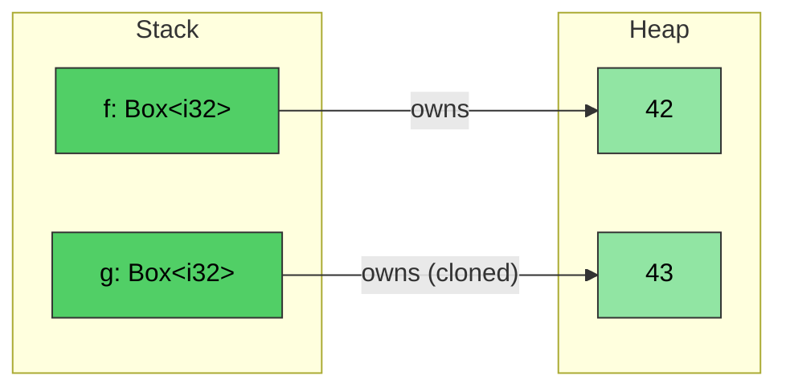
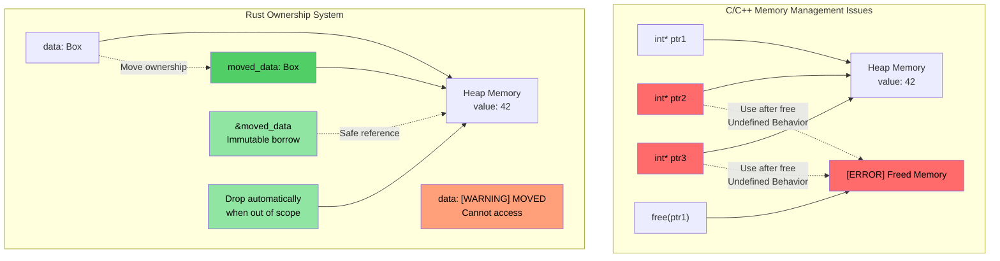
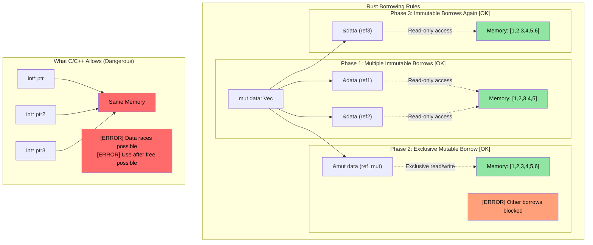

# Rust `Box<T>`

> **What you'll learn:** Rust's smart pointer types — `Box<T>` for heap allocation, `Rc<T>` for shared ownership, and `Cell<T>`/`RefCell<T>` for interior mutability. These build on the ownership and lifetime concepts from the previous sections. You'll also see a brief introduction to `Weak<T>` for breaking reference cycles.

**Why `Box<T>`?** In C, you use `malloc`/`free` for heap allocation. In C++, `std::unique_ptr<T>` wraps `new`/`delete`. Rust's `Box<T>` is the equivalent — a heap-allocated, single-owner pointer that is automatically freed when it goes out of scope. Unlike `malloc`, there's no matching `free` to forget. Unlike `unique_ptr`, there's no use-after-move — the compiler prevents it entirely.

**When to use `Box` vs stack allocation:**
- The contained type is large and you don't want to copy it on the stack
- You need a recursive type (e.g., a linked list node that contains itself)
- You need trait objects (`Box<dyn Trait>`)

- ```Box<T>``` can be use to create a pointer to a heap allocated type. The pointer is always a fixed size regardless of the type of ```<T>```
```rust
fn main() {
    // Creates a pointer to an integer (with value 42) created on the heap
    let f = Box::new(42);
    println!("{} {}", *f, f);
    // Cloning a box creates a new heap allocation
    let mut g = f.clone();
    *g = 43;
    println!("{f} {g}");
    // g and f go out of scope here and are automatically deallocated
}
```


## Ownership and Borrowing Visualization

### C/C++ vs Rust: Pointer and Ownership Management

```c
// C - Manual memory management, potential issues
void c_pointer_problems() {
    int* ptr1 = malloc(sizeof(int));
    *ptr1 = 42;
    
    int* ptr2 = ptr1;  // Both point to same memory
    int* ptr3 = ptr1;  // Three pointers to same memory
    
    free(ptr1);        // Frees the memory
    
    *ptr2 = 43;        // Use after free - undefined behavior!
    *ptr3 = 44;        // Use after free - undefined behavior!
}
```

> **For C++ developers:** Smart pointers help, but don't prevent all issues:
>
> ```cpp
> // C++ - Smart pointers help, but don't prevent all issues
> void cpp_pointer_issues() {
>     auto ptr1 = std::make_unique<int>(42);
>     
>     // auto ptr2 = ptr1;  // Compile error: unique_ptr not copyable
>     auto ptr2 = std::move(ptr1);  // OK: ownership transferred
>     
>     // But C++ still allows use-after-move:
>     // std::cout << *ptr1;  // Compiles! But undefined behavior!
>     
>     // shared_ptr aliasing:
>     auto shared1 = std::make_shared<int>(42);
>     auto shared2 = shared1;  // Both own the data
>     // Who "really" owns it? Neither. Ref count overhead everywhere.
> }
> ```

```rust
// Rust - Ownership system prevents these issues
fn rust_ownership_safety() {
    let data = Box::new(42);  // data owns the heap allocation
    
    let moved_data = data;    // Ownership transferred to moved_data
    // data is no longer accessible - compile error if used
    
    let borrowed = &moved_data;  // Immutable borrow
    println!("{}", borrowed);    // Safe to use
    
    // moved_data automatically freed when it goes out of scope
}
```



### Borrowing Rules Visualization

```rust
fn borrowing_rules_example() {
    let mut data = vec![1, 2, 3, 4, 5];
    
    // Multiple immutable borrows - OK
    let ref1 = &data;
    let ref2 = &data;
    println!("{:?} {:?}", ref1, ref2);  // Both can be used
    
    // Mutable borrow - exclusive access
    let ref_mut = &mut data;
    ref_mut.push(6);
    // ref1 and ref2 can't be used while ref_mut is active
    
    // After ref_mut is done, immutable borrows work again
    let ref3 = &data;
    println!("{:?}", ref3);
}
```



---

## Interior Mutability: `Cell<T>` and `RefCell<T>`

Recall that by default variables are immutable in Rust. Sometimes it's desirable to have most of a type read-only while permitting write access to a single field.

```rust
struct Employee {
    employee_id : u64,   // This must be immutable
    on_vacation: bool,   // What if we wanted to permit write-access to this field, but make employee_id immutable?
}
```

- Recall that Rust permits a *single mutable* reference to a variable and any number of *immutable* references — enforced at *compile-time*
- What if we wanted to pass an *immutable* vector of employees, *but* allow the `on_vacation` field to be updated, while ensuring `employee_id` cannot be mutated?

### `Cell<T>` — interior mutability for Copy types

- `Cell<T>` provides **interior mutability**, i.e., write access to specific elements of references that are otherwise read-only
- Works by copying values in and out (requires `T: Copy` for `.get()`)

### `RefCell<T>` — interior mutability with runtime borrow checking

- `RefCell<T>` provides a variation that works with references
    - Enforces Rust borrow-checks at **runtime** instead of compile-time
    - Allows a single *mutable* borrow, but **panics** if there are any other references outstanding
    - Use `.borrow()` for immutable access and `.borrow_mut()` for mutable access

### When to Choose `Cell` vs `RefCell`

| Criterion | `Cell<T>` | `RefCell<T>` |
|-----------|-----------|-------------|
| Works with | `Copy` types (integers, bools, floats) | Any type (`String`, `Vec`, structs) |
| Access pattern | Copies values in/out (`.get()`, `.set()`) | Borrows in place (`.borrow()`, `.borrow_mut()`) |
| Failure mode | Cannot fail — no runtime checks | **Panics** if you borrow mutably while another borrow is active |
| Overhead | Zero — just copies bytes | Small — tracks borrow state at runtime |
| Use when | You need a mutable flag, counter, or small value inside an immutable struct | You need to mutate a `String`, `Vec`, or complex type inside an immutable struct |

---

## Shared Ownership: `Rc<T>`

`Rc<T>` allows reference-counted shared ownership of *immutable* data. What if we wanted to store the same `Employee` in multiple places without copying?

```rust
#[derive(Debug)]
struct Employee {
    employee_id: u64,
}
fn main() {
    let mut us_employees = vec![];
    let mut all_global_employees = Vec::<Employee>::new();
    let employee = Employee { employee_id: 42 };
    us_employees.push(employee);
    // Won't compile — employee was already moved
    //all_global_employees.push(employee);
}
```

`Rc<T>` solves the problem by allowing shared *immutable* access:
- The contained type is automatically dereferenced
- The type is dropped when the reference count goes to 0

```rust
use std::rc::Rc;
#[derive(Debug)]
struct Employee {employee_id: u64}
fn main() {
    let mut us_employees = vec![];
    let mut all_global_employees = vec![];
    let employee = Employee { employee_id: 42 };
    let employee_rc = Rc::new(employee);
    us_employees.push(employee_rc.clone());
    all_global_employees.push(employee_rc.clone());
    let employee_one = all_global_employees.get(0); // Shared immutable reference
    for e in us_employees {
        println!("{}", e.employee_id);  // Shared immutable reference
    }
    println!("{employee_one:?}");
}
```

> **For C++ developers: Smart Pointer Mapping**
>
> | C++ Smart Pointer | Rust Equivalent | Key Difference |
> |---|---|---|
> | `std::unique_ptr<T>` | `Box<T>` | Rust's version is the default — move is language-level, not opt-in |
> | `std::shared_ptr<T>` | `Rc<T>` (single-thread) / `Arc<T>` (multi-thread) | No atomic overhead for `Rc`; use `Arc` only when sharing across threads |
> | `std::weak_ptr<T>` | `Weak<T>` (from `Rc::downgrade()` or `Arc::downgrade()`) | Same purpose: break reference cycles |
>
> **Key distinction**: In C++, you *choose* to use smart pointers. In Rust, owned values (`T`) and borrowing (`&T`) cover most use cases — reach for `Box`/`Rc`/`Arc` only when you need heap allocation or shared ownership.

### Breaking Reference Cycles with `Weak<T>`

`Rc<T>` uses reference counting — if two `Rc` values point to each other, neither will ever be dropped (a cycle). `Weak<T>` solves this:

```rust
use std::rc::{Rc, Weak};

struct Node {
    value: i32,
    parent: Option<Weak<Node>>,  // Weak reference — doesn't prevent drop
}

fn main() {
    let parent = Rc::new(Node { value: 1, parent: None });
    let child = Rc::new(Node {
        value: 2,
        parent: Some(Rc::downgrade(&parent)),  // Weak ref to parent
    });

    // To use a Weak, try to upgrade it — returns Option<Rc<T>>
    if let Some(parent_rc) = child.parent.as_ref().unwrap().upgrade() {
        println!("Parent value: {}", parent_rc.value);
    }
    println!("Parent strong count: {}", Rc::strong_count(&parent)); // 1, not 2
}
```

> `Weak<T>` is covered in more depth in [Avoiding Excessive clone()](ch17-1-avoiding-excessive-clone.md). For now, the key takeaway: **use `Weak` for "back-references" in tree/graph structures to avoid memory leaks.**

---

## Combining `Rc` with Interior Mutability

The real power emerges when you combine `Rc<T>` (shared ownership) with `Cell<T>` or `RefCell<T>` (interior mutability). This lets multiple owners **read and modify** shared data:

| Pattern | Use case |
|---------|----------|
| `Rc<RefCell<T>>` | Shared, mutable data (single-threaded) |
| `Arc<Mutex<T>>` | Shared, mutable data (multi-threaded — see [ch13](ch13-concurrency.md)) |
| `Rc<Cell<T>>` | Shared, mutable Copy types (simple flags, counters) |

---

# Exercise: Shared ownership and interior mutability

🟡 **Intermediate**

- **Part 1 (Rc)**: Create an `Employee` struct with `employee_id: u64` and `name: String`. Place it in an `Rc<Employee>` and clone it into two separate `Vec`s (`us_employees` and `global_employees`). Print from both vectors to show they share the same data.
- **Part 2 (Cell)**: Add an `on_vacation: Cell<bool>` field to `Employee`. Pass an immutable `&Employee` reference to a function and toggle `on_vacation` from inside that function — without making the reference mutable.
- **Part 3 (RefCell)**: Replace `name: String` with `name: RefCell<String>` and write a function that appends a suffix to the employee's name through an `&Employee` (immutable reference).

**Starter code:**
```rust
use std::cell::{Cell, RefCell};
use std::rc::Rc;

#[derive(Debug)]
struct Employee {
    employee_id: u64,
    name: RefCell<String>,
    on_vacation: Cell<bool>,
}

fn toggle_vacation(emp: &Employee) {
    // TODO: Flip on_vacation using Cell::set()
}

fn append_title(emp: &Employee, title: &str) {
    // TODO: Borrow name mutably via RefCell and push_str the title
}

fn main() {
    // TODO: Create an employee, wrap in Rc, clone into two Vecs,
    // call toggle_vacation and append_title, print results
}
```

<details><summary>Solution (click to expand)</summary>

```rust
use std::cell::{Cell, RefCell};
use std::rc::Rc;

#[derive(Debug)]
struct Employee {
    employee_id: u64,
    name: RefCell<String>,
    on_vacation: Cell<bool>,
}

fn toggle_vacation(emp: &Employee) {
    emp.on_vacation.set(!emp.on_vacation.get());
}

fn append_title(emp: &Employee, title: &str) {
    emp.name.borrow_mut().push_str(title);
}

fn main() {
    let emp = Rc::new(Employee {
        employee_id: 42,
        name: RefCell::new("Alice".to_string()),
        on_vacation: Cell::new(false),
    });

    let mut us_employees = vec![];
    let mut global_employees = vec![];
    us_employees.push(Rc::clone(&emp));
    global_employees.push(Rc::clone(&emp));

    // Toggle vacation through an immutable reference
    toggle_vacation(&emp);
    println!("On vacation: {}", emp.on_vacation.get()); // true

    // Append title through an immutable reference
    append_title(&emp, ", Sr. Engineer");
    println!("Name: {}", emp.name.borrow()); // "Alice, Sr. Engineer"

    // Both Vecs see the same data (Rc shares ownership)
    println!("US: {:?}", us_employees[0].name.borrow());
    println!("Global: {:?}", global_employees[0].name.borrow());
    println!("Rc strong count: {}", Rc::strong_count(&emp));
}
// Output:
// On vacation: true
// Name: Alice, Sr. Engineer
// US: "Alice, Sr. Engineer"
// Global: "Alice, Sr. Engineer"
// Rc strong count: 3
```

</details>
