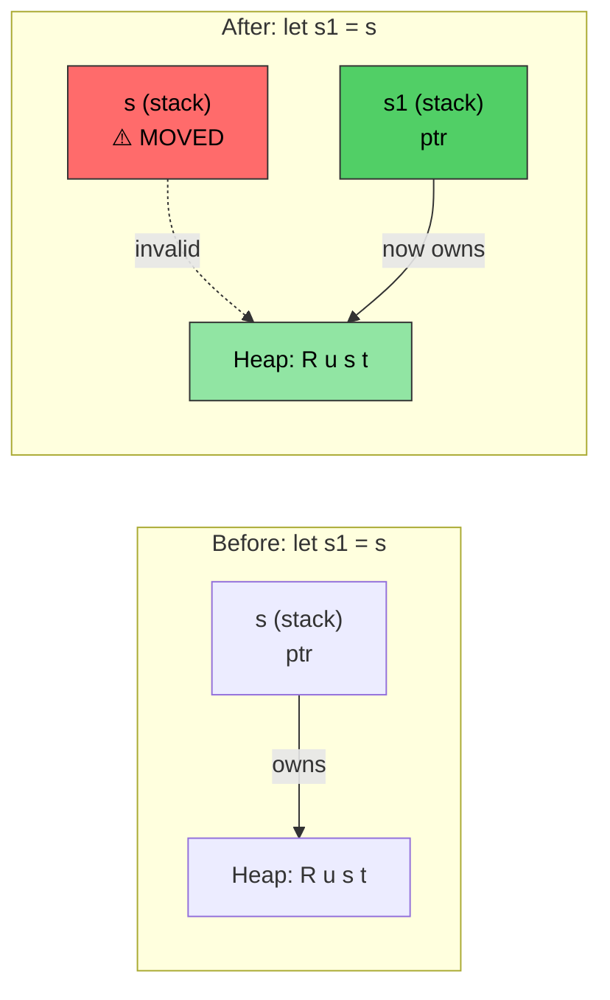
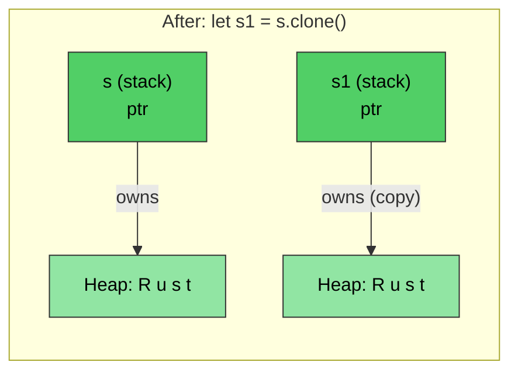

# Rust memory management

> **What you'll learn:** Rust's ownership system — the single most important concept in the language. After this chapter you'll understand move semantics, borrowing rules, and the `Drop` trait. If you grasp this chapter, the rest of Rust follows naturally. If you're struggling, re-read it — ownership clicks on the second pass for most C/C++ developers.

- Memory management in C/C++ is a source of bugs:
    - In C: memory is allocated with `malloc()` and freed with `free()`. No checks against dangling pointers, use-after-free, or double-free
    - In C++: RAII (Resource Acquisition Is Initialization) and smart pointers help, but `std::move(ptr)` compiles even after the move — use-after-move is UB
- Rust makes RAII **foolproof**:
    - Move is **destructive** — the compiler refuses to let you touch the moved-from variable
    - No Rule of Five needed (no copy ctor, move ctor, copy assign, move assign, destructor)
    - Rust gives complete control of memory allocation, but enforces safety at **compile time**
    - This is done by a combination of mechanisms including ownership, borrowing, mutability and lifetimes
    - Rust runtime allocations can happen both on the stack and the heap

> **For C++ developers — Smart Pointer Mapping:**
>
> | **C++** | **Rust** | **Safety Improvement** |
> |---------|----------|----------------------|
> | `std::unique_ptr<T>` | `Box<T>` | No use-after-move possible |
> | `std::shared_ptr<T>` | `Rc<T>` (single-thread) | No reference cycles by default |
> | `std::shared_ptr<T>` (thread-safe) | `Arc<T>` | Explicit thread-safety |
> | `std::weak_ptr<T>` | `Weak<T>` | Must check validity |
> | Raw pointer | `*const T` / `*mut T` | Only in `unsafe` blocks |
>
> For C developers: `Box<T>` replaces `malloc`/`free` pairs. `Rc<T>` replaces manual reference counting. Raw pointers exist but are confined to `unsafe` blocks.

# Rust ownership, borrowing and lifetimes
- Recall that Rust only permits a single mutable reference to a variable and multiple read-only references
    - The initial declaration of the variable establishes ```ownership```
    - Subsequent references ```borrow``` from the original owner. The rule is that the scope of the borrow can never exceed the owning scope. In other words, the ```lifetime``` of a borrow cannot exceed the owning lifetime
```rust
fn main() {
    let a = 42; // Owner
    let b = &a; // First borrow
    {
        let aa = 42;
        let c = &a; // Second borrow; a is still in scope
        // Ok: c goes out of scope here
        // aa goes out of scope here
    }
    // let d = &aa; // Will not compile unless aa is moved to outside scope
    // b implicitly goes out of scope before a
    // a goes out of scope last
}
```

- Rust can pass parameters to methods using several different mechanisms
    - By value (copy): Typically types that can be trivially copied (ex: u8, u32, i8, i32)
    - By reference: This is the equivalent of passing a pointer to the actual value. This is also commonly known as borrowing, and the reference can be immutable (```&```), or mutable (```&mut```) 
    - By moving: This transfers "ownership" of the value to the function. The caller can no longer reference the original value
```rust
fn foo(x: &u32) {
    println!("{x}");
}
fn bar(x: u32) {
    println!("{x}");
}
fn main() {
    let a = 42;
    foo(&a);    // By reference
    bar(a);     // By value (copy)
}
```

- Rust prohibits dangling references from methods
    - References returned by methods must still be in scope
    - Rust will automatically ```drop``` a reference when it goes out of scope. 
```rust
fn no_dangling() -> &u32 {
    // lifetime of a begins here
    let a = 42;
    // Won't compile. lifetime of a ends here
    &a
}

fn ok_reference(a: &u32) -> &u32 {
    // Ok because the lifetime of a always exceeds ok_reference()
    a
}
fn main() {
    let a = 42;     // lifetime of a begins here
    let b = ok_reference(&a);
    // lifetime of b ends here
    // lifetime of a ends here
}
```

# Rust move semantics
- By default, Rust assignment transfers ownership
```rust
fn main() {
    let s = String::from("Rust");    // Allocate a string from the heap
    let s1 = s; // Transfer ownership to s1. s is invalid at this point
    println!("{s1}");
    // This will not compile
    //println!("{s}");
    // s1 goes out of scope here and the memory is deallocated
    // s goes out of scope here, but nothing happens because it doesn't own anything
}
```

*After `let s1 = s`, ownership transfers to `s1`. The heap data stays put — only the stack pointer moves. `s` is now invalid.*

----
# Rust move semantics and borrowing
```rust
fn foo(s : String) {
    println!("{s}");
    // The heap memory pointed to by s will be deallocated here
}
fn bar(s : &String) {
    println!("{s}");
    // Nothing happens -- s is borrowed
}
fn main() {
    let s = String::from("Rust string move example");    // Allocate a string from the heap
    foo(s); // Transfers ownership; s is invalid now
    // println!("{s}");  // will not compile
    let t = String::from("Rust string borrow example");
    bar(&t);    // t continues to hold ownership
    println!("{t}"); 
}
```

# Rust move semantics and ownership
- It is possible to transfer ownership by moving
    - It is illegal to reference outstanding references after the move is completed
    - Consider borrowing if a move is not desirable
```rust
struct Point {
    x: u32,
    y: u32,
}
fn consume_point(p: Point) {
    println!("{} {}", p.x, p.y);
}
fn borrow_point(p: &Point) {
    println!("{} {}", p.x, p.y);
}
fn main() {
    let p = Point {x: 10, y: 20};
    // Try flipping the two lines
    borrow_point(&p);
    consume_point(p);
}
```

# Rust Clone
- The ```clone()``` method can be used to copy the original memory. The original reference continues to be valid (the downside is that we have 2x the allocation)
```rust
fn main() {
    let s = String::from("Rust");    // Allocate a string from the heap
    let s1 = s.clone(); // Copy the string; creates a new allocation on the heap
    println!("{s1}");  
    println!("{s}");
    // s1 goes out of scope here and the memory is deallocated
    // s goes out of scope here, and the memory is deallocated
}
```

*`clone()` creates a **separate** heap allocation. Both `s` and `s1` are valid — each owns its own copy.*

# Rust Copy trait
- Rust implements copy semantics for built-in types using the ```Copy``` trait
    - Examples include u8, u32, i8, i32, etc. Copy semantics use "pass by value"
    - User defined data types can optionally opt into ```copy``` semantics using the ```derive``` macro with to automatically implement the ```Copy``` trait
    - The compiler will allocate space for the copy following a new assignment
```rust
// Try commenting this out to see the change in let p1 = p; belw
#[derive(Copy, Clone, Debug)]   // We'll discuss this more later
struct Point{x: u32, y:u32}
fn main() {
    let p = Point {x: 42, y: 40};
    let p1 = p;     // This will perform a copy now instead of move
    println!("p: {p:?}");
    println!("p1: {p:?}");
    let p2 = p1.clone();    // Semantically the same as copy
}
```

# Rust Drop trait

- Rust automatically calls the `drop()` method at the end of scope
    - `drop` is part of a generic trait called `Drop`. The compiler provides a blanket NOP implementation for all types, but types can override it. For example, the `String` type overrides it to release heap-allocated memory
    - For C developers: this replaces the need for manual `free()` calls — resources are automatically released when they go out of scope (RAII)
- **Key safety:** You cannot call `.drop()` directly (the compiler forbids it). Instead, use `drop(obj)` which moves the value into the function, runs its destructor, and prevents any further use — eliminating double-free bugs

> **For C++ developers:** `Drop` maps directly to C++ destructors (`~ClassName()`):
>
> | | **C++ destructor** | **Rust `Drop`** |
> |---|---|---|
> | **Syntax** | `~MyClass() { ... }` | `impl Drop for MyType { fn drop(&mut self) { ... } }` |
> | **When called** | End of scope (RAII) | End of scope (same) |
> | **Called on move** | Source left in "valid but unspecified" state — destructor still runs on the moved-from object | Source is **gone** — no destructor call on moved-from value |
> | **Manual call** | `obj.~MyClass()` (dangerous, rarely used) | `drop(obj)` (safe — takes ownership, calls `drop`, prevents further use) |
> | **Order** | Reverse declaration order | Reverse declaration order (same) |
> | **Rule of Five** | Must manage copy ctor, move ctor, copy assign, move assign, destructor | Only `Drop` — compiler handles move semantics, and `Clone` is opt-in |
> | **Virtual dtor needed?** | Yes, if deleting through base pointer | No — no inheritance, so no slicing problem |

```rust
struct Point {x: u32, y:u32}

// Equivalent to: ~Point() { printf("Goodbye point x:%u, y:%u\n", x, y); }
impl Drop for Point {
    fn drop(&mut self) {
        println!("Goodbye point x:{}, y:{}", self.x, self.y);
    }
}
fn main() {
    let p = Point{x: 42, y: 42};
    {
        let p1 = Point{x:43, y: 43};
        println!("Exiting inner block");
        // p1.drop() called here — like C++ end-of-scope destructor
    }
    println!("Exiting main");
    // p.drop() called here
}
```

# Exercise: Move, Copy and Drop

🟡 **Intermediate** — experiment freely; the compiler will guide you
- Create your own experiments with ```Point``` with and without ```Copy``` in ```#[derive(Debug)]``` in the below make sure you understand the differences. The idea is to get a solid understanding of how move vs. copy works, so make sure to ask
- Implement a custom ```Drop``` for ```Point``` that sets x and y to 0 in ```drop```. This is a pattern that's useful for releasing locks and other resources for example
```rust
struct Point{x: u32, y: u32}
fn main() {
    // Create Point, assign it to a different variable, create a new scope,
    // pass point to a function, etc.
}
```

<details><summary>Solution (click to expand)</summary>

```rust
#[derive(Debug)]
struct Point { x: u32, y: u32 }

impl Drop for Point {
    fn drop(&mut self) {
        println!("Dropping Point({}, {})", self.x, self.y);
        self.x = 0;
        self.y = 0;
        // Note: setting to 0 in drop demonstrates the pattern,
        // but you can't observe these values after drop completes
    }
}

fn consume(p: Point) {
    println!("Consuming: {:?}", p);
    // p is dropped here
}

fn main() {
    let p1 = Point { x: 10, y: 20 };
    let p2 = p1;  // Move — p1 is no longer valid
    // println!("{:?}", p1);  // Won't compile: p1 was moved

    {
        let p3 = Point { x: 30, y: 40 };
        println!("p3 in inner scope: {:?}", p3);
        // p3 is dropped here (end of scope)
    }

    consume(p2);  // p2 is moved into consume and dropped there
    // println!("{:?}", p2);  // Won't compile: p2 was moved

    // Now try: add #[derive(Copy, Clone)] to Point (and remove the Drop impl)
    // and observe how p1 remains valid after let p2 = p1;
}
// Output:
// p3 in inner scope: Point { x: 30, y: 40 }
// Dropping Point(30, 40)
// Consuming: Point { x: 10, y: 20 }
// Dropping Point(10, 20)
```

</details>


