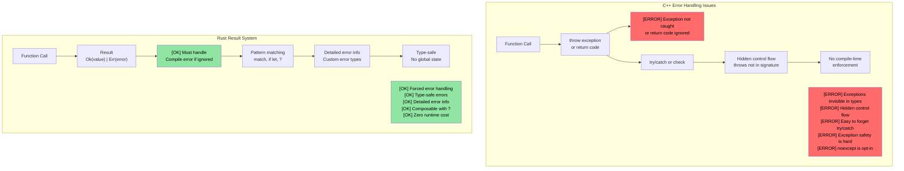
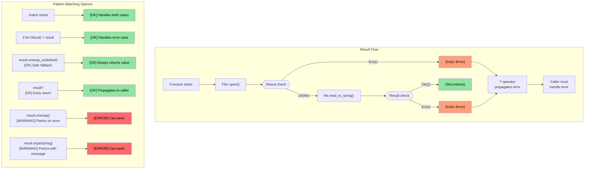

## Connecting enums to Option and Result

> **What you'll learn:** How Rust replaces null pointers with `Option<T>` and exceptions with `Result<T, E>`, and how the `?` operator makes error propagation concise. This is Rust's most distinctive pattern — errors are values, not hidden control flow.

- Remember the `enum` type we learned earlier? Rust's `Option` and `Result` are simply enums defined in the standard library:
```rust
// This is literally how Option is defined in std:
enum Option<T> {
    Some(T),  // Contains a value
    None,     // No value
}

// And Result:
enum Result<T, E> {
    Ok(T),    // Success with value
    Err(E),   // Error with details
}
```
- This means everything you learned about pattern matching with `match` works directly with `Option` and `Result`
- There is **no null pointer** in Rust -- `Option<T>` is the replacement, and the compiler forces you to handle the `None` case

### C++ Comparison: Exceptions vs Result
| **C++ Pattern** | **Rust Equivalent** | **Advantage** |
|----------------|--------------------|--------------|
| `throw std::runtime_error(msg)` | `Err(MyError::Runtime(msg))` | Error in return type — can't forget to handle |
| `try { } catch (...) { }` | `match result { Ok(v) => ..., Err(e) => ... }` | No hidden control flow |
| `std::optional<T>` | `Option<T>` | Exhaustive match required — can't forget None |
| `noexcept` annotation | Default — all Rust functions are "noexcept" | Exceptions don't exist |
| `errno` / return codes | `Result<T, E>` | Type-safe, can't ignore |

# Rust Option type
- The Rust ```Option``` type is an ```enum``` with only two variants: ```Some<T>``` and ```None```
    - The idea is that this represents a ```nullable``` type, i.e., it either contains a valid value of that type (```Some<T>```), or has no valid value (```None```)
    - The ```Option``` type is used in APIs result of an operation either succeeds and returns a valid value or it fails (but the specific error is irrelevant). For example, consider parsing a string for an integer value
```rust
fn main() {
    // Returns Option<usize>
    let a = "1234".find("1");
    match a {
        Some(a) => println!("Found 1 at index {a}"),
        None => println!("Couldn't find 1")
    }
}
```

# Rust Option type
- Rust ```Option``` can be processed in various ways
    - ```unwrap()``` panics if the ```Option<T>``` is ```None``` and returns ```T``` otherwise and it is the least preferred approach 
    - ```or()``` can be used to return an alternative value 
    ```if let``` lets us test for ```Some<T>```

> **Production patterns**: See [Safe value extraction with unwrap_or](ch17-2-avoiding-unchecked-indexing.md#safe-value-extraction-with-unwrap_or) and [Functional transforms: map, map_err, find_map](ch17-2-avoiding-unchecked-indexing.md#functional-transforms-map-map_err-find_map) for real-world examples from production Rust code.
```rust
fn main() {
  // This return an Option<usize>
  let a = "1234".find("1");
  println!("{a:?} {}", a.unwrap());
  let a = "1234".find("5").or(Some(42));
  println!("{a:?}");
  if let Some(a) = "1234".find("1") {
      println!("{a}");
  } else {
    println!("Not found in string");
  }
  // This will panic
  // "1234".find("5").unwrap();
}
```

# Rust Result type
- Result is an ```enum``` type similar to ```Option``` with two variants: ```Ok<T>``` or ```Err<E>```
    - ```Result``` is used extensively in Rust APIs that can fail. The idea is that on success, functions will return a ```Ok<T>```, or they will return a specific error ```Err<T>```
```rust
  use std::num::ParseIntError;
  fn main() {
  let a : Result<i32, ParseIntError>  = "1234z".parse();
  match a {
      Ok(n) => println!("Parsed {n}"),
      Err(e) => println!("Parsing failed {e:?}"),
  }
  let a : Result<i32, ParseIntError>  = "1234z".parse().or(Ok(-1));
  println!("{a:?}");
  if let Ok(a) = "1234".parse::<i32>() {
    println!("Let OK {a}");  
  }
  // This will panic
  //"1234z".parse().unwrap();
}
```

## Option and Result: Two Sides of the Same Coin

`Option` and `Result` are deeply related — `Option<T>` is essentially `Result<T, ()>` (a result where the error carries no information):

| `Option<T>` | `Result<T, E>` | Meaning |
|-------------|---------------|---------|
| `Some(value)` | `Ok(value)` | Success — value is present |
| `None` | `Err(error)` | Failure — no value (Option) or error details (Result) |

**Converting between them:**

```rust
fn main() {
    let opt: Option<i32> = Some(42);
    let res: Result<i32, &str> = opt.ok_or("value was None");  // Option → Result
    
    let res: Result<i32, &str> = Ok(42);
    let opt: Option<i32> = res.ok();  // Result → Option (discards error)
    
    // They share many of the same methods:
    // .map(), .and_then(), .unwrap_or(), .unwrap_or_else(), .is_some()/is_ok()
}
```

> **Rule of thumb**: Use `Option` when absence is normal (e.g., looking up a key). Use `Result` when failure needs explanation (e.g., file I/O, parsing).

# Exercise: log() function implementation with Option

🟢 **Starter**

- Implement a ```log()``` function that accepts an ```Option<&str>``` parameter. If the parameter is ```None```, it should print a default string
- The function should return a ```Result``` with ```()``` for both success and error (in this case we'll never have an error)

<details><summary>Solution (click to expand)</summary>

```rust
fn log(message: Option<&str>) -> Result<(), ()> {
    match message {
        Some(msg) => println!("LOG: {msg}"),
        None => println!("LOG: (no message provided)"),
    }
    Ok(())
}

fn main() {
    let _ = log(Some("System initialized"));
    let _ = log(None);
    
    // Alternative using unwrap_or:
    let msg: Option<&str> = None;
    println!("LOG: {}", msg.unwrap_or("(default message)"));
}
// Output:
// LOG: System initialized
// LOG: (no message provided)
// LOG: (default message)
```

</details>

----
# Rust error handling
 - Rust errors can be irrecoverable (fatal) or recoverable. Fatal errors result in a ``panic```
    - In general, situation that result in ```panics``` should be avoided. ```panics``` are caused by bugs in the program, including exceeding index bounds, calling ```unwrap()``` on an ```Option<None>```, etc.
    - It is OK to have explicit ```panics``` for conditions that should be impossible. The ```panic!``` or ```assert!``` macros can be used for sanity checks
```rust
fn main() {
   let x : Option<u32> = None;
   // println!("{x}", x.unwrap()); // Will panic
   println!("{}", x.unwrap_or(0));  // OK -- prints 0
   let x = 41;
   //assert!(x == 42); // Will panic
   //panic!("Something went wrong"); // Unconditional panic
   let _a = vec![0, 1];
   // println!("{}", a[2]); // Out of bounds panic; use a.get(2) which will return Option<T>
}
```

## Error Handling: C++ vs Rust

### C++ Exception-Based Error Handling Problems

```cpp
// C++ error handling - exceptions create hidden control flow
#include <fstream>
#include <stdexcept>

std::string read_config(const std::string& path) {
    std::ifstream file(path);
    if (!file.is_open()) {
        throw std::runtime_error("Cannot open: " + path);
    }
    std::string content;
    // What if getline throws? Is file properly closed?
    // With RAII yes, but what about other resources?
    std::getline(file, content);
    return content;  // What if caller doesn't try/catch?
}

int main() {
    // ERROR: Forgot to wrap in try/catch!
    auto config = read_config("nonexistent.txt");
    // Exception propagates silently, program crashes
    // Nothing in the function signature warned us
    return 0;
}
```



### `Result<T, E>` Visualization

```rust
// Rust error handling - comprehensive and forced
use std::fs::File;
use std::io::Read;

fn read_file_content(filename: &str) -> Result<String, std::io::Error> {
    let mut file = File::open(filename)?;  // ? automatically propagates errors
    let mut contents = String::new();
    file.read_to_string(&mut contents)?;
    Ok(contents)  // Success case
}

fn main() {
    match read_file_content("example.txt") {
        Ok(content) => println!("File content: {}", content),
        Err(error) => println!("Failed to read file: {}", error),
        // Compiler forces us to handle both cases!
    }
}
```



# Rust error handling
- Rust uses the ```enum Result<T, E>``` enum for recoverable error handling
    - The ```Ok<T>``` variant contains the result in case of success and ```Err<E>``` contains the error
```rust
fn main() {
    let x = "1234x".parse::<u32>();
    match x {
        Ok(x) => println!("Parsed number {x}"),
        Err(e) => println!("Parsing error {e:?}"),
    }
    let x  = "1234".parse::<u32>();
    // Same as above, but with valid number
    if let Ok(x) = &x {
        println!("Parsed number {x}")
    } else if let Err(e) = &x {
        println!("Error: {e:?}");
    }
}
```

# Rust error handling
- The try-operator ```?``` is a convenient short hand for the ```match``` ```Ok``` / ```Err``` pattern
    - Note the method must return ```Result<T, E>``` to enable use of ```?```
    - The type for ```Result<T, E>``` can be changed. In the example below, we return the same error type (```std::num::ParseIntError```) returned by ```str::parse()``` 
```rust
fn double_string_number(s : &str) -> Result<u32, std::num::ParseIntError> {
   let x = s.parse::<u32>()?; // Returns immediately in case of an error
   Ok(x*2)
}
fn main() {
    let result = double_string_number("1234");
    println!("{result:?}");
    let result = double_string_number("1234x");
    println!("{result:?}");
}
```

# Rust error handling
- Errors can be mapped to other types, or to default values (https://doc.rust-lang.org/std/result/enum.Result.html#method.unwrap_or_default)
```rust
// Changes the error type to () in case of error
fn double_string_number(s : &str) -> Result<u32, ()> {
   let x = s.parse::<u32>().map_err(|_|())?; // Returns immediately in case of an error
   Ok(x*2)
}
```
```rust
fn double_string_number(s : &str) -> Result<u32, ()> {
   let x = s.parse::<u32>().unwrap_or_default(); // Defaults to 0 in case of parse error
   Ok(x*2)
}
```
```rust
fn double_optional_number(x : Option<u32>) -> Result<u32, ()> {
    // ok_or converts Option<None> to Result<u32, ()> in the below
    x.ok_or(()).map(|x|x*2) // .map() is applied only on Ok(u32)
}
```

# Exercise: error handling

🟡 **Intermediate**
- Implement a ```log()``` function with a single u32 parameter. If the parameter is not 42, return an error. The ```Result<>``` for success and error type is ```()```
- Invoke ```log()``` function that exits with the same ```Result<>``` type if ```log()``` return an error. Otherwise print a message saying that log was successfully called

```rust
fn log(x: u32) -> ?? {

}

fn call_log(x: u32) -> ?? {
    // Call log(x), then exit immediately if it return an error
    println!("log was successfully called");
}

fn main() {
    call_log(42);
    call_log(43);
}
``` 

<details><summary>Solution (click to expand)</summary>

```rust
fn log(x: u32) -> Result<(), ()> {
    if x == 42 {
        Ok(())
    } else {
        Err(())
    }
}

fn call_log(x: u32) -> Result<(), ()> {
    log(x)?;  // Exit immediately if log() returns an error
    println!("log was successfully called with {x}");
    Ok(())
}

fn main() {
    let _ = call_log(42);  // Prints: log was successfully called with 42
    let _ = call_log(43);  // Returns Err(()), nothing printed
}
// Output:
// log was successfully called with 42
```

</details>


