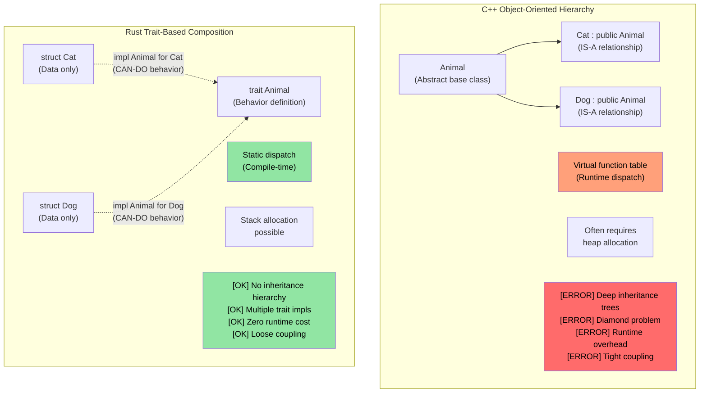
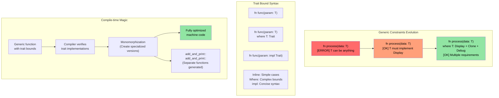

# Rust traits

> **What you'll learn:** Traits — Rust's answer to interfaces, abstract base classes, and operator overloading. You'll learn how to define traits, implement them for your types, and use dynamic dispatch (`dyn Trait`) vs static dispatch (generics). For C++ developers: traits replace virtual functions, CRTP, and concepts. For C developers: traits are the structured way Rust does polymorphism.

- Rust traits are similar to interfaces in other languages
    - Traits define methods that must be defined by types that implement the trait.
```rust
fn main() {
    trait Pet {
        fn speak(&self);
    }
    struct Cat;
    struct Dog;
    impl Pet for Cat {
        fn speak(&self) {
            println!("Meow");
        }
    }
    impl Pet for Dog {
        fn speak(&self) {
            println!("Woof!")
        }
    }
    let c = Cat{};
    let d = Dog{};
    c.speak();  // There is no "is a" relationship between Cat and Dog
    d.speak(); // There is no "is a" relationship between Cat and Dog
}
```

## Traits vs C++ Concepts and Interfaces

### Traditional C++ Inheritance vs Rust Traits

```cpp
// C++ - Inheritance-based polymorphism
class Animal {
public:
    virtual void speak() = 0;  // Pure virtual function
    virtual ~Animal() = default;
};

class Cat : public Animal {  // "Cat IS-A Animal"
public:
    void speak() override {
        std::cout << "Meow" << std::endl;
    }
};

void make_sound(Animal* animal) {  // Runtime polymorphism
    animal->speak();  // Virtual function call
}
```

```rust
// Rust - Composition over inheritance with traits
trait Animal {
    fn speak(&self);
}

struct Cat;  // Cat is NOT an Animal, but IMPLEMENTS Animal behavior

impl Animal for Cat {  // "Cat CAN-DO Animal behavior"
    fn speak(&self) {
        println!("Meow");
    }
}

fn make_sound<T: Animal>(animal: &T) {  // Static polymorphism
    animal.speak();  // Direct function call (zero cost)
}
```



### Trait Bounds and Generic Constraints

```rust
use std::fmt::Display;
use std::ops::Add;

// C++ template equivalent (less constrained)
// template<typename T>
// T add_and_print(T a, T b) {
//     // No guarantee T supports + or printing
//     return a + b;  // Might fail at compile time
// }

// Rust - explicit trait bounds
fn add_and_print<T>(a: T, b: T) -> T 
where 
    T: Display + Add<Output = T> + Copy,
{
    println!("Adding {} + {}", a, b);  // Display trait
    a + b  // Add trait
}
```



### C++ Operator Overloading → Rust `std::ops` Traits

In C++, you overload operators by writing free functions or member functions with special names (`operator+`, `operator<<`, `operator[]`, etc.). In Rust, every operator maps to a trait in `std::ops` (or `std::fmt` for output). You **implement the trait** instead of writing a magic-named function.

#### Side-by-side: `+` operator

```cpp
// C++: operator overloading as a member or free function
struct Vec2 {
    double x, y;
    Vec2 operator+(const Vec2& rhs) const {
        return {x + rhs.x, y + rhs.y};
    }
};

Vec2 a{1.0, 2.0}, b{3.0, 4.0};
Vec2 c = a + b;  // calls a.operator+(b)
```

```rust
use std::ops::Add;

#[derive(Debug, Clone, Copy)]
struct Vec2 { x: f64, y: f64 }

impl Add for Vec2 {
    type Output = Vec2;                     // Associated type — the result of +
    fn add(self, rhs: Vec2) -> Vec2 {
        Vec2 { x: self.x + rhs.x, y: self.y + rhs.y }
    }
}

let a = Vec2 { x: 1.0, y: 2.0 };
let b = Vec2 { x: 3.0, y: 4.0 };
let c = a + b;  // calls <Vec2 as Add>::add(a, b)
println!("{c:?}"); // Vec2 { x: 4.0, y: 6.0 }
```

#### Key differences from C++

| Aspect | C++ | Rust |
|--------|-----|------|
| **Mechanism** | Magic function names (`operator+`) | Implement a trait (`impl Add for T`) |
| **Discovery** | Grep for `operator+` or read the header | Look at trait impls — IDE support excellent |
| **Return type** | Free choice | Fixed by the `Output` associated type |
| **Receiver** | Usually takes `const T&` (borrows) | Takes `self` by value (moves!) by default |
| **Symmetry** | Can write `impl operator+(int, Vec2)` | Must add `impl Add<Vec2> for i32` (foreign trait rules apply) |
| **`<<` for printing** | `operator<<(ostream&, T)` — overload for *any* stream | `impl fmt::Display for T` — one canonical `to_string` representation |

#### The `self` by value gotcha

In Rust, `Add::add(self, rhs)` takes `self` **by value**. For `Copy` types (like `Vec2` above, which derives `Copy`) this is fine — the compiler copies. But for non-`Copy` types, `+` **consumes** the operands:

```rust
let s1 = String::from("hello ");
let s2 = String::from("world");
let s3 = s1 + &s2;  // s1 is MOVED into s3!
// println!("{s1}");  // ❌ Compile error: value used after move
println!("{s2}");     // ✅ s2 was only borrowed (&s2)
```

This is why `String + &str` works but `&str + &str` does not — `Add` is only implemented for `String + &str`, consuming the left-hand `String` to reuse its buffer. This has no C++ analogue: `std::string::operator+` always creates a new string.

#### Full mapping: C++ operators → Rust traits

| C++ Operator | Rust Trait | Notes |
|-------------|-----------|-------|
| `operator+` | `std::ops::Add` | `Output` associated type |
| `operator-` | `std::ops::Sub` | |
| `operator*` | `std::ops::Mul` | Not pointer deref — that's `Deref` |
| `operator/` | `std::ops::Div` | |
| `operator%` | `std::ops::Rem` | |
| `operator-` (unary) | `std::ops::Neg` | |
| `operator!` / `operator~` | `std::ops::Not` | Rust uses `!` for both logical and bitwise NOT (no `~` operator) |
| `operator&`, `\|`, `^` | `BitAnd`, `BitOr`, `BitXor` | |
| `operator<<`, `>>` (shift) | `Shl`, `Shr` | NOT stream I/O! |
| `operator+=` | `std::ops::AddAssign` | Takes `&mut self` (not `self`) |
| `operator[]` | `std::ops::Index` / `IndexMut` | Returns `&Output` / `&mut Output` |
| `operator()` | `Fn` / `FnMut` / `FnOnce` | Closures implement these; you cannot `impl Fn` directly |
| `operator==` | `PartialEq` (+ `Eq`) | In `std::cmp`, not `std::ops` |
| `operator<` | `PartialOrd` (+ `Ord`) | In `std::cmp` |
| `operator<<` (stream) | `fmt::Display` | `println!("{}", x)` |
| `operator<<` (debug) | `fmt::Debug` | `println!("{:?}", x)` |
| `operator bool` | No direct equivalent | Use `impl From<T> for bool` or a named method like `.is_empty()` |
| `operator T()` (implicit conversion) | No implicit conversions | Use `From`/`Into` traits (explicit) |

#### Guardrails: what Rust prevents

1. **No implicit conversions**: C++ `operator int()` can cause silent, surprising casts. Rust has no implicit conversion operators — use `From`/`Into` and call `.into()` explicitly.
2. **No overloading `&&` / `||`**: C++ allows it (breaking short-circuit semantics!). Rust does not.
3. **No overloading `=`**: Assignment is always a move or copy, never user-defined. Compound assignment (`+=`) IS overloadable via `AddAssign`, etc.
4. **No overloading `,`**: C++ allows `operator,()` — one of the most infamous C++ footguns. Rust does not.
5. **No overloading `&` (address-of)**: Another C++ footgun (`std::addressof` exists to work around it). Rust's `&` always means "borrow."
6. **Coherence rules**: You can only implement `Add<Foreign>` for your own type, or `Add<YourType>` for a foreign type — never `Add<Foreign>` for `Foreign`. This prevents conflicting operator definitions across crates.

> **Bottom line**: In C++, operator overloading is powerful but largely unregulated — you can overload almost anything, including comma and address-of, and implicit conversions can trigger silently. Rust gives you the same expressiveness for arithmetic and comparison operators via traits, but **blocks the historically dangerous overloads** and forces all conversions to be explicit.

----
# Rust traits
- Rust allows implementing a user defined trait on even built-in types like u32 in this example. However, either the trait or the type must belong to the crate
```rust
trait IsSecret {
  fn is_secret(&self);
}
// The IsSecret trait belongs to the crate, so we are OK
impl IsSecret for u32 {
  fn is_secret(&self) {
      if *self == 42 {
          println!("Is secret of life");
      }
  }
}

fn main() {
  42u32.is_secret();
  43u32.is_secret();
}
```


# Rust traits
- Traits support interface inheritance and default implementations
```rust
trait Animal {
  // Default implementation
  fn is_mammal(&self) -> bool {
    true
  }
}
trait Feline : Animal {
  // Default implementation
  fn is_feline(&self) -> bool {
    true
  }
}

struct Cat;
// Use default implementations. Note that all traits for the supertrait must be individually implemented
impl Feline for Cat {}
impl Animal for Cat {}
fn main() {
  let c = Cat{};
  println!("{} {}", c.is_mammal(), c.is_feline());
}
```
----
# Exercise: Logger trait implementation

🟡 **Intermediate**

- Implement a ```Log trait``` with a single method called log() that accepts a u64
    - Implement two different loggers ```SimpleLogger``` and ```ComplexLogger``` that implement the ```Log trait```. One should output "Simple logger" with the ```u64``` and the other should output "Complex logger" with the ```u64``` 

<details><summary>Solution (click to expand)</summary>

```rust
trait Log {
    fn log(&self, value: u64);
}

struct SimpleLogger;
struct ComplexLogger;

impl Log for SimpleLogger {
    fn log(&self, value: u64) {
        println!("Simple logger: {value}");
    }
}

impl Log for ComplexLogger {
    fn log(&self, value: u64) {
        println!("Complex logger: {value} (hex: 0x{value:x}, binary: {value:b})");
    }
}

fn main() {
    let simple = SimpleLogger;
    let complex = ComplexLogger;
    simple.log(42);
    complex.log(42);
}
// Output:
// Simple logger: 42
// Complex logger: 42 (hex: 0x2a, binary: 101010)
```

</details>

----
# Rust trait associated types
```rust
#[derive(Debug)]
struct Small(u32);
#[derive(Debug)]
struct Big(u32);
trait Double {
    type T;
    fn double(&self) -> Self::T;
}

impl Double for Small {
    type T = Big;
    fn double(&self) -> Self::T {
        Big(self.0 * 2)
    }
}
fn main() {
    let a = Small(42);
    println!("{:?}", a.double());
}
```

# Rust trait impl
- ```impl``` can be used with traits to accept any type that implements a trait
```rust
trait Pet {
    fn speak(&self);
}
struct Dog {}
struct Cat {}
impl Pet for Dog {
    fn speak(&self) {println!("Woof!")}
}
impl Pet for Cat {
    fn speak(&self) {println!("Meow")}
}
fn pet_speak(p: &impl Pet) {
    p.speak();
}
fn main() {
    let c = Cat {};
    let d = Dog {};
    pet_speak(&c);
    pet_speak(&d);
}
```

# Rust trait impl
- ```impl``` can be also be used be used in a return value
```rust
trait Pet {}
struct Dog;
struct Cat;
impl Pet for Cat {}
impl Pet for Dog {}
fn cat_as_pet() -> impl Pet {
    let c = Cat {};
    c
}
fn dog_as_pet() -> impl Pet {
    let d = Dog {};
    d
}
fn main() {
    let p = cat_as_pet();
    let d = dog_as_pet();
}
```
----
# Rust dynamic traits
- Dynamic traits can be used to invoke the trait functionality without knowing the underlying type. This is known as ```type erasure``` 
```rust
trait Pet {
    fn speak(&self);
}
struct Dog {}
struct Cat {x: u32}
impl Pet for Dog {
    fn speak(&self) {println!("Woof!")}
}
impl Pet for Cat {
    fn speak(&self) {println!("Meow")}
}
fn pet_speak(p: &dyn Pet) {
    p.speak();
}
fn main() {
    let c = Cat {x: 42};
    let d = Dog {};
    pet_speak(&c);
    pet_speak(&d);
}
```
----

## Choosing Between `impl Trait`, `dyn Trait`, and Enums

These three approaches all achieve polymorphism but with different trade-offs:

| Approach | Dispatch | Performance | Heterogeneous collections? | When to use |
|----------|----------|-------------|---------------------------|-------------|
| `impl Trait` / generics | Static (monomorphized) | Zero-cost — inlined at compile time | No — each slot has one concrete type | Default choice. Function arguments, return types |
| `dyn Trait` | Dynamic (vtable) | Small overhead per call (~1 pointer indirection) | Yes — `Vec<Box<dyn Trait>>` | When you need mixed types in a collection, or plugin-style extensibility |
| `enum` | Match | Zero-cost — known variants at compile time | Yes — but only known variants | When the set of variants is **closed** and known at compile time |

```rust
trait Shape {
    fn area(&self) -> f64;
}
struct Circle { radius: f64 }
struct Rect { w: f64, h: f64 }
impl Shape for Circle { fn area(&self) -> f64 { std::f64::consts::PI * self.radius * self.radius } }
impl Shape for Rect   { fn area(&self) -> f64 { self.w * self.h } }

// Static dispatch — compiler generates separate code for each type
fn print_area(s: &impl Shape) { println!("{}", s.area()); }

// Dynamic dispatch — one function, works with any Shape behind a pointer
fn print_area_dyn(s: &dyn Shape) { println!("{}", s.area()); }

// Enum — closed set, no trait needed
enum ShapeEnum { Circle(f64), Rect(f64, f64) }
impl ShapeEnum {
    fn area(&self) -> f64 {
        match self {
            ShapeEnum::Circle(r) => std::f64::consts::PI * r * r,
            ShapeEnum::Rect(w, h) => w * h,
        }
    }
}
```

> **For C++ developers:** `impl Trait` is like C++ templates (monomorphized, zero-cost). `dyn Trait` is like C++ virtual functions (vtable dispatch). Rust enums with `match` are like `std::variant` with `std::visit` — but exhaustive matching is enforced by the compiler.

> **Rule of thumb**: Start with `impl Trait` (static dispatch). Reach for `dyn Trait` only when you need heterogeneous collections or can't know the concrete type at compile time. Use `enum` when you own all the variants.

