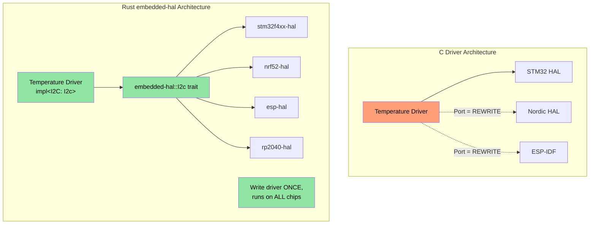
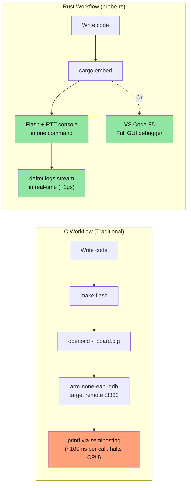

## MMIO and Volatile Register Access

> **What you'll learn:** Type-safe hardware register access in embedded Rust — volatile MMIO patterns, register abstraction crates, and how Rust's type system can encode register permissions that C's `volatile` keyword cannot.

In C firmware, you access hardware registers via `volatile` pointers to specific
memory addresses. Rust has equivalent mechanisms — but with type safety.

### C volatile vs Rust volatile

```c
// C — typical MMIO register access
#define GPIO_BASE     0x40020000
#define GPIO_MODER    (*(volatile uint32_t*)(GPIO_BASE + 0x00))
#define GPIO_ODR      (*(volatile uint32_t*)(GPIO_BASE + 0x14))

void toggle_led(void) {
    GPIO_ODR ^= (1 << 5);  // Toggle pin 5
}
```

```rust
// Rust — raw volatile (low-level, rarely used directly)
use core::ptr;

const GPIO_BASE: usize = 0x4002_0000;
const GPIO_ODR: *mut u32 = (GPIO_BASE + 0x14) as *mut u32;

/// # Safety
/// Caller must ensure GPIO_BASE is a valid mapped peripheral address.
unsafe fn toggle_led() {
    let current = unsafe { ptr::read_volatile(GPIO_ODR) };
    unsafe { ptr::write_volatile(GPIO_ODR, current ^ (1 << 5)) };
}
```

### svd2rust — Type-Safe Register Access (the Rust way)

In practice, you **never** write raw volatile pointers. Instead, `svd2rust` generates
a **Peripheral Access Crate (PAC)** from the chip's SVD file (the same XML file used by
your IDE's debug view):

```rust
// Generated PAC code (you don't write this — svd2rust does)
// The PAC makes invalid register access a compile error

// Usage with PAC:
use stm32f4::stm32f401;  // PAC crate for your chip

fn configure_gpio(dp: stm32f401::Peripherals) {
    // Enable GPIOA clock — type-safe, no magic numbers
    dp.RCC.ahb1enr.modify(|_, w| w.gpioaen().enabled());

    // Set pin 5 to output — can't accidentally write to a read-only field
    dp.GPIOA.moder.modify(|_, w| w.moder5().output());

    // Toggle pin 5 — type-checked field access
    dp.GPIOA.odr.modify(|r, w| {
        unsafe { w.bits(r.bits() ^ (1 << 5)) }
    });
}
```

| C register access | Rust PAC equivalent |
|-------------------|---------------------|
| `#define REG (*(volatile uint32_t*)ADDR)` | PAC crate generated by `svd2rust` |
| `REG |= BITMASK;` | `periph.reg.modify(\|_, w\| w.field().variant())` |
| `value = REG;` | `let val = periph.reg.read().field().bits()` |
| Wrong register field → silent UB | Compile error — field doesn't exist |
| Wrong register width → silent UB | Type-checked — u8 vs u16 vs u32 |

## Interrupt Handling and Critical Sections

C firmware uses `__disable_irq()` / `__enable_irq()` and ISR functions with `void`
signatures. Rust provides type-safe equivalents.

### C vs Rust Interrupt Patterns

```c
// C — traditional interrupt handler
volatile uint32_t tick_count = 0;

void SysTick_Handler(void) {   // Naming convention is critical — get it wrong → HardFault
    tick_count++;
}

uint32_t get_ticks(void) {
    __disable_irq();
    uint32_t t = tick_count;   // Read inside critical section
    __enable_irq();
    return t;
}
```

```rust
// Rust — using cortex-m and critical sections
use core::cell::Cell;
use cortex_m::interrupt::{self, Mutex};

// Shared state protected by a critical-section Mutex
static TICK_COUNT: Mutex<Cell<u32>> = Mutex::new(Cell::new(0));

#[cortex_m_rt::exception]     // Attribute ensures correct vector table placement
fn SysTick() {                // Compile error if name doesn't match a valid exception
    interrupt::free(|cs| {    // cs = critical section token (proof IRQs disabled)
        let count = TICK_COUNT.borrow(cs).get();
        TICK_COUNT.borrow(cs).set(count + 1);
    });
}

fn get_ticks() -> u32 {
    interrupt::free(|cs| TICK_COUNT.borrow(cs).get())
}
```

### RTIC — Real-Time Interrupt-driven Concurrency

For complex firmware with multiple interrupt priorities, RTIC (formerly RTFM) provides
**compile-time task scheduling with zero overhead**:

```rust
#[rtic::app(device = stm32f4xx_hal::pac, dispatchers = [USART1])]
mod app {
    use stm32f4xx_hal::prelude::*;

    #[shared]
    struct Shared {
        temperature: f32,   // Shared between tasks — RTIC manages locking
    }

    #[local]
    struct Local {
        led: stm32f4xx_hal::gpio::Pin<'A', 5, stm32f4xx_hal::gpio::Output>,
    }

    #[init]
    fn init(cx: init::Context) -> (Shared, Local) {
        let dp = cx.device;
        let gpioa = dp.GPIOA.split();
        let led = gpioa.pa5.into_push_pull_output();
        (Shared { temperature: 25.0 }, Local { led })
    }

    // Hardware task: runs on SysTick interrupt
    #[task(binds = SysTick, shared = [temperature], local = [led])]
    fn tick(mut cx: tick::Context) {
        cx.local.led.toggle();
        cx.shared.temperature.lock(|temp| {
            // RTIC guarantees exclusive access here — no manual locking needed
            *temp += 0.1;
        });
    }
}
```

**Why RTIC matters for C firmware devs:**
- The `#[shared]` annotation replaces manual mutex management
- Priority-based preemption is configured at compile time — no runtime overhead
- Deadlock-free by construction (the framework proves it at compile time)
- ISR naming errors are compile errors, not runtime HardFaults

## Panic Handler Strategies

In C, when something goes wrong in firmware, you typically reset or blink an LED.
Rust's panic handler gives you structured control:

```rust
// Strategy 1: Halt (for debugging — attach debugger, inspect state)
use panic_halt as _;  // Infinite loop on panic

// Strategy 2: Reset the MCU
use panic_reset as _;  // Triggers system reset

// Strategy 3: Log via probe (development)
use panic_probe as _;  // Sends panic info over debug probe (with defmt)

// Strategy 4: Log over defmt then halt
use defmt_panic as _;  // Rich panic messages over ITM/RTT

// Strategy 5: Custom handler (production firmware)
use core::panic::PanicInfo;

#[panic_handler]
fn panic(info: &PanicInfo) -> ! {
    // 1. Disable interrupts to prevent further damage
    cortex_m::interrupt::disable();

    // 2. Write panic info to a reserved RAM region (survives reset)
    // Safety: PANIC_LOG is a reserved memory region defined in linker script
    unsafe {
        let log = 0x2000_0000 as *mut [u8; 256];
        // Write truncated panic message
        use core::fmt::Write;
        let mut writer = FixedWriter::new(&mut *log);
        let _ = write!(writer, "{}", info);
    }

    // 3. Trigger watchdog reset (or blink error LED)
    loop {
        cortex_m::asm::wfi();  // Wait for interrupt (low power while halted)
    }
}
```

## Linker Scripts and Memory Layout

C firmware devs write linker scripts to define FLASH/RAM regions. Rust embedded
uses the same concept via `memory.x`:

```ld
/* memory.x — placed at crate root, consumed by cortex-m-rt */
MEMORY
{
  /* Adjust for your MCU — these are STM32F401 values */
  FLASH : ORIGIN = 0x08000000, LENGTH = 512K
  RAM   : ORIGIN = 0x20000000, LENGTH = 96K
}

/* Optional: reserve space for panic log (see panic handler above) */
_panic_log_start = ORIGIN(RAM);
_panic_log_size  = 256;
```

```toml
# .cargo/config.toml — set the target and linker flags
[target.thumbv7em-none-eabihf]
runner = "probe-rs run --chip STM32F401RE"  # flash and run via debug probe
rustflags = [
    "-C", "link-arg=-Tlink.x",              # cortex-m-rt linker script
]

[build]
target = "thumbv7em-none-eabihf"            # Cortex-M4F with hardware FPU
```

| C linker script | Rust equivalent |
|-----------------|-----------------|
| `MEMORY { FLASH ..., RAM ... }` | `memory.x` at crate root |
| `__attribute__((section(".data")))` | `#[link_section = ".data"]` |
| `-T linker.ld` in Makefile | `-C link-arg=-Tlink.x` in `.cargo/config.toml` |
| `__bss_start__`, `__bss_end__` | Handled by `cortex-m-rt` automatically |
| Startup assembly (`startup.s`) | `cortex-m-rt` `#[entry]` macro |

## Writing `embedded-hal` Drivers

The `embedded-hal` crate defines traits for SPI, I2C, GPIO, UART, etc. Drivers
written against these traits work on **any MCU** — this is Rust's killer feature
for embedded reuse.

### C vs Rust: A Temperature Sensor Driver

```c
// C — driver tightly coupled to STM32 HAL
#include "stm32f4xx_hal.h"

float read_temperature(I2C_HandleTypeDef* hi2c, uint8_t addr) {
    uint8_t buf[2];
    HAL_I2C_Mem_Read(hi2c, addr << 1, 0x00, I2C_MEMADD_SIZE_8BIT,
                     buf, 2, HAL_MAX_DELAY);
    int16_t raw = ((int16_t)buf[0] << 4) | (buf[1] >> 4);
    return raw * 0.0625;
}
// Problem: This driver ONLY works with STM32 HAL. Porting to Nordic = rewrite.
```

```rust
// Rust — driver works on ANY MCU that implements embedded-hal
use embedded_hal::i2c::I2c;

pub struct Tmp102<I2C> {
    i2c: I2C,
    address: u8,
}

impl<I2C: I2c> Tmp102<I2C> {
    pub fn new(i2c: I2C, address: u8) -> Self {
        Self { i2c, address }
    }

    pub fn read_temperature(&mut self) -> Result<f32, I2C::Error> {
        let mut buf = [0u8; 2];
        self.i2c.write_read(self.address, &[0x00], &mut buf)?;
        let raw = ((buf[0] as i16) << 4) | ((buf[1] as i16) >> 4);
        Ok(raw as f32 * 0.0625)
    }
}

// Works on STM32, Nordic nRF, ESP32, RP2040 — any chip with an embedded-hal I2C impl
```



## Global Allocator Setup

The `alloc` crate gives you `Vec`, `String`, `Box` — but you need to tell Rust
where heap memory comes from. This is the equivalent of implementing `malloc()`
for your platform:

```rust
#![no_std]
extern crate alloc;

use alloc::vec::Vec;
use alloc::string::String;
use embedded_alloc::LlffHeap as Heap;

#[global_allocator]
static HEAP: Heap = Heap::empty();

#[cortex_m_rt::entry]
fn main() -> ! {
    // Initialize the allocator with a memory region
    // (typically a portion of RAM not used by stack or static data)
    {
        const HEAP_SIZE: usize = 4096;
        static mut HEAP_MEM: [u8; HEAP_SIZE] = [0; HEAP_SIZE];
        // Safety: HEAP_MEM is only accessed here during init, before any allocation
        unsafe { HEAP.init(HEAP_MEM.as_ptr() as usize, HEAP_SIZE) }
    }

    // Now you can use heap types!
    let mut log_buffer: Vec<u8> = Vec::with_capacity(256);
    let name: String = String::from("sensor_01");
    // ...

    loop {}
}
```

| C heap setup | Rust equivalent |
|-------------|-----------------|
| `_sbrk()` / custom `malloc()` | `#[global_allocator]` + `Heap::init()` |
| `configTOTAL_HEAP_SIZE` (FreeRTOS) | `HEAP_SIZE` constant |
| `pvPortMalloc()` | `alloc::vec::Vec::new()` — automatic |
| Heap exhaustion → undefined behavior | `alloc_error_handler` → controlled panic |

## Mixed `no_std` + `std` Workspaces

Real projects (like a large Rust workspace) often have:
- `no_std` library crates for hardware-portable logic
- `std` binary crates for the Linux application layer

```text
workspace_root/
├── Cargo.toml              # [workspace] members = [...]
├── protocol/               # no_std — wire protocol, parsing
│   ├── Cargo.toml          # no default-features, no std
│   └── src/lib.rs          # #![no_std]
├── driver/                 # no_std — hardware abstraction
│   ├── Cargo.toml
│   └── src/lib.rs          # #![no_std], uses embedded-hal traits
├── firmware/               # no_std — MCU binary
│   ├── Cargo.toml          # depends on protocol, driver
│   └── src/main.rs         # #![no_std] #![no_main]
└── host_tool/              # std — Linux CLI tool
    ├── Cargo.toml          # depends on protocol (same crate!)
    └── src/main.rs         # Uses std::fs, std::net, etc.
```

The key pattern: the `protocol` crate uses `#![no_std]` so it compiles for **both**
the MCU firmware and the Linux host tool. Shared code, zero duplication.

```toml
# protocol/Cargo.toml
[package]
name = "protocol"

[features]
default = []
std = []  # Optional: enable std-specific features when building for host

[dependencies]
serde = { version = "1", default-features = false, features = ["derive"] }
# Note: default-features = false drops serde's std dependency
```

```rust
// protocol/src/lib.rs
#![cfg_attr(not(feature = "std"), no_std)]

#[cfg(feature = "std")]
extern crate std;

extern crate alloc;
use alloc::vec::Vec;
use serde::{Serialize, Deserialize};

#[derive(Debug, Serialize, Deserialize)]
pub struct DiagPacket {
    pub sensor_id: u16,
    pub value: i32,
    pub fault_code: u16,
}

// This function works in both no_std and std contexts
pub fn parse_packet(data: &[u8]) -> Result<DiagPacket, &'static str> {
    if data.len() < 8 {
        return Err("packet too short");
    }
    Ok(DiagPacket {
        sensor_id: u16::from_le_bytes([data[0], data[1]]),
        value: i32::from_le_bytes([data[2], data[3], data[4], data[5]]),
        fault_code: u16::from_le_bytes([data[6], data[7]]),
    })
}
```

## Exercise: Hardware Abstraction Layer Driver

Write a `no_std` driver for a hypothetical LED controller that communicates over SPI.
The driver should be generic over any SPI implementation using `embedded-hal`.

**Requirements:**
1. Define a `LedController<SPI>` struct
2. Implement `new()`, `set_brightness(led: u8, brightness: u8)`, and `all_off()`
3. SPI protocol: send `[led_index, brightness_value]` as 2-byte transaction
4. Write tests using a mock SPI implementation

```rust
// Starter code
#![no_std]
use embedded_hal::spi::SpiDevice;

pub struct LedController<SPI> {
    spi: SPI,
    num_leds: u8,
}

// TODO: Implement new(), set_brightness(), all_off()
// TODO: Create MockSpi for testing
```

<details><summary>Solution (click to expand)</summary>

```rust
#![no_std]
use embedded_hal::spi::SpiDevice;

pub struct LedController<SPI> {
    spi: SPI,
    num_leds: u8,
}

impl<SPI: SpiDevice> LedController<SPI> {
    pub fn new(spi: SPI, num_leds: u8) -> Self {
        Self { spi, num_leds }
    }

    pub fn set_brightness(&mut self, led: u8, brightness: u8) -> Result<(), SPI::Error> {
        if led >= self.num_leds {
            return Ok(()); // Silently ignore out-of-range LEDs
        }
        self.spi.write(&[led, brightness])
    }

    pub fn all_off(&mut self) -> Result<(), SPI::Error> {
        for led in 0..self.num_leds {
            self.spi.write(&[led, 0])?;
        }
        Ok(())
    }
}

#[cfg(test)]
mod tests {
    use super::*;

    // Mock SPI that records all transactions
    struct MockSpi {
        transactions: Vec<Vec<u8>>,
    }

    // Minimal error type for mock
    #[derive(Debug)]
    struct MockError;
    impl embedded_hal::spi::Error for MockError {
        fn kind(&self) -> embedded_hal::spi::ErrorKind {
            embedded_hal::spi::ErrorKind::Other
        }
    }

    impl embedded_hal::spi::ErrorType for MockSpi {
        type Error = MockError;
    }

    impl SpiDevice for MockSpi {
        fn write(&mut self, buf: &[u8]) -> Result<(), Self::Error> {
            self.transactions.push(buf.to_vec());
            Ok(())
        }
        fn read(&mut self, _buf: &mut [u8]) -> Result<(), Self::Error> { Ok(()) }
        fn transfer(&mut self, _r: &mut [u8], _w: &[u8]) -> Result<(), Self::Error> { Ok(()) }
        fn transfer_in_place(&mut self, _buf: &mut [u8]) -> Result<(), Self::Error> { Ok(()) }
        fn transaction(&mut self, _ops: &mut [embedded_hal::spi::Operation<'_, u8>]) -> Result<(), Self::Error> { Ok(()) }
    }

    #[test]
    fn test_set_brightness() {
        let mock = MockSpi { transactions: vec![] };
        let mut ctrl = LedController::new(mock, 4);
        ctrl.set_brightness(2, 128).unwrap();
        assert_eq!(ctrl.spi.transactions, vec![vec![2, 128]]);
    }

    #[test]
    fn test_all_off() {
        let mock = MockSpi { transactions: vec![] };
        let mut ctrl = LedController::new(mock, 3);
        ctrl.all_off().unwrap();
        assert_eq!(ctrl.spi.transactions, vec![
            vec![0, 0], vec![1, 0], vec![2, 0],
        ]);
    }

    #[test]
    fn test_out_of_range_led() {
        let mock = MockSpi { transactions: vec![] };
        let mut ctrl = LedController::new(mock, 2);
        ctrl.set_brightness(5, 255).unwrap(); // Out of range — ignored
        assert!(ctrl.spi.transactions.is_empty());
    }
}
```

</details>

## Debugging Embedded Rust — probe-rs, defmt, and VS Code

C firmware developers typically debug with OpenOCD + GDB or vendor-specific IDEs
(Keil, IAR, Segger Ozone). Rust's embedded ecosystem has converged on **probe-rs**
as the unified debug probe interface, replacing the OpenOCD + GDB stack with a
single, Rust-native tool.

### probe-rs — The All-in-One Debug Probe Tool

`probe-rs` replaces the OpenOCD + GDB combination. It supports CMSIS-DAP,
ST-Link, J-Link, and other debug probes out of the box:

```bash
# Install probe-rs (includes cargo-flash and cargo-embed)
cargo install probe-rs-tools

# Flash and run your firmware
cargo flash --chip STM32F401RE --release

# Flash, run, and open RTT (Real-Time Transfer) console
cargo embed --chip STM32F401RE
```

**probe-rs vs OpenOCD + GDB**:

| Aspect | OpenOCD + GDB | probe-rs |
|--------|--------------|----------|
| Install | 2 separate packages + scripts | `cargo install probe-rs-tools` |
| Config | `.cfg` files per board/probe | `--chip` flag or `Embed.toml` |
| Console output | Semihosting (very slow) | RTT (~10× faster) |
| Log framework | `printf` | `defmt` (structured, zero-cost) |
| Flash algorithm | XML pack files | Built-in for 1000+ chips |
| GDB support | Native | `probe-rs gdb` adapter |

### `Embed.toml` — Project Configuration

Instead of juggling `.cfg` and `.gdbinit` files, probe-rs uses a single config:

```toml
# Embed.toml — placed in your project root
[default.general]
chip = "STM32F401RETx"

[default.rtt]
enabled = true           # Enable Real-Time Transfer console
channels = [
    { up = 0, mode = "BlockIfFull", name = "Terminal" },
]

[default.flashing]
enabled = true           # Flash before running
restore_unwritten_bytes = false

[default.reset]
halt_afterwards = false  # Start running after flash + reset

[default.gdb]
enabled = false          # Set true to expose GDB server on :1337
gdb_connection_string = "127.0.0.1:1337"
```

```bash
# With Embed.toml, just run:
cargo embed              # Flash + RTT console — zero flags needed
cargo embed --release    # Release build
```

### defmt — Deferred Formatting for Embedded Logging

`defmt` (deferred formatting) replaces `printf` debugging. Format strings are
stored in the ELF file, not in flash — so log calls on the target send only
an index + argument bytes. This makes logging **10–100× faster** than `printf`
and uses a fraction of the flash space:

```rust
#![no_std]
#![no_main]

use defmt::{info, warn, error, debug, trace};
use defmt_rtt as _; // RTT transport — links the defmt output to probe-rs

#[cortex_m_rt::entry]
fn main() -> ! {
    info!("Boot complete, firmware v{}", env!("CARGO_PKG_VERSION"));

    let sensor_id: u16 = 0x4A;
    let temperature: f32 = 23.5;

    // Format strings stay in ELF, not flash — near-zero overhead
    debug!("Sensor {:#06X}: {:.1}°C", sensor_id, temperature);

    if temperature > 80.0 {
        warn!("Overtemp on sensor {:#06X}: {:.1}°C", sensor_id, temperature);
    }

    loop {
        cortex_m::asm::wfi(); // Wait for interrupt
    }
}

// Custom types — derive defmt::Format instead of Debug
#[derive(defmt::Format)]
struct SensorReading {
    id: u16,
    value: i32,
    status: SensorStatus,
}

#[derive(defmt::Format)]
enum SensorStatus {
    Ok,
    Warning,
    Fault(u8),
}

// Usage:
// info!("Reading: {:?}", reading);  // <-- uses defmt::Format, NOT std Debug
```

**defmt vs `printf` vs `log`**:

| Feature | C `printf` (semihosting) | Rust `log` crate | `defmt` |
|---------|-------------------------|-------------------|---------|
| Speed | ~100ms per call | N/A (needs `std`) | ~1μs per call |
| Flash usage | Full format strings | Full format strings | Index only (bytes) |
| Transport | Semihosting (halts CPU) | Serial/UART | RTT (non-blocking) |
| Structured output | No | Text only | Typed, binary-encoded |
| `no_std` | Via semihosting | Facade only (backends need `std`) | ✅ Native |
| Filter levels | Manual `#ifdef` | `RUST_LOG=debug` | `defmt::println` + features |

### VS Code Debug Configuration

With the `probe-rs` VS Code extension, you get full graphical debugging —
breakpoints, variable inspection, call stack, and register view:

```jsonc
// .vscode/launch.json
{
    "version": "0.2.0",
    "configurations": [
        {
            "type": "probe-rs-debug",
            "request": "launch",
            "name": "Flash & Debug (probe-rs)",
            "chip": "STM32F401RETx",
            "coreConfigs": [
                {
                    "programBinary": "target/thumbv7em-none-eabihf/debug/${workspaceFolderBasename}",
                    "rttEnabled": true,
                    "rttChannelFormats": [
                        {
                            "channelNumber": 0,
                            "dataFormat": "Defmt",
                            "showTimestamps": true
                        }
                    ]
                }
            ],
            "connectUnderReset": true,
            "speed": 4000
        }
    ]
}
```

Install the extension:
```rust
ext install probe-rs.probe-rs-debugger
```

### C Debugger Workflow vs Rust Embedded Debugging



| C Debug Action | Rust Equivalent |
|---------------|-----------------|
| `openocd -f board/st_nucleo_f4.cfg` | `probe-rs info` (auto-detects probe + chip) |
| `arm-none-eabi-gdb -x .gdbinit` | `probe-rs gdb --chip STM32F401RE` |
| `target remote :3333` | GDB connects to `localhost:1337` |
| `monitor reset halt` | `probe-rs reset --chip ...` |
| `load firmware.elf` | `cargo flash --chip ...` |
| `printf("debug: %d\n", val)` (semihosting) | `defmt::info!("debug: {}", val)` (RTT) |
| Keil/IAR GUI debugger | VS Code + `probe-rs-debugger` extension |
| Segger SystemView | `defmt` + `probe-rs` RTT viewer |

> **Cross-reference**: For advanced unsafe patterns used in embedded drivers
> (pin projections, custom arena/slab allocators), see the companion
> *Rust Patterns* guide, sections "Pin Projections — Structural Pinning"
> and "Custom Allocators — Arena and Slab Patterns."

---


