# Rust Training for C# Programmers

A comprehensive guide to learning Rust for developers with C# experience, focusing on the conceptual shifts and practical differences between the two languages.

## Table of Contents

### 1. Introduction and Philosophy
- [Language Philosophy Comparison](#language-philosophy-comparison)
- [Memory Management: GC vs RAII](#memory-management-gc-vs-raii)
- [Performance Characteristics](#performance-characteristics)

### 2. Type System Differences
- [Null Safety: Nullable<T> vs Option<T>](#null-safety-nullablet-vs-optiont)
- [Value Types vs Reference Types vs Ownership](#value-types-vs-reference-types-vs-ownership)
- [Algebraic Data Types vs C# Unions](#algebraic-data-types-vs-c-unions)
- [Exhaustive Pattern Matching: Compiler Guarantees vs Runtime Errors](#exhaustive-pattern-matching-compiler-guarantees-vs-runtime-errors)
- [True Immutability vs Record Illusions](#true-immutability-vs-record-illusions)
- [Memory Safety: Runtime Checks vs Compile-Time Proofs](#memory-safety-runtime-checks-vs-compile-time-proofs)

### 3. Object-Oriented vs Functional Paradigms
- [Inheritance vs Composition](#inheritance-vs-composition)
- [Interfaces vs Traits](#interfaces-vs-traits)
- [Virtual Methods vs Static Dispatch](#virtual-methods-vs-static-dispatch)
- [Sealed Classes vs Rust Immutability](#sealed-classes-vs-rust-immutability)

### 4. Error Handling Philosophy
- [Exceptions vs Result<T, E>](#exceptions-vs-resultt-e)
- [Try-Catch vs Pattern Matching](#try-catch-vs-pattern-matching)
- [Error Propagation Patterns](#error-propagation-patterns)

### 5. Concurrency and Safety
- [Thread Safety: Convention vs Type System Guarantees](#thread-safety-convention-vs-type-system-guarantees)
- [async/await Comparison](#asyncawait-comparison)
- [Data Race Prevention](#data-race-prevention)

### 6. Collections and Iterators
- [LINQ vs Rust Iterators](#linq-vs-rust-iterators)
- [Collection Ownership](#collection-ownership)
- [Lazy Evaluation Patterns](#lazy-evaluation-patterns)

### 7. Generics and Constraints
- [Generic Constraints: where vs trait bounds](#generic-constraints-where-vs-trait-bounds)
- [Variance in Generics](#variance-in-generics)
- [Higher-Kinded Types](#higher-kinded-types)

### 8. Practical Migration Patterns
- [Incremental Adoption Strategy](#incremental-adoption-strategy)
- [C# to Rust Concept Mapping](#c-to-rust-concept-mapping)
- [Team Adoption Timeline](#team-adoption-timeline)
- [Common C# Patterns in Rust](#common-c-patterns-in-rust)
- [Ecosystem Comparison](#ecosystem-comparison)
- [Testing and Documentation](#testing-and-documentation)

### 9. Performance and Adoption
- [Performance Comparison: Managed vs Native](#performance-comparison-managed-vs-native)
- [When to Choose Each Language](#when-to-choose-each-language)

### 10. Advanced Topics
- [Unsafe Code: When and Why](#unsafe-code-when-and-why)
- [Interop Considerations](#interop-considerations)
- [Performance Optimization](#performance-optimization)

### 11. Best Practices for C# Developers
- [Idiomatic Rust for C# Developers](#idiomatic-rust-for-c-developers)
- [Common Mistakes and Solutions](#common-mistakes-and-solutions)
- [Essential Crates for C# Developers](#essential-crates-for-c-developers)

***

## Language Philosophy Comparison

### C# Philosophy
- **Productivity first**: Rich tooling, extensive framework, "pit of success"
- **Managed runtime**: Garbage collection handles memory automatically
- **Enterprise-focused**: Strong typing with reflection, extensive standard library
- **Object-oriented**: Classes, inheritance, interfaces as primary abstractions

### Rust Philosophy
- **Performance without sacrifice**: Zero-cost abstractions, no runtime overhead
- **Memory safety**: Compile-time guarantees prevent crashes and security vulnerabilities
- **Systems programming**: Direct hardware access with high-level abstractions
- **Functional + systems**: Immutability by default, ownership-based resource management

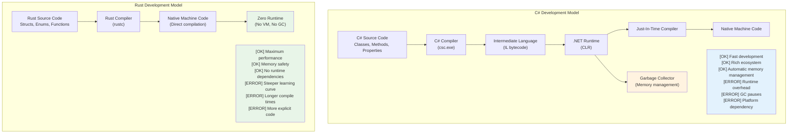

***

## Memory Management: GC vs RAII

### C# Garbage Collection
```csharp
// C# - Automatic memory management
public class Person
{
    public string Name { get; set; }
    public List<string> Hobbies { get; set; } = new List<string>();
    
    public void AddHobby(string hobby)
    {
        Hobbies.Add(hobby);  // Memory allocated automatically
    }
    
    // No explicit cleanup needed - GC handles it
    // But IDisposable pattern for resources
}

using var file = new FileStream("data.txt", FileMode.Open);
// 'using' ensures Dispose() is called
```

### Rust Ownership and RAII
```rust
// Rust - Compile-time memory management
pub struct Person {
    name: String,
    hobbies: Vec<String>,
}

impl Person {
    pub fn add_hobby(&mut self, hobby: String) {
        self.hobbies.push(hobby);  // Memory management tracked at compile time
    }
    
    // Drop trait automatically implemented - cleanup is guaranteed
}

// RAII - Resource Acquisition Is Initialization
{
    let file = std::fs::File::open("data.txt")?;
    // File automatically closed when 'file' goes out of scope
    // No 'using' statement needed - handled by type system
}
```

```mermaid
graph TD
    subgraph "C# Memory Management"
        CS_ALLOC["Object Allocation<br/>new Person()"]
        CS_HEAP["Managed Heap"]
        CS_REF["References point to heap"]
        CS_GC_CHECK["GC periodically checks<br/>for unreachable objects"]
        CS_SWEEP["Mark and sweep<br/>collection"]
        CS_PAUSE["[ERROR] GC pause times"]
        
        CS_ALLOC --> CS_HEAP
        CS_HEAP --> CS_REF
        CS_REF --> CS_GC_CHECK
        CS_GC_CHECK --> CS_SWEEP
        CS_SWEEP --> CS_PAUSE
        
        CS_ISSUES["[ERROR] Non-deterministic cleanup<br/>[ERROR] Memory pressure<br/>[ERROR] Finalization complexity<br/>[OK] Easy to use"]
    end
    
    subgraph "Rust Ownership System"
        RUST_ALLOC["Value Creation<br/>Person { ... }"]
        RUST_OWNER["Single owner<br/>on stack or heap"]
        RUST_BORROW["Borrowing system<br/>&T, &mut T"]
        RUST_SCOPE["Scope-based cleanup<br/>Drop trait"]
        RUST_COMPILE["Compile-time verification"]
        
        RUST_ALLOC --> RUST_OWNER
        RUST_OWNER --> RUST_BORROW
        RUST_BORROW --> RUST_SCOPE
        RUST_SCOPE --> RUST_COMPILE
        
        RUST_BENEFITS["[OK] Deterministic cleanup<br/>[OK] Zero runtime cost<br/>[OK] No memory leaks<br/>[ERROR] Learning curve"]
    end
    
    style CS_ISSUES fill:#ffebee
    style RUST_BENEFITS fill:#e8f5e8
    style CS_PAUSE fill:#ffcdd2
    style RUST_COMPILE fill:#c8e6c9
```

***

## Null Safety: Nullable<T> vs Option<T>

### C# Null Handling Evolution
```csharp
// C# - Traditional null handling (error-prone)
public class User
{
    public string Name { get; set; }  // Can be null!
    public string Email { get; set; } // Can be null!
}

public string GetUserDisplayName(User user)
{
    if (user?.Name != null)  // Null conditional operator
    {
        return user.Name;
    }
    return "Unknown User";
}

// C# 8+ Nullable Reference Types
public class User
{
    public string Name { get; set; }    // Non-nullable
    public string? Email { get; set; }  // Explicitly nullable
}

// C# Nullable<T> for value types
int? maybeNumber = GetNumber();
if (maybeNumber.HasValue)
{
    Console.WriteLine(maybeNumber.Value);
}
```

### Rust Option<T> System
```rust
// Rust - Explicit null handling with Option<T>
#[derive(Debug)]
pub struct User {
    name: String,           // Never null
    email: Option<String>,  // Explicitly optional
}

impl User {
    pub fn get_display_name(&self) -> &str {
        &self.name  // No null check needed - guaranteed to exist
    }
    
    pub fn get_email_or_default(&self) -> String {
        self.email
            .as_ref()
            .map(|e| e.clone())
            .unwrap_or_else(|| "no-email@example.com".to_string())
    }
}

// Pattern matching forces handling of None case
fn handle_optional_user(user: Option<User>) {
    match user {
        Some(u) => println!("User: {}", u.get_display_name()),
        None => println!("No user found"),
        // Compiler error if None case is not handled!
    }
}
```

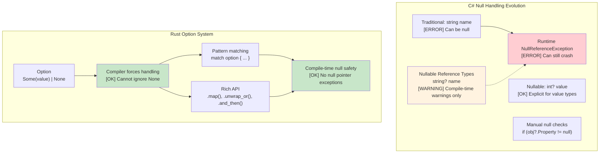

***

## Algebraic Data Types vs C# Unions

### C# Discriminated Unions (Limited)
```csharp
// C# - Limited union support with inheritance
public abstract class Result
{
    public abstract T Match<T>(Func<Success, T> onSuccess, Func<Error, T> onError);
}

public class Success : Result
{
    public string Value { get; }
    public Success(string value) => Value = value;
    
    public override T Match<T>(Func<Success, T> onSuccess, Func<Error, T> onError)
        => onSuccess(this);
}

public class Error : Result
{
    public string Message { get; }
    public Error(string message) => Message = message;
    
    public override T Match<T>(Func<Success, T> onSuccess, Func<Error, T> onError)
        => onError(this);
}

// C# 9+ Records with pattern matching (better)
public abstract record Shape;
public record Circle(double Radius) : Shape;
public record Rectangle(double Width, double Height) : Shape;

public static double Area(Shape shape) => shape switch
{
    Circle(var radius) => Math.PI * radius * radius,
    Rectangle(var width, var height) => width * height,
    _ => throw new ArgumentException("Unknown shape")  // [ERROR] Runtime error possible
};
```

### Rust Algebraic Data Types (Enums)
```rust
// Rust - True algebraic data types with exhaustive pattern matching
#[derive(Debug, Clone)]
pub enum Result<T, E> {
    Ok(T),
    Err(E),
}

#[derive(Debug, Clone)]
pub enum Shape {
    Circle { radius: f64 },
    Rectangle { width: f64, height: f64 },
    Triangle { base: f64, height: f64 },
}

impl Shape {
    pub fn area(&self) -> f64 {
        match self {
            Shape::Circle { radius } => std::f64::consts::PI * radius * radius,
            Shape::Rectangle { width, height } => width * height,
            Shape::Triangle { base, height } => 0.5 * base * height,
            // [OK] Compiler error if any variant is missing!
        }
    }
}

// Advanced: Enums can hold different types
#[derive(Debug)]
pub enum Value {
    Integer(i64),
    Float(f64),
    Text(String),
    Boolean(bool),
    List(Vec<Value>),  // Recursive types!
}

impl Value {
    pub fn type_name(&self) -> &'static str {
        match self {
            Value::Integer(_) => "integer",
            Value::Float(_) => "float",
            Value::Text(_) => "text",
            Value::Boolean(_) => "boolean",
            Value::List(_) => "list",
        }
    }
}
```

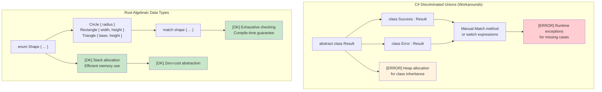

***

## Exhaustive Pattern Matching: Compiler Guarantees vs Runtime Errors

### C# Switch Expressions - Still Incomplete
```csharp
// C# switch expressions look exhaustive but aren't guaranteed
public enum HttpStatus { Ok, NotFound, ServerError, Unauthorized }

public string HandleResponse(HttpStatus status) => status switch
{
    HttpStatus.Ok => "Success",
    HttpStatus.NotFound => "Resource not found",
    HttpStatus.ServerError => "Internal error",
    // Missing Unauthorized case - compiles fine!
    // Runtime: System.InvalidOperationException at runtime
};

// Even with nullable warnings, this compiles:
public class User 
{
    public string Name { get; set; }
    public bool IsActive { get; set; }
}

public string ProcessUser(User? user) => user switch
{
    { IsActive: true } => $"Active: {user.Name}",
    { IsActive: false } => $"Inactive: {user.Name}",
    // Missing null case - warning only, not error
    // Runtime: NullReferenceException possible
};

// Adding enum values breaks existing code silently
public enum HttpStatus 
{ 
    Ok, 
    NotFound, 
    ServerError, 
    Unauthorized,
    Forbidden  // Adding this doesn't break compilation of HandleResponse()!
}
```

### Rust Pattern Matching - True Exhaustiveness
```rust
#[derive(Debug)]
enum HttpStatus {
    Ok,
    NotFound, 
    ServerError,
    Unauthorized,
}

fn handle_response(status: HttpStatus) -> &'static str {
    match status {
        HttpStatus::Ok => "Success",
        HttpStatus::NotFound => "Resource not found", 
        HttpStatus::ServerError => "Internal error",
        HttpStatus::Unauthorized => "Authentication required",
        // Compiler ERROR if any case is missing!
        // This literally will not compile
    }
}

// Adding a new variant breaks compilation everywhere it's used
#[derive(Debug)]
enum HttpStatus {
    Ok,
    NotFound,
    ServerError, 
    Unauthorized,
    Forbidden,  // Adding this breaks compilation in handle_response()
}
// The compiler forces you to handle ALL cases

// Option<T> pattern matching is also exhaustive
fn process_optional_value(value: Option<i32>) -> String {
    match value {
        Some(n) => format!("Got value: {}", n),
        None => "No value".to_string(),
        // Forgetting either case = compilation error
    }
}
```

```mermaid
graph TD
    subgraph "C# Pattern Matching Limitations"
        CS_SWITCH["switch expression"]
        CS_WARNING["⚠️ Compiler warnings only"]
        CS_COMPILE["✅ Compiles successfully"]
        CS_RUNTIME["💥 Runtime exceptions"]
        CS_DEPLOY["❌ Bugs reach production"]
        CS_SILENT["😰 Silent failures on enum changes"]
        
        CS_SWITCH --> CS_WARNING
        CS_WARNING --> CS_COMPILE
        CS_COMPILE --> CS_RUNTIME
        CS_RUNTIME --> CS_DEPLOY
        CS_SWITCH --> CS_SILENT
    end
    
    subgraph "Rust Exhaustive Matching"
        RUST_MATCH["match expression"]
        RUST_ERROR["🛑 Compilation fails"]
        RUST_FIX["✅ Must handle all cases"]
        RUST_SAFE["✅ Zero runtime surprises"]
        RUST_EVOLUTION["🔄 Enum changes break compilation"]
        RUST_REFACTOR["🛠️ Forced refactoring"]
        
        RUST_MATCH --> RUST_ERROR
        RUST_ERROR --> RUST_FIX
        RUST_FIX --> RUST_SAFE
        RUST_MATCH --> RUST_EVOLUTION
        RUST_EVOLUTION --> RUST_REFACTOR
    end
    
    style CS_RUNTIME fill:#ffcdd2
    style CS_DEPLOY fill:#ffcdd2
    style CS_SILENT fill:#ffcdd2
    style RUST_SAFE fill:#c8e6c9
    style RUST_REFACTOR fill:#c8e6c9
```

***

## True Immutability vs Record Illusions

### C# Records - Immutability Theater
```csharp
// C# records look immutable but have escape hatches
public record Person(string Name, int Age, List<string> Hobbies);

var person = new Person("John", 30, new List<string> { "reading" });

// These all "look" like they create new instances:
var older = person with { Age = 31 };  // New record
var renamed = person with { Name = "Jonathan" };  // New record

// But the reference types are still mutable!
person.Hobbies.Add("gaming");  // Mutates the original!
Console.WriteLine(older.Hobbies.Count);  // 2 - older person affected!
Console.WriteLine(renamed.Hobbies.Count); // 2 - renamed person also affected!

// Init-only properties can still be set via reflection
typeof(Person).GetProperty("Age")?.SetValue(person, 25);

// Collection expressions help but don't solve the fundamental issue
public record BetterPerson(string Name, int Age, IReadOnlyList<string> Hobbies);

var betterPerson = new BetterPerson("Jane", 25, new List<string> { "painting" });
// Still mutable via casting: 
((List<string>)betterPerson.Hobbies).Add("hacking the system");

// Even "immutable" collections aren't truly immutable
using System.Collections.Immutable;
public record SafePerson(string Name, int Age, ImmutableList<string> Hobbies);
// This is better, but requires discipline and has performance overhead
```

### Rust - True Immutability by Default
```rust
#[derive(Debug, Clone)]
struct Person {
    name: String,
    age: u32,
    hobbies: Vec<String>,
}

let person = Person {
    name: "John".to_string(),
    age: 30,
    hobbies: vec!["reading".to_string()],
};

// This simply won't compile:
// person.age = 31;  // ERROR: cannot assign to immutable field
// person.hobbies.push("gaming".to_string());  // ERROR: cannot borrow as mutable

// To modify, you must explicitly opt-in with 'mut':
let mut older_person = person.clone();
older_person.age = 31;  // Now it's clear this is mutation

// Or use functional update patterns:
let renamed = Person {
    name: "Jonathan".to_string(),
    ..person  // Copies other fields (move semantics apply)
};

// The original is guaranteed unchanged (until moved):
println!("{:?}", person.hobbies);  // Always ["reading"] - immutable

// Structural sharing with efficient immutable data structures
use std::rc::Rc;

#[derive(Debug, Clone)]
struct EfficientPerson {
    name: String,
    age: u32,
    hobbies: Rc<Vec<String>>,  // Shared, immutable reference
}

// Creating new versions shares data efficiently
let person1 = EfficientPerson {
    name: "Alice".to_string(),
    age: 30,
    hobbies: Rc::new(vec!["reading".to_string(), "cycling".to_string()]),
};

let person2 = EfficientPerson {
    name: "Bob".to_string(),
    age: 25,
    hobbies: Rc::clone(&person1.hobbies),  // Shared reference, no deep copy
};
```

```mermaid
graph TD
    subgraph "C# Records - Shallow Immutability"
        CS_RECORD["record Person(...)"]
        CS_WITH["with expressions"]
        CS_SHALLOW["⚠️ Only top-level immutable"]
        CS_REF_MUT["❌ Reference types still mutable"]
        CS_REFLECTION["❌ Reflection can bypass"]
        CS_RUNTIME["❌ Runtime surprises"]
        CS_DISCIPLINE["😓 Requires team discipline"]
        
        CS_RECORD --> CS_WITH
        CS_WITH --> CS_SHALLOW
        CS_SHALLOW --> CS_REF_MUT
        CS_RECORD --> CS_REFLECTION
        CS_REF_MUT --> CS_RUNTIME
        CS_RUNTIME --> CS_DISCIPLINE
    end
    
    subgraph "Rust - True Immutability"
        RUST_STRUCT["struct Person { ... }"]
        RUST_DEFAULT["✅ Immutable by default"]
        RUST_COMPILE["✅ Compile-time enforcement"]
        RUST_MUT["🔒 Explicit 'mut' required"]
        RUST_MOVE["🔄 Move semantics"]
        RUST_ZERO["⚡ Zero runtime overhead"]
        RUST_SAFE["🛡️ Memory safe"]
        
        RUST_STRUCT --> RUST_DEFAULT
        RUST_DEFAULT --> RUST_COMPILE
        RUST_COMPILE --> RUST_MUT
        RUST_MUT --> RUST_MOVE
        RUST_MOVE --> RUST_ZERO
        RUST_ZERO --> RUST_SAFE
    end
    
    style CS_REF_MUT fill:#ffcdd2
    style CS_REFLECTION fill:#ffcdd2
    style CS_RUNTIME fill:#ffcdd2
    style RUST_COMPILE fill:#c8e6c9
    style RUST_ZERO fill:#c8e6c9
    style RUST_SAFE fill:#c8e6c9
```

***

## Memory Safety: Runtime Checks vs Compile-Time Proofs

### C# - Runtime Safety Net
```csharp
// C# relies on runtime checks and GC
public class Buffer
{
    private byte[] data;
    
    public Buffer(int size)
    {
        data = new byte[size];
    }
    
    public void ProcessData(int index)
    {
        // Runtime bounds checking
        if (index >= data.Length)
            throw new IndexOutOfRangeException();
            
        data[index] = 42;  // Safe, but checked at runtime
    }
    
    // Memory leaks still possible with events/static references
    public static event Action<string> GlobalEvent;
    
    public void Subscribe()
    {
        GlobalEvent += HandleEvent;  // Can create memory leaks
        // Forgot to unsubscribe - object won't be collected
    }
    
    private void HandleEvent(string message) { /* ... */ }
    
    // Null reference exceptions are still possible
    public void ProcessUser(User user)
    {
        Console.WriteLine(user.Name.ToUpper());  // NullReferenceException if user.Name is null
    }
    
    // Array access can fail at runtime
    public int GetValue(int[] array, int index)
    {
        return array[index];  // IndexOutOfRangeException possible
    }
}
```

### Rust - Compile-Time Guarantees
```rust
struct Buffer {
    data: Vec<u8>,
}

impl Buffer {
    fn new(size: usize) -> Self {
        Buffer {
            data: vec![0; size],
        }
    }
    
    fn process_data(&mut self, index: usize) {
        // Bounds checking can be optimized away by compiler when proven safe
        if let Some(item) = self.data.get_mut(index) {
            *item = 42;  // Safe access, proven at compile time
        }
        // Or use indexing with explicit bounds check:
        // self.data[index] = 42;  // Panics in debug, but memory-safe
    }
    
    // Memory leaks impossible - ownership system prevents them
    fn process_with_closure<F>(&mut self, processor: F) 
    where F: FnOnce(&mut Vec<u8>)
    {
        processor(&mut self.data);
        // When processor goes out of scope, it's automatically cleaned up
        // No way to create dangling references or memory leaks
    }
    
    // Null pointer dereferences impossible - no null pointers!
    fn process_user(&self, user: &User) {
        println!("{}", user.name.to_uppercase());  // user.name cannot be null
    }
    
    // Array access is bounds-checked or explicitly unsafe
    fn get_value(array: &[i32], index: usize) -> Option<i32> {
        array.get(index).copied()  // Returns None if out of bounds
    }
    
    // Or explicitly unsafe if you know what you're doing:
    unsafe fn get_value_unchecked(array: &[i32], index: usize) -> i32 {
        *array.get_unchecked(index)  // Fast but must prove bounds manually
    }
}

struct User {
    name: String,  // String cannot be null in Rust
}

// Ownership prevents use-after-free
fn ownership_example() {
    let data = vec![1, 2, 3, 4, 5];
    let reference = &data[0];  // Borrow data
    
    // drop(data);  // ERROR: cannot drop while borrowed
    println!("{}", reference);  // This is guaranteed safe
}

// Borrowing prevents data races
fn borrowing_example(data: &mut Vec<i32>) {
    let first = &data[0];  // Immutable borrow
    // data.push(6);  // ERROR: cannot mutably borrow while immutably borrowed
    println!("{}", first);  // Guaranteed no data race
}
```

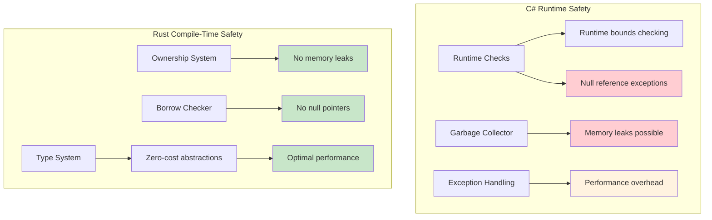

***

## Inheritance vs Composition
```csharp
// C# - Class-based inheritance
public abstract class Animal
{
    public string Name { get; protected set; }
    public abstract void MakeSound();
    
    public virtual void Sleep()
    {
        Console.WriteLine($"{Name} is sleeping");
    }
}

public class Dog : Animal
{
    public Dog(string name) { Name = name; }
    
    public override void MakeSound()
    {
        Console.WriteLine("Woof!");
    }
    
    public void Fetch()
    {
        Console.WriteLine($"{Name} is fetching");
    }
}

// Interface-based contracts
public interface IFlyable
{
    void Fly();
}

public class Bird : Animal, IFlyable
{
    public Bird(string name) { Name = name; }
    
    public override void MakeSound()
    {
        Console.WriteLine("Tweet!");
    }
    
    public void Fly()
    {
        Console.WriteLine($"{Name} is flying");
    }
}
```

### Rust Composition Model
```rust
// Rust - Composition over inheritance with traits
pub trait Animal {
    fn name(&self) -> &str;
    fn make_sound(&self);
    
    // Default implementation (like C# virtual methods)
    fn sleep(&self) {
        println!("{} is sleeping", self.name());
    }
}

pub trait Flyable {
    fn fly(&self);
}

// Separate data from behavior
#[derive(Debug)]
pub struct Dog {
    name: String,
}

#[derive(Debug)]
pub struct Bird {
    name: String,
    wingspan: f64,
}

// Implement behaviors for types
impl Animal for Dog {
    fn name(&self) -> &str {
        &self.name
    }
    
    fn make_sound(&self) {
        println!("Woof!");
    }
}

impl Dog {
    pub fn new(name: String) -> Self {
        Dog { name }
    }
    
    pub fn fetch(&self) {
        println!("{} is fetching", self.name);
    }
}

impl Animal for Bird {
    fn name(&self) -> &str {
        &self.name
    }
    
    fn make_sound(&self) {
        println!("Tweet!");
    }
}

impl Flyable for Bird {
    fn fly(&self) {
        println!("{} is flying with {:.1}m wingspan", self.name, self.wingspan);
    }
}

// Multiple trait bounds (like multiple interfaces)
fn make_flying_animal_sound<T>(animal: &T) 
where 
    T: Animal + Flyable,
{
    animal.make_sound();
    animal.fly();
}
```

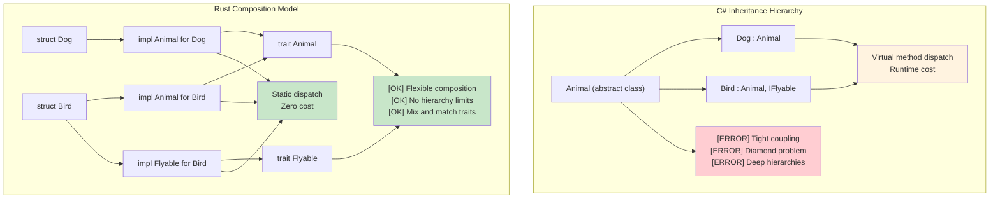

***

## Exceptions vs Result<T, E>

### C# Exception-Based Error Handling
```csharp
// C# - Exception-based error handling
public class UserService
{
    public User GetUser(int userId)
    {
        if (userId <= 0)
        {
            throw new ArgumentException("User ID must be positive");
        }
        
        var user = database.FindUser(userId);
        if (user == null)
        {
            throw new UserNotFoundException($"User {userId} not found");
        }
        
        return user;
    }
    
    public async Task<string> GetUserEmailAsync(int userId)
    {
        try
        {
            var user = GetUser(userId);
            return user.Email ?? throw new InvalidOperationException("User has no email");
        }
        catch (UserNotFoundException ex)
        {
            logger.Warning("User not found: {UserId}", userId);
            return "noreply@company.com";
        }
        catch (Exception ex)
        {
            logger.Error(ex, "Unexpected error getting user email");
            throw; // Re-throw
        }
    }
}
```

### Rust Result-Based Error Handling
```rust
use std::fmt;

#[derive(Debug)]
pub enum UserError {
    InvalidId(i32),
    NotFound(i32),
    NoEmail,
    DatabaseError(String),
}

impl fmt::Display for UserError {
    fn fmt(&self, f: &mut fmt::Formatter<'_>) -> fmt::Result {
        match self {
            UserError::InvalidId(id) => write!(f, "Invalid user ID: {}", id),
            UserError::NotFound(id) => write!(f, "User {} not found", id),
            UserError::NoEmail => write!(f, "User has no email address"),
            UserError::DatabaseError(msg) => write!(f, "Database error: {}", msg),
        }
    }
}

impl std::error::Error for UserError {}

pub struct UserService {
    // database connection, etc.
}

impl UserService {
    pub fn get_user(&self, user_id: i32) -> Result<User, UserError> {
        if user_id <= 0 {
            return Err(UserError::InvalidId(user_id));
        }
        
        // Simulate database lookup
        self.database_find_user(user_id)
            .ok_or(UserError::NotFound(user_id))
    }
    
    pub fn get_user_email(&self, user_id: i32) -> Result<String, UserError> {
        let user = self.get_user(user_id)?; // ? operator propagates errors
        
        user.email
            .ok_or(UserError::NoEmail)
    }
    
    pub fn get_user_email_or_default(&self, user_id: i32) -> String {
        match self.get_user_email(user_id) {
            Ok(email) => email,
            Err(UserError::NotFound(_)) => {
                log::warn!("User not found: {}", user_id);
                "noreply@company.com".to_string()
            }
            Err(err) => {
                log::error!("Error getting user email: {}", err);
                "error@company.com".to_string()
            }
        }
    }
}
```

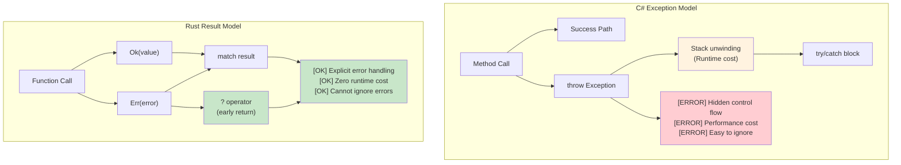

***

## LINQ vs Rust Iterators

### C# LINQ (Language Integrated Query)
```csharp
// C# LINQ - Declarative data processing
var numbers = new[] { 1, 2, 3, 4, 5, 6, 7, 8, 9, 10 };

var result = numbers
    .Where(n => n % 2 == 0)           // Filter even numbers
    .Select(n => n * n)               // Square them
    .Where(n => n > 10)               // Filter > 10
    .OrderByDescending(n => n)        // Sort descending
    .Take(3)                          // Take first 3
    .ToList();                        // Materialize

// LINQ with complex objects
var users = GetUsers();
var activeAdults = users
    .Where(u => u.IsActive && u.Age >= 18)
    .GroupBy(u => u.Department)
    .Select(g => new {
        Department = g.Key,
        Count = g.Count(),
        AverageAge = g.Average(u => u.Age)
    })
    .OrderBy(x => x.Department)
    .ToList();

// Async LINQ (with additional libraries)
var results = await users
    .ToAsyncEnumerable()
    .WhereAwait(async u => await IsActiveAsync(u.Id))
    .SelectAwait(async u => await EnrichUserAsync(u))
    .ToListAsync();
```

### Rust Iterators
```rust
// Rust iterators - Lazy, zero-cost abstractions
let numbers = vec![1, 2, 3, 4, 5, 6, 7, 8, 9, 10];

let result: Vec<i32> = numbers
    .iter()
    .filter(|&&n| n % 2 == 0)        // Filter even numbers
    .map(|&n| n * n)                 // Square them
    .filter(|&n| n > 10)             // Filter > 10
    .collect::<Vec<_>>()             // Collect to Vec
    .into_iter()
    .rev()                           // Reverse (descending sort)
    .take(3)                         // Take first 3
    .collect();                      // Materialize

// Complex iterator chains
use std::collections::HashMap;

#[derive(Debug, Clone)]
struct User {
    name: String,
    age: u32,
    department: String,
    is_active: bool,
}

fn process_users(users: Vec<User>) -> HashMap<String, (usize, f64)> {
    users
        .into_iter()
        .filter(|u| u.is_active && u.age >= 18)
        .fold(HashMap::new(), |mut acc, user| {
            let entry = acc.entry(user.department.clone()).or_insert((0, 0.0));
            entry.0 += 1;  // count
            entry.1 += user.age as f64;  // sum of ages
            acc
        })
        .into_iter()
        .map(|(dept, (count, sum))| (dept, (count, sum / count as f64)))  // average
        .collect()
}

// Parallel processing with rayon
use rayon::prelude::*;

fn parallel_processing(numbers: Vec<i32>) -> Vec<i32> {
    numbers
        .par_iter()                  // Parallel iterator
        .filter(|&&n| n % 2 == 0)
        .map(|&n| expensive_computation(n))
        .collect()
}

fn expensive_computation(n: i32) -> i32 {
    // Simulate heavy computation
    (0..1000).fold(n, |acc, _| acc + 1)
}
```

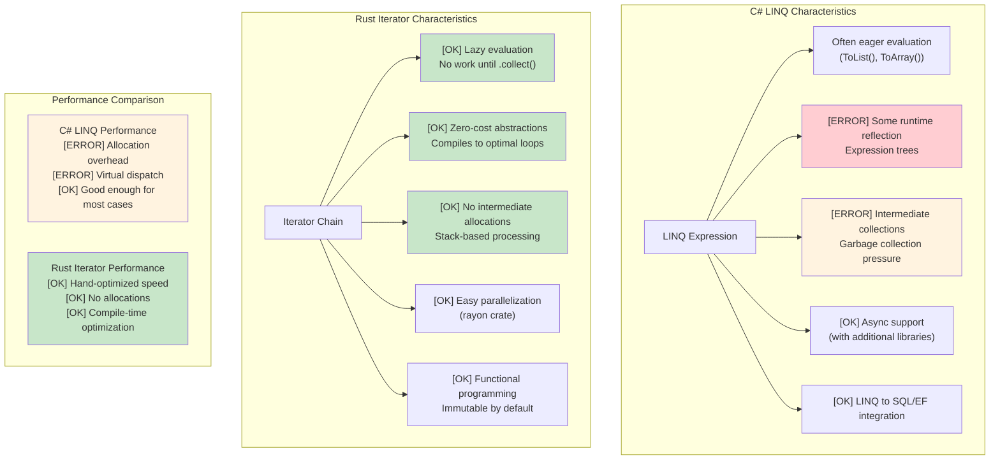

***

## Generic Constraints: where vs trait bounds

### C# Generic Constraints
```csharp
// C# Generic constraints with where clause
public class Repository<T> where T : class, IEntity, new()
{
    public T Create()
    {
        return new T();  // new() constraint allows parameterless constructor
    }
    
    public void Save(T entity)
    {
        if (entity.Id == 0)  // IEntity constraint provides Id property
        {
            entity.Id = GenerateId();
        }
        // Save to database
    }
}

// Multiple type parameters with constraints
public class Converter<TInput, TOutput> 
    where TInput : IConvertible
    where TOutput : class, new()
{
    public TOutput Convert(TInput input)
    {
        var output = new TOutput();
        // Conversion logic using IConvertible
        return output;
    }
}

// Variance in generics
public interface IRepository<out T> where T : IEntity
{
    IEnumerable<T> GetAll();  // Covariant - can return more derived types
}

public interface IWriter<in T> where T : IEntity
{
    void Write(T entity);  // Contravariant - can accept more base types
}
```

### Rust Generic Constraints with Trait Bounds
```rust
use std::fmt::{Debug, Display};
use std::clone::Clone;

// Basic trait bounds
pub struct Repository<T> 
where 
    T: Clone + Debug + Default,
{
    items: Vec<T>,
}

impl<T> Repository<T> 
where 
    T: Clone + Debug + Default,
{
    pub fn new() -> Self {
        Repository { items: Vec::new() }
    }
    
    pub fn create(&self) -> T {
        T::default()  // Default trait provides default value
    }
    
    pub fn add(&mut self, item: T) {
        println!("Adding item: {:?}", item);  // Debug trait for printing
        self.items.push(item);
    }
    
    pub fn get_all(&self) -> Vec<T> {
        self.items.clone()  // Clone trait for duplication
    }
}

// Multiple trait bounds with different syntaxes
pub fn process_data<T, U>(input: T) -> U 
where 
    T: Display + Clone,
    U: From<T> + Debug,
{
    println!("Processing: {}", input);  // Display trait
    let cloned = input.clone();         // Clone trait
    let output = U::from(cloned);       // From trait for conversion
    println!("Result: {:?}", output);   // Debug trait
    output
}

// Associated types (similar to C# generic constraints)
pub trait Iterator {
    type Item;  // Associated type instead of generic parameter
    
    fn next(&mut self) -> Option<Self::Item>;
}

pub trait Collect<T> {
    fn collect<I: Iterator<Item = T>>(iter: I) -> Self;
}

// Higher-ranked trait bounds (advanced)
fn apply_to_all<F>(items: &[String], f: F) -> Vec<String>
where 
    F: for<'a> Fn(&'a str) -> String,  // Function works with any lifetime
{
    items.iter().map(|s| f(s)).collect()
}

// Conditional trait implementations
impl<T> PartialEq for Repository<T> 
where 
    T: PartialEq + Clone + Debug + Default,
{
    fn eq(&self, other: &Self) -> bool {
        self.items == other.items
    }
}
```

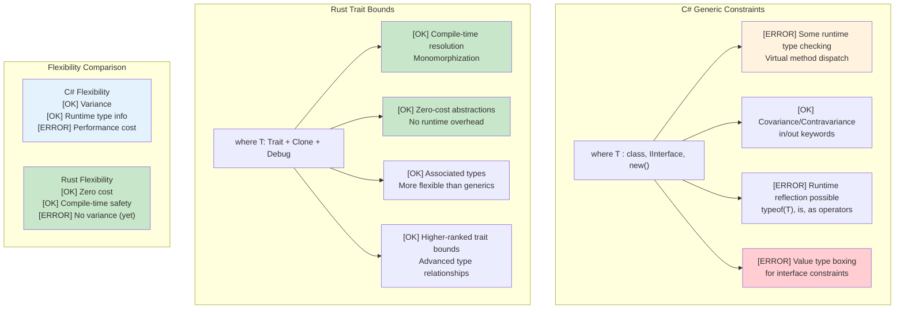

***

## Common C# Patterns in Rust

### Repository Pattern
```csharp
// C# Repository Pattern
public interface IRepository<T> where T : IEntity
{
    Task<T> GetByIdAsync(int id);
    Task<IEnumerable<T>> GetAllAsync();
    Task<T> AddAsync(T entity);
    Task UpdateAsync(T entity);
    Task DeleteAsync(int id);
}

public class UserRepository : IRepository<User>
{
    private readonly DbContext _context;
    
    public UserRepository(DbContext context)
    {
        _context = context;
    }
    
    public async Task<User> GetByIdAsync(int id)
    {
        return await _context.Users.FindAsync(id);
    }
    
    // ... other implementations
}
```

```rust
// Rust Repository Pattern with traits and generics
use async_trait::async_trait;
use std::fmt::Debug;

#[async_trait]
pub trait Repository<T, E> 
where 
    T: Clone + Debug + Send + Sync,
    E: std::error::Error + Send + Sync,
{
    async fn get_by_id(&self, id: u64) -> Result<Option<T>, E>;
    async fn get_all(&self) -> Result<Vec<T>, E>;
    async fn add(&self, entity: T) -> Result<T, E>;
    async fn update(&self, entity: T) -> Result<T, E>;
    async fn delete(&self, id: u64) -> Result<(), E>;
}

#[derive(Debug, Clone)]
pub struct User {
    pub id: u64,
    pub name: String,
    pub email: String,
}

#[derive(Debug)]
pub enum RepositoryError {
    NotFound(u64),
    DatabaseError(String),
    ValidationError(String),
}

impl std::fmt::Display for RepositoryError {
    fn fmt(&self, f: &mut std::fmt::Formatter<'_>) -> std::fmt::Result {
        match self {
            RepositoryError::NotFound(id) => write!(f, "Entity with id {} not found", id),
            RepositoryError::DatabaseError(msg) => write!(f, "Database error: {}", msg),
            RepositoryError::ValidationError(msg) => write!(f, "Validation error: {}", msg),
        }
    }
}

impl std::error::Error for RepositoryError {}

pub struct UserRepository {
    // database connection pool, etc.
}

#[async_trait]
impl Repository<User, RepositoryError> for UserRepository {
    async fn get_by_id(&self, id: u64) -> Result<Option<User>, RepositoryError> {
        // Simulate database lookup
        if id == 0 {
            return Ok(None);
        }
        
        Ok(Some(User {
            id,
            name: format!("User {}", id),
            email: format!("user{}@example.com", id),
        }))
    }
    
    async fn get_all(&self) -> Result<Vec<User>, RepositoryError> {
        // Implementation here
        Ok(vec![])
    }
    
    async fn add(&self, entity: User) -> Result<User, RepositoryError> {
        // Validation and database insertion
        if entity.name.is_empty() {
            return Err(RepositoryError::ValidationError("Name cannot be empty".to_string()));
        }
        Ok(entity)
    }
    
    async fn update(&self, entity: User) -> Result<User, RepositoryError> {
        // Implementation here
        Ok(entity)
    }
    
    async fn delete(&self, id: u64) -> Result<(), RepositoryError> {
        // Implementation here
        Ok(())
    }
}
```

### Builder Pattern
```csharp
// C# Builder Pattern (fluent interface)
public class HttpClientBuilder
{
    private TimeSpan? _timeout;
    private string _baseAddress;
    private Dictionary<string, string> _headers = new();
    
    public HttpClientBuilder WithTimeout(TimeSpan timeout)
    {
        _timeout = timeout;
        return this;
    }
    
    public HttpClientBuilder WithBaseAddress(string baseAddress)
    {
        _baseAddress = baseAddress;
        return this;
    }
    
    public HttpClientBuilder WithHeader(string name, string value)
    {
        _headers[name] = value;
        return this;
    }
    
    public HttpClient Build()
    {
        var client = new HttpClient();
        if (_timeout.HasValue)
            client.Timeout = _timeout.Value;
        if (!string.IsNullOrEmpty(_baseAddress))
            client.BaseAddress = new Uri(_baseAddress);
        foreach (var header in _headers)
            client.DefaultRequestHeaders.Add(header.Key, header.Value);
        return client;
    }
}

// Usage
var client = new HttpClientBuilder()
    .WithTimeout(TimeSpan.FromSeconds(30))
    .WithBaseAddress("https://api.example.com")
    .WithHeader("Accept", "application/json")
    .Build();
```

```rust
// Rust Builder Pattern (consuming builder)
use std::collections::HashMap;
use std::time::Duration;

#[derive(Debug)]
pub struct HttpClient {
    timeout: Duration,
    base_address: String,
    headers: HashMap<String, String>,
}

pub struct HttpClientBuilder {
    timeout: Option<Duration>,
    base_address: Option<String>,
    headers: HashMap<String, String>,
}

impl HttpClientBuilder {
    pub fn new() -> Self {
        HttpClientBuilder {
            timeout: None,
            base_address: None,
            headers: HashMap::new(),
        }
    }
    
    pub fn with_timeout(mut self, timeout: Duration) -> Self {
        self.timeout = Some(timeout);
        self
    }
    
    pub fn with_base_address<S: Into<String>>(mut self, base_address: S) -> Self {
        self.base_address = Some(base_address.into());
        self
    }
    
    pub fn with_header<K: Into<String>, V: Into<String>>(mut self, name: K, value: V) -> Self {
        self.headers.insert(name.into(), value.into());
        self
    }
    
    pub fn build(self) -> Result<HttpClient, String> {
        let base_address = self.base_address.ok_or("Base address is required")?;
        
        Ok(HttpClient {
            timeout: self.timeout.unwrap_or(Duration::from_secs(30)),
            base_address,
            headers: self.headers,
        })
    }
}

// Usage
let client = HttpClientBuilder::new()
    .with_timeout(Duration::from_secs(30))
    .with_base_address("https://api.example.com")
    .with_header("Accept", "application/json")
    .build()?;

// Alternative: Using Default trait for common cases
impl Default for HttpClientBuilder {
    fn default() -> Self {
        Self::new()
    }
}
```

***

## Essential Crates for C# Developers

### Core Functionality Equivalents

```rust
// Cargo.toml dependencies for C# developers
[dependencies]
# Serialization (like Newtonsoft.Json or System.Text.Json)
serde = { version = "1.0", features = ["derive"] }
serde_json = "1.0"

# HTTP client (like HttpClient)
reqwest = { version = "0.11", features = ["json"] }

# Async runtime (like Task.Run, async/await)
tokio = { version = "1.0", features = ["full"] }

# Error handling (like custom exceptions)
thiserror = "1.0"
anyhow = "1.0"

# Logging (like ILogger, Serilog)
log = "0.4"
env_logger = "0.10"

# Date/time (like DateTime)
chrono = { version = "0.4", features = ["serde"] }

# UUID (like System.Guid)
uuid = { version = "1.0", features = ["v4", "serde"] }

# Collections (like List<T>, Dictionary<K,V>)
# Built into std, but for advanced collections:
indexmap = "2.0"  # Ordered HashMap

# Configuration (like IConfiguration)
config = "0.13"

# Database (like Entity Framework)
sqlx = { version = "0.7", features = ["runtime-tokio-rustls", "postgres", "uuid", "chrono"] }

# Testing (like xUnit, NUnit)
# Built into std, but for more features:
rstest = "0.18"  # Parameterized tests

# Mocking (like Moq)
mockall = "0.11"

# Parallel processing (like Parallel.ForEach)
rayon = "1.7"
```

### Example Usage Patterns

```rust
use serde::{Deserialize, Serialize};
use reqwest;
use tokio;
use thiserror::Error;
use chrono::{DateTime, Utc};
use uuid::Uuid;

// Data models (like C# POCOs with attributes)
#[derive(Debug, Clone, Serialize, Deserialize)]
pub struct User {
    pub id: Uuid,
    pub name: String,
    pub email: String,
    #[serde(with = "chrono::serde::ts_seconds")]
    pub created_at: DateTime<Utc>,
}

// Custom error types (like custom exceptions)
#[derive(Error, Debug)]
pub enum ApiError {
    #[error("HTTP request failed: {0}")]
    Http(#[from] reqwest::Error),
    
    #[error("Serialization failed: {0}")]
    Serialization(#[from] serde_json::Error),
    
    #[error("User not found: {id}")]
    UserNotFound { id: Uuid },
    
    #[error("Validation failed: {message}")]
    Validation { message: String },
}

// Service class equivalent
pub struct UserService {
    client: reqwest::Client,
    base_url: String,
}

impl UserService {
    pub fn new(base_url: String) -> Self {
        let client = reqwest::Client::builder()
            .timeout(std::time::Duration::from_secs(30))
            .build()
            .expect("Failed to create HTTP client");
            
        UserService { client, base_url }
    }
    
    // Async method (like C# async Task<User>)
    pub async fn get_user(&self, id: Uuid) -> Result<User, ApiError> {
        let url = format!("{}/users/{}", self.base_url, id);
        
        let response = self.client
            .get(&url)
            .send()
            .await?;
        
        if response.status() == 404 {
            return Err(ApiError::UserNotFound { id });
        }
        
        let user = response.json::<User>().await?;
        Ok(user)
    }
    
    // Create user (like C# async Task<User>)
    pub async fn create_user(&self, name: String, email: String) -> Result<User, ApiError> {
        if name.trim().is_empty() {
            return Err(ApiError::Validation {
                message: "Name cannot be empty".to_string(),
            });
        }
        
        let new_user = User {
            id: Uuid::new_v4(),
            name,
            email,
            created_at: Utc::now(),
        };
        
        let response = self.client
            .post(&format!("{}/users", self.base_url))
            .json(&new_user)
            .send()
            .await?;
        
        let created_user = response.json::<User>().await?;
        Ok(created_user)
    }
}

// Usage example (like C# Main method)
#[tokio::main]
async fn main() -> Result<(), ApiError> {
    // Initialize logging (like configuring ILogger)
    env_logger::init();
    
    let service = UserService::new("https://api.example.com".to_string());
    
    // Create user
    let user = service.create_user(
        "John Doe".to_string(),
        "john@example.com".to_string(),
    ).await?;
    
    println!("Created user: {:?}", user);
    
    // Get user
    let retrieved_user = service.get_user(user.id).await?;
    println!("Retrieved user: {:?}", retrieved_user);
    
    Ok(())
}

#[cfg(test)]
mod tests {
    use super::*;
    
    #[tokio::test]  // Like C# [Test] or [Fact]
    async fn test_user_creation() {
        let service = UserService::new("http://localhost:8080".to_string());
        
        let result = service.create_user(
            "Test User".to_string(),
            "test@example.com".to_string(),
        ).await;
        
        assert!(result.is_ok());
        let user = result.unwrap();
        assert_eq!(user.name, "Test User");
        assert_eq!(user.email, "test@example.com");
    }
    
    #[test]
    fn test_validation() {
        // Synchronous test
        let error = ApiError::Validation {
            message: "Invalid input".to_string(),
        };
        
        assert_eq!(error.to_string(), "Validation failed: Invalid input");
    }
}
```

***

## Thread Safety: Convention vs Type System Guarantees

### C# - Thread Safety by Convention
```csharp
// C# collections aren't thread-safe by default
public class UserService
{
    private readonly List<string> items = new();
    private readonly Dictionary<int, User> cache = new();

    // This can cause data races:
    public void AddItem(string item)
    {
        items.Add(item);  // Not thread-safe!
    }

    // Must use locks manually:
    private readonly object lockObject = new();

    public void SafeAddItem(string item)
    {
        lock (lockObject)
        {
            items.Add(item);  // Safe, but runtime overhead
        }
        // Easy to forget the lock elsewhere
    }

    // ConcurrentCollection helps but limited:
    private readonly ConcurrentBag<string> safeItems = new();
    
    public void ConcurrentAdd(string item)
    {
        safeItems.Add(item);  // Thread-safe but limited operations
    }

    // Complex shared state management
    private readonly ConcurrentDictionary<int, User> threadSafeCache = new();
    private volatile bool isShutdown = false;
    
    public async Task ProcessUser(int userId)
    {
        if (isShutdown) return;  // Race condition possible!
        
        var user = await GetUser(userId);
        threadSafeCache.TryAdd(userId, user);  // Must remember which collections are safe
    }

    // Thread-local storage requires careful management
    private static readonly ThreadLocal<Random> threadLocalRandom = 
        new ThreadLocal<Random>(() => new Random());
        
    public int GetRandomNumber()
    {
        return threadLocalRandom.Value.Next();  // Safe but manual management
    }
}

// Event handling with potential race conditions
public class EventProcessor
{
    public event Action<string> DataReceived;
    private readonly List<string> eventLog = new();
    
    public void OnDataReceived(string data)
    {
        // Race condition - event might be null between check and invocation
        if (DataReceived != null)
        {
            DataReceived(data);
        }
        
        // Another race condition - list not thread-safe
        eventLog.Add($"Processed: {data}");
    }
}
```

### Rust - Thread Safety Guaranteed by Type System
```rust
use std::sync::{Arc, Mutex, RwLock};
use std::thread;
use std::collections::HashMap;
use tokio::sync::{mpsc, broadcast};

// Rust prevents data races at compile time
pub struct UserService {
    items: Arc<Mutex<Vec<String>>>,
    cache: Arc<RwLock<HashMap<i32, User>>>,
}

impl UserService {
    pub fn new() -> Self {
        UserService {
            items: Arc::new(Mutex::new(Vec::new())),
            cache: Arc::new(RwLock::new(HashMap::new())),
        }
    }
    
    pub fn add_item(&self, item: String) {
        let mut items = self.items.lock().unwrap();
        items.push(item);
        // Lock automatically released when `items` goes out of scope
    }
    
    // Multiple readers, single writer - automatically enforced
    pub async fn get_user(&self, user_id: i32) -> Option<User> {
        let cache = self.cache.read().unwrap();
        cache.get(&user_id).cloned()
    }
    
    pub async fn cache_user(&self, user_id: i32, user: User) {
        let mut cache = self.cache.write().unwrap();
        cache.insert(user_id, user);
    }
    
    // Clone the Arc for thread sharing
    pub fn process_in_background(&self) {
        let items = Arc::clone(&self.items);
        
        thread::spawn(move || {
            let items = items.lock().unwrap();
            for item in items.iter() {
                println!("Processing: {}", item);
            }
        });
    }
}

// Channel-based communication - no shared state needed
pub struct MessageProcessor {
    sender: mpsc::UnboundedSender<String>,
}

impl MessageProcessor {
    pub fn new() -> (Self, mpsc::UnboundedReceiver<String>) {
        let (tx, rx) = mpsc::unbounded_channel();
        (MessageProcessor { sender: tx }, rx)
    }
    
    pub fn send_message(&self, message: String) -> Result<(), mpsc::error::SendError<String>> {
        self.sender.send(message)
    }
}

// This won't compile - Rust prevents sharing mutable data unsafely:
fn impossible_data_race() {
    let mut items = vec![1, 2, 3];
    
    // This won't compile - cannot move `items` into multiple closures
    /*
    thread::spawn(move || {
        items.push(4);  // ERROR: use of moved value
    });
    
    thread::spawn(move || {
        items.push(5);  // ERROR: use of moved value  
    });
    */
}

// Safe concurrent data processing
use rayon::prelude::*;

fn parallel_processing() {
    let data = vec![1, 2, 3, 4, 5];
    
    // Parallel iteration - guaranteed thread-safe
    let results: Vec<i32> = data
        .par_iter()
        .map(|&x| x * x)
        .collect();
        
    println!("{:?}", results);
}

// Async concurrency with message passing
async fn async_message_passing() {
    let (tx, mut rx) = mpsc::channel(100);
    
    // Producer task
    let producer = tokio::spawn(async move {
        for i in 0..10 {
            if tx.send(i).await.is_err() {
                break;
            }
        }
    });
    
    // Consumer task  
    let consumer = tokio::spawn(async move {
        while let Some(value) = rx.recv().await {
            println!("Received: {}", value);
        }
    });
    
    // Wait for both tasks
    let (producer_result, consumer_result) = tokio::join!(producer, consumer);
    producer_result.unwrap();
    consumer_result.unwrap();
}

#[derive(Clone)]
struct User {
    id: i32,
    name: String,
}
```

```mermaid
graph TD
    subgraph "C# Thread Safety Challenges"
        CS_MANUAL["Manual synchronization"]
        CS_LOCKS["lock statements"]
        CS_CONCURRENT["ConcurrentCollections"]
        CS_VOLATILE["volatile fields"]
        CS_FORGET["😰 Easy to forget locks"]
        CS_DEADLOCK["💀 Deadlock possible"]
        CS_RACE["🏃 Race conditions"]
        CS_OVERHEAD["⚡ Runtime overhead"]
        
        CS_MANUAL --> CS_LOCKS
        CS_MANUAL --> CS_CONCURRENT
        CS_MANUAL --> CS_VOLATILE
        CS_LOCKS --> CS_FORGET
        CS_LOCKS --> CS_DEADLOCK
        CS_FORGET --> CS_RACE
        CS_LOCKS --> CS_OVERHEAD
    end
    
    subgraph "Rust Type System Guarantees"
        RUST_OWNERSHIP["Ownership system"]
        RUST_BORROWING["Borrow checker"]
        RUST_SEND["Send trait"]
        RUST_SYNC["Sync trait"]
        RUST_ARC["Arc<Mutex<T>>"]
        RUST_CHANNELS["Message passing"]
        RUST_SAFE["✅ Data races impossible"]
        RUST_FAST["⚡ Zero-cost abstractions"]
        
        RUST_OWNERSHIP --> RUST_BORROWING
        RUST_BORROWING --> RUST_SEND
        RUST_SEND --> RUST_SYNC
        RUST_SYNC --> RUST_ARC
        RUST_ARC --> RUST_CHANNELS
        RUST_CHANNELS --> RUST_SAFE
        RUST_SAFE --> RUST_FAST
    end
    
    style CS_FORGET fill:#ffcdd2
    style CS_DEADLOCK fill:#ffcdd2
    style CS_RACE fill:#ffcdd2
    style RUST_SAFE fill:#c8e6c9
    style RUST_FAST fill:#c8e6c9
```

***

## Incremental Adoption Strategy

### Phase 1: Learning and Experimentation (Weeks 1-4)
```rust
// Start with command-line tools and utilities
// Example: Log file analyzer
use std::fs;
use std::collections::HashMap;
use clap::Parser;

#[derive(Parser)]
#[command(author, version, about)]
struct Args {
    #[arg(short, long)]
    file: String,
    
    #[arg(short, long, default_value = "10")]
    top: usize,
}

fn main() -> Result<(), Box<dyn std::error::Error>> {
    let args = Args::parse();
    
    let content = fs::read_to_string(&args.file)?;
    let mut word_count = HashMap::new();
    
    for line in content.lines() {
        for word in line.split_whitespace() {
            let word = word.to_lowercase();
            *word_count.entry(word).or_insert(0) += 1;
        }
    }
    
    let mut sorted: Vec<_> = word_count.into_iter().collect();
    sorted.sort_by(|a, b| b.1.cmp(&a.1));
    
    for (word, count) in sorted.into_iter().take(args.top) {
        println!("{}: {}", word, count);
    }
    
    Ok(())
}
```

### Phase 2: Replace Performance-Critical Components (Weeks 5-8)
```rust
// Replace CPU-intensive data processing
// Example: Image processing microservice
use image::{DynamicImage, ImageBuffer, Rgb};
use serde::{Deserialize, Serialize};
use tokio::io::{AsyncReadExt, AsyncWriteExt};
use warp::Filter;

#[derive(Serialize, Deserialize)]
struct ProcessingRequest {
    image_data: Vec<u8>,
    operation: String,
    parameters: serde_json::Value,
}

#[derive(Serialize)]
struct ProcessingResponse {
    processed_image: Vec<u8>,
    processing_time_ms: u64,
}

async fn process_image(request: ProcessingRequest) -> Result<ProcessingResponse, Box<dyn std::error::Error + Send + Sync>> {
    let start = std::time::Instant::now();
    
    let img = image::load_from_memory(&request.image_data)?;
    
    let processed = match request.operation.as_str() {
        "blur" => {
            let radius = request.parameters["radius"].as_f64().unwrap_or(2.0) as f32;
            img.blur(radius)
        }
        "grayscale" => img.grayscale(),
        "resize" => {
            let width = request.parameters["width"].as_u64().unwrap_or(100) as u32;
            let height = request.parameters["height"].as_u64().unwrap_or(100) as u32;
            img.resize(width, height, image::imageops::FilterType::Lanczos3)
        }
        _ => return Err("Unknown operation".into()),
    };
    
    let mut buffer = Vec::new();
    processed.write_to(&mut std::io::Cursor::new(&mut buffer), image::ImageOutputFormat::Png)?;
    
    Ok(ProcessingResponse {
        processed_image: buffer,
        processing_time_ms: start.elapsed().as_millis() as u64,
    })
}

#[tokio::main]
async fn main() {
    let process_route = warp::path("process")
        .and(warp::post())
        .and(warp::body::json())
        .and_then(|req: ProcessingRequest| async move {
            match process_image(req).await {
                Ok(response) => Ok(warp::reply::json(&response)),
                Err(e) => Err(warp::reject::custom(ProcessingError(e.to_string()))),
            }
        });

    warp::serve(process_route)
        .run(([127, 0, 0, 1], 3030))
        .await;
}

#[derive(Debug)]
struct ProcessingError(String);
impl warp::reject::Reject for ProcessingError {}
```

### Phase 3: New Microservices (Weeks 9-12)
```rust
// Build new services from scratch in Rust
// Example: Authentication service
use axum::{
    extract::{Query, State},
    http::StatusCode,
    response::Json,
    routing::{get, post},
    Router,
};
use jsonwebtoken::{encode, decode, Header, Validation, EncodingKey, DecodingKey};
use serde::{Deserialize, Serialize};
use sqlx::{Pool, Postgres};
use uuid::Uuid;
use bcrypt::{hash, verify, DEFAULT_COST};

#[derive(Clone)]
struct AppState {
    db: Pool<Postgres>,
    jwt_secret: String,
}

#[derive(Serialize, Deserialize)]
struct Claims {
    sub: String,
    exp: usize,
}

#[derive(Deserialize)]
struct LoginRequest {
    email: String,
    password: String,
}

#[derive(Serialize)]
struct LoginResponse {
    token: String,
    user_id: Uuid,
}

async fn login(
    State(state): State<AppState>,
    Json(request): Json<LoginRequest>,
) -> Result<Json<LoginResponse>, StatusCode> {
    let user = sqlx::query!(
        "SELECT id, password_hash FROM users WHERE email = $1",
        request.email
    )
    .fetch_optional(&state.db)
    .await
    .map_err(|_| StatusCode::INTERNAL_SERVER_ERROR)?;

    let user = user.ok_or(StatusCode::UNAUTHORIZED)?;

    if !verify(&request.password, &user.password_hash)
        .map_err(|_| StatusCode::INTERNAL_SERVER_ERROR)?
    {
        return Err(StatusCode::UNAUTHORIZED);
    }

    let claims = Claims {
        sub: user.id.to_string(),
        exp: (chrono::Utc::now() + chrono::Duration::hours(24)).timestamp() as usize,
    };

    let token = encode(
        &Header::default(),
        &claims,
        &EncodingKey::from_secret(state.jwt_secret.as_ref()),
    )
    .map_err(|_| StatusCode::INTERNAL_SERVER_ERROR)?;

    Ok(Json(LoginResponse {
        token,
        user_id: user.id,
    }))
}

#[tokio::main]
async fn main() -> Result<(), Box<dyn std::error::Error>> {
    let database_url = std::env::var("DATABASE_URL")?;
    let jwt_secret = std::env::var("JWT_SECRET")?;
    
    let pool = sqlx::postgres::PgPoolOptions::new()
        .max_connections(20)
        .connect(&database_url)
        .await?;

    let app_state = AppState {
        db: pool,
        jwt_secret,
    };

    let app = Router::new()
        .route("/login", post(login))
        .with_state(app_state);

    let listener = tokio::net::TcpListener::bind("0.0.0.0:3000").await?;
    axum::serve(listener, app).await?;
    
    Ok(())
}
```

***

## C# to Rust Concept Mapping

### Dependency Injection → Constructor Injection + Traits
```csharp
// C# with DI container
services.AddScoped<IUserRepository, UserRepository>();
services.AddScoped<IUserService, UserService>();

public class UserService
{
    private readonly IUserRepository _repository;
    
    public UserService(IUserRepository repository)
    {
        _repository = repository;
    }
}
```

```rust
// Rust: Constructor injection with traits
pub trait UserRepository {
    async fn find_by_id(&self, id: Uuid) -> Result<Option<User>, Error>;
    async fn save(&self, user: &User) -> Result<(), Error>;
}

pub struct UserService<R> 
where 
    R: UserRepository,
{
    repository: R,
}

impl<R> UserService<R> 
where 
    R: UserRepository,
{
    pub fn new(repository: R) -> Self {
        Self { repository }
    }
    
    pub async fn get_user(&self, id: Uuid) -> Result<Option<User>, Error> {
        self.repository.find_by_id(id).await
    }
}

// Usage
let repository = PostgresUserRepository::new(pool);
let service = UserService::new(repository);
```

### LINQ → Iterator Chains
```csharp
// C# LINQ
var result = users
    .Where(u => u.Age > 18)
    .Select(u => u.Name.ToUpper())
    .OrderBy(name => name)
    .Take(10)
    .ToList();
```

```rust
// Rust: Iterator chains (zero-cost!)
let result: Vec<String> = users
    .iter()
    .filter(|u| u.age > 18)
    .map(|u| u.name.to_uppercase())
    .collect::<Vec<_>>()
    .into_iter()
    .sorted()
    .take(10)
    .collect();

// Or with itertools crate for more LINQ-like operations
use itertools::Itertools;

let result: Vec<String> = users
    .iter()
    .filter(|u| u.age > 18)
    .map(|u| u.name.to_uppercase())
    .sorted()
    .take(10)
    .collect();
```

### Entity Framework → SQLx + Migrations
```csharp
// C# Entity Framework
public class ApplicationDbContext : DbContext
{
    public DbSet<User> Users { get; set; }
}

var user = await context.Users
    .Where(u => u.Email == email)
    .FirstOrDefaultAsync();
```

```rust
// Rust: SQLx with compile-time checked queries
use sqlx::{PgPool, FromRow};

#[derive(FromRow)]
struct User {
    id: Uuid,
    email: String,
    name: String,
}

// Compile-time checked query
let user = sqlx::query_as!(
    User,
    "SELECT id, email, name FROM users WHERE email = $1",
    email
)
.fetch_optional(&pool)
.await?;

// Or with dynamic queries
let user = sqlx::query_as::<_, User>(
    "SELECT id, email, name FROM users WHERE email = $1"
)
.bind(email)
.fetch_optional(&pool)
.await?;
```

### Configuration → Config Crates
```csharp
// C# Configuration
public class AppSettings
{
    public string DatabaseUrl { get; set; }
    public int Port { get; set; }
}

var config = builder.Configuration.Get<AppSettings>();
```

```rust
// Rust: Config with serde
use config::{Config, ConfigError, Environment, File};
use serde::Deserialize;

#[derive(Debug, Deserialize)]
struct AppSettings {
    database_url: String,
    port: u16,
}

impl AppSettings {
    pub fn new() -> Result<Self, ConfigError> {
        let s = Config::builder()
            .add_source(File::with_name("config/default"))
            .add_source(Environment::with_prefix("APP"))
            .build()?;

        s.try_deserialize()
    }
}

// Usage
let settings = AppSettings::new()?;
```

***

## Team Adoption Timeline

### Month 1: Foundation
**Week 1-2: Syntax and Ownership**
- Basic syntax differences from C#
- Understanding ownership, borrowing, and lifetimes
- Small exercises: CLI tools, file processing

**Week 3-4: Error Handling and Types**
- `Result<T, E>` vs exceptions
- `Option<T>` vs nullable types
- Pattern matching and exhaustive checking

**Recommended exercises:**
```rust
// Week 1-2: File processor
fn process_log_file(path: &str) -> Result<Vec<String>, std::io::Error> {
    let content = std::fs::read_to_string(path)?;
    let errors: Vec<String> = content
        .lines()
        .filter(|line| line.contains("ERROR"))
        .map(|line| line.to_string())
        .collect();
    Ok(errors)
}

// Week 3-4: JSON processor with error handling
use serde::{Deserialize, Serialize};

#[derive(Deserialize, Serialize, Debug)]
struct LogEntry {
    timestamp: String,
    level: String,
    message: String,
}

fn parse_log_entries(json_str: &str) -> Result<Vec<LogEntry>, Box<dyn std::error::Error>> {
    let entries: Vec<LogEntry> = serde_json::from_str(json_str)?;
    Ok(entries)
}
```

### Month 2: Practical Applications
**Week 5-6: Traits and Generics**
- Trait system vs interfaces
- Generic constraints and bounds
- Common patterns and idioms

**Week 7-8: Async Programming and Concurrency**
- `async`/`await` similarities and differences
- Channels for communication
- Thread safety guarantees

**Recommended projects:**
```rust
// Week 5-6: Generic data processor
trait DataProcessor<T> {
    type Output;
    type Error;
    
    fn process(&self, data: T) -> Result<Self::Output, Self::Error>;
}

struct JsonProcessor;

impl DataProcessor<&str> for JsonProcessor {
    type Output = serde_json::Value;
    type Error = serde_json::Error;
    
    fn process(&self, data: &str) -> Result<Self::Output, Self::Error> {
        serde_json::from_str(data)
    }
}

// Week 7-8: Async web client
async fn fetch_and_process_data(urls: Vec<&str>) -> Result<(), Box<dyn std::error::Error>> {
    let client = reqwest::Client::new();
    
    let tasks: Vec<_> = urls
        .into_iter()
        .map(|url| {
            let client = client.clone();
            tokio::spawn(async move {
                let response = client.get(url).send().await?;
                let text = response.text().await?;
                println!("Fetched {} bytes from {}", text.len(), url);
                Ok::<(), reqwest::Error>(())
            })
        })
        .collect();
    
    for task in tasks {
        task.await??;
    }
    
    Ok(())
}
```

### Month 3+: Production Integration
**Week 9-12: Real Project Work**
- Choose a non-critical component to rewrite
- Implement comprehensive error handling
- Add logging, metrics, and testing
- Performance profiling and optimization

**Ongoing: Team Review and Mentoring**
- Code reviews focusing on Rust idioms
- Pair programming sessions
- Knowledge sharing sessions

***

## Performance Comparison: Managed vs Native

### Real-World Performance Characteristics

| **Aspect** | **C# (.NET)** | **Rust** | **Performance Impact** |
|------------|---------------|----------|------------------------|
| **Startup Time** | 100-500ms (JIT compilation) | 1-10ms (native binary) | 🚀 **50-500x faster** |
| **Memory Usage** | +30-100% (GC overhead + metadata) | Baseline (minimal runtime) | 💾 **30-50% less RAM** |
| **GC Pauses** | 1-100ms periodic pauses | Never (no GC) | ⚡ **Consistent latency** |
| **CPU Usage** | +10-20% (GC + JIT overhead) | Baseline (direct execution) | 🔋 **10-20% better efficiency** |
| **Binary Size** | 30-200MB (with runtime) | 1-20MB (static binary) | 📦 **10x smaller deployments** |
| **Memory Safety** | Runtime checks | Compile-time proofs | 🛡️ **Zero overhead safety** |
| **Concurrent Performance** | Good (with careful synchronization) | Excellent (fearless concurrency) | 🏃 **Superior scalability** |

### Benchmark Examples

```csharp
// C# - JSON processing benchmark
public class JsonProcessor
{
    public async Task<List<User>> ProcessJsonFile(string path)
    {
        var json = await File.ReadAllTextAsync(path);
        var users = JsonSerializer.Deserialize<List<User>>(json);
        
        return users.Where(u => u.Age > 18)
                   .OrderBy(u => u.Name)
                   .Take(1000)
                   .ToList();
    }
}

// Typical performance: ~200ms for 100MB file
// Memory usage: ~500MB peak (GC overhead)
// Binary size: ~80MB (self-contained)
```

```rust
// Rust - Equivalent JSON processing
use serde::{Deserialize, Serialize};
use tokio::fs;

#[derive(Deserialize, Serialize)]
struct User {
    name: String,
    age: u32,
}

pub async fn process_json_file(path: &str) -> Result<Vec<User>, Box<dyn std::error::Error>> {
    let json = fs::read_to_string(path).await?;
    let mut users: Vec<User> = serde_json::from_str(&json)?;
    
    users.retain(|u| u.age > 18);
    users.sort_by(|a, b| a.name.cmp(&b.name));
    users.truncate(1000);
    
    Ok(users)
}

// Typical performance: ~120ms for same 100MB file
// Memory usage: ~200MB peak (no GC overhead)
// Binary size: ~8MB (static binary)
```

### CPU-Intensive Workloads

```csharp
// C# - Mathematical computation
public class Mandelbrot
{
    public static int[,] Generate(int width, int height, int maxIterations)
    {
        var result = new int[height, width];
        
        Parallel.For(0, height, y =>
        {
            for (int x = 0; x < width; x++)
            {
                var c = new Complex(
                    (x - width / 2.0) * 4.0 / width,
                    (y - height / 2.0) * 4.0 / height);
                
                result[y, x] = CalculateIterations(c, maxIterations);
            }
        });
        
        return result;
    }
}

// Performance: ~2.3 seconds (8-core machine)
// Memory: ~500MB
```

```rust
// Rust - Same computation with Rayon
use rayon::prelude::*;
use num_complex::Complex;

pub fn generate_mandelbrot(width: usize, height: usize, max_iterations: u32) -> Vec<Vec<u32>> {
    (0..height)
        .into_par_iter()
        .map(|y| {
            (0..width)
                .map(|x| {
                    let c = Complex::new(
                        (x as f64 - width as f64 / 2.0) * 4.0 / width as f64,
                        (y as f64 - height as f64 / 2.0) * 4.0 / height as f64,
                    );
                    calculate_iterations(c, max_iterations)
                })
                .collect()
        })
        .collect()
}

// Performance: ~1.1 seconds (same 8-core machine)  
// Memory: ~200MB
// 2x faster with 60% less memory usage
```

### When to Choose Each Language

**Choose C# when:**
- **Rapid development is crucial** - Rich tooling ecosystem
- **Team expertise in .NET** - Existing knowledge and skills
- **Enterprise integration** - Heavy use of Microsoft ecosystem
- **Moderate performance requirements** - Performance is adequate
- **Rich UI applications** - WPF, WinUI, Blazor applications
- **Prototyping and MVPs** - Fast time to market

**Choose Rust when:**
- **Performance is critical** - CPU/memory-intensive applications
- **Resource constraints matter** - Embedded, edge computing, serverless
- **Long-running services** - Web servers, databases, system services
- **System-level programming** - OS components, drivers, network tools
- **High reliability requirements** - Financial systems, safety-critical applications
- **Concurrent/parallel workloads** - High-throughput data processing

### Migration Strategy Decision Tree

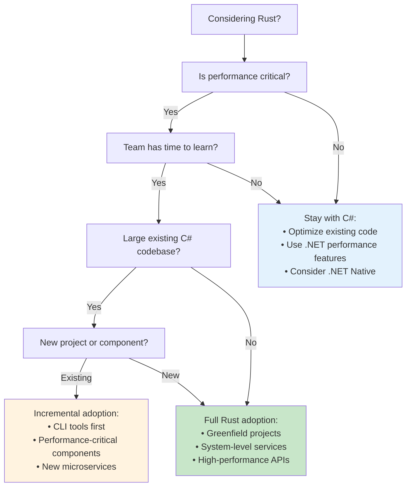

***

## Best Practices for C# Developers

### 1. **Mindset Shifts**
- **From GC to Ownership**: Think about who owns data and when it's freed
- **From Exceptions to Results**: Make error handling explicit and visible
- **From Inheritance to Composition**: Use traits to compose behavior
- **From Null to Option**: Make absence of values explicit in the type system

### 2. **Code Organization**
```rust
// Structure projects like C# solutions
src/
├── main.rs          // Program.cs equivalent
├── lib.rs           // Library entry point
├── models/          // Like Models/ folder in C#
│   ├── mod.rs
│   ├── user.rs
│   └── product.rs
├── services/        // Like Services/ folder
│   ├── mod.rs
│   ├── user_service.rs
│   └── product_service.rs
├── controllers/     // Like Controllers/ (for web apps)
├── repositories/    // Like Repositories/
└── utils/          // Like Utilities/
```

### 3. **Error Handling Strategy**
```rust
// Create a common Result type for your application
pub type AppResult<T> = Result<T, AppError>;

#[derive(Error, Debug)]
pub enum AppError {
    #[error("Database error: {0}")]
    Database(#[from] sqlx::Error),
    
    #[error("HTTP error: {0}")]
    Http(#[from] reqwest::Error),
    
    #[error("Validation error: {message}")]
    Validation { message: String },
    
    #[error("Business logic error: {message}")]
    Business { message: String },
}

// Use throughout your application
pub async fn create_user(data: CreateUserRequest) -> AppResult<User> {
    validate_user_data(&data)?;  // Returns AppError::Validation
    let user = repository.create_user(data).await?;  // Returns AppError::Database
    Ok(user)
}
```

### 4. **Testing Patterns**
```rust
// Structure tests like C# unit tests
#[cfg(test)]
mod tests {
    use super::*;
    use rstest::*;  // For parameterized tests like C# [Theory]
    
    #[test]
    fn test_basic_functionality() {
        // Arrange
        let input = "test data";
        
        // Act
        let result = process_data(input);
        
        // Assert
        assert_eq!(result, "expected output");
    }
    
    #[rstest]
    #[case(1, 2, 3)]
    #[case(5, 5, 10)]
    #[case(0, 0, 0)]
    fn test_addition(#[case] a: i32, #[case] b: i32, #[case] expected: i32) {
        assert_eq!(add(a, b), expected);
    }
    
    #[tokio::test]  // For async tests
    async fn test_async_functionality() {
        let result = async_function().await;
        assert!(result.is_ok());
    }
}
```

### 5. **Common Mistakes to Avoid**
```rust
// [ERROR] Don't try to implement inheritance
// Instead of:
// struct Manager : Employee  // This doesn't exist in Rust

// [OK] Use composition with traits
trait Employee {
    fn get_salary(&self) -> u32;
}

trait Manager: Employee {
    fn get_team_size(&self) -> usize;
}

// [ERROR] Don't use unwrap() everywhere (like ignoring exceptions)
let value = might_fail().unwrap();  // Can panic!

// [OK] Handle errors properly
let value = match might_fail() {
    Ok(v) => v,
    Err(e) => {
        log::error!("Operation failed: {}", e);
        return Err(e.into());
    }
};

// [ERROR] Don't clone everything (like copying objects unnecessarily)
let data = expensive_data.clone();  // Expensive!

// [OK] Use borrowing when possible
let data = &expensive_data;  // Just a reference

// [ERROR] Don't use RefCell everywhere (like making everything mutable)
struct Data {
    value: RefCell<i32>,  // Interior mutability - use sparingly
}

// [OK] Prefer owned or borrowed data
struct Data {
    value: i32,  // Simple and clear
}
```

This guide provides C# developers with a comprehensive understanding of how their existing knowledge translates to Rust, highlighting both the similarities and the fundamental differences in approach. The key is understanding that Rust's constraints (like ownership) are designed to prevent entire classes of bugs that are possible in C#, at the cost of some initial complexity.


