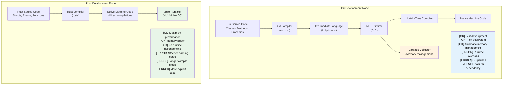

## Speaker Intro and General Approach

- Speaker intro
    - Principal Firmware Architect in Microsoft SCHIE (Silicon and Cloud Hardware Infrastructure Engineering) team
    - Industry veteran with expertise in security, systems programming (firmware, operating systems, hypervisors), CPU and platform architecture, and C++ systems
    - Started programming in Rust in 2017 (@AWS EC2), and have been in love with the language ever since
- This course is intended to be as interactive as possible
    - Assumption: You know C# and .NET development
    - Examples deliberately map C# concepts to Rust equivalents
    - **Please feel free to ask clarifying questions at any point of time**

---

## The Case for Rust for C# Developers

> **What you'll learn:** Why Rust matters for C# developers — the performance gap between managed and native code,
> how Rust eliminates null-reference exceptions and hidden control flow at compile time,
> and the key scenarios where Rust complements or replaces C#.
>
> **Difficulty:** 🟢 Beginner

### Performance Without the Runtime Tax
```csharp
// C# - Great productivity, runtime overhead
public class DataProcessor
{
    private List<int> data = new List<int>();
    
    public void ProcessLargeDataset()
    {
        // Allocations trigger GC
        for (int i = 0; i < 10_000_000; i++)
        {
            data.Add(i * 2); // GC pressure
        }
        // Unpredictable GC pauses during processing
    }
}
// Runtime: Variable (50-200ms due to GC)
// Memory: ~80MB (including GC overhead)
// Predictability: Low (GC pauses)
```

```rust
// Rust - Same expressiveness, zero runtime overhead
struct DataProcessor {
    data: Vec<i32>,
}

impl DataProcessor {
    fn process_large_dataset(&mut self) {
        // Zero-cost abstractions
        for i in 0..10_000_000 {
            self.data.push(i * 2); // No GC pressure
        }
        // Deterministic performance
    }
}
// Runtime: Consistent (~30ms)
// Memory: ~40MB (exact allocation)
// Predictability: High (no GC)
```

### Memory Safety Without Runtime Checks
```csharp
// C# - Runtime safety with overhead
public class UnsafeOperations
{
    public string ProcessArray(int[] array)
    {
        // Runtime bounds checking
        if (array.Length > 0)
        {
            return array[0].ToString(); // NullReferenceException possible
        }
        return null; // Null propagation
    }
    
    public void ProcessConcurrently()
    {
        var list = new List<int>();
        
        // Data races possible, requires careful locking
        Parallel.For(0, 1000, i =>
        {
            lock (list) // Runtime overhead
            {
                list.Add(i);
            }
        });
    }
}
```

```rust
// Rust - Compile-time safety with zero runtime cost
struct SafeOperations;

impl SafeOperations {
    // Compile-time null safety, no runtime checks
    fn process_array(array: &[i32]) -> Option<String> {
        array.first().map(|x| x.to_string())
        // No null references possible
        // Bounds checking optimized away when provably safe
    }
    
    fn process_concurrently() {
        use std::sync::{Arc, Mutex};
        use std::thread;
        
        let data = Arc::new(Mutex::new(Vec::new()));
        
        // Data races prevented at compile time
        let handles: Vec<_> = (0..1000).map(|i| {
            let data = Arc::clone(&data);
            thread::spawn(move || {
                data.lock().unwrap().push(i);
            })
        }).collect();
        
        for handle in handles {
            handle.join().unwrap();
        }
    }
}
```

***

## Common C# Pain Points That Rust Addresses

### 1. The Billion Dollar Mistake: Null References
```csharp
// C# - Null reference exceptions are runtime bombs
public class UserService
{
    public string GetUserDisplayName(User user)
    {
        // Any of these could throw NullReferenceException
        return user.Profile.DisplayName.ToUpper();
        //     ^^^^^ ^^^^^^^ ^^^^^^^^^^^ ^^^^^^^
        //     Could be null at runtime
    }
    
    // Even with nullable reference types (C# 8+)
    public string GetDisplayName(User? user)
    {
        return user?.Profile?.DisplayName?.ToUpper() ?? "Unknown";
        // Still possible to have null at runtime
    }
}
```

```rust
// Rust - Null safety guaranteed at compile time
struct UserService;

impl UserService {
    fn get_user_display_name(user: &User) -> Option<String> {
        user.profile.as_ref()?
            .display_name.as_ref()
            .map(|name| name.to_uppercase())
        // Compiler forces you to handle None case
        // Impossible to have null pointer exceptions
    }
    
    fn get_display_name_safe(user: Option<&User>) -> String {
        user.and_then(|u| u.profile.as_ref())
            .and_then(|p| p.display_name.as_ref())
            .map(|name| name.to_uppercase())
            .unwrap_or_else(|| "Unknown".to_string())
        // Explicit handling, no surprises
    }
}
```

### 2. Hidden Exceptions and Control Flow
```csharp
// C# - Exceptions can be thrown from anywhere
public async Task<UserData> GetUserDataAsync(int userId)
{
    // Each of these might throw different exceptions
    var user = await userRepository.GetAsync(userId);        // SqlException
    var permissions = await permissionService.GetAsync(user); // HttpRequestException  
    var preferences = await preferenceService.GetAsync(user); // TimeoutException
    
    return new UserData(user, permissions, preferences);
    // Caller has no idea what exceptions to expect
}
```

```rust
// Rust - All errors explicit in function signatures
#[derive(Debug)]
enum UserDataError {
    DatabaseError(String),
    NetworkError(String),
    Timeout,
    UserNotFound(i32),
}

async fn get_user_data(user_id: i32) -> Result<UserData, UserDataError> {
    // All errors explicit and handled
    let user = user_repository.get(user_id).await
        .map_err(UserDataError::DatabaseError)?;
    
    let permissions = permission_service.get(&user).await
        .map_err(UserDataError::NetworkError)?;
    
    let preferences = preference_service.get(&user).await
        .map_err(|_| UserDataError::Timeout)?;
    
    Ok(UserData::new(user, permissions, preferences))
    // Caller knows exactly what errors are possible
}
```

### 3. Correctness: The Type System as a Proof Engine

Rust's type system catches entire categories of logic bugs at compile time that C# can only catch at runtime — or not at all.

#### ADTs vs Sealed-Class Workarounds
```csharp
// C# — Discriminated unions require sealed-class boilerplate
// and the compiler STILL doesn't enforce exhaustive matching.
public abstract record Shape;
public sealed record Circle(double Radius)   : Shape;
public sealed record Rectangle(double W, double H) : Shape;
public sealed record Triangle(double A, double B, double C) : Shape;

public static double Area(Shape shape) => shape switch
{
    Circle c    => Math.PI * c.Radius * c.Radius,
    Rectangle r => r.W * r.H,
    // Forgot Triangle? Compiles fine. Throws at runtime.
    _           => throw new ArgumentException("Unknown shape")
};
// Add a new variant six months later — no compiler warning
// tells you about the 47 switch expressions you need to update.
```

```rust
// Rust — ADTs + exhaustive matching = compile-time proof
enum Shape {
    Circle { radius: f64 },
    Rectangle { w: f64, h: f64 },
    Triangle { a: f64, b: f64, c: f64 },
}

fn area(shape: &Shape) -> f64 {
    match shape {
        Shape::Circle { radius }    => std::f64::consts::PI * radius * radius,
        Shape::Rectangle { w, h }   => w * h,
        // Forget Triangle? ERROR: non-exhaustive pattern
        Shape::Triangle { a, b, c } => {
            let s = (a + b + c) / 2.0;
            (s * (s - a) * (s - b) * (s - c)).sqrt()
        }
    }
}
// Add a new variant → compiler shows you EVERY match that needs updating.
```

#### Immutability by Default vs Opt-In Immutability
```csharp
// C# — Everything is mutable by default
public class Config
{
    public string Host { get; set; }   // Mutable by default
    public int Port { get; set; }
}

// "readonly" and "record" help, but don't prevent deep mutation:
public record ServerConfig(string Host, int Port, List<string> AllowedOrigins);

var config = new ServerConfig("localhost", 8080, new List<string> { "*.example.com" });
// Records are "immutable" but reference-type fields are NOT:
config.AllowedOrigins.Add("*.evil.com"); // Compiles and mutates! ← bug
// The compiler gives you no warning.
```

```rust
// Rust — Immutable by default, mutation is explicit and visible
struct Config {
    host: String,
    port: u16,
    allowed_origins: Vec<String>,
}

let config = Config {
    host: "localhost".into(),
    port: 8080,
    allowed_origins: vec!["*.example.com".into()],
};

// config.allowed_origins.push("*.evil.com".into()); // ERROR: cannot borrow as mutable

// Mutation requires explicit opt-in:
let mut config = config;
config.allowed_origins.push("*.safe.com".into()); // OK — visibly mutable

// "mut" in the signature tells every reader: "this function modifies data"
fn add_origin(config: &mut Config, origin: String) {
    config.allowed_origins.push(origin);
}
```

#### Functional Programming: First-Class vs Afterthought
```csharp
// C# — FP bolted on; LINQ is expressive but the language fights you
public IEnumerable<Order> GetHighValueOrders(IEnumerable<Order> orders)
{
    return orders
        .Where(o => o.Total > 1000)   // Func<Order, bool> — heap-allocated delegate
        .Select(o => new OrderSummary  // Anonymous type or extra class
        {
            Id = o.Id,
            Total = o.Total
        })
        .OrderByDescending(o => o.Total);
    // No exhaustive matching on results
    // Null can sneak in anywhere in the pipeline
    // Can't enforce purity — any lambda might have side effects
}
```

```rust
// Rust — FP is a first-class citizen
fn get_high_value_orders(orders: &[Order]) -> Vec<OrderSummary> {
    orders.iter()
        .filter(|o| o.total > 1000)      // Zero-cost closure, no heap allocation
        .map(|o| OrderSummary {           // Type-checked struct
            id: o.id,
            total: o.total,
        })
        .sorted_by(|a, b| b.total.cmp(&a.total)) // itertools
        .collect()
    // No nulls anywhere in the pipeline
    // Closures are monomorphized — zero overhead vs hand-written loops
    // Purity enforced: &[Order] means the function CAN'T modify orders
}
```

#### Inheritance: Elegant in Theory, Fragile in Practice
```csharp
// C# — The fragile base class problem
public class Animal
{
    public virtual string Speak() => "...";
    public void Greet() => Console.WriteLine($"I say: {Speak()}");
}

public class Dog : Animal
{
    public override string Speak() => "Woof!";
}

public class RobotDog : Dog
{
    // Which Speak() does Greet() call? What if Dog changes?
    // Diamond problem with interfaces + default methods
    // Tight coupling: changing Animal can break RobotDog silently
}

// Common C# anti-patterns:
// - God base classes with 20 virtual methods
// - Deep hierarchies (5+ levels) nobody can reason about
// - "protected" fields creating hidden coupling
// - Base class changes silently altering derived behavior
```

```rust
// Rust — Composition over inheritance, enforced by the language
trait Speaker {
    fn speak(&self) -> &str;
}

trait Greeter: Speaker {
    fn greet(&self) {
        println!("I say: {}", self.speak());
    }
}

struct Dog;
impl Speaker for Dog {
    fn speak(&self) -> &str { "Woof!" }
}
impl Greeter for Dog {} // Uses default greet()

struct RobotDog {
    voice: String, // Composition: owns its own data
}
impl Speaker for RobotDog {
    fn speak(&self) -> &str { &self.voice }
}
impl Greeter for RobotDog {} // Clear, explicit behavior

// No fragile base class problem — no base classes at all
// No hidden coupling — traits are explicit contracts
// No diamond problem — trait coherence rules prevent ambiguity
// Adding a method to Speaker? Compiler tells you everywhere to implement it.
```

> **Key insight**: In C#, correctness is a discipline — you hope developers
> follow conventions, write tests, and catch edge cases in code review.
> In Rust, correctness is a **property of the type system** — entire
> categories of bugs (null derefs, forgotten variants, accidental mutation,
> data races) are structurally impossible.

***

### 4. Unpredictable Performance Due to GC
```csharp
// C# - GC can pause at any time
public class HighFrequencyTrader
{
    private List<Trade> trades = new List<Trade>();
    
    public void ProcessMarketData(MarketTick tick)
    {
        // Allocations can trigger GC at worst possible moment
        var analysis = new MarketAnalysis(tick);
        trades.Add(new Trade(analysis.Signal, tick.Price));
        
        // GC might pause here during critical market moment
        // Pause duration: 1-100ms depending on heap size
    }
}
```

```rust
// Rust - Predictable, deterministic performance
struct HighFrequencyTrader {
    trades: Vec<Trade>,
}

impl HighFrequencyTrader {
    fn process_market_data(&mut self, tick: MarketTick) {
        // Zero allocations, predictable performance
        let analysis = MarketAnalysis::from(tick);
        self.trades.push(Trade::new(analysis.signal(), tick.price));
        
        // No GC pauses, consistent sub-microsecond latency
        // Performance guaranteed by type system
    }
}
```

***

## When to Choose Rust Over C#

### ✅ Choose Rust When:
- **Correctness matters**: State machines, protocol implementations, financial logic — where a missed case is a production incident, not a test failure
- **Performance is critical**: Real-time systems, high-frequency trading, game engines
- **Memory usage matters**: Embedded systems, cloud costs, mobile applications
- **Predictability required**: Medical devices, automotive, financial systems
- **Security is paramount**: Cryptography, network security, system-level code
- **Long-running services**: Where GC pauses cause issues
- **Resource-constrained environments**: IoT, edge computing
- **System programming**: CLI tools, databases, web servers, operating systems

### ✅ Stay with C# When:
- **Rapid application development**: Business applications, CRUD applications
- **Large existing codebase**: When migration cost is prohibitive
- **Team expertise**: When Rust learning curve doesn't justify benefits
- **Enterprise integrations**: Heavy .NET Framework/Windows dependencies
- **GUI applications**: WPF, WinUI, Blazor ecosystems
- **Time to market**: When development speed trumps performance

### 🔄 Consider Both (Hybrid Approach):
- **Performance-critical components in Rust**: Called from C# via P/Invoke
- **Business logic in C#**: Familiar, productive development
- **Gradual migration**: Start with new services in Rust

***

## Real-World Impact: Why Companies Choose Rust

### Dropbox: Storage Infrastructure
- **Before (Python)**: High CPU usage, memory overhead
- **After (Rust)**: 10x performance improvement, 50% memory reduction
- **Result**: Millions saved in infrastructure costs

### Discord: Voice/Video Backend  
- **Before (Go)**: GC pauses causing audio drops
- **After (Rust)**: Consistent low-latency performance
- **Result**: Better user experience, reduced server costs

### Microsoft: Windows Components
- **Rust in Windows**: File system, networking stack components
- **Benefit**: Memory safety without performance cost
- **Impact**: Fewer security vulnerabilities, same performance

### Why This Matters for C# Developers:
1. **Complementary skills**: Rust and C# solve different problems
2. **Career growth**: Systems programming expertise increasingly valuable
3. **Performance understanding**: Learn zero-cost abstractions
4. **Safety mindset**: Apply ownership thinking to any language
5. **Cloud costs**: Performance directly impacts infrastructure spend

***

## Language Philosophy Comparison

### C# Philosophy
- **Productivity first**: Rich tooling, extensive framework, "pit of success"
- **Managed runtime**: Garbage collection handles memory automatically
- **Enterprise-focused**: Strong typing with reflection, extensive standard library
- **Object-oriented**: Classes, inheritance, interfaces as primary abstractions

### Rust Philosophy
- **Performance without sacrifice**: Zero-cost abstractions, no runtime overhead
- **Memory safety**: Compile-time guarantees prevent crashes and security vulnerabilities
- **Systems programming**: Direct hardware access with high-level abstractions
- **Functional + systems**: Immutability by default, ownership-based resource management



***

## Quick Reference: Rust vs C#

| **Concept** | **C#** | **Rust** | **Key Difference** |
|-------------|--------|----------|-------------------|
| Memory management | Garbage collector | Ownership system | Zero-cost, deterministic cleanup |
| Null references | `null` everywhere | `Option<T>` | Compile-time null safety |
| Error handling | Exceptions | `Result<T, E>` | Explicit, no hidden control flow |
| Mutability | Mutable by default | Immutable by default | Opt-in to mutation |
| Type system | Reference/value types | Ownership types | Move semantics, borrowing |
| Assemblies | GAC, app domains | Crates | Static linking, no runtime |
| Namespaces | `using System.IO` | `use std::fs` | Module system |
| Interfaces | `interface IFoo` | `trait Foo` | Default implementations |
| Generics | `List<T>` where T : class | `Vec<T>` where T: Clone | Zero-cost abstractions |
| Threading | locks, async/await | Ownership + Send/Sync | Data race prevention |
| Performance | JIT compilation | AOT compilation | Predictable, no GC pauses |

***


