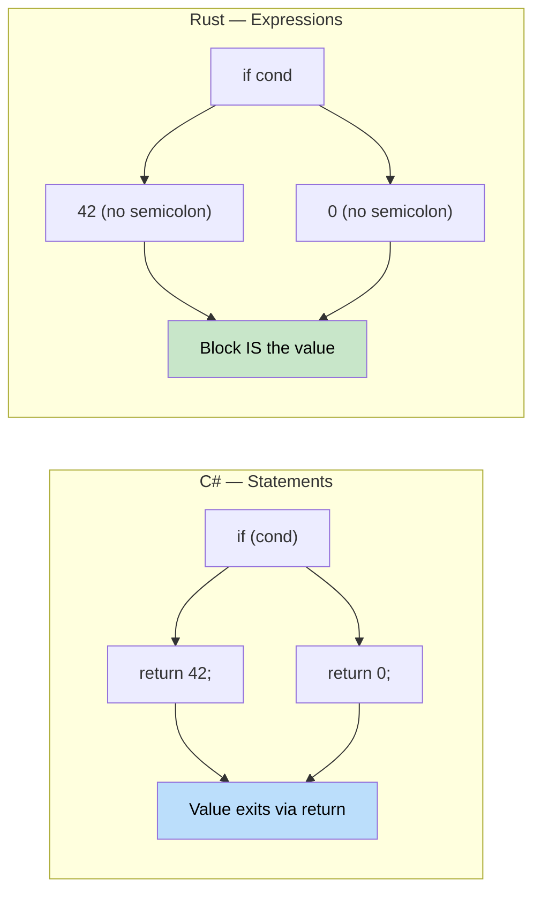

## Functions vs Methods

> **What you'll learn:** Functions and methods in Rust vs C#, the critical distinction between
> expressions and statements, `if`/`match`/`loop`/`while`/`for` syntax, and how Rust's
> expression-oriented design eliminates the need for ternary operators.
>
> **Difficulty:** 🟢 Beginner

### C# Function Declaration
```csharp
// C# - Methods in classes
public class Calculator
{
    // Instance method
    public int Add(int a, int b)
    {
        return a + b;
    }
    
    // Static method
    public static int Multiply(int a, int b)
    {
        return a * b;
    }
    
    // Method with ref parameter
    public void Increment(ref int value)
    {
        value++;
    }
}
```

### Rust Function Declaration
```rust
// Rust - Standalone functions
fn add(a: i32, b: i32) -> i32 {
    a + b  // No 'return' needed for final expression
}

fn multiply(a: i32, b: i32) -> i32 {
    return a * b;  // Explicit return is also fine
}

// Function with mutable reference
fn increment(value: &mut i32) {
    *value += 1;
}

fn main() {
    let result = add(5, 3);
    println!("5 + 3 = {}", result);
    
    let mut x = 10;
    increment(&mut x);
    println!("After increment: {}", x);
}
```

### Expression vs Statement (Important!)



```csharp
// C# - Statements vs expressions
public int GetValue()
{
    if (condition)
    {
        return 42;  // Statement
    }
    return 0;       // Statement
}
```

```rust
// Rust - Everything can be an expression
fn get_value(condition: bool) -> i32 {
    if condition {
        42  // Expression (no semicolon)
    } else {
        0   // Expression (no semicolon)
    }
    // The if-else block itself is an expression that returns a value
}

// Or even simpler
fn get_value_ternary(condition: bool) -> i32 {
    if condition { 42 } else { 0 }
}
```

### Function Parameters and Return Types
```rust
// No parameters, no return value (returns unit type ())
fn say_hello() {
    println!("Hello!");
}

// Multiple parameters
fn greet(name: &str, age: u32) {
    println!("{} is {} years old", name, age);
}

// Multiple return values using tuple
fn divide_and_remainder(dividend: i32, divisor: i32) -> (i32, i32) {
    (dividend / divisor, dividend % divisor)
}

fn main() {
    let (quotient, remainder) = divide_and_remainder(10, 3);
    println!("10 ÷ 3 = {} remainder {}", quotient, remainder);
}
```

***

## Control Flow Basics

### Conditional Statements
```csharp
// C# if statements
int x = 5;
if (x > 10)
{
    Console.WriteLine("Big number");
}
else if (x > 5)
{
    Console.WriteLine("Medium number");
}
else
{
    Console.WriteLine("Small number");
}

// C# ternary operator
string message = x > 10 ? "Big" : "Small";
```

```rust
// Rust if expressions
let x = 5;
if x > 10 {
    println!("Big number");
} else if x > 5 {
    println!("Medium number");
} else {
    println!("Small number");
}

// Rust if as expression (like ternary)
let message = if x > 10 { "Big" } else { "Small" };

// Multiple conditions
let message = if x > 10 {
    "Big"
} else if x > 5 {
    "Medium"
} else {
    "Small"
};
```

### Loops
```csharp
// C# loops
// For loop
for (int i = 0; i < 5; i++)
{
    Console.WriteLine(i);
}

// Foreach loop
var numbers = new[] { 1, 2, 3, 4, 5 };
foreach (var num in numbers)
{
    Console.WriteLine(num);
}

// While loop
int count = 0;
while (count < 3)
{
    Console.WriteLine(count);
    count++;
}
```

```rust
// Rust loops
// Range-based for loop
for i in 0..5 {  // 0 to 4 (exclusive end)
    println!("{}", i);
}

// Iterate over collection
let numbers = vec![1, 2, 3, 4, 5];
for num in numbers {  // Takes ownership
    println!("{}", num);
}

// Iterate over references (more common)
let numbers = vec![1, 2, 3, 4, 5];
for num in &numbers {  // Borrows elements
    println!("{}", num);
}

// While loop
let mut count = 0;
while count < 3 {
    println!("{}", count);
    count += 1;
}

// Infinite loop with break
let mut counter = 0;
loop {
    if counter >= 3 {
        break;
    }
    println!("{}", counter);
    counter += 1;
}
```

### Loop Control
```csharp
// C# loop control
for (int i = 0; i < 10; i++)
{
    if (i == 3) continue;
    if (i == 7) break;
    Console.WriteLine(i);
}
```

```rust
// Rust loop control
for i in 0..10 {
    if i == 3 { continue; }
    if i == 7 { break; }
    println!("{}", i);
}

// Loop labels (for nested loops)
'outer: for i in 0..3 {
    'inner: for j in 0..3 {
        if i == 1 && j == 1 {
            break 'outer;  // Break out of outer loop
        }
        println!("i: {}, j: {}", i, j);
    }
}
```

***


<details>
<summary><strong>🏋️ Exercise: Temperature Converter</strong> (click to expand)</summary>

**Challenge**: Convert this C# program to idiomatic Rust. Use expressions, pattern matching, and proper error handling.

```csharp
// C# — convert this to Rust
public static double Convert(double value, string from, string to)
{
    double celsius = from switch
    {
        "F" => (value - 32.0) * 5.0 / 9.0,
        "K" => value - 273.15,
        "C" => value,
        _ => throw new ArgumentException($"Unknown unit: {from}")
    };
    return to switch
    {
        "F" => celsius * 9.0 / 5.0 + 32.0,
        "K" => celsius + 273.15,
        "C" => celsius,
        _ => throw new ArgumentException($"Unknown unit: {to}")
    };
}
```

<details>
<summary>🔑 Solution</summary>

```rust
#[derive(Debug, Clone, Copy)]
enum TempUnit { Celsius, Fahrenheit, Kelvin }

fn parse_unit(s: &str) -> Result<TempUnit, String> {
    match s {
        "C" => Ok(TempUnit::Celsius),
        "F" => Ok(TempUnit::Fahrenheit),
        "K" => Ok(TempUnit::Kelvin),
        _   => Err(format!("Unknown unit: {s}")),
    }
}

fn convert(value: f64, from: TempUnit, to: TempUnit) -> f64 {
    let celsius = match from {
        TempUnit::Fahrenheit => (value - 32.0) * 5.0 / 9.0,
        TempUnit::Kelvin     => value - 273.15,
        TempUnit::Celsius    => value,
    };
    match to {
        TempUnit::Fahrenheit => celsius * 9.0 / 5.0 + 32.0,
        TempUnit::Kelvin     => celsius + 273.15,
        TempUnit::Celsius    => celsius,
    }
}

fn main() -> Result<(), String> {
    let from = parse_unit("F")?;
    let to   = parse_unit("C")?;
    println!("212°F = {:.1}°C", convert(212.0, from, to));
    Ok(())
}
```

**Key takeaways**:
- Enums replace magic strings — exhaustive matching catches missing units at compile time
- `Result<T, E>` replaces exceptions — the caller sees possible failures in the signature
- `match` is an expression that returns a value — no `return` statements needed

</details>
</details>


