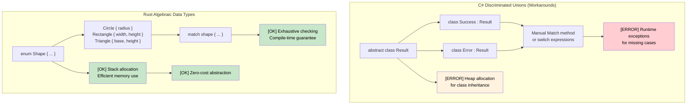

## Algebraic Data Types vs C# Unions

> **What you'll learn:** Rust's algebraic data types (enums with data) vs C#'s limited discriminated unions,
> `match` expressions with exhaustive checking, guard clauses, and nested pattern destructuring.
>
> **Difficulty:** 🟡 Intermediate

### C# Discriminated Unions (Limited)
```csharp
// C# - Limited union support with inheritance
public abstract class Result
{
    public abstract T Match<T>(Func<Success, T> onSuccess, Func<Error, T> onError);
}

public class Success : Result
{
    public string Value { get; }
    public Success(string value) => Value = value;
    
    public override T Match<T>(Func<Success, T> onSuccess, Func<Error, T> onError)
        => onSuccess(this);
}

public class Error : Result
{
    public string Message { get; }
    public Error(string message) => Message = message;
    
    public override T Match<T>(Func<Success, T> onSuccess, Func<Error, T> onError)
        => onError(this);
}

// C# 9+ Records with pattern matching (better)
public abstract record Shape;
public record Circle(double Radius) : Shape;
public record Rectangle(double Width, double Height) : Shape;

public static double Area(Shape shape) => shape switch
{
    Circle(var radius) => Math.PI * radius * radius,
    Rectangle(var width, var height) => width * height,
    _ => throw new ArgumentException("Unknown shape")  // [ERROR] Runtime error possible
};
```

### Rust Algebraic Data Types (Enums)
```rust
// Rust - True algebraic data types with exhaustive pattern matching
#[derive(Debug, Clone)]
pub enum Result<T, E> {
    Ok(T),
    Err(E),
}

#[derive(Debug, Clone)]
pub enum Shape {
    Circle { radius: f64 },
    Rectangle { width: f64, height: f64 },
    Triangle { base: f64, height: f64 },
}

impl Shape {
    pub fn area(&self) -> f64 {
        match self {
            Shape::Circle { radius } => std::f64::consts::PI * radius * radius,
            Shape::Rectangle { width, height } => width * height,
            Shape::Triangle { base, height } => 0.5 * base * height,
            // [OK] Compiler error if any variant is missing!
        }
    }
}

// Advanced: Enums can hold different types
#[derive(Debug)]
pub enum Value {
    Integer(i64),
    Float(f64),
    Text(String),
    Boolean(bool),
    List(Vec<Value>),  // Recursive types!
}

impl Value {
    pub fn type_name(&self) -> &'static str {
        match self {
            Value::Integer(_) => "integer",
            Value::Float(_) => "float",
            Value::Text(_) => "text",
            Value::Boolean(_) => "boolean",
            Value::List(_) => "list",
        }
    }
}
```



***

## Enums and Pattern Matching

Rust enums are much more powerful than C# enums - they can hold data and are the foundation of type-safe programming.

### C# Enum Limitations
```csharp
// C# enum - just named constants
public enum Status
{
    Pending,
    Approved,
    Rejected
}

// C# enum with backing values
public enum HttpStatusCode
{
    OK = 200,
    NotFound = 404,
    InternalServerError = 500
}

// Need separate classes for complex data
public abstract class Result
{
    public abstract bool IsSuccess { get; }
}

public class Success : Result
{
    public string Value { get; }
    public override bool IsSuccess => true;
    
    public Success(string value)
    {
        Value = value;
    }
}

public class Error : Result
{
    public string Message { get; }
    public override bool IsSuccess => false;
    
    public Error(string message)
    {
        Message = message;
    }
}
```

### Rust Enum Power
```rust
// Simple enum (like C# enum)
#[derive(Debug, PartialEq)]
enum Status {
    Pending,
    Approved,
    Rejected,
}

// Enum with data (this is where Rust shines!)
#[derive(Debug)]
enum Result<T, E> {
    Ok(T),      // Success variant holding value of type T
    Err(E),     // Error variant holding error of type E
}

// Complex enum with different data types
#[derive(Debug)]
enum Message {
    Quit,                       // No data
    Move { x: i32, y: i32 },   // Struct-like variant
    Write(String),             // Tuple-like variant
    ChangeColor(i32, i32, i32), // Multiple values
}

// Real-world example: HTTP Response
#[derive(Debug)]
enum HttpResponse {
    Ok { body: String, headers: Vec<String> },
    NotFound { path: String },
    InternalError { message: String, code: u16 },
    Redirect { location: String },
}
```

### Pattern Matching with Match
```csharp
// C# switch statement (limited)
public string HandleStatus(Status status)
{
    switch (status)
    {
        case Status.Pending:
            return "Waiting for approval";
        case Status.Approved:
            return "Request approved";
        case Status.Rejected:
            return "Request rejected";
        default:
            return "Unknown status"; // Always need default
    }
}

// C# pattern matching (C# 8+)
public string HandleResult(Result result)
{
    return result switch
    {
        Success success => $"Success: {success.Value}",
        Error error => $"Error: {error.Message}",
        _ => "Unknown result" // Still need catch-all
    };
}
```

```rust
// Rust match - exhaustive and powerful
fn handle_status(status: Status) -> String {
    match status {
        Status::Pending => "Waiting for approval".to_string(),
        Status::Approved => "Request approved".to_string(),
        Status::Rejected => "Request rejected".to_string(),
        // No default needed - compiler ensures exhaustiveness
    }
}

// Pattern matching with data extraction
fn handle_result<T, E>(result: Result<T, E>) -> String 
where 
    T: std::fmt::Debug,
    E: std::fmt::Debug,
{
    match result {
        Result::Ok(value) => format!("Success: {:?}", value),
        Result::Err(error) => format!("Error: {:?}", error),
        // Exhaustive - no default needed
    }
}

// Complex pattern matching
fn handle_message(msg: Message) -> String {
    match msg {
        Message::Quit => "Goodbye!".to_string(),
        Message::Move { x, y } => format!("Move to ({}, {})", x, y),
        Message::Write(text) => format!("Write: {}", text),
        Message::ChangeColor(r, g, b) => format!("Change color to RGB({}, {}, {})", r, g, b),
    }
}

// HTTP response handling
fn handle_http_response(response: HttpResponse) -> String {
    match response {
        HttpResponse::Ok { body, headers } => {
            format!("Success! Body: {}, Headers: {:?}", body, headers)
        },
        HttpResponse::NotFound { path } => {
            format!("404: Path '{}' not found", path)
        },
        HttpResponse::InternalError { message, code } => {
            format!("Error {}: {}", code, message)
        },
        HttpResponse::Redirect { location } => {
            format!("Redirect to: {}", location)
        },
    }
}
```

### Guards and Advanced Patterns
```rust
// Pattern matching with guards
fn describe_number(x: i32) -> String {
    match x {
        n if n < 0 => "negative".to_string(),
        0 => "zero".to_string(),
        n if n < 10 => "single digit".to_string(),
        n if n < 100 => "double digit".to_string(),
        _ => "large number".to_string(),
    }
}

// Matching ranges
fn describe_age(age: u32) -> String {
    match age {
        0..=12 => "child".to_string(),
        13..=19 => "teenager".to_string(),
        20..=64 => "adult".to_string(),
        65.. => "senior".to_string(),
    }
}

// Destructuring structs and tuples
```

<details>
<summary><strong>🏋️ Exercise: Command Parser</strong> (click to expand)</summary>

**Challenge**: Model a CLI command system using Rust enums. Parse string input into a `Command` enum and execute each variant. Handle unknown commands with proper error handling.

```rust
// Starter code — fill in the blanks
#[derive(Debug)]
enum Command {
    // TODO: Add variants for Quit, Echo(String), Move { x: i32, y: i32 }, Count(u32)
}

fn parse_command(input: &str) -> Result<Command, String> {
    let parts: Vec<&str> = input.splitn(2, ' ').collect();
    // TODO: match on parts[0] and parse arguments
    todo!()
}

fn execute(cmd: &Command) -> String {
    // TODO: match on each variant and return a description
    todo!()
}
```

<details>
<summary>🔑 Solution</summary>

```rust
#[derive(Debug)]
enum Command {
    Quit,
    Echo(String),
    Move { x: i32, y: i32 },
    Count(u32),
}

fn parse_command(input: &str) -> Result<Command, String> {
    let parts: Vec<&str> = input.splitn(2, ' ').collect();
    match parts[0] {
        "quit" => Ok(Command::Quit),
        "echo" => {
            let msg = parts.get(1).unwrap_or(&"").to_string();
            Ok(Command::Echo(msg))
        }
        "move" => {
            let args = parts.get(1).ok_or("move requires 'x y'")?;
            let coords: Vec<&str> = args.split_whitespace().collect();
            let x = coords.get(0).ok_or("missing x")?.parse::<i32>().map_err(|e| e.to_string())?;
            let y = coords.get(1).ok_or("missing y")?.parse::<i32>().map_err(|e| e.to_string())?;
            Ok(Command::Move { x, y })
        }
        "count" => {
            let n = parts.get(1).ok_or("count requires a number")?
                .parse::<u32>().map_err(|e| e.to_string())?;
            Ok(Command::Count(n))
        }
        other => Err(format!("Unknown command: {other}")),
    }
}

fn execute(cmd: &Command) -> String {
    match cmd {
        Command::Quit           => "Goodbye!".to_string(),
        Command::Echo(msg)      => msg.clone(),
        Command::Move { x, y }  => format!("Moving to ({x}, {y})"),
        Command::Count(n)       => format!("Counted to {n}"),
    }
}
```

**Key takeaways**:
- Each enum variant can hold different data — no need for class hierarchies
- `match` forces you to handle every variant, preventing forgotten cases
- `?` operator chains error propagation cleanly — no nested try-catch

</details>
</details>


