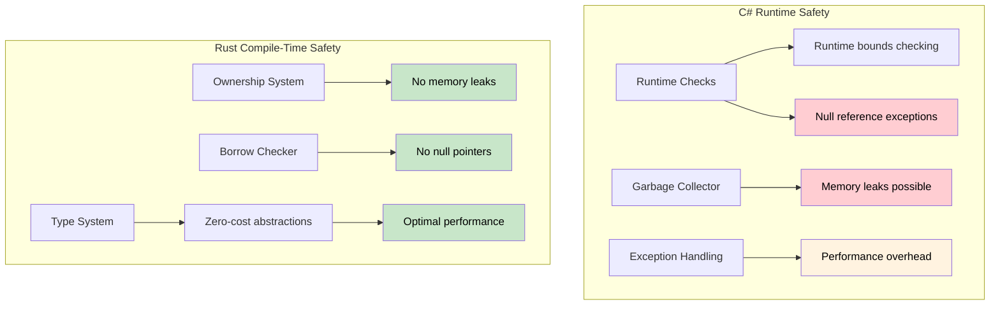

## References vs Pointers

> **What you'll learn:** Rust references vs C# pointers and unsafe contexts, lifetime basics,
> and why compile-time safety proofs are stronger than C#'s runtime checks (bounds checking, null guards).
>
> **Difficulty:** 🟡 Intermediate

### C# Pointers (Unsafe Context)
```csharp
// C# unsafe pointers (rarely used)
unsafe void UnsafeExample()
{
    int value = 42;
    int* ptr = &value;  // Pointer to value
    *ptr = 100;         // Dereference and modify
    Console.WriteLine(value);  // 100
}
```

### Rust References (Safe by Default)
```rust
// Rust references (always safe)
fn safe_example() {
    let mut value = 42;
    let ptr = &mut value;  // Mutable reference
    *ptr = 100;           // Dereference and modify
    println!("{}", value); // 100
}

// No "unsafe" keyword needed - borrow checker ensures safety
```

### Lifetime Basics for C# Developers
```csharp
// C# - Can return references that might become invalid
public class LifetimeIssues
{
    public string GetFirstWord(string input)
    {
        return input.Split(' ')[0];  // Returns new string (safe)
    }
    
    public unsafe char* GetFirstChar(string input)
    {
        // This would be dangerous - returning pointer to managed memory
        fixed (char* ptr = input)
            return ptr;  // ❌ Bad: ptr becomes invalid after method ends
    }
}
```

```rust
// Rust - Lifetime checking prevents dangling references
fn get_first_word(input: &str) -> &str {
    input.split_whitespace().next().unwrap_or("")
    // ✅ Safe: returned reference has same lifetime as input
}

fn invalid_reference() -> &str {
    let temp = String::from("hello");
    &temp  // ❌ Compile error: temp doesn't live long enough
    // temp would be dropped at end of function
}

fn valid_reference() -> String {
    let temp = String::from("hello");
    temp  // ✅ Works: ownership is transferred to caller
}
```

***

## Memory Safety: Runtime Checks vs Compile-Time Proofs

### C# - Runtime Safety Net
```csharp
// C# relies on runtime checks and GC
public class Buffer
{
    private byte[] data;
    
    public Buffer(int size)
    {
        data = new byte[size];
    }
    
    public void ProcessData(int index)
    {
        // Runtime bounds checking
        if (index >= data.Length)
            throw new IndexOutOfRangeException();
            
        data[index] = 42;  // Safe, but checked at runtime
    }
    
    // Memory leaks still possible with events/static references
    public static event Action<string> GlobalEvent;
    
    public void Subscribe()
    {
        GlobalEvent += HandleEvent;  // Can create memory leaks
        // Forgot to unsubscribe - object won't be collected
    }
    
    private void HandleEvent(string message) { /* ... */ }
    
    // Null reference exceptions are still possible
    public void ProcessUser(User user)
    {
        Console.WriteLine(user.Name.ToUpper());  // NullReferenceException if user.Name is null
    }
    
    // Array access can fail at runtime
    public int GetValue(int[] array, int index)
    {
        return array[index];  // IndexOutOfRangeException possible
    }
}
```

### Rust - Compile-Time Guarantees
```rust
struct Buffer {
    data: Vec<u8>,
}

impl Buffer {
    fn new(size: usize) -> Self {
        Buffer {
            data: vec![0; size],
        }
    }
    
    fn process_data(&mut self, index: usize) {
        // Bounds checking can be optimized away by compiler when proven safe
        if let Some(item) = self.data.get_mut(index) {
            *item = 42;  // Safe access, proven at compile time
        }
        // Or use indexing with explicit bounds check:
        // self.data[index] = 42;  // Panics in debug, but memory-safe
    }
    
    // Memory leaks impossible - ownership system prevents them
    fn process_with_closure<F>(&mut self, processor: F) 
    where F: FnOnce(&mut Vec<u8>)
    {
        processor(&mut self.data);
        // When processor goes out of scope, it's automatically cleaned up
        // No way to create dangling references or memory leaks
    }
    
    // Null pointer dereferences impossible - no null pointers!
    fn process_user(&self, user: &User) {
        println!("{}", user.name.to_uppercase());  // user.name cannot be null
    }
    
    // Array access is bounds-checked or explicitly unsafe
    fn get_value(array: &[i32], index: usize) -> Option<i32> {
        array.get(index).copied()  // Returns None if out of bounds
    }
    
    // Or explicitly unsafe if you know what you're doing:
    unsafe fn get_value_unchecked(array: &[i32], index: usize) -> i32 {
        *array.get_unchecked(index)  // Fast but must prove bounds manually
    }
}

struct User {
    name: String,  // String cannot be null in Rust
}

// Ownership prevents use-after-free
fn ownership_example() {
    let data = vec![1, 2, 3, 4, 5];
    let reference = &data[0];  // Borrow data
    
    // drop(data);  // ERROR: cannot drop while borrowed
    println!("{}", reference);  // This is guaranteed safe
}

// Borrowing prevents data races
fn borrowing_example(data: &mut Vec<i32>) {
    let first = &data[0];  // Immutable borrow
    // data.push(6);  // ERROR: cannot mutably borrow while immutably borrowed
    println!("{}", first);  // Guaranteed no data race
}
```



---

## Exercises

<details>
<summary><strong>🏋️ Exercise: Spot the Safety Bug</strong> (click to expand)</summary>

This C# code has a subtle safety bug. Identify it, then write the Rust equivalent and explain why the Rust version **won't compile**:

```csharp
public List<int> GetEvenNumbers(List<int> numbers)
{
    var result = new List<int>();
    foreach (var n in numbers)
    {
        if (n % 2 == 0)
        {
            result.Add(n);
            numbers.Remove(n);  // Bug: modifying collection while iterating
        }
    }
    return result;
}
```

<details>
<summary>🔑 Solution</summary>

**C# bug**: Modifying `numbers` while iterating throws `InvalidOperationException` at *runtime*. Easy to miss in code review.

```rust
fn get_even_numbers(numbers: &mut Vec<i32>) -> Vec<i32> {
    let mut result = Vec::new();
    for &n in numbers.iter() {
        if n % 2 == 0 {
            result.push(n);
            // numbers.retain(|&x| x != n);
            // ❌ ERROR: cannot borrow `*numbers` as mutable because
            //    it is also borrowed as immutable (by the iterator)
        }
    }
    result
}

// Idiomatic Rust: use partition or retain
fn get_even_numbers_idiomatic(numbers: &mut Vec<i32>) -> Vec<i32> {
    let evens: Vec<i32> = numbers.iter().copied().filter(|n| n % 2 == 0).collect();
    numbers.retain(|n| n % 2 != 0); // remove evens after iteration
    evens
}

fn main() {
    let mut nums = vec![1, 2, 3, 4, 5, 6];
    let evens = get_even_numbers_idiomatic(&mut nums);
    assert_eq!(evens, vec![2, 4, 6]);
    assert_eq!(nums, vec![1, 3, 5]);
}
```

**Key insight**: Rust's borrow checker prevents the entire *category* of "mutate while iterating" bugs at compile time. C# catches this at runtime; many languages don't catch it at all.

</details>
</details>

***


