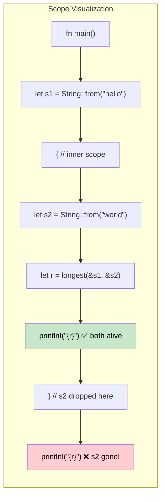

## Lifetimes: Telling the Compiler How Long References Live

> **What you'll learn:** Why lifetimes exist (no GC means the compiler needs proof), lifetime annotation syntax,
> elision rules, struct lifetimes, the `'static` lifetime, and common borrow checker errors with fixes.
>
> **Difficulty:** 🔴 Advanced

C# developers never think about reference lifetimes — the garbage collector handles reachability. In Rust, the compiler needs *proof* that every reference is valid for as long as it's used. Lifetimes are that proof.

### Why Lifetimes Exist
```rust
// This won't compile — the compiler can't prove the returned reference is valid
fn longest(a: &str, b: &str) -> &str {
    if a.len() > b.len() { a } else { b }
}
// ERROR: missing lifetime specifier — the compiler doesn't know
// whether the return value borrows from `a` or `b`
```

### Lifetime Annotations
```rust
// Lifetime 'a says: "the return value lives at least as long as BOTH inputs"
fn longest<'a>(a: &'a str, b: &'a str) -> &'a str {
    if a.len() > b.len() { a } else { b }
}

fn main() {
    let result;
    let string1 = String::from("long string");
    {
        let string2 = String::from("xyz");
        result = longest(&string1, &string2);
        println!("Longest: {result}"); // ✅ both references still valid here
    }
    // println!("{result}"); // ❌ ERROR: string2 doesn't live long enough
}
```

### C# Comparison
```csharp
// C# — the GC keeps objects alive as long as any reference exists
string Longest(string a, string b) => a.Length > b.Length ? a : b;

// No lifetime issues — GC tracks reachability automatically
// But: GC pauses, unpredictable memory usage, no compile-time proof
```

### Lifetime Elision Rules

Most of the time you **don't need to write lifetime annotations**. The compiler applies three rules automatically:

| Rule | Description | Example |
|------|-------------|---------|
| **Rule 1** | Each reference parameter gets its own lifetime | `fn foo(x: &str, y: &str)` → `fn foo<'a, 'b>(x: &'a str, y: &'b str)` |
| **Rule 2** | If there's exactly one input lifetime, it's assigned to all output lifetimes | `fn first(s: &str) -> &str` → `fn first<'a>(s: &'a str) -> &'a str` |
| **Rule 3** | If one input is `&self` or `&mut self`, that lifetime is assigned to all outputs | `fn name(&self) -> &str` → works because of &self |

```rust
// These are equivalent — the compiler adds lifetimes automatically:
fn first_word(s: &str) -> &str { /* ... */ }           // elided
fn first_word<'a>(s: &'a str) -> &'a str { /* ... */ } // explicit

// But this REQUIRES explicit annotation — two inputs, which one does output borrow?
fn longest<'a>(a: &'a str, b: &'a str) -> &'a str { /* ... */ }
```

### Struct Lifetimes
```rust
// A struct that borrows data (instead of owning it)
struct Excerpt<'a> {
    text: &'a str,  // borrows from some String that must outlive this struct
}

impl<'a> Excerpt<'a> {
    fn new(text: &'a str) -> Self {
        Excerpt { text }
    }

    fn first_sentence(&self) -> &str {
        self.text.split('.').next().unwrap_or(self.text)
    }
}

fn main() {
    let novel = String::from("Call me Ishmael. Some years ago...");
    let excerpt = Excerpt::new(&novel); // excerpt borrows from novel
    println!("First sentence: {}", excerpt.first_sentence());
    // novel must stay alive as long as excerpt exists
}
```

```csharp
// C# equivalent — no lifetime concerns, but no compile-time guarantee either
class Excerpt
{
    public string Text { get; }
    public Excerpt(string text) => Text = text;
    public string FirstSentence() => Text.Split('.')[0];
}
// What if the string is mutated elsewhere? Runtime surprise.
```

### The `'static` Lifetime
```rust
// 'static means "lives for the entire program duration"
let s: &'static str = "I'm a string literal"; // stored in binary, always valid

// Common places you see 'static:
// 1. String literals
// 2. Global constants
// 3. Thread::spawn requires 'static (thread might outlive the caller)
std::thread::spawn(move || {
    // Closures sent to threads must own their data or use 'static references
    println!("{s}"); // OK: &'static str
});

// 'static does NOT mean "immortal" — it means "CAN live forever if needed"
let owned = String::from("hello");
// owned is NOT 'static, but it can be moved into a thread (ownership transfer)
```

### Common Borrow Checker Errors and Fixes

| Error | Cause | Fix |
|-------|-------|-----|
| `missing lifetime specifier` | Multiple input references, ambiguous output | Add `<'a>` annotation tying output to correct input |
| `does not live long enough` | Reference outlives the data it points to | Extend the data's scope, or return owned data instead |
| `cannot borrow as mutable` | Immutable borrow still active | Use the immutable reference before mutating, or restructure |
| `cannot move out of borrowed content` | Trying to take ownership of borrowed data | Use `.clone()`, or restructure to avoid the move |
| `lifetime may not live long enough` | Struct borrow outlives source | Ensure the source data's scope encompasses the struct's usage |

### Visualizing Lifetime Scopes



### Multiple Lifetime Parameters

Sometimes references come from different sources with different lifetimes:

```rust
// Two independent lifetimes: the return borrows only from 'a, not 'b
fn first_with_context<'a, 'b>(data: &'a str, _context: &'b str) -> &'a str {
    // Return borrows from 'data' only — 'context' can have a shorter lifetime
    data.split(',').next().unwrap_or(data)
}

fn main() {
    let data = String::from("alice,bob,charlie");
    let result;
    {
        let context = String::from("user lookup"); // shorter lifetime
        result = first_with_context(&data, &context);
    } // context dropped — but result borrows from data, not context ✅
    println!("{result}");
}
```

```csharp
// C# — no lifetime tracking means you can't express "borrows from A but not B"
string FirstWithContext(string data, string context) => data.Split(',')[0];
// Fine for GC'd languages, but Rust can prove safety without a GC
```

### Real-World Lifetime Patterns

**Pattern 1: Iterator returning references**
```rust
// A parser that yields borrowed slices from the input
struct CsvRow<'a> {
    fields: Vec<&'a str>,
}

fn parse_csv_line(line: &str) -> CsvRow<'_> {
    // '_ tells the compiler "infer the lifetime from the input"
    CsvRow {
        fields: line.split(',').collect(),
    }
}
```

**Pattern 2: "Return owned when in doubt"**
```rust
// When lifetimes get complex, returning owned data is the pragmatic fix
fn format_greeting(first: &str, last: &str) -> String {
    // Returns owned String — no lifetime annotation needed
    format!("Hello, {first} {last}!")
}

// Only borrow when:
// 1. Performance matters (avoiding allocation)
// 2. The relationship between input and output lifetime is clear
```

**Pattern 3: Lifetime bounds on generics**
```rust
// "T must live at least as long as 'a"
fn store_reference<'a, T: 'a>(cache: &mut Vec<&'a T>, item: &'a T) {
    cache.push(item);
}

// Common in trait objects: Box<dyn Display + 'a>
fn make_printer<'a>(text: &'a str) -> Box<dyn std::fmt::Display + 'a> {
    Box::new(text)
}
```

### When to Reach for `'static`

| Scenario | Use `'static`? | Alternative |
|----------|:-----------:|-------------|
| String literals | ✅ Yes — they're always `'static` | — |
| `thread::spawn` closure | Often — thread outlives caller | Use `thread::scope` for borrowed data |
| Global config | ✅ `lazy_static!` or `OnceLock` | Pass references through params |
| Trait objects stored long-term | Often — `Box<dyn Trait + 'static>` | Parameterize the container with `'a` |
| Temporary borrowing | ❌ Never — over-constraining | Use the actual lifetime |

<details>
<summary><strong>🏋️ Exercise: Lifetime Annotations</strong> (click to expand)</summary>

**Challenge**: Add the correct lifetime annotations to make this compile:

```rust
struct Config {
    db_url: String,
    api_key: String,
}

// TODO: Add lifetime annotations
fn get_connection_info(config: &Config) -> (&str, &str) {
    (&config.db_url, &config.api_key)
}

// TODO: This struct borrows from Config — add lifetime parameter
struct ConnectionInfo {
    db_url: &str,
    api_key: &str,
}
```

<details>
<summary>🔑 Solution</summary>

```rust
struct Config {
    db_url: String,
    api_key: String,
}

// Rule 3 doesn't apply (no &self), Rule 2 applies (one input → output)
// So the compiler handles this automatically — no annotation needed!
fn get_connection_info(config: &Config) -> (&str, &str) {
    (&config.db_url, &config.api_key)
}

// Struct lifetime annotation needed:
struct ConnectionInfo<'a> {
    db_url: &'a str,
    api_key: &'a str,
}

fn make_info<'a>(config: &'a Config) -> ConnectionInfo<'a> {
    ConnectionInfo {
        db_url: &config.db_url,
        api_key: &config.api_key,
    }
}
```

**Key takeaway**: Lifetime elision often saves you from writing annotations on functions, but structs that borrow data always need explicit `<'a>`.

</details>
</details>

***


