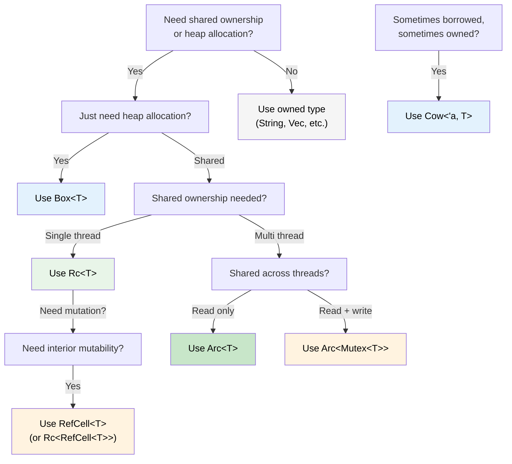

## Smart Pointers: When Single Ownership Isn't Enough

> **What you'll learn:** `Box<T>`, `Rc<T>`, `Arc<T>`, `Cell<T>`, `RefCell<T>`, and `Cow<'a, T>` —
> when to use each, how they compare to C#'s GC-managed references, `Drop` as Rust's `IDisposable`,
> `Deref` coercion, and a decision tree for choosing the right smart pointer.
>
> **Difficulty:** 🔴 Advanced

In C#, every object is essentially reference-counted by the GC. In Rust, single ownership is the default — but sometimes you need shared ownership, heap allocation, or interior mutability. That's where smart pointers come in.

### Box&lt;T&gt; — Simple Heap Allocation
```rust
// Stack allocation (default in Rust)
let x = 42;           // on the stack

// Heap allocation with Box
let y = Box::new(42); // on the heap, like C# `new int(42)` (boxed)
println!("{}", y);     // auto-derefs: prints 42

// Common use: recursive types (can't know size at compile time)
#[derive(Debug)]
enum List {
    Cons(i32, Box<List>),  // Box gives a known pointer size
    Nil,
}

let list = List::Cons(1, Box::new(List::Cons(2, Box::new(List::Nil))));
```

```csharp
// C# — everything on the heap already (reference types)
// Box<T> is only needed in Rust because stack is the default
var list = new LinkedListNode<int>(1);  // always heap-allocated
```

### Rc&lt;T&gt; — Shared Ownership (Single Thread)
```rust
use std::rc::Rc;

// Multiple owners of the same data — like multiple C# references
let shared = Rc::new(vec![1, 2, 3]);
let clone1 = Rc::clone(&shared); // reference count: 2
let clone2 = Rc::clone(&shared); // reference count: 3

println!("Count: {}", Rc::strong_count(&shared)); // 3
// Data is dropped when last Rc goes out of scope

// Common use: shared configuration, graph nodes, tree structures
```

### Arc&lt;T&gt; — Shared Ownership (Thread-Safe)
```rust
use std::sync::Arc;
use std::thread;

// Arc = Atomic Reference Counting — safe to share across threads
let data = Arc::new(vec![1, 2, 3]);

let handles: Vec<_> = (0..3).map(|i| {
    let data = Arc::clone(&data);
    thread::spawn(move || {
        println!("Thread {i}: {:?}", data);
    })
}).collect();

for h in handles { h.join().unwrap(); }
```

```csharp
// C# — all references are thread-safe by default (GC handles it)
var data = new List<int> { 1, 2, 3 };
// Can share freely across threads (but mutation is still unsafe!)
```

### Cell&lt;T&gt; and RefCell&lt;T&gt; — Interior Mutability
```rust
use std::cell::RefCell;

// Sometimes you need to mutate data behind a shared reference.
// RefCell moves borrow checking from compile time to runtime.
struct Logger {
    entries: RefCell<Vec<String>>,
}

impl Logger {
    fn new() -> Self {
        Logger { entries: RefCell::new(Vec::new()) }
    }

    fn log(&self, msg: &str) { // &self, not &mut self!
        self.entries.borrow_mut().push(msg.to_string());
    }

    fn dump(&self) {
        for entry in self.entries.borrow().iter() {
            println!("{entry}");
        }
    }
}
// ⚠️ RefCell panics at runtime if borrow rules are violated
// Use sparingly — prefer compile-time checking when possible
```

### Cow&lt;'a, str&gt; — Clone on Write
```rust
use std::borrow::Cow;

// Sometimes you have a &str that MIGHT need to become a String
fn normalize(input: &str) -> Cow<'_, str> {
    if input.contains('\t') {
        // Only allocate when we need to modify
        Cow::Owned(input.replace('\t', "    "))
    } else {
        // Borrow the original — zero allocation
        Cow::Borrowed(input)
    }
}

let clean = normalize("hello");           // Cow::Borrowed — no allocation
let dirty = normalize("hello\tworld");    // Cow::Owned — allocated
// Both can be used as &str via Deref
println!("{clean} / {dirty}");
```

### Drop: Rust's `IDisposable`

In C#, `IDisposable` + `using` handles resource cleanup. Rust's equivalent is the `Drop` trait — but it's **automatic**, not opt-in:

```csharp
// C# — must remember to use 'using' or call Dispose()
using var file = File.OpenRead("data.bin");
// Dispose() called at end of scope

// Forgetting 'using' is a resource leak!
var file2 = File.OpenRead("data.bin");
// GC will *eventually* finalize, but timing is unpredictable
```

```rust
// Rust — Drop runs automatically when value goes out of scope
{
    let file = File::open("data.bin")?;
    // use file...
}   // file.drop() called HERE, deterministically — no 'using' needed

// Custom Drop (like implementing IDisposable)
struct TempFile {
    path: std::path::PathBuf,
}

impl Drop for TempFile {
    fn drop(&mut self) {
        // Guaranteed to run when TempFile goes out of scope
        let _ = std::fs::remove_file(&self.path);
        println!("Cleaned up {:?}", self.path);
    }
}

fn main() {
    let tmp = TempFile { path: "scratch.tmp".into() };
    // ... use tmp ...
}   // scratch.tmp deleted automatically here
```

**Key difference from C#:** In Rust, *every* type can have deterministic cleanup. You never forget `using` because there's nothing to forget — `Drop` runs when the owner goes out of scope. This pattern is called **RAII** (Resource Acquisition Is Initialization).

> **Rule**: If your type holds a resource (file handle, network connection, lock guard, temp file), implement `Drop`. The ownership system guarantees it runs exactly once.

### Deref Coercion: Automatic Smart Pointer Unwrapping

Rust automatically "unwraps" smart pointers when you call methods or pass them to functions. This is called **Deref coercion**:

```rust
let boxed: Box<String> = Box::new(String::from("hello"));

// Deref coercion chain: Box<String> → String → str
println!("Length: {}", boxed.len());   // calls str::len() — auto-deref!

fn greet(name: &str) {
    println!("Hello, {name}");
}

let s = String::from("Alice");
greet(&s);       // &String → &str via Deref coercion
greet(&boxed);   // &Box<String> → &String → &str — two levels!
```

```csharp
// C# has no equivalent — you'd need explicit casts or .ToString()
// Closest: implicit conversion operators, but those require explicit definition
```

**Why this matters:** You can pass `&String` where `&str` is expected, `&Vec<T>` where `&[T]` is expected, and `&Box<T>` where `&T` is expected — all without explicit conversion. This is why Rust APIs typically accept `&str` and `&[T]` rather than `&String` and `&Vec<T>`.

### Rc vs Arc: When to Use Which

| | `Rc<T>` | `Arc<T>` |
|---|---|---|
| **Thread safety** | ❌ Single-thread only | ✅ Thread-safe (atomic ops) |
| **Overhead** | Lower (non-atomic refcount) | Higher (atomic refcount) |
| **Compiler enforced** | Won't compile across `thread::spawn` | Works everywhere |
| **Combine with** | `RefCell<T>` for mutation | `Mutex<T>` or `RwLock<T>` for mutation |

**Rule of thumb:** Start with `Rc`. The compiler will tell you if you need `Arc`.

### Decision Tree: Which Smart Pointer?



<details>
<summary><strong>🏋️ Exercise: Choose the Right Smart Pointer</strong> (click to expand)</summary>

**Challenge**: For each scenario, choose the correct smart pointer and explain why.

1. A recursive tree data structure
2. A shared configuration object read by multiple components (single thread)
3. A request counter shared across HTTP handler threads
4. A cache that might return borrowed or owned strings
5. A logging buffer that needs mutation through a shared reference

<details>
<summary>🔑 Solution</summary>

1. **`Box<T>`** — recursive types need indirection for known size at compile time
2. **`Rc<T>`** — shared read-only access, single thread, no `Arc` overhead needed
3. **`Arc<Mutex<u64>>`** — shared across threads (`Arc`) with mutation (`Mutex`)
4. **`Cow<'a, str>`** — sometimes returns `&str` (cache hit), sometimes `String` (cache miss)
5. **`RefCell<Vec<String>>`** — interior mutability behind `&self` (single thread)

**Rule of thumb**: Start with owned types. Reach for `Box` when you need indirection, `Rc`/`Arc` when you need sharing, `RefCell`/`Mutex` when you need interior mutability, `Cow` when you want zero-copy for the common case.

</details>
</details>

***


