```mermaid
graph TD
    subgraph "C# Memory Management"
        CS_ALLOC["Object Allocation<br/>new Person()"]
        CS_HEAP["Managed Heap"]
        CS_REF["References point to heap"]
        CS_GC_CHECK["GC periodically checks<br/>for unreachable objects"]
        CS_SWEEP["Mark and sweep<br/>collection"]
        CS_PAUSE["[ERROR] GC pause times"]
        
        CS_ALLOC --> CS_HEAP
        CS_HEAP --> CS_REF
        CS_REF --> CS_GC_CHECK
        CS_GC_CHECK --> CS_SWEEP
        CS_SWEEP --> CS_PAUSE
        
        CS_ISSUES["[ERROR] Non-deterministic cleanup<br/>[ERROR] Memory pressure<br/>[ERROR] Finalization complexity<br/>[OK] Easy to use"]
    end
    
    subgraph "Rust Ownership System"
        RUST_ALLOC["Value Creation<br/>Person { ... }"]
        RUST_OWNER["Single owner<br/>on stack or heap"]
        RUST_BORROW["Borrowing system<br/>&T, &mut T"]
        RUST_SCOPE["Scope-based cleanup<br/>Drop trait"]
        RUST_COMPILE["Compile-time verification"]
        
        RUST_ALLOC --> RUST_OWNER
        RUST_OWNER --> RUST_BORROW
        RUST_BORROW --> RUST_SCOPE
        RUST_SCOPE --> RUST_COMPILE
        
        RUST_BENEFITS["[OK] Deterministic cleanup<br/>[OK] Zero runtime cost<br/>[OK] No memory leaks<br/>[ERROR] Learning curve"]
    end
    
    style CS_ISSUES fill:#ffebee,color:#000
    style RUST_BENEFITS fill:#e8f5e8,color:#000
    style CS_PAUSE fill:#ffcdd2,color:#000
    style RUST_COMPILE fill:#c8e6c9,color:#000
```

## Understanding Ownership

> **What you'll learn:** Rust's ownership system — why `let s2 = s1` invalidates `s1` (unlike C# reference copying),
> the three ownership rules, `Copy` vs `Move` types, borrowing with `&` and `&mut`,
> and how the borrow checker replaces garbage collection.
>
> **Difficulty:** 🟡 Intermediate

Ownership is Rust's most unique feature and the biggest conceptual shift for C# developers. Let's approach it step by step.

### C# Memory Model (Review)
```csharp
// C# - Automatic memory management
public void ProcessData()
{
    var data = new List<int> { 1, 2, 3, 4, 5 };
    ProcessList(data);
    // data is still accessible here
    Console.WriteLine(data.Count);  // Works fine
    
    // GC will clean up when no references remain
}

public void ProcessList(List<int> list)
{
    list.Add(6);  // Modifies the original list
}
```

### Rust Ownership Rules
1. **Each value has exactly one owner** (unless you opt into shared ownership with `Rc<T>`/`Arc<T>` — see [Smart Pointers](ch07-3-smart-pointers-beyond-single-ownership.md))
2. **When the owner goes out of scope, the value is dropped** (deterministic cleanup — see [Drop](ch07-3-smart-pointers-beyond-single-ownership.md#drop-rusts-idisposable))
3. **Ownership can be transferred (moved)**

```rust
// Rust - Explicit ownership management
fn process_data() {
    let data = vec![1, 2, 3, 4, 5];  // data owns the vector
    process_list(data);              // Ownership moved to function
    // println!("{:?}", data);       // ❌ Error: data no longer owned here
}

fn process_list(mut list: Vec<i32>) {  // list now owns the vector
    list.push(6);
    // list is dropped here when function ends
}
```

### Understanding "Move" for C# Developers
```csharp
// C# - References are copied, objects stay in place
// (Only reference types — classes — work this way;
//  C# value types like struct behave differently)
var original = new List<int> { 1, 2, 3 };
var reference = original;  // Both variables point to same object
original.Add(4);
Console.WriteLine(reference.Count);  // 4 - same object
```

```rust
// Rust - Ownership is transferred
let original = vec![1, 2, 3];
let moved = original;       // Ownership transferred
// println!("{:?}", original);  // ❌ Error: original no longer owns the data
println!("{:?}", moved);    // ✅ Works: moved now owns the data
```

### Copy Types vs Move Types
```rust
// Copy types (like C# value types) - copied, not moved
let x = 5;        // i32 implements Copy
let y = x;        // x is copied to y
println!("{}", x); // ✅ Works: x is still valid

// Move types (like C# reference types) - moved, not copied  
let s1 = String::from("hello");  // String doesn't implement Copy
let s2 = s1;                     // s1 is moved to s2
// println!("{}", s1);           // ❌ Error: s1 is no longer valid
```

### Practical Example: Swapping Values
```csharp
// C# - Simple reference swapping
public void SwapLists(ref List<int> a, ref List<int> b)
{
    var temp = a;
    a = b;
    b = temp;
}
```

```rust
// Rust - Ownership-aware swapping
fn swap_vectors(a: &mut Vec<i32>, b: &mut Vec<i32>) {
    std::mem::swap(a, b);  // Built-in swap function
}

// Or manual approach
fn manual_swap() {
    let mut a = vec![1, 2, 3];
    let mut b = vec![4, 5, 6];
    
    let temp = a;  // Move a to temp
    a = b;         // Move b to a
    b = temp;      // Move temp to b
    
    println!("a: {:?}, b: {:?}", a, b);
}
```

***

## Borrowing Basics

Borrowing is like getting a reference in C#, but with compile-time safety guarantees.

### C# Reference Parameters
```csharp
// C# - ref and out parameters
public void ModifyValue(ref int value)
{
    value += 10;
}

public void ReadValue(in int value)  // readonly reference
{
    Console.WriteLine(value);
}

public bool TryParse(string input, out int result)
{
    return int.TryParse(input, out result);
}
```

### Rust Borrowing
```rust
// Rust - borrowing with & and &mut
fn modify_value(value: &mut i32) {  // Mutable borrow
    *value += 10;
}

fn read_value(value: &i32) {        // Immutable borrow
    println!("{}", value);
}

fn main() {
    let mut x = 5;
    
    read_value(&x);      // Borrow immutably
    modify_value(&mut x); // Borrow mutably
    
    println!("{}", x);   // x is still owned here
}
```

### Borrowing Rules (Enforced at Compile Time!)
```rust
fn borrowing_rules() {
    let mut data = vec![1, 2, 3];
    
    // Rule 1: Multiple immutable borrows are OK
    let r1 = &data;
    let r2 = &data;
    println!("{:?} {:?}", r1, r2);  // ✅ Works
    
    // Rule 2: Only one mutable borrow at a time
    let r3 = &mut data;
    // let r4 = &mut data;  // ❌ Error: cannot borrow mutably twice
    // let r5 = &data;      // ❌ Error: cannot borrow immutably while borrowed mutably
    
    r3.push(4);  // Use the mutable borrow
    // r3 goes out of scope here
    
    // Rule 3: Can borrow again after previous borrows end
    let r6 = &data;  // ✅ Works now
    println!("{:?}", r6);
}
```

### C# vs Rust: Reference Safety
```csharp
// C# - Potential runtime errors
public class ReferenceSafety
{
    private List<int> data = new List<int>();
    
    public List<int> GetData() => data;  // Returns reference to internal data
    
    public void UnsafeExample()
    {
        var reference = GetData();
        
        // Another thread could modify data here!
        Thread.Sleep(1000);
        
        // reference might be invalid or changed
        reference.Add(42);  // Potential race condition
    }
}
```

```rust
// Rust - Compile-time safety
pub struct SafeContainer {
    data: Vec<i32>,
}

impl SafeContainer {
    // Return immutable borrow - caller can't modify
    // Prefer &[i32] over &Vec<i32> — accept the broadest type
    pub fn get_data(&self) -> &[i32] {
        &self.data
    }
    
    // Return mutable borrow - exclusive access guaranteed
    pub fn get_data_mut(&mut self) -> &mut Vec<i32> {
        &mut self.data
    }
}

fn safe_example() {
    let mut container = SafeContainer { data: vec![1, 2, 3] };
    
    let reference = container.get_data();
    // container.get_data_mut();  // ❌ Error: can't borrow mutably while immutably borrowed
    
    println!("{:?}", reference);  // Use immutable reference
    // reference goes out of scope here
    
    let mut_reference = container.get_data_mut();  // ✅ Now OK
    mut_reference.push(4);
}
```

***

## Move Semantics

### C# Value Types vs Reference Types
```csharp
// C# - Value types are copied
struct Point
{
    public int X { get; set; }
    public int Y { get; set; }
}

var p1 = new Point { X = 1, Y = 2 };
var p2 = p1;  // Copy
p2.X = 10;
Console.WriteLine(p1.X);  // Still 1

// C# - Reference types share the object
var list1 = new List<int> { 1, 2, 3 };
var list2 = list1;  // Reference copy
list2.Add(4);
Console.WriteLine(list1.Count);  // 4 - same object
```

### Rust Move Semantics
```rust
// Rust - Move by default for non-Copy types
#[derive(Debug)]
struct Point {
    x: i32,
    y: i32,
}

fn move_example() {
    let p1 = Point { x: 1, y: 2 };
    let p2 = p1;  // Move (not copy)
    // println!("{:?}", p1);  // ❌ Error: p1 was moved
    println!("{:?}", p2);    // ✅ Works
}

// To enable copying, implement Copy trait
#[derive(Debug, Copy, Clone)]
struct CopyablePoint {
    x: i32,
    y: i32,
}

fn copy_example() {
    let p1 = CopyablePoint { x: 1, y: 2 };
    let p2 = p1;  // Copy (because it implements Copy)
    println!("{:?}", p1);  // ✅ Works
    println!("{:?}", p2);  // ✅ Works
}
```

### When Values Are Moved
```rust
fn demonstrate_moves() {
    let s = String::from("hello");
    
    // 1. Assignment moves
    let s2 = s;  // s moved to s2
    
    // 2. Function calls move
    take_ownership(s2);  // s2 moved into function
    
    // 3. Returning from functions moves
    let s3 = give_ownership();  // Return value moved to s3
    
    println!("{}", s3);  // s3 is valid
}

fn take_ownership(s: String) {
    println!("{}", s);
    // s is dropped here
}

fn give_ownership() -> String {
    String::from("yours")  // Ownership moved to caller
}
```

### Avoiding Moves with Borrowing
```rust
fn demonstrate_borrowing() {
    let s = String::from("hello");
    
    // Borrow instead of move
    let len = calculate_length(&s);  // s is borrowed
    println!("'{}' has length {}", s, len);  // s is still valid
}

fn calculate_length(s: &String) -> usize {
    s.len()  // s is not owned, so it's not dropped
}
```

***

## Memory Management: GC vs RAII

### C# Garbage Collection
```csharp
// C# - Automatic memory management
public class Person
{
    public string Name { get; set; }
    public List<string> Hobbies { get; set; } = new List<string>();
    
    public void AddHobby(string hobby)
    {
        Hobbies.Add(hobby);  // Memory allocated automatically
    }
    
    // No explicit cleanup needed - GC handles it
    // But IDisposable pattern for resources
}

using var file = new FileStream("data.txt", FileMode.Open);
// 'using' ensures Dispose() is called
```

### Rust Ownership and RAII
```rust
// Rust - Compile-time memory management
pub struct Person {
    name: String,
    hobbies: Vec<String>,
}

impl Person {
    pub fn add_hobby(&mut self, hobby: String) {
        self.hobbies.push(hobby);  // Memory management tracked at compile time
    }
    
        // Drop trait automatically implemented - cleanup is guaranteed
    // Compare to C#'s IDisposable:
    //   C#:   using var file = new FileStream(...)    // Dispose() called at end of using block
    //   Rust: let file = File::open(...)?             // drop() called at end of scope — no 'using' needed
}

// RAII - Resource Acquisition Is Initialization
{
    let file = std::fs::File::open("data.txt")?;
    // File automatically closed when 'file' goes out of scope
    // No 'using' statement needed - handled by type system
}
```



***


<details>
<summary><strong>🏋️ Exercise: Fix the Borrow Checker Errors</strong> (click to expand)</summary>

**Challenge**: Each snippet below has a borrow checker error. Fix them without changing the output.

```rust
// 1. Move after use
fn problem_1() {
    let name = String::from("Alice");
    let greeting = format!("Hello, {name}!");
    let upper = name.to_uppercase();  // hint: borrow instead of move
    println!("{greeting} — {upper}");
}

// 2. Mutable + immutable borrow overlap
fn problem_2() {
    let mut numbers = vec![1, 2, 3];
    let first = &numbers[0];
    numbers.push(4);            // hint: reorder operations
    println!("first = {first}");
}

// 3. Returning a reference to a local
fn problem_3() -> String {
    let s = String::from("hello");
    s   // hint: return owned value, not &str
}
```

<details>
<summary>🔑 Solution</summary>

```rust
// 1. format! already borrows — the fix is that format! takes a reference.
//    The original code actually compiles! But if we had `let greeting = name;`
//    then fix by using &name:
fn solution_1() {
    let name = String::from("Alice");
    let greeting = format!("Hello, {}!", &name); // borrow
    let upper = name.to_uppercase();             // name still valid
    println!("{greeting} — {upper}");
}

// 2. Use the immutable borrow before the mutable operation:
fn solution_2() {
    let mut numbers = vec![1, 2, 3];
    let first = numbers[0]; // copy the i32 value (i32 is Copy)
    numbers.push(4);
    println!("first = {first}");
}

// 3. Return the owned String (already correct — common beginner confusion):
fn solution_3() -> String {
    let s = String::from("hello");
    s // ownership transferred to caller — this is the correct pattern
}
```

**Key takeaways**:
- `format!()` borrows its arguments — it doesn't move them
- Primitive types like `i32` implement `Copy`, so indexing copies the value
- Returning an owned value transfers ownership to the caller — no lifetime issues

</details>
</details>


