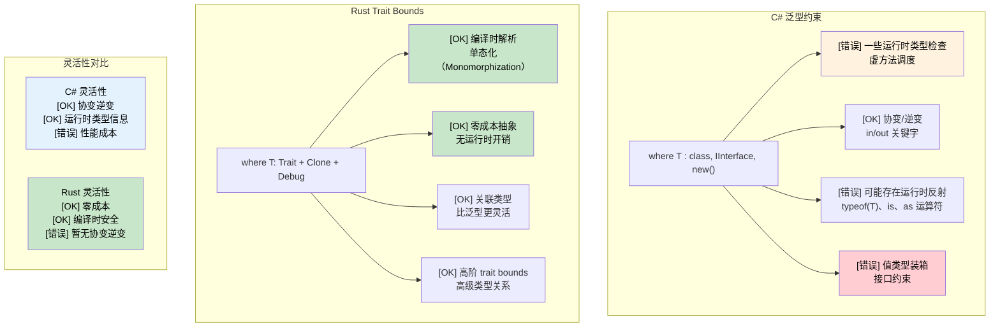

## 泛型约束：where vs trait bounds

> **你将学到：** Rust 的 trait bounds 与 C# 的 `where` 约束、`where` 子句语法、条件 trait 实现、关联类型以及高阶 trait bounds（HRTBs）。
>
> **难度：** 🔴 进阶

### C# 泛型约束
```csharp
// C# Generic constraints with where clause
public class Repository<T> where T : class, IEntity, new()
{
    public T Create()
    {
        return new T();  // new() constraint allows parameterless constructor
    }

    public void Save(T entity)
    {
        if (entity.Id == 0)  // IEntity constraint provides Id property
        {
            entity.Id = GenerateId();
        }
        // Save to database
    }
}

// Multiple type parameters with constraints
public class Converter<TInput, TOutput>
    where TInput : IConvertible
    where TOutput : class, new()
{
    public TOutput Convert(TInput input)
    {
        var output = new TOutput();
        // Conversion logic using IConvertible
        return output;
    }
}

// Variance in generics
public interface IRepository<out T> where T : IEntity
{
    IEnumerable<T> GetAll();  // Covariant - can return more derived types
}

public interface IWriter<in T> where T : IEntity
{
    void Write(T entity);  // Contravariant - can accept more base types
}
```

### Rust 泛型约束与 Trait Bounds
```rust
use std::fmt::{Debug, Display};
use std::clone::Clone;

// Basic trait bounds
pub struct Repository<T>
where
    T: Clone + Debug + Default,
{
    items: Vec<T>,
}

impl<T> Repository<T>
where
    T: Clone + Debug + Default,
{
    pub fn new() -> Self {
        Repository { items: Vec::new() }
    }

    pub fn create(&self) -> T {
        T::default()  // Default trait provides default value
    }

    pub fn add(&mut self, item: T) {
        println!("Adding item: {:?}", item);  // Debug trait for printing
        self.items.push(item);
    }

    pub fn get_all(&self) -> Vec<T> {
        self.items.clone()  // Clone trait for duplication
    }
}

// Multiple trait bounds with different syntaxes
pub fn process_data<T, U>(input: T) -> U
where
    T: Display + Clone,
    U: From<T> + Debug,
{
    println!("Processing: {}", input);  // Display trait
    let cloned = input.clone();         // Clone trait
    let output = U::from(cloned);       // From trait for conversion
    println!("Result: {:?}", output);   // Debug trait
    output
}

// Associated types (similar to C# generic constraints)
pub trait Iterator {
    type Item;  // Associated type instead of generic parameter

    fn next(&mut self) -> Option<Self::Item>;
}

pub trait Collect<T> {
    fn collect<I: Iterator<Item = T>>(iter: I) -> Self;
}

// Higher-ranked trait bounds (advanced)
fn apply_to_all<F>(items: &[String], f: F) -> Vec<String>
where
    F: for<'a> Fn(&'a str) -> String,  // Function works with any lifetime
{
    items.iter().map(|s| f(s)).collect()
}

// Conditional trait implementations
impl<T> PartialEq for Repository<T>
where
    T: PartialEq + Clone + Debug + Default,
{
    fn eq(&self, other: &Self) -> bool {
        self.items == other.items
    }
}
```



---

## 练习

<details>
<summary><strong>🏋️ 练习：泛型 Repository</strong>（点击展开）</summary>

将这个 C# 泛型 repository 接口转换为 Rust trait：

```csharp
public interface IRepository<T> where T : IEntity, new()
{
    T GetById(int id);
    IEnumerable<T> Find(Func<T, bool> predicate);
    void Save(T entity);
}
```

要求：
1. 定义一个 `Entity` trait，包含 `fn id(&self) -> u64`
2. 定义一个 `Repository<T>` trait，其中 `T: Entity + Clone`
3. 实现一个 `InMemoryRepository<T>`，使用 `Vec<T>` 存储元素
4. `find` 方法应接受 `impl Fn(&T) -> bool`

<details>
<summary>🔑 解答</summary>

```rust
trait Entity: Clone {
    fn id(&self) -> u64;
}

trait Repository<T: Entity> {
    fn get_by_id(&self, id: u64) -> Option<&T>;
    fn find(&self, predicate: impl Fn(&T) -> bool) -> Vec<&T>;
    fn save(&mut self, entity: T);
}

struct InMemoryRepository<T> {
    items: Vec<T>,
}

impl<T: Entity> InMemoryRepository<T> {
    fn new() -> Self { Self { items: Vec::new() } }
}

impl<T: Entity> Repository<T> for InMemoryRepository<T> {
    fn get_by_id(&self, id: u64) -> Option<&T> {
        self.items.iter().find(|item| item.id() == id)
    }
    fn find(&self, predicate: impl Fn(&T) -> bool) -> Vec<&T> {
        self.items.iter().filter(|item| predicate(item)).collect()
    }
    fn save(&mut self, entity: T) {
        if let Some(pos) = self.items.iter().position(|e| e.id() == entity.id()) {
            self.items[pos] = entity;
        } else {
            self.items.push(entity);
        }
    }
}

#[derive(Clone, Debug)]
struct User { user_id: u64, name: String }

impl Entity for User {
    fn id(&self) -> u64 { self.user_id }
}

fn main() {
    let mut repo = InMemoryRepository::new();
    repo.save(User { user_id: 1, name: "Alice".into() });
    repo.save(User { user_id: 2, name: "Bob".into() });

    let found = repo.find(|u| u.name.starts_with('A'));
    assert_eq!(found.len(), 1);
}
```

**与 C# 的主要区别**：没有 `new()` 约束（改用 `Default` trait）。`Fn(&T) -> bool` 替代 `Func<T, bool>`。返回 `Option` 而不是抛出异常。

</details>
</details>

***

