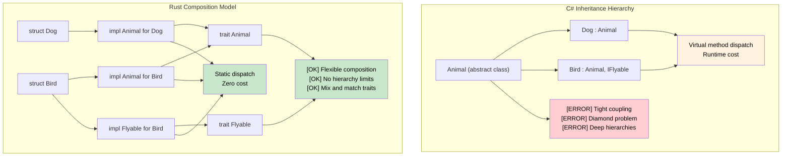

## Inheritance vs Composition

> **What you'll learn:** Why Rust has no class inheritance, how traits + structs replace deep
> class hierarchies, and practical patterns for achieving polymorphism through composition.
>
> **Difficulty:** 🟡 Intermediate

```csharp
// C# - Class-based inheritance
public abstract class Animal
{
    public string Name { get; protected set; }
    public abstract void MakeSound();
    
    public virtual void Sleep()
    {
        Console.WriteLine($"{Name} is sleeping");
    }
}

public class Dog : Animal
{
    public Dog(string name) { Name = name; }
    
    public override void MakeSound()
    {
        Console.WriteLine("Woof!");
    }
    
    public void Fetch()
    {
        Console.WriteLine($"{Name} is fetching");
    }
}

// Interface-based contracts
public interface IFlyable
{
    void Fly();
}

public class Bird : Animal, IFlyable
{
    public Bird(string name) { Name = name; }
    
    public override void MakeSound()
    {
        Console.WriteLine("Tweet!");
    }
    
    public void Fly()
    {
        Console.WriteLine($"{Name} is flying");
    }
}
```

### Rust Composition Model
```rust
// Rust - Composition over inheritance with traits
pub trait Animal {
    fn name(&self) -> &str;
    fn make_sound(&self);
    
    // Default implementation (like C# virtual methods)
    fn sleep(&self) {
        println!("{} is sleeping", self.name());
    }
}

pub trait Flyable {
    fn fly(&self);
}

// Separate data from behavior
#[derive(Debug)]
pub struct Dog {
    name: String,
}

#[derive(Debug)]
pub struct Bird {
    name: String,
    wingspan: f64,
}

// Implement behaviors for types
impl Animal for Dog {
    fn name(&self) -> &str {
        &self.name
    }
    
    fn make_sound(&self) {
        println!("Woof!");
    }
}

impl Dog {
    pub fn new(name: String) -> Self {
        Dog { name }
    }
    
    pub fn fetch(&self) {
        println!("{} is fetching", self.name);
    }
}

impl Animal for Bird {
    fn name(&self) -> &str {
        &self.name
    }
    
    fn make_sound(&self) {
        println!("Tweet!");
    }
}

impl Flyable for Bird {
    fn fly(&self) {
        println!("{} is flying with {:.1}m wingspan", self.name, self.wingspan);
    }
}

// Multiple trait bounds (like multiple interfaces)
fn make_flying_animal_sound<T>(animal: &T) 
where 
    T: Animal + Flyable,
{
    animal.make_sound();
    animal.fly();
}
```



---

## Exercises

<details>
<summary><strong>🏋️ Exercise: Replace Inheritance with Traits</strong> (click to expand)</summary>

This C# code uses inheritance. Rewrite it in Rust using trait composition:

```csharp
public abstract class Shape { public abstract double Area(); }
public abstract class Shape3D : Shape { public abstract double Volume(); }
public class Cylinder : Shape3D
{
    public double Radius { get; }
    public double Height { get; }
    public Cylinder(double r, double h) { Radius = r; Height = h; }
    public override double Area() => 2.0 * Math.PI * Radius * (Radius + Height);
    public override double Volume() => Math.PI * Radius * Radius * Height;
}
```

Requirements:
1. `HasArea` trait with `fn area(&self) -> f64`
2. `HasVolume` trait with `fn volume(&self) -> f64`
3. `Cylinder` struct implementing both
4. A function `fn print_shape_info(shape: &(impl HasArea + HasVolume))` — note the trait bound composition (no inheritance needed)

<details>
<summary>🔑 Solution</summary>

```rust
use std::f64::consts::PI;

trait HasArea {
    fn area(&self) -> f64;
}

trait HasVolume {
    fn volume(&self) -> f64;
}

struct Cylinder {
    radius: f64,
    height: f64,
}

impl HasArea for Cylinder {
    fn area(&self) -> f64 {
        2.0 * PI * self.radius * (self.radius + self.height)
    }
}

impl HasVolume for Cylinder {
    fn volume(&self) -> f64 {
        PI * self.radius * self.radius * self.height
    }
}

fn print_shape_info(shape: &(impl HasArea + HasVolume)) {
    println!("Area:   {:.2}", shape.area());
    println!("Volume: {:.2}", shape.volume());
}

fn main() {
    let c = Cylinder { radius: 3.0, height: 5.0 };
    print_shape_info(&c);
}
```

**Key insight**: C# needs a 3-level hierarchy (Shape → Shape3D → Cylinder). Rust uses flat trait composition — `impl HasArea + HasVolume` combines capabilities without inheritance depth.

</details>
</details>

***


