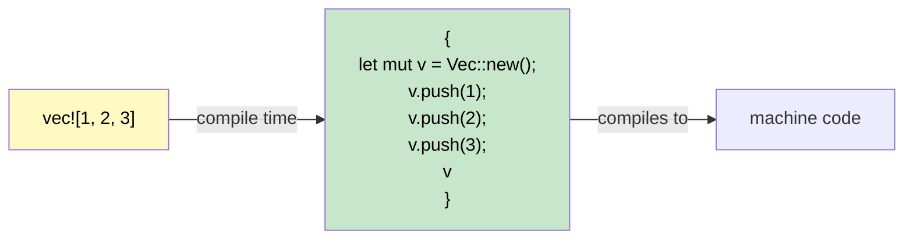

## 宏：编写代码的代码

> **你将学到：** 为什么 Rust 需要宏（无重载、无可变参数），`macro_rules!` 基础，`!` 后缀约定，常用 derive 宏，以及用于快速调试的 `dbg!()`。
>
> **难度：** 初级

C# 没有与 Rust 宏直接对应的功能。理解宏的存在原因和工作原理可以消除 C# 开发者的一个主要困惑。

### 为什么 Rust 需要宏



```csharp
// C# 有一些功能使宏变得不必要：
Console.WriteLine("Hello");           // 方法重载（1-16个参数）
Console.WriteLine("{0}, {1}", a, b);  // 通过 params 数组实现可变参数
var list = new List<int> { 1, 2, 3 }; // 集合初始化器语法
```

```rust
// Rust 没有函数重载、没有可变参数、没有特殊语法。
// 宏填补了这些空白：
println!("Hello");                    // 宏 — 在编译时处理 0+ 个参数
println!("{}, {}", a, b);             // 宏 — 在编译时进行类型检查
let list = vec![1, 2, 3];            // 宏 — 展开为 Vec::new() + push()
```

### 识别宏：`!` 后缀

每个宏调用都以 `!` 结尾。如果你看到 `!`，它就是一个宏，而不是函数：

```rust
println!("hello");     // 宏 — 在编译时生成格式化字符串代码
format!("{x}");        // 宏 — 返回 String，编译时格式化检查
vec![1, 2, 3];         // 宏 — 创建并填充 Vec
todo!();               // 宏 — 以"尚未实现"信息 panic
dbg!(expression);      // 宏 — 打印 文件:行号 + 表达式 + 值，并返回值
assert_eq!(a, b);      // 宏 — 如果 a ≠ b 则 panic 并显示差异
cfg!(target_os = "linux"); // 宏 — 编译时平台检测
```

### 使用 `macro_rules!` 编写简单宏
```rust
// 定义一个从键值对创建 HashMap 的宏
macro_rules! hashmap {
    // 模式：以逗号分隔的 key => value 对
    ( $( $key:expr => $value:expr ),* $(,)? ) => {{
        let mut map = std::collections::HashMap::new();
        $( map.insert($key, $value); )*
        map
    }};
}

fn main() {
    let scores = hashmap! {
        "Alice" => 100,
        "Bob"   => 85,
        "Carol" => 92,
    };
    println!("{scores:?}");
}
```

### Derive 宏：自动实现 Trait

```rust
// #[derive] 是一个过程宏，生成 trait 实现
#[derive(Debug, Clone, PartialEq, Eq, Hash)]
struct User {
    name: String,
    age: u32,
}
// 编译器通过检查结构体字段自动生成 Debug::fmt、Clone::clone、PartialEq::eq 等
```

```csharp
// C# 等价物：无 — 你需要手动实现 IEquatable、ICloneable 等
// 或者使用 record：public record User(string Name, int Age);
// Record 自动生成 Equals、GetHashCode、ToString — 类似的思路！
```

### 常用的 Derive 宏

| Derive | 用途 | C# 等价物 |
|--------|---------|---------------|
| `Debug` | `{:?}` 格式化字符串输出 | `ToString()` 重写 |
| `Clone` | 通过 `.clone()` 深拷贝 | `ICloneable` |
| `Copy` | 隐式按位拷贝（无需 `.clone()`） | 值类型（`struct`）语义 |
| `PartialEq`, `Eq` | `==` 比较 | `IEquatable<T>` |
| `PartialOrd`, `Ord` | `<`, `>` 比较和排序 | `IComparable<T>` |
| `Hash` | 用于 `HashMap` 键的哈希 | `GetHashCode()` |
| `Default` | 通过 `Default::default()` 获取默认值 | 无参构造函数 |
| `Serialize`, `Deserialize` | JSON/TOML/等（serde） | `[JsonProperty]` 特性 |

> **经验法则：** 从 `#[derive(Debug)]` 开始为每个类型添加它。需要时添加 `Clone`、`PartialEq`。为任何跨越边界（API、文件、数据库）的类型添加 `Serialize`、`Deserialize`。

### 过程宏与属性宏（了解级别）

Derive 宏是**过程宏**的一种——在编译时运行以生成代码的代码。你还会遇到另外两种形式：

**属性宏** — 通过 `#[...]` 附加到条目上：
```rust
#[tokio::main]          // 将 main() 转换为异步运行时入口点
async fn main() { }

#[test]                 // 将函数标记为单元测试
fn it_works() { assert_eq!(2 + 2, 4); }

#[cfg(test)]            // 仅在测试期间条件编译此模块
mod tests { /* ... */ }
```

**函数式宏** — 看起来像函数调用：
```rust
// sqlx::query! 在编译时验证你的 SQL 是否与数据库匹配
let users = sqlx::query!("SELECT id, name FROM users WHERE active = $1", true)
    .fetch_all(&pool)
    .await?;
```

> **面向 C# 开发者的关键洞察：** 你很少*编写*过程宏——它们是高级库作者的工具。但你*使用*它们的频率很高（`#[derive(...)]`、`#[tokio::main]`、`#[test]`）。可以把它们想象成 C# 的源生成器：你从中受益，而无需自己实现。

### 使用 `#[cfg]` 进行条件编译

Rust 的 `#[cfg]` 属性类似于 C# 的 `#if DEBUG` 预处理器指令，但它是类型检查的：

```rust
// 仅在 Linux 上编译此函数
#[cfg(target_os = "linux")]
fn platform_specific() {
    println!("Running on Linux");
}

// 仅调试断言（类似于 C# Debug.Assert）
#[cfg(debug_assertions)]
fn expensive_check(data: &[u8]) {
    assert!(data.len() < 1_000_000, "data unexpectedly large");
}

// 特性标志（类似于 C# #if FEATURE_X，但在 Cargo.toml 中声明）
#[cfg(feature = "json")]
pub fn to_json<T: Serialize>(val: &T) -> String {
    serde_json::to_string(val).unwrap()
}
```

```csharp
// C# 等价物
#if DEBUG
    Debug.Assert(data.Length < 1_000_000);
#endif
```

### `dbg!()` — 调试的最佳助手

```rust
fn calculate(x: i32) -> i32 {
    let intermediate = dbg!(x * 2);     // 打印：[src/main.rs:3] x * 2 = 10
    let result = dbg!(intermediate + 1); // 打印：[src/main.rs:4] intermediate + 1 = 11
    result
}
// dbg! 打印到 stderr，包含 文件:行号，并返回值
// 比 Console.WriteLine 用于调试有用得多！
```

<details>
<summary><strong>🏋️ 练习：编写一个 min! 宏</strong>（点击展开）</summary>

**挑战**：编写一个接受 2 个或更多参数并返回最小值的 `min!` 宏。

```rust
// 应该像这样工作：
let smallest = min!(5, 3, 8, 1, 4); // → 1
let pair = min!(10, 20);             // → 10
```

<details>
<summary>🔑 解决方案</summary>

```rust
macro_rules! min {
    // 基本情况：单个值
    ($x:expr) => ($x);
    // 递归：比较第一个与剩余的最小值
    ($x:expr, $($rest:expr),+) => {{
        let first = $x;
        let rest = min!($($rest),+);
        if first < rest { first } else { rest }
    }};
}

fn main() {
    assert_eq!(min!(5, 3, 8, 1, 4), 1);
    assert_eq!(min!(10, 20), 10);
    assert_eq!(min!(42), 42);
    println!("All assertions passed!");
}
```

**关键要点**：`macro_rules!` 使用 token 树的模式匹配——它像 `match` 一样工作，但匹配的是代码结构而不是值。

</details>
</details>

***
