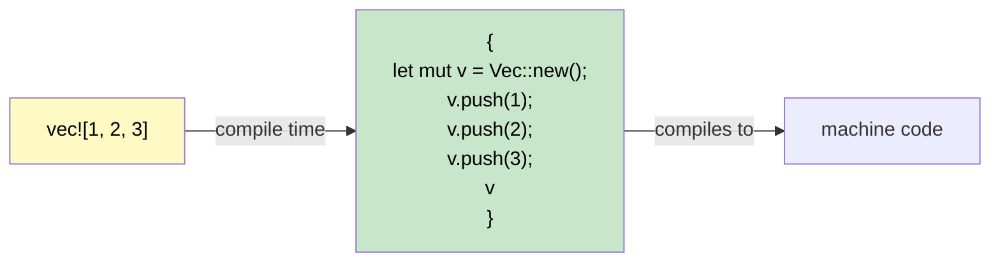

## Macros: Code That Writes Code

> **What you'll learn:** Why Rust needs macros (no overloading, no variadic args), `macro_rules!` basics,
> the `!` suffix convention, common derive macros, and `dbg!()` for quick debugging.
>
> **Difficulty:** 🟡 Intermediate

C# has no direct equivalent to Rust macros. Understanding why they exist and how they work removes a major source of confusion for C# developers.

### Why Macros Exist in Rust



```csharp
// C# has features that make macros unnecessary:
Console.WriteLine("Hello");           // Method overloading (1-16 params)
Console.WriteLine("{0}, {1}", a, b);  // Variadic via params array
var list = new List<int> { 1, 2, 3 }; // Collection initializer syntax
```

```rust
// Rust has NO function overloading, NO variadic arguments, NO special syntax.
// Macros fill these gaps:
println!("Hello");                    // Macro — handles 0+ args at compile time
println!("{}, {}", a, b);             // Macro — type-checked at compile time
let list = vec![1, 2, 3];            // Macro — expands to Vec::new() + push()
```

### Recognizing Macros: The `!` Suffix

Every macro invocation ends with `!`. If you see `!`, it's a macro, not a function:

```rust
println!("hello");     // macro — generates format string code at compile time
format!("{x}");        // macro — returns String, compile-time format checking
vec![1, 2, 3];         // macro — creates and populates a Vec
todo!();               // macro — panics with "not yet implemented"
dbg!(expression);      // macro — prints file:line + expression + value, returns value
assert_eq!(a, b);      // macro — panics with diff if a ≠ b
cfg!(target_os = "linux"); // macro — compile-time platform detection
```

### Writing a Simple Macro with `macro_rules!`
```rust
// Define a macro that creates a HashMap from key-value pairs
macro_rules! hashmap {
    // Pattern: key => value pairs separated by commas
    ( $( $key:expr => $value:expr ),* $(,)? ) => {{
        let mut map = std::collections::HashMap::new();
        $( map.insert($key, $value); )*
        map
    }};
}

fn main() {
    let scores = hashmap! {
        "Alice" => 100,
        "Bob"   => 85,
        "Carol" => 92,
    };
    println!("{scores:?}");
}
```

### Derive Macros: Auto-Implementing Traits
```rust
// #[derive] is a procedural macro that generates trait implementations
#[derive(Debug, Clone, PartialEq, Eq, Hash)]
struct User {
    name: String,
    age: u32,
}
// The compiler generates Debug::fmt, Clone::clone, PartialEq::eq, etc.
// automatically by examining the struct fields.
```

```csharp
// C# equivalent: none — you'd manually implement IEquatable, ICloneable, etc.
// Or use records: public record User(string Name, int Age);
// Records auto-generate Equals, GetHashCode, ToString — similar idea!
```

### Common Derive Macros

| Derive | Purpose | C# Equivalent |
|--------|---------|---------------|
| `Debug` | `{:?}` format string output | `ToString()` override |
| `Clone` | Deep copy via `.clone()` | `ICloneable` |
| `Copy` | Implicit bitwise copy (no `.clone()` needed) | Value type (`struct`) semantics |
| `PartialEq`, `Eq` | `==` comparison | `IEquatable<T>` |
| `PartialOrd`, `Ord` | `<`, `>` comparison + sorting | `IComparable<T>` |
| `Hash` | Hashing for `HashMap` keys | `GetHashCode()` |
| `Default` | Default values via `Default::default()` | Parameterless constructor |
| `Serialize`, `Deserialize` | JSON/TOML/etc. (serde) | `[JsonProperty]` attributes |

> **Rule of thumb:** Start with `#[derive(Debug)]` on every type. Add `Clone`, `PartialEq` when needed. Add `Serialize, Deserialize` for any type that crosses a boundary (API, file, database).

### Procedural & Attribute Macros (Awareness Level)

Derive macros are one kind of **procedural macro** — code that runs at compile time to generate code. You'll encounter two other forms:

**Attribute macros** — attached to items with `#[...]`:
```rust
#[tokio::main]          // turns main() into an async runtime entry point
async fn main() { }

#[test]                 // marks a function as a unit test
fn it_works() { assert_eq!(2 + 2, 4); }

#[cfg(test)]            // conditionally compile this module only during testing
mod tests { /* ... */ }
```

**Function-like macros** — look like function calls:
```rust
// sqlx::query! verifies your SQL against the database at compile time
let users = sqlx::query!("SELECT id, name FROM users WHERE active = $1", true)
    .fetch_all(&pool)
    .await?;
```

> **Key insight for C# developers:** You rarely *write* procedural macros — they're an advanced library-author tool. But you *use* them constantly (`#[derive(...)]`, `#[tokio::main]`, `#[test]`). Think of them like C# source generators: you benefit from them without implementing them.

### Conditional Compilation with `#[cfg]`

Rust's `#[cfg]` attributes are like C#'s `#if DEBUG` preprocessor directives, but type-checked:

```rust
// Compile this function only on Linux
#[cfg(target_os = "linux")]
fn platform_specific() {
    println!("Running on Linux");
}

// Debug-only assertions (like C# Debug.Assert)
#[cfg(debug_assertions)]
fn expensive_check(data: &[u8]) {
    assert!(data.len() < 1_000_000, "data unexpectedly large");
}

// Feature flags (like C# #if FEATURE_X, but declared in Cargo.toml)
#[cfg(feature = "json")]
pub fn to_json<T: Serialize>(val: &T) -> String {
    serde_json::to_string(val).unwrap()
}
```

```csharp
// C# equivalent
#if DEBUG
    Debug.Assert(data.Length < 1_000_000);
#endif
```

### `dbg!()` — Your Best Friend for Debugging
```rust
fn calculate(x: i32) -> i32 {
    let intermediate = dbg!(x * 2);     // prints: [src/main.rs:3] x * 2 = 10
    let result = dbg!(intermediate + 1); // prints: [src/main.rs:4] intermediate + 1 = 11
    result
}
// dbg! prints to stderr, includes file:line, and returns the value
// Far more useful than Console.WriteLine for debugging!
```

<details>
<summary><strong>🏋️ Exercise: Write a min! Macro</strong> (click to expand)</summary>

**Challenge**: Write a `min!` macro that accepts 2 or more arguments and returns the smallest.

```rust
// Should work like:
let smallest = min!(5, 3, 8, 1, 4); // → 1
let pair = min!(10, 20);             // → 10
```

<details>
<summary>🔑 Solution</summary>

```rust
macro_rules! min {
    // Base case: single value
    ($x:expr) => ($x);
    // Recursive: compare first with min of rest
    ($x:expr, $($rest:expr),+) => {{
        let first = $x;
        let rest = min!($($rest),+);
        if first < rest { first } else { rest }
    }};
}

fn main() {
    assert_eq!(min!(5, 3, 8, 1, 4), 1);
    assert_eq!(min!(10, 20), 10);
    assert_eq!(min!(42), 42);
    println!("All assertions passed!");
}
```

**Key takeaway**: `macro_rules!` uses pattern matching on token trees — it's like `match` but for code structure instead of values.

</details>
</details>

***


