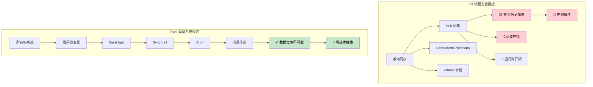

## 线程安全：约定 vs 类型系统保证

> **你将学到：** Rust如何在编译时强制线程安全 vs C#的基于约定的方法，
> `Arc<Mutex<T>>` vs `lock`、通道 vs `ConcurrentQueue`、`Send`/`Sync` trait、
> 作用域线程，以及与 async/await 的桥接。
>
> **难度：** 🔴 高级

> **深度探索**：关于生产级异步模式（流处理、优雅关闭、连接池、取消安全性），请参阅配套的[异步Rust训练](../../source-docs/ASYNC_RUST_TRAINING.md)指南。
>
> **前置知识**：[所有权与借用](ch07-ownership-and-borrowing.md) 和 [智能指针](ch07-3-smart-pointers-beyond-single-ownership.md)（Rc vs Arc 决策树）。

### C# - 基于约定的线程安全
```csharp
// C# 集合默认不是线程安全的
public class UserService
{
    private readonly List<string> items = new();
    private readonly Dictionary<int, User> cache = new();

    // 这可能导致数据竞争：
    public void AddItem(string item)
    {
        items.Add(item);  // 非线程安全！
    }

    // 必须手动使用锁：
    private readonly object lockObject = new();

    public void SafeAddItem(string item)
    {
        lock (lockObject)
        {
            items.Add(item);  // 安全，但有运行时开销
        }
        // 在其他地方容易忘记加锁
    }

    // ConcurrentCollection 有帮助但有限：
    private readonly ConcurrentBag<string> safeItems = new();

    public void ConcurrentAdd(string item)
    {
        safeItems.Add(item);  // 线程安全但操作有限
    }

    // 复杂的共享状态管理
    private readonly ConcurrentDictionary<int, User> threadSafeCache = new();
    private volatile bool isShutdown = false;

    public async Task ProcessUser(int userId)
    {
        if (isShutdown) return;  // 可能出现竞态条件！

        var user = await GetUser(userId);
        threadSafeCache.TryAdd(userId, user);  // 必须记住哪些集合是安全的
    }

    // 线程本地存储需要仔细管理
    private static readonly ThreadLocal<Random> threadLocalRandom =
        new ThreadLocal<Random>(() => new Random());

    public int GetRandomNumber()
    {
        return threadLocalRandom.Value.Next();  // 安全但需要手动管理
    }
}

// 事件处理可能存在竞态条件
public class EventProcessor
{
    public event Action<string> DataReceived;
    private readonly List<string> eventLog = new();

    public void OnDataReceived(string data)
    {
        // 竞态条件 - 在检查和调用之间事件可能为 null
        if (DataReceived != null)
        {
            DataReceived(data);
        }

        // 另一个竞态条件 - 列表非线程安全
        eventLog.Add($"Processed: {data}");
    }
}
```

### Rust - 类型系统保证的线程安全
```rust
use std::sync::{Arc, Mutex, RwLock};
use std::thread;
use std::collections::HashMap;
use tokio::sync::{mpsc, broadcast};

// Rust 在编译时防止数据竞争
pub struct UserService {
    items: Arc<Mutex<Vec<String>>>,
    cache: Arc<RwLock<HashMap<i32, User>>>,
}

impl UserService {
    pub fn new() -> Self {
        UserService {
            items: Arc::new(Mutex::new(Vec::new())),
            cache: Arc::new(RwLock::new(HashMap::new())),
        }
    }

    pub fn add_item(&self, item: String) {
        let mut items = self.items.lock().unwrap();
        items.push(item);
        // 当 `items` 超出作用域时，锁自动释放
    }

    // 多读者、单写者 - 自动强制执行
    pub async fn get_user(&self, user_id: i32) -> Option<User> {
        let cache = self.cache.read().unwrap();
        cache.get(&user_id).cloned()
    }

    pub async fn cache_user(&self, user_id: i32, user: User) {
        let mut cache = self.cache.write().unwrap();
        cache.insert(user_id, user);
    }

    // 克隆 Arc 用于线程共享
    pub fn process_in_background(&self) {
        let items = Arc::clone(&self.items);

        thread::spawn(move || {
            let items = items.lock().unwrap();
            for item in items.iter() {
                println!("Processing: {}", item);
            }
        });
    }
}

// 基于通道的通信 - 不需要共享状态
pub struct MessageProcessor {
    sender: mpsc::UnboundedSender<String>,
}

impl MessageProcessor {
    pub fn new() -> (Self, mpsc::UnboundedReceiver<String>) {
        let (tx, rx) = mpsc::unbounded_channel();
        (MessageProcessor { sender: tx }, rx)
    }

    pub fn send_message(&self, message: String) -> Result<(), mpsc::error::SendError<String>> {
        self.sender.send(message)
    }
}

// 这不会编译 - Rust 防止不安全的共享可变数据：
fn impossible_data_race() {
    let mut items = vec![1, 2, 3];

    // 这不会编译 - 不能将 `items` 移动到多个闭包中
    /*
    thread::spawn(move || {
        items.push(4);  // ERROR: use of moved value
    });

    thread::spawn(move || {
        items.push(5);  // ERROR: use of moved value
    });
    */
}

// 安全的并行数据处理
use rayon::prelude::*;

fn parallel_processing() {
    let data = vec![1, 2, 3, 4, 5];

    // 并行迭代 - 保证线程安全
    let results: Vec<i32> = data
        .par_iter()
        .map(|&x| x * x)
        .collect();

    println!("{:?}", results);
}

// 使用消息传递的异步并发
async fn async_message_passing() {
    let (tx, mut rx) = mpsc::channel(100);

    // 生产者任务
    let producer = tokio::spawn(async move {
        for i in 0..10 {
            if tx.send(i).await.is_err() {
                break;
            }
        }
    });

    // 消费者任务
    let consumer = tokio::spawn(async move {
        while let Some(value) = rx.recv().await {
            println!("Received: {}", value);
        }
    });

    // 等待两个任务完成
    let (producer_result, consumer_result) = tokio::join!(producer, consumer);
    producer_result.unwrap();
    consumer_result.unwrap();
}

#[derive(Clone)]
struct User {
    id: i32,
    name: String,
}
```



***


<details>
<summary><strong>🏋️ 练习：线程安全计数器</strong>（点击展开）</summary>

**挑战**：实现一个线程安全计数器，可以从 10 个线程同时递增。每个线程递增 1000 次。最终计数应该正好是 10,000。

<details>
<summary>🔑 解决方案</summary>

```rust
use std::sync::{Arc, Mutex};
use std::thread;

fn main() {
    let counter = Arc::new(Mutex::new(0u64));
    let mut handles = vec![];

    for _ in 0..10 {
        let counter = Arc::clone(&counter);
        handles.push(thread::spawn(move || {
            for _ in 0..1000 {
                let mut count = counter.lock().unwrap();
                *count += 1;
            }
        }));
    }

    for h in handles { h.join().unwrap(); }
    assert_eq!(*counter.lock().unwrap(), 10_000);
    println!("Final count: {}", counter.lock().unwrap());
}
```

**或使用原子操作（更快，无锁）：**
```rust
use std::sync::atomic::{AtomicU64, Ordering};
use std::sync::Arc;
use std::thread;

fn main() {
    let counter = Arc::new(AtomicU64::new(0));
    let handles: Vec<_> = (0..10).map(|_| {
        let counter = Arc::clone(&counter);
        thread::spawn(move || {
            for _ in 0..1000 {
                counter.fetch_add(1, Ordering::Relaxed);
            }
        })
    }).collect();

    for h in handles { h.join().unwrap(); }
    assert_eq!(counter.load(Ordering::SeqCst), 10_000);
}
```

**关键要点**：`Arc<Mutex<T>>` 是通用模式。对于简单计数器，`AtomicU64` 可以完全避免锁开销。

</details>
</details>

### 为什么 Rust 防止数据竞争：Send 和 Sync

Rust 使用两个标记 trait 在**编译时**强制线程安全 —— 这在 C# 中没有等价物：

- `Send`：类型可以安全地**转移**到另一个线程（例如，移动到传递给 `thread::spawn` 的闭包中）
- `Sync`：类型可以安全地**共享**（通过 `&T`）给多个线程

大多数类型自动是 `Send + Sync`。 notable 例外：
- `Rc<T>` **既不是** Send **也不是** Sync —— 编译器会拒绝让你将其传递给 `thread::spawn`（改用 `Arc<T>`）
- `Cell<T>` 和 `RefCell<T>` **不是** Sync —— 使用 `Mutex<T>` 或 `RwLock<T>` 实现线程安全的内部可变性
- 原始指针（`*const T`、`*mut T`）**既不是** Send **也不是** Sync

在 C# 中，`List<T>` 不是线程安全的，但编译器不会阻止你在多个线程间共享它。在 Rust 中，类似的错误是**编译错误**，而不是运行时竞态条件。

### 作用域线程：借用栈上的数据

`thread::scope()` 允许生成线程借用局部变量 —— 不需要 `Arc`：

```rust
use std::thread;

fn main() {
    let data = vec![1, 2, 3, 4, 5];

    // 作用域线程可以借用 'data' — 作用域等待所有线程完成
    thread::scope(|s| {
        s.spawn(|| println!("Thread 1: {data:?}"));
        s.spawn(|| println!("Thread 2: sum = {}", data.iter().sum::<i32>()));
    });
    // 'data' 在这里仍然有效 — 线程保证已完成
}
```

这类似于 C# 的 `Parallel.ForEach`，调用代码等待完成，但 Rust 的借用检查器**证明**在编译时没有数据竞争。

### 桥接到 async/await

C# 开发者通常使用 `Task` 和 `async/await` 而不是原始线程。Rust 两种范式都有：

| C# | Rust | 何时使用 |
|----|------|-------------|
| `Thread` | `std::thread::spawn` | CPU 密集型工作，每个任务一个 OS 线程 |
| `Task.Run` | `tokio::spawn` | 在运行时上的异步任务 |
| `async/await` | `async/await` | I/O 密集型并发 |
| `lock` | `Mutex<T>` | 同步互斥 |
| `SemaphoreSlim` | `tokio::sync::Semaphore` | 异步并发限制 |
| `Interlocked` | `std::sync::atomic` | 无锁原子操作 |
| `CancellationToken` | `tokio_util::sync::CancellationToken` | 协作取消 |

> 下一章（[Async/Await 深度探索](ch13-1-asyncawait-deep-dive.md)）详细介绍 Rust 的异步模型 —— 包括它与 C# 基于 `Task` 模型的区别。
