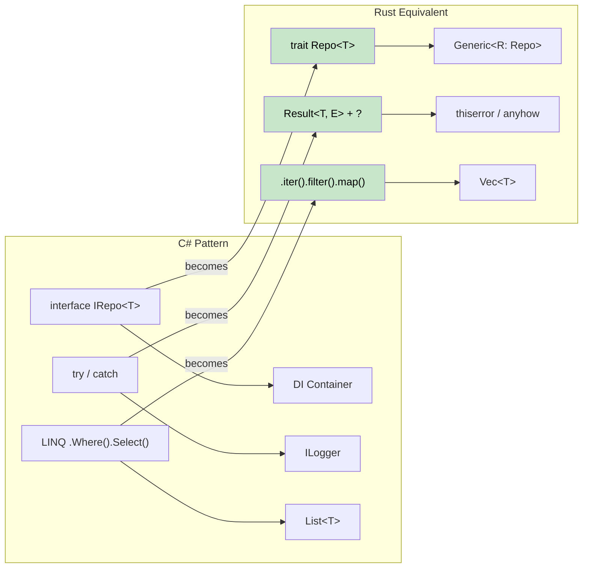

## Rust 中的常见 C# 模式

> **学习内容：** 如何将 Repository 模式、Builder 模式、依赖注入、LINQ 链、Entity Framework 查询和配置模式从 C# 转换为惯用的 Rust。
>
> **难度：** 🟡 中级



### Repository 模式
```csharp
// C# Repository Pattern
public interface IRepository<T> where T : IEntity
{
    Task<T> GetByIdAsync(int id);
    Task<IEnumerable<T>> GetAllAsync();
    Task<T> AddAsync(T entity);
    Task UpdateAsync(T entity);
    Task DeleteAsync(int id);
}

public class UserRepository : IRepository<User>
{
    private readonly DbContext _context;
    
    public UserRepository(DbContext context)
    {
        _context = context;
    }
    
    public async Task<User> GetByIdAsync(int id)
    {
        return await _context.Users.FindAsync(id);
    }
    
    // ... other implementations
}
```

```rust
// Rust Repository Pattern with traits and generics
use async_trait::async_trait;
use std::fmt::Debug;

#[async_trait]
pub trait Repository<T, E> 
where 
    T: Clone + Debug + Send + Sync,
    E: std::error::Error + Send + Sync,
{
    async fn get_by_id(&self, id: u64) -> Result<Option<T>, E>;
    async fn get_all(&self) -> Result<Vec<T>, E>;
    async fn add(&self, entity: T) -> Result<T, E>;
    async fn update(&self, entity: T) -> Result<T, E>;
    async fn delete(&self, id: u64) -> Result<(), E>;
}

#[derive(Debug, Clone)]
pub struct User {
    pub id: u64,
    pub name: String,
    pub email: String,
}

#[derive(Debug)]
pub enum RepositoryError {
    NotFound(u64),
    DatabaseError(String),
    ValidationError(String),
}

impl std::fmt::Display for RepositoryError {
    fn fmt(&self, f: &mut std::fmt::Formatter<'_>) -> std::fmt::Result {
        match self {
            RepositoryError::NotFound(id) => write!(f, "Entity with id {} not found", id),
            RepositoryError::DatabaseError(msg) => write!(f, "Database error: {}", msg),
            RepositoryError::ValidationError(msg) => write!(f, "Validation error: {}", msg),
        }
    }
}

impl std::error::Error for RepositoryError {}

pub struct UserRepository {
    // database connection pool, etc.
}

#[async_trait]
impl Repository<User, RepositoryError> for UserRepository {
    async fn get_by_id(&self, id: u64) -> Result<Option<User>, RepositoryError> {
        // Simulate database lookup
        if id == 0 {
            return Ok(None);
        }
        
        Ok(Some(User {
            id,
            name: format!("User {}", id),
            email: format!("user{}@example.com", id),
        }))
    }
    
    async fn get_all(&self) -> Result<Vec<User>, RepositoryError> {
        // Implementation here
        Ok(vec![])
    }
    
    async fn add(&self, entity: User) -> Result<User, RepositoryError> {
        // Validation and database insertion
        if entity.name.is_empty() {
            return Err(RepositoryError::ValidationError("Name cannot be empty".to_string()));
        }
        Ok(entity)
    }
    
    async fn update(&self, entity: User) -> Result<User, RepositoryError> {
        // Implementation here
        Ok(entity)
    }
    
    async fn delete(&self, id: u64) -> Result<(), RepositoryError> {
        // Implementation here
        Ok(())
    }
}
```

### Builder 模式
```csharp
// C# Builder Pattern (fluent interface)
public class HttpClientBuilder
{
    private TimeSpan? _timeout;
    private string _baseAddress;
    private Dictionary<string, string> _headers = new();
    
    public HttpClientBuilder WithTimeout(TimeSpan timeout)
    {
        _timeout = timeout;
        return this;
    }
    
    public HttpClientBuilder WithBaseAddress(string baseAddress)
    {
        _baseAddress = baseAddress;
        return this;
    }
    
    public HttpClientBuilder WithHeader(string name, string value)
    {
        _headers[name] = value;
        return this;
    }
    
    public HttpClient Build()
    {
        var client = new HttpClient();
        if (_timeout.HasValue)
            client.Timeout = _timeout.Value;
        if (!string.IsNullOrEmpty(_baseAddress))
            client.BaseAddress = new Uri(_baseAddress);
        foreach (var header in _headers)
            client.DefaultRequestHeaders.Add(header.Key, header.Value);
        return client;
    }
}

// Usage
var client = new HttpClientBuilder()
    .WithTimeout(TimeSpan.FromSeconds(30))
    .WithBaseAddress("https://api.example.com")
    .WithHeader("Accept", "application/json")
    .Build();
```

```rust
// Rust Builder Pattern (consuming builder)
use std::collections::HashMap;
use std::time::Duration;

#[derive(Debug)]
pub struct HttpClient {
    timeout: Duration,
    base_address: String,
    headers: HashMap<String, String>,
}

pub struct HttpClientBuilder {
    timeout: Option<Duration>,
    base_address: Option<String>,
    headers: HashMap<String, String>,
}

impl HttpClientBuilder {
    pub fn new() -> Self {
        HttpClientBuilder {
            timeout: None,
            base_address: None,
            headers: HashMap::new(),
        }
    }
    
    pub fn with_timeout(mut self, timeout: Duration) -> Self {
        self.timeout = Some(timeout);
        self
    }
    
    pub fn with_base_address<S: Into<String>>(mut self, base_address: S) -> Self {
        self.base_address = Some(base_address.into());
        self
    }
    
    pub fn with_header<K: Into<String>, V: Into<String>>(mut self, name: K, value: V) -> Self {
        self.headers.insert(name.into(), value.into());
        self
    }
    
    pub fn build(self) -> Result<HttpClient, String> {
        let base_address = self.base_address.ok_or("Base address is required")?;
        
        Ok(HttpClient {
            timeout: self.timeout.unwrap_or(Duration::from_secs(30)),
            base_address,
            headers: self.headers,
        })
    }
}

// Usage
let client = HttpClientBuilder::new()
    .with_timeout(Duration::from_secs(30))
    .with_base_address("https://api.example.com")
    .with_header("Accept", "application/json")
    .build()?;

// Alternative: Using Default trait for common cases
impl Default for HttpClientBuilder {
    fn default() -> Self {
        Self::new()
    }
}
```

***

## C# 到 Rust 的概念映射

### 依赖注入 → 构造函数注入 + Traits
```csharp
// C# with DI container
services.AddScoped<IUserRepository, UserRepository>();
services.AddScoped<IUserService, UserService>();

public class UserService
{
    private readonly IUserRepository _repository;
    
    public UserService(IUserRepository repository)
    {
        _repository = repository;
    }
}
```

```rust
// Rust: Constructor injection with traits
pub trait UserRepository {
    async fn find_by_id(&self, id: Uuid) -> Result<Option<User>, Error>;
    async fn save(&self, user: &User) -> Result<(), Error>;
}

pub struct UserService<R> 
where 
    R: UserRepository,
{
    repository: R,
}

impl<R> UserService<R> 
where 
    R: UserRepository,
{
    pub fn new(repository: R) -> Self {
        Self { repository }
    }
    
    pub async fn get_user(&self, id: Uuid) -> Result<Option<User>, Error> {
        self.repository.find_by_id(id).await
    }
}

// Usage
let repository = PostgresUserRepository::new(pool);
let service = UserService::new(repository);
```

### LINQ → 迭代器链
```csharp
// C# LINQ
var result = users
    .Where(u => u.Age > 18)
    .Select(u => u.Name.ToUpper())
    .OrderBy(name => name)
    .Take(10)
    .ToList();
```

```rust
// Rust: Iterator chains (zero-cost!)
let result: Vec<String> = users
    .iter()
    .filter(|u| u.age > 18)
    .map(|u| u.name.to_uppercase())
    .collect::<Vec<_>>()
    .into_iter()
    .sorted()
    .take(10)
    .collect();

// Or with itertools crate for more LINQ-like operations
use itertools::Itertools;

let result: Vec<String> = users
    .iter()
    .filter(|u| u.age > 18)
    .map(|u| u.name.to_uppercase())
    .sorted()
    .take(10)
    .collect();
```

### Entity Framework → SQLx + 迁移
```csharp
// C# Entity Framework
public class ApplicationDbContext : DbContext
{
    public DbSet<User> Users { get; set; }
}

var user = await context.Users
    .Where(u => u.Email == email)
    .FirstOrDefaultAsync();
```

```rust
// Rust: SQLx with compile-time checked queries
use sqlx::{PgPool, FromRow};

#[derive(FromRow)]
struct User {
    id: Uuid,
    email: String,
    name: String,
}

// Compile-time checked query
let user = sqlx::query_as!(
    User,
    "SELECT id, email, name FROM users WHERE email = $1",
    email
)
.fetch_optional(&pool)
.await?;

// Or with dynamic queries
let user = sqlx::query_as::<_, User>(
    "SELECT id, email, name FROM users WHERE email = $1"
)
.bind(email)
.fetch_optional(&pool)
.await?;
```

### 配置 → Config Crates
```csharp
// C# Configuration
public class AppSettings
{
    public string DatabaseUrl { get; set; }
    public int Port { get; set; }
}

var config = builder.Configuration.Get<AppSettings>();
```

```rust
// Rust: Config with serde
use config::{Config, ConfigError, Environment, File};
use serde::Deserialize;

#[derive(Debug, Deserialize)]
struct AppSettings {
    database_url: String,
    port: u16,
}

impl AppSettings {
    pub fn new() -> Result<Self, ConfigError> {
        let s = Config::builder()
            .add_source(File::with_name("config/default"))
            .add_source(Environment::with_prefix("APP"))
            .build()?;

        s.try_deserialize()
    }
}

// Usage
let settings = AppSettings::new()?;
```

---

## 案例研究

### 案例研究 1：CLI 工具迁移（csvtool）

**背景**：一个团队维护着一个 C# 控制台应用程序（`CsvProcessor`），它读取大型 CSV 文件、应用转换并写入输出。在处理 500 MB 文件时，内存使用量飙升至 4 GB，GC 暂停导致 30 秒的卡顿。

**迁移方法**：在两周内逐个模块重写为 Rust。

| 步骤 | 变更内容 | C# → Rust |
|------|---------|-----------|
| 1 | CSV 解析 | `CsvHelper` → `csv` crate（流式 `Reader`） |
| 2 | 数据模型 | `class Record` → `struct Record`（栈分配，`#[derive(Deserialize)]`） |
| 3 | 转换 | LINQ `.Select().Where()` → `.iter().map().filter()` |
| 4 | 文件 I/O | `StreamReader` → `BufReader<File>` + `?` 错误传播 |
| 5 | CLI 参数 | `System.CommandLine` → `clap`（derive 宏） |
| 6 | 并行处理 | `Parallel.ForEach` → `rayon` 的 `.par_iter()` |

**成果**：
- 内存：4 GB → 12 MB（流式处理而非将整个文件加载到内存）
- 速度：500 MB 文件处理从 45s → 3s
- 二进制大小：单个 2 MB 可执行文件，无运行时依赖

**关键经验**：最大的收获不是 Rust 本身——而是 Rust 的所有权模型*迫使*采用了流式设计。在 C# 中，很容易将所有内容 `.ToList()` 加载到内存中。而在 Rust 中，borrow checker 自然地引导向基于 `Iterator` 的处理方式。

### 案例研究 2：微服务替换（auth-gateway）

**背景**：一个 C# ASP.NET Core 认证网关为 50 多个后端服务处理 JWT 验证和速率限制。在 10K req/s 时，p99 延迟达到 200ms，并出现 GC 峰值。

**迁移方法**：使用 `axum` + `tower` 替换为 Rust 服务，保持 API 契约完全相同。

```rust
// Before (C#):  services.AddAuthentication().AddJwtBearer(...)
// After (Rust):  tower middleware layer

use axum::{Router, middleware};
use tower::ServiceBuilder;

let app = Router::new()
    .route("/api/*path", any(proxy_handler))
    .layer(
        ServiceBuilder::new()
            .layer(middleware::from_fn(validate_jwt))
            .layer(middleware::from_fn(rate_limit))
    );
```

| 指标 | C# (ASP.NET Core) | Rust (axum) |
|--------|-------------------|-------------|
| p50 延迟 | 5ms | 0.8ms |
| p99 延迟 | 200ms（GC 峰值） | 4ms |
| 内存 | 300 MB | 8 MB |
| Docker 镜像 | 210 MB（.NET 运行时） | 12 MB（静态二进制） |
| 冷启动 | 2.1s | 0.05s |

**关键经验**：
1. **保持相同的 API 契约** — 客户端无需更改。Rust 服务是直接替换方案。
2. **从热点路径开始** — JWT 验证是瓶颈。仅迁移那一个中间件就能获得 80% 的收益。
3. **使用 `tower` 中间件** — 它模仿了 ASP.NET Core 的中间件管道模式，因此 C# 开发者发现 Rust 架构很熟悉。
4. **p99 延迟的改善**来自于消除 GC 暂停，而不是更快的代码 — Rust 的稳定状态吞吐量仅快 2 倍，但没有了 GC，尾延迟变得可预测。

---

## 练习

<details>
<summary><strong>🏋️ 练习：迁移 C# 服务</strong>（点击展开）</summary>

将此 C# 服务翻译为惯用的 Rust：

```csharp
public interface IUserService
{
    Task<User?> GetByIdAsync(int id);
    Task<List<User>> SearchAsync(string query);
}

public class UserService : IUserService
{
    private readonly IDatabase _db;
    public UserService(IDatabase db) { _db = db; }

    public async Task<User?> GetByIdAsync(int id)
    {
        try { return await _db.QuerySingleAsync<User>(id); }
        catch (NotFoundException) { return null; }
    }

    public async Task<List<User>> SearchAsync(string query)
    {
        return await _db.QueryAsync<User>($"SELECT * WHERE name LIKE '%{query}%'");
    }
}
```

**提示**：使用 trait、用 `Option<User>` 代替 null、用 `Result` 代替 try/catch，并修复 SQL 注入漏洞。

<details>
<summary>🔑 解决方案</summary>

```rust
use async_trait::async_trait;

#[derive(Debug, Clone)]
struct User { id: i64, name: String }

#[async_trait]
trait Database: Send + Sync {
    async fn get_user(&self, id: i64) -> Result<Option<User>, sqlx::Error>;
    async fn search_users(&self, query: &str) -> Result<Vec<User>, sqlx::Error>;
}

#[async_trait]
trait UserService: Send + Sync {
    async fn get_by_id(&self, id: i64) -> Result<Option<User>, AppError>;
    async fn search(&self, query: &str) -> Result<Vec<User>, AppError>;
}

struct UserServiceImpl<D: Database> {
    db: D,  // No Arc needed — Rust's ownership handles it
}

#[async_trait]
impl<D: Database> UserService for UserServiceImpl<D> {
    async fn get_by_id(&self, id: i64) -> Result<Option<User>, AppError> {
        // Option instead of null; Result instead of try/catch
        Ok(self.db.get_user(id).await?)

    async fn search(&self, query: &str) -> Result<Vec<User>, AppError> {
        // Parameterized query — NO SQL injection!
        // (sqlx uses $1 placeholders, not string interpolation)
        self.db.search_users(query).await.map_err(Into::into)
    }
}
```

**与 C# 的主要变化**：
- `null` → `Option<User>`（编译时空安全）
- `try/catch` → `Result` + `?`（显式错误传播）
- SQL 注入已修复：参数化查询，而非字符串插值
- `IDatabase _db` → 泛型 `D: Database`（静态分发，无装箱）

</details>
</details>

***

