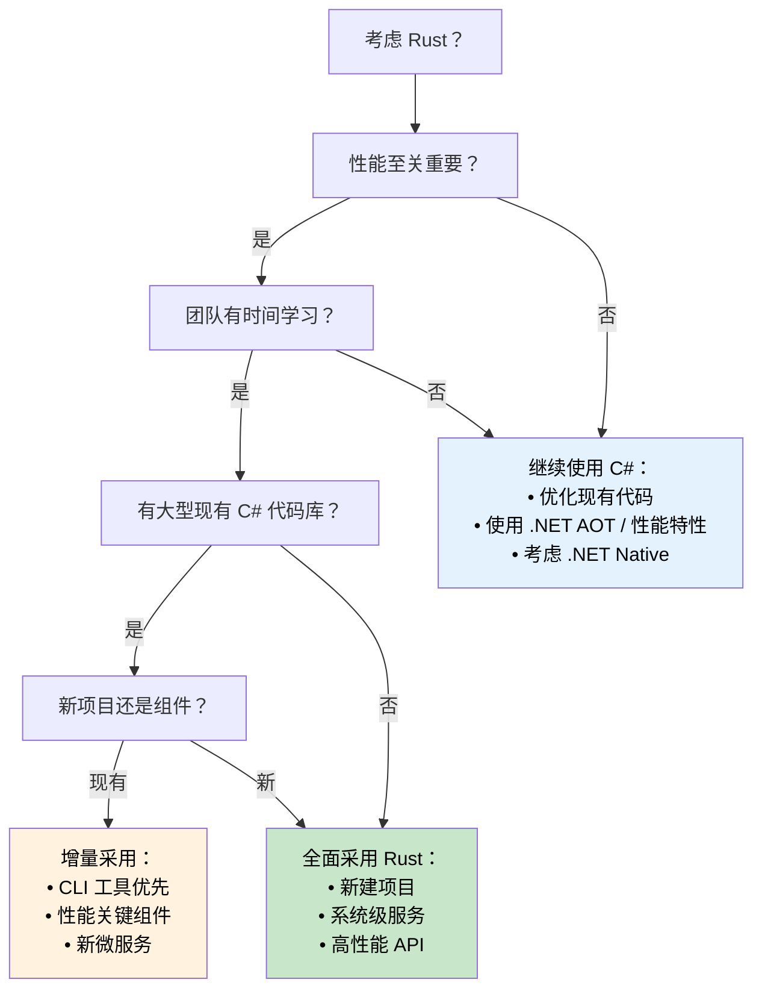

## 性能对比：托管代码 vs 原生代码

> **你将学到：** C# 与 Rust 之间的真实性能差异 — 启动时间、内存占用、吞吐量基准测试、CPU 密集型工作负载，以及何时迁移 vs 何时留在 C# 的决策树。
>
> **难度：** 🟡 中级

### 真实场景性能特性

| **方面** | **C# (.NET)** | **Rust** | **性能影响** |
|------------|---------------|----------|------------------------|
| **启动时间** | 100-500ms (JIT)；5-30ms (.NET 8 AOT) | 1-10ms (原生二进制) | 🚀 **比 JIT 快 10-50 倍** |
| **内存占用** | +30-100% (GC 开销 + 元数据) | 基线（最小运行时） | 💾 **内存少 30-50%** |
| **GC 暂停** | 1-100ms 周期性暂停 | 从不（无 GC） | ⚡ **一致的延迟** |
| **CPU 占用** | +10-20% (GC + JIT 开销) | 基线（直接执行） | 🔋 **效率高 10-20%** |
| **二进制大小** | 30-200MB（含运行时）；10-30MB (AOT 裁剪) | 1-20MB（静态二进制） | 📦 **部署更小** |
| **内存安全** | 运行时检查 | 编译时证明 | 🛡️ **零开销安全** |
| **并发性能** | 良好（需仔细同步） | 卓越（无畏并发） | 🏃 **更优的可扩展性** |

> **关于 .NET 8+ AOT 的说明**：Native AOT 编译显著缩小了启动时间差距（5-30ms）。但在吞吐量和内存方面，GC 开销和暂停仍然存在。评估迁移时，请对你的*特定工作负载*进行基准测试 — 标题数字可能具有误导性。

### 基准测试示例

```csharp
// C# - JSON 处理基准测试
public class JsonProcessor
{
    public async Task<List<User>> ProcessJsonFile(string path)
    {
        var json = await File.ReadAllTextAsync(path);
        var users = JsonSerializer.Deserialize<List<User>>(json);

        return users.Where(u => u.Age > 18)
                   .OrderBy(u => u.Name)
                   .Take(1000)
                   .ToList();
    }
}

// 典型性能：100MB 文件约 200ms
// 内存占用：峰值约 500MB（GC 开销）
// 二进制大小：约 80MB（自包含）
```

```rust
// Rust - 等效的 JSON 处理
use serde::{Deserialize, Serialize};
use tokio::fs;

#[derive(Deserialize, Serialize)]
struct User {
    name: String,
    age: u32,
}

pub async fn process_json_file(path: &str) -> Result<Vec<User>, Box<dyn std::error::Error>> {
    let json = fs::read_to_string(path).await?;
    let mut users: Vec<User> = serde_json::from_str(&json)?;

    users.retain(|u| u.age > 18);
    users.sort_by(|a, b| a.name.cmp(&b.name));
    users.truncate(1000);

    Ok(users)
}

// 典型性能：相同 100MB 文件约 120ms
// 内存占用：峰值约 200MB（无 GC 开销）
// 二进制大小：约 8MB（静态二进制）
```

### CPU 密集型工作负载

```csharp
// C# - 数学计算
public class Mandelbrot
{
    public static int[,] Generate(int width, int height, int maxIterations)
    {
        var result = new int[height, width];

        Parallel.For(0, height, y =>
        {
            for (int x = 0; x < width; x++)
            {
                var c = new Complex(
                    (x - width / 2.0) * 4.0 / width,
                    (y - height / 2.0) * 4.0 / height);

                result[y, x] = CalculateIterations(c, maxIterations);
            }
        });

        return result;
    }
}

// 性能：约 2.3 秒（8 核机器）
// 内存：约 500MB
```

```rust
// Rust - 使用 Rayon 的相同计算
use rayon::prelude::*;
use num_complex::Complex;

pub fn generate_mandelbrot(width: usize, height: usize, max_iterations: u32) -> Vec<Vec<u32>> {
    (0..height)
        .into_par_iter()
        .map(|y| {
            (0..width)
                .map(|x| {
                    let c = Complex::new(
                        (x as f64 - width as f64 / 2.0) * 4.0 / width as f64,
                        (y as f64 - height as f64 / 2.0) * 4.0 / height as f64,
                    );
                    calculate_iterations(c, max_iterations)
                })
                .collect()
        })
        .collect()
}

// 性能：约 1.1 秒（相同 8 核机器）
// 内存：约 200MB
// 快 2 倍，内存少 60%
```

###何时选择各语言

**选择 C# 当：**
- **快速开发至关重要** — 丰富的工具生态系统
- **团队在 .NET 方面有专业知识** — 现有知识和技能
- **企业集成** — 大量使用 Microsoft 生态系统
- **性能要求适中** — 性能足够
- **丰富的 UI 应用** — WPF、WinUI、Blazor 应用
- **原型设计和 MVP** — 快速上市

**选择 Rust 当：**
- **性能至关重要** — CPU/内存密集型应用
- **资源约束很重要** — 嵌入式、边缘计算、无服务器
- **长时间运行的服务** — Web 服务器、数据库、系统服务
- **系统级编程** — OS 组件、驱动程序、网络工具
- **高可靠性要求** — 金融系统、安全关键应用
- **并发/并行工作负载** — 高吞吐量数据处理

### 迁移策略决策树



***


