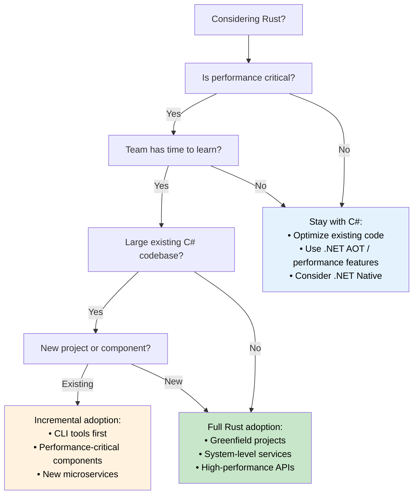

## Performance Comparison: Managed vs Native

> **What you'll learn:** Real-world performance differences between C# and Rust — startup time,
> memory usage, throughput benchmarks, CPU-intensive workloads, and a decision tree
> for when to migrate vs when to stay in C#.
>
> **Difficulty:** 🟡 Intermediate

### Real-World Performance Characteristics

| **Aspect** | **C# (.NET)** | **Rust** | **Performance Impact** |
|------------|---------------|----------|------------------------|
| **Startup Time** | 100-500ms (JIT); 5-30ms (.NET 8 AOT) | 1-10ms (native binary) | 🚀 **10-50x faster** (vs JIT) |
| **Memory Usage** | +30-100% (GC overhead + metadata) | Baseline (minimal runtime) | 💾 **30-50% less RAM** |
| **GC Pauses** | 1-100ms periodic pauses | Never (no GC) | ⚡ **Consistent latency** |
| **CPU Usage** | +10-20% (GC + JIT overhead) | Baseline (direct execution) | 🔋 **10-20% better efficiency** |
| **Binary Size** | 30-200MB (with runtime); 10-30MB (AOT trimmed) | 1-20MB (static binary) | 📦 **Smaller deployments** |
| **Memory Safety** | Runtime checks | Compile-time proofs | 🛡️ **Zero overhead safety** |
| **Concurrent Performance** | Good (with careful synchronization) | Excellent (fearless concurrency) | 🏃 **Superior scalability** |

> **Note on .NET 8+ AOT**: Native AOT compilation closes the startup gap significantly (5-30ms). For throughput and memory, GC overhead and pauses remain. When evaluating a migration, benchmark your *specific workload* — headline numbers can be misleading.

### Benchmark Examples

```csharp
// C# - JSON processing benchmark
public class JsonProcessor
{
    public async Task<List<User>> ProcessJsonFile(string path)
    {
        var json = await File.ReadAllTextAsync(path);
        var users = JsonSerializer.Deserialize<List<User>>(json);
        
        return users.Where(u => u.Age > 18)
                   .OrderBy(u => u.Name)
                   .Take(1000)
                   .ToList();
    }
}

// Typical performance: ~200ms for 100MB file
// Memory usage: ~500MB peak (GC overhead)
// Binary size: ~80MB (self-contained)
```

```rust
// Rust - Equivalent JSON processing
use serde::{Deserialize, Serialize};
use tokio::fs;

#[derive(Deserialize, Serialize)]
struct User {
    name: String,
    age: u32,
}

pub async fn process_json_file(path: &str) -> Result<Vec<User>, Box<dyn std::error::Error>> {
    let json = fs::read_to_string(path).await?;
    let mut users: Vec<User> = serde_json::from_str(&json)?;
    
    users.retain(|u| u.age > 18);
    users.sort_by(|a, b| a.name.cmp(&b.name));
    users.truncate(1000);
    
    Ok(users)
}

// Typical performance: ~120ms for same 100MB file
// Memory usage: ~200MB peak (no GC overhead)
// Binary size: ~8MB (static binary)
```

### CPU-Intensive Workloads

```csharp
// C# - Mathematical computation
public class Mandelbrot
{
    public static int[,] Generate(int width, int height, int maxIterations)
    {
        var result = new int[height, width];
        
        Parallel.For(0, height, y =>
        {
            for (int x = 0; x < width; x++)
            {
                var c = new Complex(
                    (x - width / 2.0) * 4.0 / width,
                    (y - height / 2.0) * 4.0 / height);
                
                result[y, x] = CalculateIterations(c, maxIterations);
            }
        });
        
        return result;
    }
}

// Performance: ~2.3 seconds (8-core machine)
// Memory: ~500MB
```

```rust
// Rust - Same computation with Rayon
use rayon::prelude::*;
use num_complex::Complex;

pub fn generate_mandelbrot(width: usize, height: usize, max_iterations: u32) -> Vec<Vec<u32>> {
    (0..height)
        .into_par_iter()
        .map(|y| {
            (0..width)
                .map(|x| {
                    let c = Complex::new(
                        (x as f64 - width as f64 / 2.0) * 4.0 / width as f64,
                        (y as f64 - height as f64 / 2.0) * 4.0 / height as f64,
                    );
                    calculate_iterations(c, max_iterations)
                })
                .collect()
        })
        .collect()
}

// Performance: ~1.1 seconds (same 8-core machine)  
// Memory: ~200MB
// 2x faster with 60% less memory usage
```

### When to Choose Each Language

**Choose C# when:**
- **Rapid development is crucial** - Rich tooling ecosystem
- **Team expertise in .NET** - Existing knowledge and skills
- **Enterprise integration** - Heavy use of Microsoft ecosystem
- **Moderate performance requirements** - Performance is adequate
- **Rich UI applications** - WPF, WinUI, Blazor applications
- **Prototyping and MVPs** - Fast time to market

**Choose Rust when:**
- **Performance is critical** - CPU/memory-intensive applications
- **Resource constraints matter** - Embedded, edge computing, serverless
- **Long-running services** - Web servers, databases, system services
- **System-level programming** - OS components, drivers, network tools
- **High reliability requirements** - Financial systems, safety-critical applications
- **Concurrent/parallel workloads** - High-throughput data processing

### Migration Strategy Decision Tree



***


