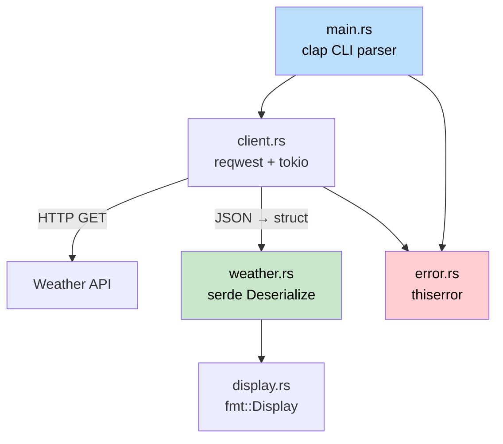

## 终极项目：构建一个 CLI 天气工具

> **你将学到：** 如何将所有内容 —— 结构体、trait、错误处理、异步、模块、serde 和 CLI 参数解析 —— 组合成一个可工作的 Rust 应用程序。这类似于 C# 开发者使用 `HttpClient`、`System.Text.Json` 和 `System.CommandLine` 构建的工具。
>
> **难度：** 🟡 中级

这个终极项目汇集了书中每个部分的概念。你将构建 `weather-cli`，一个从 API 获取天气数据并显示的命令行工具。该项目被构建为一个小型 crate，具有正确的模块布局、错误类型和测试。

### 项目概述



**你将构建的内容：**
```
$ weather-cli --city "Seattle"
🌧  Seattle: 12°C, Overcast clouds
    Humidity: 82%  Wind: 5.4 m/s
```

**涉及的概念：**
| 书籍章节 | 这里使用的概念 |
|---|---|
| Ch05 (结构体) | `WeatherReport`、`Config` 数据类型 |
| Ch08 (模块) | `src/lib.rs`、`src/client.rs`、`src/display.rs` |
| Ch09 (错误) | 使用 `thiserror` 的自定义 `WeatherError` |
| Ch10 (Trait) | 用于格式化输出的 `Display` impl |
| Ch11 (From/Into) | 通过 `serde` 进行 JSON 反序列化 |
| Ch12 (迭代器) | 处理 API 响应数组 |
| Ch13 (异步) | 用于 HTTP 调用的 `reqwest` + `tokio` |
| Ch14-1 (测试) | 单元测试 + 集成测试 |

---

### 步骤 1：项目设置

```bash
cargo new weather-cli
cd weather-cli
```

添加依赖到 `Cargo.toml`：
```toml
[package]
name = "weather-cli"
version = "0.1.0"
edition = "2021"

[dependencies]
clap = { version = "4", features = ["derive"] }   # CLI args (like System.CommandLine)
reqwest = { version = "0.12", features = ["json"] } # HTTP client (like HttpClient)
serde = { version = "1", features = ["derive"] }    # Serialization (like System.Text.Json)
serde_json = "1"
thiserror = "2"                                      # Error types
tokio = { version = "1", features = ["full"] }       # Async runtime
```

```csharp
// C# 等效依赖：
// dotnet add package System.CommandLine
// dotnet add package System.Net.Http.Json
// (System.Text.Json and HttpClient are built-in)
```

### 步骤 2：定义数据类型

创建 `src/weather.rs`：
```rust
use serde::Deserialize;

/// Raw API response (matches JSON shape)
#[derive(Deserialize, Debug)]
pub struct ApiResponse {
    pub main: MainData,
    pub weather: Vec<WeatherCondition>,
    pub wind: WindData,
    pub name: String,
}

#[derive(Deserialize, Debug)]
pub struct MainData {
    pub temp: f64,
    pub humidity: u32,
}

#[derive(Deserialize, Debug)]
pub struct WeatherCondition {
    pub description: String,
    pub icon: String,
}

#[derive(Deserialize, Debug)]
pub struct WindData {
    pub speed: f64,
}

/// Our domain type (clean, decoupled from API)
#[derive(Debug, Clone)]
pub struct WeatherReport {
    pub city: String,
    pub temp_celsius: f64,
    pub description: String,
    pub humidity: u32,
    pub wind_speed: f64,
}

impl From<ApiResponse> for WeatherReport {
    fn from(api: ApiResponse) -> Self {
        let description = api.weather
            .first()
            .map(|w| w.description.clone())
            .unwrap_or_else(|| "Unknown".to_string());

        WeatherReport {
            city: api.name,
            temp_celsius: api.main.temp,
            description,
            humidity: api.main.humidity,
            wind_speed: api.wind.speed,
        }
    }
}
```

```csharp
// C# equivalent:
// public record ApiResponse(MainData Main, List<WeatherCondition> Weather, ...);
// public record WeatherReport(string City, double TempCelsius, ...);
// Manual mapping or AutoMapper
```

**关键区别：** `#[derive(Deserialize)]` + `From` impl 取代了 C# 的 `JsonSerializer.Deserialize<T>()` + AutoMapper。两者在 Rust 中都在编译时完成 —— 无需反射。

### 步骤 3：错误类型

创建 `src/error.rs`：
```rust
use thiserror::Error;

#[derive(Error, Debug)]
pub enum WeatherError {
    #[error("HTTP request failed: {0}")]
    Http(#[from] reqwest::Error),

    #[error("City not found: {0}")]
    CityNotFound(String),

    #[error("API key not set — export WEATHER_API_KEY")]
    MissingApiKey,
}

pub type Result<T> = std::result::Result<T, WeatherError>;
```

### 步骤 4：HTTP 客户端

创建 `src/client.rs`：
```rust
use crate::error::{WeatherError, Result};
use crate::weather::{ApiResponse, WeatherReport};

pub struct WeatherClient {
    api_key: String,
    http: reqwest::Client,
}

impl WeatherClient {
    pub fn new(api_key: String) -> Self {
        WeatherClient {
            api_key,
            http: reqwest::Client::new(),
        }
    }

    pub async fn get_weather(&self, city: &str) -> Result<WeatherReport> {
        let url = format!(
            "https://api.openweathermap.org/data/2.5/weather?q={}&appid={}&units=metric",
            city, self.api_key
        );

        let response = self.http.get(&url).send().await?;

        if response.status() == reqwest::StatusCode::NOT_FOUND {
            return Err(WeatherError::CityNotFound(city.to_string()));
        }

        let api_data: ApiResponse = response.json().await?;
        Ok(WeatherReport::from(api_data))
    }
}
```

```csharp
// C# equivalent:
// var response = await _httpClient.GetAsync(url);
// if (response.StatusCode == HttpStatusCode.NotFound)
//     throw new CityNotFoundException(city);
// var data = await response.Content.ReadFromJsonAsync<ApiResponse>();
```

**关键区别：**
- `?` 操作符取代了 try/catch —— 错误通过 `Result` 自动传播
- `WeatherReport::from(api_data)` 使用 `From` trait 而不是 AutoMapper
- 没有 `IHttpClientFactory` —— `reqwest::Client` 在内部处理连接池

### 步骤 5：显示格式化

创建 `src/display.rs`：
```rust
use std::fmt;
use crate::weather::WeatherReport;

impl fmt::Display for WeatherReport {
    fn fmt(&self, f: &mut fmt::Formatter<'_>) -> fmt::Result {
        let icon = weather_icon(&self.description);
        writeln!(f, "{}  {}: {:.0}°C, {}",
            icon, self.city, self.temp_celsius, self.description)?;
        write!(f, "    Humidity: {}%  Wind: {:.1} m/s",
            self.humidity, self.wind_speed)
    }
}

fn weather_icon(description: &str) -> &str {
    let desc = description.to_lowercase();
    if desc.contains("clear") { "☀️" }
    else if desc.contains("cloud") { "☁️" }
    else if desc.contains("rain") || desc.contains("drizzle") { "🌧" }
    else if desc.contains("snow") { "❄️" }
    else if desc.contains("thunder") { "⛈" }
    else { "🌡" }
}
```

### 步骤 6：将所有内容连接在一起

`src/lib.rs`：
```rust
pub mod client;
pub mod display;
pub mod error;
pub mod weather;
```

`src/main.rs`：
```rust
use clap::Parser;
use weather_cli::{client::WeatherClient, error::WeatherError};

#[derive(Parser)]
#[command(name = "weather-cli", about = "Fetch weather from the command line")]
struct Cli {
    /// City name to look up
    #[arg(short, long)]
    city: String,
}

#[tokio::main]
async fn main() {
    let cli = Cli::parse();

    let api_key = match std::env::var("WEATHER_API_KEY") {
        Ok(key) => key,
        Err(_) => {
            eprintln!("Error: {}", WeatherError::MissingApiKey);
            std::process::exit(1);
        }
    };

    let client = WeatherClient::new(api_key);

    match client.get_weather(&cli.city).await {
        Ok(report) => println!("{report}"),
        Err(WeatherError::CityNotFound(city)) => {
            eprintln!("City not found: {city}");
            std::process::exit(1);
        }
        Err(e) => {
            eprintln!("Error: {e}");
            std::process::exit(1);
        }
    }
}
```

### 步骤 7：测试

```rust
// In src/weather.rs or tests/weather_test.rs
#[cfg(test)]
mod tests {
    use super::*;

    fn sample_api_response() -> ApiResponse {
        serde_json::from_str(r#"{
            "main": {"temp": 12.3, "humidity": 82},
            "weather": [{"description": "overcast clouds", "icon": "04d"}],
            "wind": {"speed": 5.4},
            "name": "Seattle"
        }"#).unwrap()
    }

    #[test]
    fn api_response_to_weather_report() {
        let report = WeatherReport::from(sample_api_response());
        assert_eq!(report.city, "Seattle");
        assert!((report.temp_celsius - 12.3).abs() < 0.01);
        assert_eq!(report.description, "overcast clouds");
    }

    #[test]
    fn display_format_includes_icon() {
        let report = WeatherReport {
            city: "Test".into(),
            temp_celsius: 20.0,
            description: "clear sky".into(),
            humidity: 50,
            wind_speed: 3.0,
        };
        let output = format!("{report}");
        assert!(output.contains("☀️"));
        assert!(output.contains("20°C"));
    }

    #[test]
    fn empty_weather_array_defaults_to_unknown() {
        let json = r#"{
            "main": {"temp": 0.0, "humidity": 0},
            "weather": [],
            "wind": {"speed": 0.0},
            "name": "Nowhere"
        }"#;
        let api: ApiResponse = serde_json::from_str(json).unwrap();
        let report = WeatherReport::from(api);
        assert_eq!(report.description, "Unknown");
    }
}
```

---

### 最终文件布局

```
weather-cli/
├── Cargo.toml
├── src/
│   ├── main.rs        # CLI entry point (clap)
│   ├── lib.rs         # Module declarations
│   ├── client.rs      # HTTP client (reqwest + tokio)
│   ├── weather.rs     # Data types + From impl + tests
│   ├── display.rs     # Display formatting
│   └── error.rs       # WeatherError + Result alias
└── tests/
    └── integration.rs # Integration tests
```

对比 C# 等效实现：
```
WeatherCli/
├── WeatherCli.csproj
├── Program.cs
├── Services/
│   └── WeatherClient.cs
├── Models/
│   ├── ApiResponse.cs
│   └── WeatherReport.cs
└── Tests/
    └── WeatherTests.cs
```

**Rust 版本在结构上非常相似。** 主要区别在于：
- `mod` 声明代替了命名空间
- `Result<T, E>` 代替了异常
- `From` trait 代替了 AutoMapper
- 显式的 `#[tokio::main]` 代替了内置的异步运行时

### 奖励：集成测试存根

创建 `tests/integration.rs` 来测试公共 API，而无需访问真实服务器：

```rust
// tests/integration.rs
use weather_cli::weather::WeatherReport;

#[test]
fn weather_report_display_roundtrip() {
    let report = WeatherReport {
        city: "Seattle".into(),
        temp_celsius: 12.3,
        description: "overcast clouds".into(),
        humidity: 82,
        wind_speed: 5.4,
    };

    let output = format!("{report}");
    assert!(output.contains("Seattle"));
    assert!(output.contains("12°C"));
    assert!(output.contains("82%"));
}
```

使用 `cargo test` 运行 —— Rust 自动发现 `src/`（`#[cfg(test)]` 模块）和 `tests/`（集成测试）中的测试。无需测试框架配置 —— 对比一下在 C# 中设置 xUnit/NUnit 的复杂性。

---

### 扩展挑战

一旦它工作正常，尝试以下内容来加深你的技能：

1. **添加缓存** —— 将上一个 API 响应存储在文件中。启动时，检查是否少于 10 分钟，如果是则跳过 HTTP 调用。这涉及 `std::fs`、`serde_json::to_writer` 和 `SystemTime`。

2. **添加多个城市** —— 接受 `--city "Seattle,Portland,Vancouver"` 并使用 `tokio::join!` 并发获取所有城市。这涉及并发异步。

3. **添加 `--format json` 标志** —— 使用 `serde_json::to_string_pretty` 将报告输出为 JSON 而不是人类可读的文本。这涉及条件格式化和 `Serialize`。

4. **编写集成测试** —— 创建 `tests/integration.rs` 使用 `wiremock` 的模拟 HTTP 服务器测试完整流程。这涉及 ch14-1 中的 `tests/` 目录模式。

***
