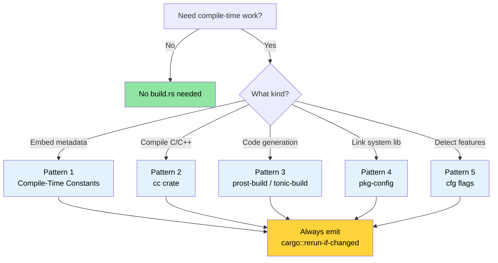

# 构建脚本 — 深入理解 `build.rs` 🟢

> **你将学到：**
> - `build.rs` 如何融入 Cargo 构建流程以及何时运行
> - 五个生产模式：编译时常量、C/C++ 编译、protobuf 代码生成、`pkg-config` 链接和特性检测
> - 会减慢构建或破坏交叉编译的反模式
> - 如何在可追溯性和可重现构建之间取得平衡
>
> **交叉引用：** [交叉编译](ch02-cross-compilation-one-source-many-target.md) 使用构建脚本进行目标感知构建 · [`no_std` 和特性](ch09-no-std-and-feature-verification.md) 扩展了此处设置的 `cfg` 标志 · [CI/CD 流水线](ch11-putting-it-all-together-a-production-cic.md) 在自动化中编排构建脚本

每个 Cargo 包都可以在 crate 根目录包含一个名为 `build.rs` 的文件。
Cargo 会在编译 crate **之前**编译并执行这个文件。构建脚本通过
stdout 上的 `println!` 指令与 Cargo 通信。

### build.rs 是什么以及何时运行

```text
┌─────────────────────────────────────────────────────────┐
│                    Cargo 构建流水线                       │
│                                                         │
│  1. 解析依赖                                             │
│  2. 下载 crates                                         │
│  3. 编译 build.rs  ← 普通 Rust，在 HOST 上运行            │
│  4. 执行 build.rs  ← stdout → Cargo 指令                 │
│  5. 编译 crate（使用步骤 4 中的指令）                      │
│  6. 链接                                                │
└─────────────────────────────────────────────────────────┘
```

关键事实：
- `build.rs` 在**主机**上运行，而不是目标上。在交叉编译时，
  构建脚本在你的开发机器上运行，即使最终二进制文件的目标是
  不同的架构。
- 构建脚本的作用域仅限于其自身包。它不能影响其他 crate 的编译方式——除非包在 `Cargo.toml` 中声明了 `links` 键，
  这使得可以通过 `cargo::metadata=KEY=VALUE` 向依赖 crate 传递元数据。
- 它**每次** Cargo 检测到变化时都会运行——除非你发出 `cargo::rerun-if-changed`
  指令来限制重新运行。
- 它可以发出*cfg 标志*、*环境变量*、*链接器参数*和*文件路径*，供主 crate 消费。

> **注意 (Rust 1.71+)**：自 Rust 1.71 起，Cargo 会对编译后的
> `build.rs` 二进制文件进行指纹识别——如果二进制文件相同，即使
> 源文件时间戳改变，它也不会重新运行。但是，
> `cargo::rerun-if-changed=build.rs` 仍然有价值：如果**没有任何**
> `rerun-if-changed` 指令，只要包中的**任何文件**改变（而不仅仅是 `build.rs`），
> Cargo 就会重新运行 `build.rs`。发出 `cargo::rerun-if-changed=build.rs`
> 可以将重新运行限制为仅当 `build.rs` 本身改变时——在大 crate 中这是一个显著的编译时间节省。

最小的 `Cargo.toml` 条目：

```toml
[package]
name = "my-crate"
version = "0.1.0"
edition = "2021"
build = "build.rs"       # 默认 — Cargo 自动查找 build.rs
# build = "src/build.rs" # 或者放在其他位置
```

### Cargo 指令协议

你的构建脚本通过向 stdout 打印指令来与 Cargo 通信。
自 Rust 1.77 起，首选的前缀是 `cargo::`（取代较早的
`cargo:` 单冒号形式）。

| 指令 | 用途 |
|-------------|---------|
| `cargo::rerun-if-changed=PATH` | 仅当 PATH 改变时重新运行 build.rs |
| `cargo::rerun-if-env-changed=VAR` | 仅当环境变量 VAR 改变时重新运行 |
| `cargo::rustc-link-lib=NAME` | 链接到原生库 NAME |
| `cargo::rustc-link-search=PATH` | 将 PATH 添加到库搜索路径 |
| `cargo::rustc-cfg=KEY` | 为条件编译设置 `#[cfg(KEY)]` 标志 |
| `cargo::rustc-cfg=KEY="VALUE"` | 设置 `#[cfg(KEY = "VALUE")]` 标志 |
| `cargo::rustc-env=KEY=VALUE` | 设置可通过 `env!()` 访问的环境变量 |
| `cargo::rustc-cdylib-link-arg=FLAG` | 为 cdylib 目标向链接器传递 FLAG |
| `cargo::warning=MESSAGE` | 在编译期间显示警告 |
| `cargo::metadata=KEY=VALUE` | 存储可由依赖 crate 读取的元数据 |

```rust
// build.rs — 最小示例
fn main() {
    // 仅当 build.rs 本身改变时重新运行
    println!("cargo::rerun-if-changed=build.rs");

    // 设置编译时环境变量
    let timestamp = std::time::SystemTime::now()
        .duration_since(std::time::UNIX_EPOCH)
        .map(|d| d.as_secs().to_string())
        .unwrap_or_else(|_| "0".into());
    println!("cargo::rustc-env=BUILD_TIMESTAMP={timestamp}");
}
```

### 模式 1：编译时常量

最常见的用例：将构建元数据烘焙到二进制文件中，以便你可以在
运行时报告（git 哈希、构建日期、CI 作业 ID）。

```rust
// build.rs
use std::process::Command;

fn main() {
    println!("cargo::rerun-if-changed=.git/HEAD");
    println!("cargo::rerun-if-changed=.git/refs");

    // Git 提交哈希
    let output = Command::new("git")
        .args(["rev-parse", "--short", "HEAD"])
        .output()
        .expect("git not found");
    let git_hash = String::from_utf8_lossy(&output.stdout).trim().to_string();
    println!("cargo::rustc-env=GIT_HASH={git_hash}");

    // 构建 profile（debug 或 release）
    let profile = std::env::var("PROFILE").unwrap_or_else(|_| "unknown".into());
    println!("cargo::rustc-env=BUILD_PROFILE={profile}");

    // 目标三元组
    let target = std::env::var("TARGET").unwrap_or_else(|_| "unknown".into());
    println!("cargo::rustc-env=BUILD_TARGET={target}");
}
```

```rust
// src/main.rs — 消费构建时的值
fn print_version() {
    println!(
        "{} {} (git:{} target:{} profile:{})",
        env!("CARGO_PKG_NAME"),
        env!("CARGO_PKG_VERSION"),
        env!("GIT_HASH"),
        env!("BUILD_TARGET"),
        env!("BUILD_PROFILE"),
    );
}
```

> **你免费获得的内置 Cargo 环境变量**：
> `CARGO_PKG_NAME`、`CARGO_PKG_VERSION`、`CARGO_PKG_AUTHORS`、
> `CARGO_PKG_DESCRIPTION`、`CARGO_MANIFEST_DIR`。
> 参见[完整列表](https://doc.rust-lang.org/cargo/reference/environment-variables.html#environment-variables-cargo-sets-for-crates)。

### 模式 2：使用 `cc` crate 编译 C/C++ 代码

当你的 Rust crate 包装了一个 C 库或需要一个小 C 辅助函数（在
硬件接口中很常见）时，[`cc`](https://docs.rs/cc) crate 简化了
build.rs 内部的编译。

```toml
# Cargo.toml
[build-dependencies]
cc = "1.0"
```

```rust
// build.rs
fn main() {
    println!("cargo::rerun-if-changed=csrc/");

    cc::Build::new()
        .file("csrc/ipmi_raw.c")
        .file("csrc/smbios_parser.c")
        .include("csrc/include")
        .flag("-Wall")
        .flag("-Wextra")
        .opt_level(2)
        .compile("diag_helpers");
    // 这会生成 libdiag_helpers.a 并发出正确的
    // cargo::rustc-link-lib 和 cargo::rustc-link-search 指令。
}
```

```rust
// src/lib.rs — 编译后的 C 代码的 FFI 绑定
extern "C" {
    fn ipmi_raw_command(
        netfn: u8,
        cmd: u8,
        data: *const u8,
        data_len: usize,
        response: *mut u8,
        response_len: *mut usize,
    ) -> i32;
}

/// 原始 IPMI 命令接口的安全包装器。
/// 假设：enum IpmiError { CommandFailed(i32), ... }
pub fn send_ipmi_command(netfn: u8, cmd: u8, data: &[u8]) -> Result<Vec<u8>, IpmiError> {
    let mut response = vec![0u8; 256];
    let mut response_len: usize = response.len();

    // SAFETY: response 缓冲区足够大，response_len 已正确初始化。
    let rc = unsafe {
        ipmi_raw_command(
            netfn,
            cmd,
            data.as_ptr(),
            data.len(),
            response.as_mut_ptr(),
            &mut response_len,
        )
    };

    if rc != 0 {
        return Err(IpmiError::CommandFailed(rc));
    }
    response.truncate(response_len);
    Ok(response)
}
```

对于 C++ 代码，使用 `.cpp(true)` 和 `.flag("-std=c++17")`：

```rust
// build.rs — C++ 变体
fn main() {
    println!("cargo::rerun-if-changed=cppsrc/");

    cc::Build::new()
        .cpp(true)
        .file("cppsrc/vendor_parser.cpp")
        .flag("-std=c++17")
        .flag("-fno-exceptions")    // 匹配 Rust 的无异常模型
        .compile("vendor_helpers");
}
```

### 模式 3：协议缓冲区和代码生成

构建脚本擅长代码生成——在编译时将 `.proto`、`.fbs` 或 `.json`
模式文件转换为 Rust 源码。下面是使用 [`prost-build`](https://docs.rs/prost-build)
的 protobuf 模式：

```toml
# Cargo.toml
[build-dependencies]
prost-build = "0.13"
```

```rust
// build.rs
fn main() {
    println!("cargo::rerun-if-changed=proto/");

    prost_build::compile_protos(
        &["proto/diagnostics.proto", "proto/telemetry.proto"],
        &["proto/"],
    )
    .expect("Failed to compile protobuf definitions");
}
```

```rust
// src/lib.rs — 包含生成的代码
pub mod diagnostics {
    include!(concat!(env!("OUT_DIR"), "/diagnostics.rs"));
}

pub mod telemetry {
    include!(concat!(env!("OUT_DIR"), "/telemetry.rs"));
}
```

> **`OUT_DIR`** 是 Cargo 提供的目录，构建脚本应该将生成的文件放在那里。
> 每个 crate 在 `target/` 下都有自己的 `OUT_DIR`。

### 模式 4：使用 `pkg-config` 链接系统库

对于提供 `.pc` 文件的系统库（systemd、OpenSSL、libpci），
[`pkg-config`](https://docs.rs/pkg-config) crate 探测系统并
发出正确的链接指令：

```toml
# Cargo.toml
[build-dependencies]
pkg-config = "0.3"
```

```rust
// build.rs
fn main() {
    // 探测 libpci（用于 PCIe 设备枚举）
    pkg_config::Config::new()
        .atleast_version("3.6.0")
        .probe("libpci")
        .expect("libpci >= 3.6.0 not found — install pciutils-dev");

    // 探测 libsystemd（可选 — 用于 sd_notify 集成）
    if pkg_config::probe_library("libsystemd").is_ok() {
        println!("cargo::rustc-cfg=has_systemd");
    }
}
```

```rust
// src/lib.rs — 基于 pkg-config 探测的条件编译
#[cfg(has_systemd)]
mod systemd_notify {
    extern "C" {
        fn sd_notify(unset_environment: i32, state: *const std::ffi::c_char) -> i32;
    }

    pub fn notify_ready() {
        let state = std::ffi::CString::new("READY=1").unwrap();
        // SAFETY: state 是一个有效的空终止 C 字符串。
        unsafe { sd_notify(0, state.as_ptr()) };
    }
}

#[cfg(not(has_systemd))]
mod systemd_notify {
    pub fn notify_ready() {
        // 在没有 systemd 的系统上为空操作
    }
}
```

### 模式 5：特性检测和条件编译

构建脚本可以探测编译环境并设置 cfg 标志，主 crate 使用这些
标志进行条件代码路径。

**CPU 架构和 OS 检测**（安全——这些是编译时常量）：

```rust
// build.rs — 检测 CPU 特性和 OS 能力
fn main() {
    println!("cargo::rerun-if-changed=build.rs");

    let target = std::env::var("TARGET").unwrap();
    let target_os = std::env::var("CARGO_CFG_TARGET_OS").unwrap();

    // 在 x86_64 上启用 AVX2 优化路径
    if target.starts_with("x86_64") {
        println!("cargo::rustc-cfg=has_x86_64");
    }

    // 在 aarch64 上启用 ARM NEON 路径
    if target.starts_with("aarch64") {
        println!("cargo::rustc-cfg=has_aarch64");
    }

    // 检测 /dev/ipmi0 是否可用（构建时检查）
    if target_os == "linux" && std::path::Path::new("/dev/ipmi0").exists() {
        println!("cargo::rustc-cfg=has_ipmi_device");
    }
}
```

> ⚠️ **反模式演示** — 下面的代码展示了一个诱人但
> 有问题的做法。**请勿在生产中使用。**

```rust
// build.rs — 糟糕：在构建时进行运行时硬件检测
fn main() {
    // 反模式：二进制文件被烘焙到 BUILD 机器的硬件上。
    // 如果你在有 GPU 的机器上构建但部署到没有 GPU 的机器上，
    // 二进制文件会静默假设 GPU 存在。
    if std::process::Command::new("accel-query")
        .arg("--query-gpu=name")
        .arg("--format=csv,noheader")
        .output()
        .is_ok()
    {
        println!("cargo::rustc-cfg=has_accel_device");
    }
}
```

```rust
// src/gpu.rs — 基于构建时检测进行适应的代码
pub fn query_gpu_info() -> GpuResult {
    #[cfg(has_accel_device)]
    {
        run_accel_query()
    }

    #[cfg(not(has_accel_device))]
    {
        GpuResult::NotAvailable("accel-query not found at build time".into())
    }
}
```

> ⚠️ **为什么这是错误的**：对于可选硬件，运行时设备检测几乎总是比
> 构建时检测更好。上述生成的二进制文件*与构建机器的硬件配置绑定*——
> 它在部署目标上的行为会不同。仅对真正在编译时固定的能力（架构、OS、
> 库可用性）使用构建时检测。对于 GPU 等硬件，在运行时使用
> `which accel-query` 或 `accel-mgmt` 探测进行检测。

### 反模式和陷阱

| 反模式 | 为什么不好 | 修复 |
|-------------|-------------|---------|
| 没有 `rerun-if-changed` | build.rs 在*每次*构建时都运行，减慢迭代 | 始终至少发出 `cargo::rerun-if-changed=build.rs` |
| 在 build.rs 中进行网络调用 | 离线构建失败，不可重现 | 将文件 vendoring 或使用单独的获取步骤 |
| 写入 `src/` | Cargo 不期望源文件在构建期间改变 | 写入 `OUT_DIR` 并使用 `include!()` |
| 繁重计算 | 减慢每次 `cargo build` | 在 `OUT_DIR` 中缓存结果，用 `rerun-if-changed` 门控 |
| 忽略交叉编译 | 不尊重 `$CC` 而使用 `Command::new("gcc")` | 使用处理交叉编译工具链的 `cc` crate |
| 没有上下文的 panic | `unwrap()` 给出不透明的"构建脚本失败"错误 | 使用 `.expect("描述性消息")` 或打印 `cargo::warning=` |

### 应用：嵌入构建元数据

当前项目使用 `env!("CARGO_PKG_VERSION")` 进行版本报告。
构建脚本可以用更丰富的元数据扩展它：

```rust
// build.rs — 建议的添加
fn main() {
    println!("cargo::rerun-if-changed=.git/HEAD");
    println!("cargo::rerun-if-changed=.git/refs");
    println!("cargo::rerun-if-changed=build.rs");

    // 嵌入 git 哈希以便在诊断报告中可追溯
    if let Ok(output) = std::process::Command::new("git")
        .args(["rev-parse", "--short=10", "HEAD"])
        .output()
    {
        let hash = String::from_utf8_lossy(&output.stdout).trim().to_string();
        println!("cargo::rustc-env=APP_GIT_HASH={hash}");
    } else {
        println!("cargo::rustc-env=APP_GIT_HASH=unknown");
    }

    // 嵌入构建时间戳以进行报告关联
    let timestamp = std::time::SystemTime::now()
        .duration_since(std::time::UNIX_EPOCH)
        .map(|d| d.as_secs().to_string())
        .unwrap_or_else(|_| "0".into());
    println!("cargo::rustc-env=APP_BUILD_EPOCH={timestamp}");

    // 发出目标三元组 — 在多架构部署中很有用
    let target = std::env::var("TARGET").unwrap_or_else(|_| "unknown".into());
    println!("cargo::rustc-env=APP_TARGET={target}");
}
```

```rust
// src/version.rs — 消费元数据
pub struct BuildInfo {
    pub version: &'static str,
    pub git_hash: &'static str,
    pub build_epoch: &'static str,
    pub target: &'static str,
}

pub const BUILD_INFO: BuildInfo = BuildInfo {
    version: env!("CARGO_PKG_VERSION"),
    git_hash: env!("APP_GIT_HASH"),
    build_epoch: env!("APP_BUILD_EPOCH"),
    target: env!("APP_TARGET"),
};

impl BuildInfo {
    /// 在需要时在运行时解析 epoch（stable Rust 上无法进行 const &str → u64 的转换——
    /// 没有用于 str 到 int 转换的 const fn）。
    pub fn build_epoch_secs(&self) -> u64 {
        self.build_epoch.parse().unwrap_or(0)
    }
}

impl std::fmt::Display for BuildInfo {
    fn fmt(&self, f: &mut std::fmt::Formatter<'_>) -> std::fmt::Result {
        write!(
            f,
            "DiagTool v{} (git:{} target:{})",
            self.version, self.git_hash, self.target
        )
    }
}
```

> **项目中的关键见解**：在整个多个 crate 工作空间中，代码库没有任何 `build.rs` 文件，
> 因为它是纯 Rust，没有 C 依赖、没有代码生成、也没有系统库链接。
> 当你需要这些时，`build.rs` 就是工具——但不要"只是因为"就添加它。
> 在大型代码库中不存在构建脚本是一个特性，而不是缺陷。
> 参见[依赖管理](ch06-dependency-management-and-supply-chain-s.md) 了解项目如何在没有自定义构建逻辑的情况下管理其供应链。
> 这是一个*积极*的信号。

### 亲身体验

1. **嵌入 git 元数据**：创建一个发出 `APP_GIT_HASH` 和
   `APP_BUILD_EPOCH` 作为环境变量的 `build.rs`。在
   `main.rs` 中用 `env!()` 消费它们并打印构建信息。验证哈希在提交后发生变化。

2. **探测系统库**：编写一个使用 `pkg-config` 探测
   `libz`（zlib）的 `build.rs`。如果找到则发出 `cargo::rustc-cfg=has_zlib`。
   在 `main.rs` 中，根据 cfg 标志有条件地打印"zlib available"或"zlib not found"。

3. **故意触发构建失败**：从你的 `build.rs` 中移除 `rerun-if-changed` 行，
   观察它在 `cargo build` 和 `cargo test` 期间重新运行了多少次。
   然后加回去并进行比较。

### 可重现构建

第 1 章教的是将时间戳和 git 哈希嵌入二进制文件。这对可追溯性很有用，
但它**与可重现构建冲突**——即从相同源始终产生相同二进制的特性。

**紧张关系：**

| 目标 | 成就 | 代价 |
|------|-------------|---------|
| 可追溯性 | 二进制文件中的 `APP_BUILD_EPOCH` | 每个构建都不同——无法验证完整性 |
| 可重现性 | `cargo build --locked` 始终产生相同输出 | 没有构建时元数据 |

**实际解决方案：**

```bash
# 1. 在 CI 中始终使用 --locked（确保尊重 Cargo.lock）
cargo build --release --locked
# 如果 Cargo.lock 缺失或过时则失败——捕获"works on my machine"

# 2. 对于需要可重现性的构建，设置 SOURCE_DATE_EPOCH
SOURCE_DATE_EPOCH=$(git log -1 --format=%ct) cargo build --release --locked
# 使用上次提交的时间戳而不是"现在"——相同的提交 = 相同的二进制文件
```

```rust
// 在 build.rs 中：尊重 SOURCE_DATE_EPOCH 以实现可重现性
let timestamp = std::env::var("SOURCE_DATE_EPOCH")
    .unwrap_or_else(|_| {
        std::time::SystemTime::now()
            .duration_since(std::time::UNIX_EPOCH)
            .map(|d| d.as_secs().to_string())
            .unwrap_or_else(|_| "0".into())
    });
println!("cargo::rustc-env=APP_BUILD_EPOCH={timestamp}");
```

> **最佳实践**：在构建脚本中使用 `SOURCE_DATE_EPOCH`，以便发布构建
> 是可重现的（`git-hash + locked deps + 确定性的时间戳 = 相同的二进制文件`），
> 而开发构建仍然获得实时时间戳以方便使用。

### 构建流水线决策图



### 🏋️ 练习

#### 🟢 练习 1：版本戳

创建一个带有 `build.rs` 的最小 crate，将当前 git 哈希和构建 profile 嵌入到环境变量中。
从 `main()` 打印它们。验证 debug 和 release 构建之间的输出发生变化。

<details>
<summary>解决方案</summary>

```rust
// build.rs
fn main() {
    println!("cargo::rerun-if-changed=.git/HEAD");
    println!("cargo::rerun-if-changed=build.rs");

    let hash = std::process::Command::new("git")
        .args(["rev-parse", "--short", "HEAD"])
        .output()
        .map(|o| String::from_utf8_lossy(&o.stdout).trim().to_string())
        .unwrap_or_else(|_| "unknown".into());
    println!("cargo::rustc-env=GIT_HASH={hash}");
    println!("cargo::rustc-env=BUILD_PROFILE={}", std::env::var("PROFILE").unwrap_or_default());
}
```

```rust,ignore
// src/main.rs
fn main() {
    println!("{} v{} (git:{} profile:{})",
        env!("CARGO_PKG_NAME"),
        env!("CARGO_PKG_VERSION"),
        env!("GIT_HASH"),
        env!("BUILD_PROFILE"),
    );
}
```

```bash
cargo run          # shows profile:debug
cargo run --release # shows profile:release
```
</details>

#### 🟡 练习 2：条件系统库

编写一个使用 `pkg-config` 同时探测 `libz` 和 `libpci` 的 `build.rs`。
为找到的每个发出一个 `cfg` 标志。在 `main.rs` 中，打印在构建时检测到哪些库。

<details>
<summary>解决方案</summary>

```toml
# Cargo.toml
[build-dependencies]
pkg-config = "0.3"
```

```rust,ignore
// build.rs
fn main() {
    println!("cargo::rerun-if-changed=build.rs");
    if pkg_config::probe_library("zlib").is_ok() {
        println!("cargo::rustc-cfg=has_zlib");
    }
    if pkg_config::probe_library("libpci").is_ok() {
        println!("cargo::rustc-cfg=has_libpci");
    }
}
```

```rust
// src/main.rs
fn main() {
    #[cfg(has_zlib)]
    println!("✅ zlib detected");
    #[cfg(not(has_zlib))]
    println!("❌ zlib not found");

    #[cfg(has_libpci)]
    println!("✅ libpci detected");
    #[cfg(not(has_libpci))]
    println!("❌ libpci not found");
}
```
</details>

### 关键要点

- `build.rs` 在**主机**上于编译时运行——始终发出 `cargo::rerun-if-changed` 以避免不必要的重新构建
- 使用 `cc` crate（而不是原始 `gcc` 命令）进行 C/C++ 编译——它正确处理交叉编译工具链
- 将生成的文件写入 `OUT_DIR`，永远不要写入 `src/` — Cargo 不期望源文件在构建期间改变
- 对于可选硬件，优先使用运行时检测而不是构建时检测
- 在嵌入时间戳时使用 `SOURCE_DATE_EPOCH` 使构建可重现

---

