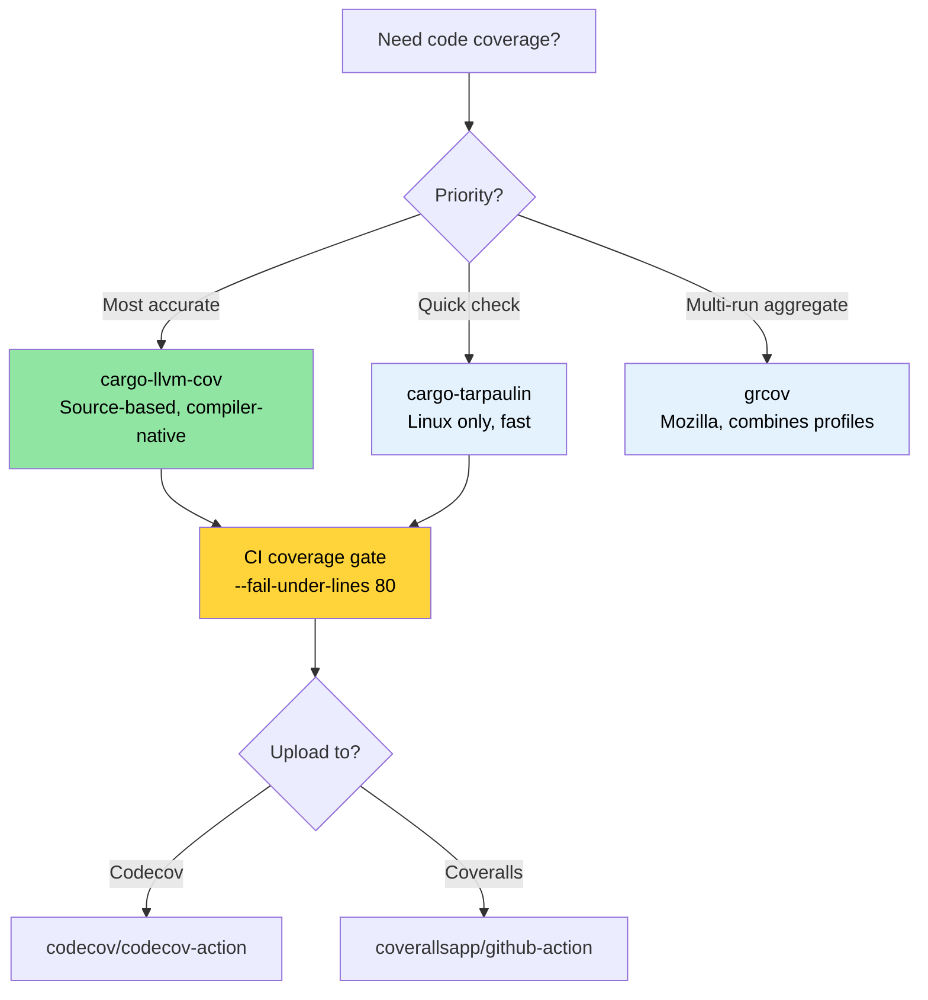

# 代码覆盖率 — 发现测试遗漏的内容 🟢

> **你将学到：**
> - 使用 `cargo-llvm-cov` 进行基于源码的覆盖率（最准确的 Rust 覆盖率工具）
> - 使用 `cargo-tarpaulin` 和 Mozilla 的 `grcov` 进行快速覆盖率检查
> - 使用 Codecov 和 Coveralls 在 CI 中设置覆盖率门控
> - 一种优先考虑高风险盲点的覆盖率引导测试策略
>
> **交叉引用：** [Miri 和 Sanitizers](ch05-miri-valgrind-and-sanitizers-verifying-u.md) — 覆盖率发现未测试的代码，Miri 发现已测试代码中的 UB · [基准测试](ch03-benchmarking-measuring-what-matters.md) — 覆盖率显示*什么是测试过的*，基准测试显示*什么是快的* · [CI/CD 流水线](ch11-putting-it-all-together-a-production-cic.md) — 流水线中的覆盖率门控

代码覆盖率测量你的测试实际执行了哪些行、分支或函数。
它不能证明正确性（被覆盖的行仍然可能有 bug），但它可靠地揭示了**盲点**——完全没有测试练习的代码路径。

凭借跨多个 crate 的 1,006 个测试，项目有大量测试投入。
覆盖率分析回答："这项投入是否到达了重要的代码？"

### 使用 `llvm-cov` 进行基于源码的覆盖率

Rust 使用 LLVM，它提供基于源码的覆盖率插桩——这是可用的最准确的覆盖率方法。
推荐的工具是 [`cargo-llvm-cov`](https://github.com/taiki-e/cargo-llvm-cov)：

```bash
# 安装
cargo install cargo-llvm-cov

# 或通过 rustup 组件（用于原始 llvm 工具）
rustup component add llvm-tools-preview
```

**基本用法：**

```bash
# 运行测试并显示每个文件的覆盖率摘要
cargo llvm-cov

# 生成 HTML 报告（可浏览，逐行高亮）
cargo llvm-cov --html
# 输出：target/llvm-cov/html/index.html

# 生成 LCOV 格式（用于 CI 集成）
cargo llvm-cov --lcov --output-path lcov.info

# 工作空间范围的覆盖率（所有 crate）
cargo llvm-cov --workspace

# 只包含特定包
cargo llvm-cov --package accel_diag --package topology_lib

# 包含文档测试的覆盖率
cargo llvm-cov --doctests
```

**阅读 HTML 报告：**

```text
target/llvm-cov/html/index.html
├── Filename          │ Function │ Line   │ Branch │ Region
├─ accel_diag/src/lib.rs │  78.5%  │ 82.3% │ 61.2% │  74.1%
├─ sel_mgr/src/parse.rs│  95.2%  │ 96.8% │ 88.0% │  93.5%
├─ topology_lib/src/.. │  91.0%  │ 93.4% │ 79.5% │  89.2%
└─ ...

Green = covered    Red = not covered    Yellow = partially covered (branch)
```

**覆盖率类型解释：**

| 类型 | 测量内容 | 意义 |
|------|------------------|-------------|
| **行覆盖率** | 执行了哪些源码行 | 基本的是"这段代码被达到了吗？" |
| **分支覆盖率** | 取走了哪些 `if`/`match` 分支 | 捕获未测试的条件 |
| **函数覆盖率** | 调用了哪些函数 | 发现死代码 |
| **区域覆盖率** | 击中了哪些代码区域（子表达式） | 最细粒度 |

### cargo-tarpaulin — 快速路径

[`cargo-tarpaulin`](https://github.com/xd009642/tarpaulin) 是一个 Linux 特定的
覆盖率工具，设置更简单（不需要 LLVM 组件）：

```bash
# 安装
cargo install cargo-tarpaulin

# 基本覆盖率报告
cargo tarpaulin

# HTML 输出
cargo tarpaulin --out Html

# 带特定选项
cargo tarpaulin \
    --workspace \
    --timeout 120 \
    --out Xml Html \
    --output-dir coverage/ \
    --exclude-files "*/tests/*" "*/benches/*" \
    --ignore-panics

# 跳过某些 crate
cargo tarpaulin --workspace --exclude diag_tool  # 排除二进制 crate
```

**tarpaulin vs llvm-cov 比较：**

| 功能 | cargo-llvm-cov | cargo-tarpaulin |
|---------|----------------|-----------------|
| 准确性 | 基于源码（最准确） | 基于 Ptrace（偶尔过度计数） |
| 平台 | 任何（基于 llvm） | 仅 Linux |
| 分支覆盖率 | 有 | 有限 |
| 文档测试 | 有 | 无 |
| 设置 | 需要 `llvm-tools-preview` | 自包含 |
| 速度 | 更快（编译时插桩） | 更慢（ptrace 开销） |
| 稳定性 | 非常稳定 | 偶尔有误报 |

**建议**：使用 `cargo-llvm-cov` 以获得准确性。当你需要快速检查而不安装 LLVM 工具时使用 `cargo-tarpaulin`。

### grcov — Mozilla 的覆盖率工具

[`grcov`](https://github.com/mozilla/grcov) 是 Mozilla 的覆盖率聚合器。
它消费原始 LLVM 分析数据并产生多种格式的报告：

```bash
# 安装
cargo install grcov

# 步骤 1：用覆盖率插桩构建
export RUSTFLAGS="-Cinstrument-coverage"
export LLVM_PROFILE_FILE="target/coverage/%p-%m.profraw"
cargo build --tests

# 步骤 2：运行测试（生成 .profraw 文件）
cargo test

# 步骤 3：用 grcov 聚合
grcov target/coverage/ \
    --binary-path target/debug/ \
    --source-dir . \
    --output-types html,lcov \
    --output-path target/coverage/report \
    --branch \
    --ignore-not-existing \
    --ignore "*/tests/*" \
    --ignore "*/.cargo/*"

# 步骤 4：查看报告
open target/coverage/report/html/index.html
```

**何时使用 grcov**：当你需要将**多次测试运行**的覆盖率合并（例如，单元测试 + 集成测试 + 模糊测试）到单个报告时，它最有用。

### CI 中的覆盖率：Codecov 和 Coveralls

将覆盖率数据上传到跟踪服务以获取历史趋势和 PR 注释：

```yaml
# .github/workflows/coverage.yml
name: Code Coverage

on: [push, pull_request]

jobs:
  coverage:
    runs-on: ubuntu-latest
    steps:
      - uses: actions/checkout@v4
      - uses: dtolnay/rust-toolchain@stable
        with:
          components: llvm-tools-preview

      - name: Install cargo-llvm-cov
        uses: taiki-e/install-action@cargo-llvm-cov

      - name: Generate coverage
        run: cargo llvm-cov --workspace --lcov --output-path lcov.info

      - name: Upload to Codecov
        uses: codecov/codecov-action@v4
        with:
          files: lcov.info
          token: ${{ secrets.CODECOV_TOKEN }}
          fail_ci_if_error: true

      # 可选：执行最低覆盖率
      - name: Check coverage threshold
        run: |
          cargo llvm-cov --workspace --fail-under-lines 80
          # 如果行覆盖率降至 80% 以下则构建失败
```

**覆盖率门控** — 通过读取 JSON 输出对每个 crate 执行最低覆盖率：

```bash
# 获取每个 crate 的覆盖率作为 JSON
cargo llvm-cov --workspace --json | jq '.data[0].totals.lines.percent'

# 如果低于阈值则失败
cargo llvm-cov --workspace --fail-under-lines 80
cargo llvm-cov --workspace --fail-under-functions 70
cargo llvm-cov --workspace --fail-under-regions 60
```

### 覆盖率引导测试策略

没有策略的覆盖率数字毫无意义。以下是如何有效使用覆盖率数据：

**步骤 1：按风险分类**

```text
高覆盖率，高风险     → ✅ 良好 — 保持它
高覆盖率，低风险      → 🔄 可能过度测试 — 如果慢则跳过
低覆盖率，高风险      → 🔴 立即编写测试 — 这是 bug 藏身之处
低覆盖率，低风险       → 🟡 跟踪但不恐慌
```

**步骤 2：关注分支覆盖率，而不是行覆盖率**

```rust
// 100% 行覆盖率，50% 分支覆盖率 — 仍然有风险！
pub fn classify_temperature(temp_c: i32) -> ThermalState {
    if temp_c > 105 {       // ← 用 temp=110 测试 → Critical
        ThermalState::Critical
    } else if temp_c > 85 { // ← 用 temp=90 测试 → Warning
        ThermalState::Warning
    } else if temp_c < -10 { // ← 从未测试 → 传感器错误情况被遗漏
        ThermalState::SensorError
    } else {
        ThermalState::Normal  // ← 用 temp=25 测试 → Normal
    }
}
```

**步骤 3：排除噪音**

```bash
# 从覆盖率中排除测试代码（它总是"被覆盖的"）
cargo llvm-cov --workspace --ignore-filename-regex 'tests?\.rs$|benches/'

# 排除生成的代码
cargo llvm-cov --workspace --ignore-filename-regex 'target/'
```

在代码中标记不可测试的部分：

```rust
// 覆盖率工具识别此模式
#[cfg(not(tarpaulin_include))]  // tarpaulin
fn unreachable_hardware_path() {
    // 此路径需要实际 GPU 硬件才能触发
}

// 对于 llvm-cov，使用更有针对性的方法：
// 简单接受某些路径需要集成/硬件测试，而不是单元测试。
// 在覆盖率例外列表中跟踪它们。
```

### 补充测试工具

**`proptest` — 属性驱动测试** 发现手工测试遗漏的边缘情况：

```toml
[dev-dependencies]
proptest = "1"
```

```rust
use proptest::prelude::*;

proptest! {
    #[test]
    fn parse_never_panics(input in "\\PC*") {
        // proptest 生成数千个随机字符串
        // 如果 parse_gpu_csv 对任何输入 panic，测试失败
        // proptest 会为你最小化失败情况。
        let _ = parse_gpu_csv(&input);
    }

    #[test]
    fn temperature_roundtrip(raw in 0u16..4096) {
        let temp = Temperature::from_raw(raw);
        let md = temp.millidegrees_c();
        // 属性：毫度应该总是可以从原始值导出
        assert_eq!(md, (raw as i32) * 625 / 10);
    }
}
```

**`insta` — 快照测试** 用于大型结构化输出（JSON、文本报告）：

```toml
[dev-dependencies]
insta = { version = "1", features = ["json"] }
```

```rust
#[test]
fn test_der_report_format() {
    let report = generate_der_report(&test_results);
    // 第一次运行：创建快照文件。后续运行：与之比较。
    // 运行 `cargo insta review` 以交互方式接受更改。
    insta::assert_json_snapshot!(report);
}
```

> **何时添加 proptest/insta**：如果你的单元测试都是"快乐路径"示例，
> proptest 会发现你遗漏的边缘情况。如果你正在测试大型输出
> 格式（JSON 报告、DER 记录），快照测试比手工断言更容易编写和维护。

### 应用：1,000+ 测试覆盖率地图

项目有 1,000+ 测试但没有覆盖率跟踪。添加它
可以揭示测试投入分布。未覆盖的路径是 [Miri 和 sanitizer](ch05-miri-valgrind-and-sanitizers-verifying-u.md) 验证的最佳候选：

**建议的覆盖率配置：**

```bash
# 快速工作空间覆盖率（建议的 CI 命令）
cargo llvm-cov --workspace \
    --ignore-filename-regex 'tests?\.rs$' \
    --fail-under-lines 75 \
    --html

# 针对每个 crate 的覆盖率以进行针对性改进
for crate in accel_diag event_log topology_lib network_diag compute_diag fan_diag; do
    echo "=== $crate ==="
    cargo llvm-cov --package "$crate" --json 2>/dev/null | \
        jq -r '.data[0].totals | "Lines: \(.lines.percent | round)%  Branches: \(.branches.percent | round)%"'
done
```

**预期高覆盖率的 crate**（基于测试密度）：
- `topology_lib` — 922 行金色文件测试套件
- `event_log` — 带有 `create_test_record()` 辅助函数的注册表
- `cable_diag` — `make_test_event()` / `make_test_context()` 模式

**预期的覆盖率差距**（基于代码检查）：
- IPMI 通信路径中的错误处理分支
- GPU 硬件特定分支（需要实际 GPU）
- `dmesg` 解析边缘情况（平台相关输出）

> **覆盖率的 80/20 规则**：从 0% 到 80% 的覆盖率是 straightforward。
> 从 80% 到 95% 需要越来越 contrived 的测试场景。从 95% 到 100%
> 需要 `#[cfg(not(...))]` 排除，并且很少值得 effort。
> 以**80% 行覆盖率和 70% 分支覆盖率**作为实际底线。

### 覆盖率故障排除

| 症状 | 原因 | 修复 |
|---------|-------|-----|
| `llvm-cov` 显示所有文件 0% | 未应用插桩 | 确保你运行 `cargo llvm-cov`，而不是单独运行 `cargo test` + `llvm-cov` |
| 覆盖率将 `unreachable!()` 计为未覆盖 | 这些分支存在于编译代码中 | 使用 `#[cfg(not(tarpaulin_include))]` 或添加到排除正则表达式 |
| 测试二进制文件在覆盖率下崩溃 | 插桩 + sanitizer 冲突 | 不要将 `cargo llvm-cov` 与 `-Zsanitizer=address` 结合；分别运行 |
| `llvm-cov` 和 `tarpaulin` 覆盖率不同 | 不同的插桩技术 | 使用 `llvm-cov` 作为事实来源（编译器原生）；对于大差异提出问题 |
| `error: profraw file is malformed` | 测试二进制文件在执行中途崩溃 | 先修复测试失败；当进程异常退出时 profraw 文件会损坏 |
| 分支覆盖率似乎不可能地低 | 优化器为 match 分支、unwrap 等创建分支 | 关注*行*覆盖率以获得实际阈值；分支覆盖率天生较低 |

### 亲身体验

1. **测量项目的覆盖率**：在你的项目上运行 `cargo llvm-cov --workspace --html`
   并打开报告。找到覆盖率最低的三个文件。它们是未测试的，还是本质上难以测试的（硬件相关代码）？

2. **设置覆盖率门控**：将 `cargo llvm-cov --workspace --fail-under-lines 60` 添加到你的 CI。
   有意注释掉一个测试并验证 CI 失败。然后将阈值提高到项目实际覆盖率减 2%。

3. **分支 vs. 行覆盖率**：编写一个带有 3 分支 `match` 的函数，只测试 2 个分支。
   比较行覆盖率（可能显示 66%）vs. 分支覆盖率（可能显示 50%）。
   哪个指标对你的项目更有用？

### 覆盖率工具选择



### 🏋️ 练习

#### 🟢 练习 1：第一个覆盖率报告

安装 `cargo-llvm-cov`，在任何 Rust 项目上运行它，并打开 HTML 报告。
找到行覆盖率最低的三个文件。

<details>
<summary>解决方案</summary>

```bash
cargo install cargo-llvm-cov
cargo llvm-cov --workspace --html --open
# 报告按覆盖率排序文件 — 最低的在底部
# 寻找低于 50% 的文件 — 那些是你的盲点
```
</details>

#### 🟡 练习 2：CI 覆盖率门控

向 GitHub Actions 工作流添加一个覆盖率门控，如果行覆盖率降至 60% 以下则失败。
通过注释掉一个测试来验证它有效。

<details>
<summary>解决方案</summary>

```yaml
# .github/workflows/coverage.yml
name: Coverage
on: [push, pull_request]
jobs:
  coverage:
    runs-on: ubuntu-latest
    steps:
      - uses: actions/checkout@v4
      - uses: dtolnay/rust-toolchain@stable
        with:
          components: llvm-tools-preview
      - run: cargo install cargo-llvm-cov
      - run: cargo llvm-cov --workspace --fail-under-lines 60
```

注释掉一个测试、推送并观察工作流失败。
</details>

### 关键要点

- `cargo-llvm-cov` 是 Rust 最准确的覆盖率工具 — 它使用编译器自己的插桩
- 覆盖率不能证明正确性，但**零覆盖率证明零测试** — 用它来发现盲点
- 在 CI 中设置覆盖率门控（例如 `--fail-under-lines 80`）以防止回归
- 不要追求 100% 覆盖率 — 专注于高风险代码路径（错误处理、unsafe、解析）
- 永远不要在同一运行中结合覆盖率插桩和 sanitizer

---

