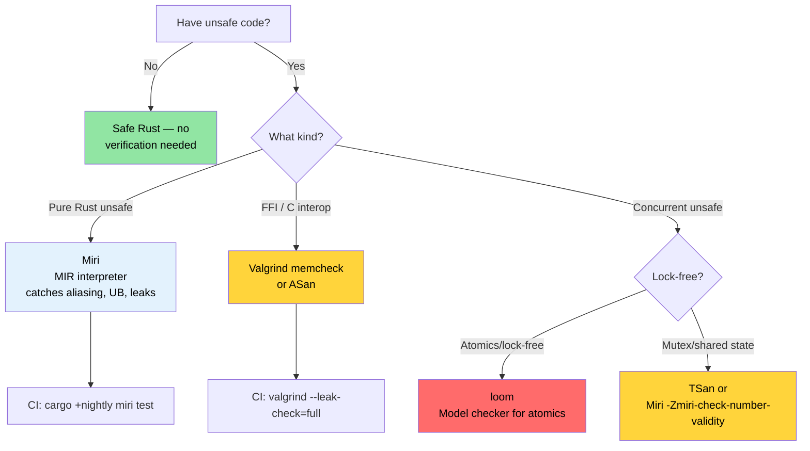

# Miri、Valgrind 和 Sanitizers — 验证 Unsafe 代码 🔴

> **你将学到：**
> - Miri 作为 MIR 解释器 — 它捕获什么（别名、UB、泄漏）和它不能捕获什么（FFI、系统调用）
> - Valgrind memcheck、Helgrind（数据竞争）、Callgrind（性能分析）和 Massif（堆）
> - LLVM sanitizer：ASan、MSan、TSan、LSan 以及 nightly `-Zbuild-std`
> - 用于崩溃发现的 `cargo-fuzz` 和用于并发模型检查的 `loom`
> - 选择正确验证工具的决策树
>
> **交叉引用：** [代码覆盖率](ch04-code-coverage-seeing-what-tests-miss.md) — 覆盖率发现未测试的路径，Miri 验证已测试的路径 · [`no_std` 和特性](ch09-no-std-and-feature-verification.md) — `no_std` 代码通常需要 Miri 可以验证的 `unsafe` · [CI/CD 流水线](ch11-putting-it-all-together-a-production-cic.md) — 流水线中的 Miri 作业

Safe Rust 在编译时保证内存安全和数据竞争自由。但当你写 `unsafe` 时——
用于 FFI、手写数据结构或性能技巧——这些保证成为*你的*责任。
本章涵盖了验证你的 `unsafe` 代码实际维护它声称的安全契约的工具。

### Miri — Unsafe Rust 的解释器

[Miri](https://github.com/rust-lang/miri) 是 Rust 的中级中间表示（MIR）的**解释器**。
Miri 不是编译成机器码，而是*逐步执行*你的程序，对每个操作进行穷举的未定义行为检查。

```bash
# 安装 Miri（仅限 nightly 组件）
rustup +nightly component add miri

# 在 Miri 下运行你的测试套件
cargo +nightly miri test

# 在 Miri 下运行特定二进制文件
cargo +nightly miri run

# 运行特定测试
cargo +nightly miri test -- test_name
```

**Miri 如何工作：**

```text
Source → rustc → MIR → Miri 解释 MIR
                        │
                        ├─ 跟踪每个指针的来源
                        ├─ 验证每个内存访问
                        ├─ 在每次解引用时检查对齐
                        ├─ 检测 use-after-free
                        ├─ 检测数据竞争（使用线程）
                        └─ 强制执行 Stacked Borrows / Tree Borrows 规则
```

### Miri 捕获什么（以及什么不能）

**Miri 检测到：**

| 类别 | 示例 | 会在运行时崩溃吗？ |
|----------|---------|------------------------|
| 越界访问 | `ptr.add(100).read()` 超出分配 | 有时（取决于页面布局） |
| Use after free | 通过原始指针读取已 drop 的 `Box` | 有时（取决于分配器） |
| Double free | 两次调用 `drop_in_place` | 通常会 |
| 未对齐访问 | `(ptr as *const u32).read()` 在奇数地址 | 在某些架构上 |
| 无效值 | `transmute::<u8, bool>(2)` | 静默错误 |
| 悬垂引用 | `&*ptr` 其中 ptr 已被 free | 不会（静默损坏） |
| 数据竞争 | 两个线程，一个写，没有同步 | 间歇性，难以重现 |
| Stacked Borrows 违规 | 别名 `&mut` 引用 | 不会（静默损坏） |

**Miri 不会检测到：**

| 限制 | 为什么 |
|-----------|---------|
| 逻辑 bug | Miri 检查内存安全，不检查正确性 |
| 并发死锁 | Miri 检查数据竞争，不检查活锁 |
| 性能问题 | 解释比原生慢 10-100 倍 |
| OS/硬件交互 | Miri 无法模拟系统调用、设备 I/O |
| 所有 FFI 调用 | 无法解释 C 代码（只有 Rust MIR） |
| 穷举路径覆盖 | 只测试你的测试套件达到的路径 |

**一个具体示例——捕获"在实际中工作"但不符合规定代码：**

```rust
#[cfg(test)]
mod tests {
    #[test]
    fn test_miri_catches_ub() {
        // 这在 release 构建中"工作"，但这是未定义行为
        let mut v = vec![1, 2, 3];
        let ptr = v.as_ptr();

        // Push 可能重新分配，使 ptr 无效
        v.push(4);

        // ❌ UB：重新分配后 ptr 可能悬垂
        // Miri 会捕获这个，即使分配器恰好没有移动缓冲区。
        // let _val = unsafe { *ptr };
        // 错误：Miri 会报告：
        //   "pointer to alloc1234 was dereferenced after this
        //    allocation got freed"

        // ✅ 正确：在突变后获取新指针
        let ptr = v.as_ptr();
        let val = unsafe { *ptr };
        assert_eq!(val, 1);
    }
}
```

### 在真实 Crate 上运行 Miri

**带有 `unsafe` 的 crate 的实际 Miri 工作流程：**

```bash
# 步骤 1：在 Miri 下运行所有测试
cargo +nightly miri test 2>&1 | tee miri_output.txt

# 步骤 2：如果 Miri 报告错误，隔离它们
cargo +nightly miri test -- failing_test_name

# 步骤 3：使用 Miri 的 backtrace 进行诊断
MIRIFLAGS="-Zmiri-backtrace=full" cargo +nightly miri test

# 步骤 4：选择借用模型
# Stacked Borrows（默认，更严格）：
cargo +nightly miri test

# Tree Borrows（实验性，更宽松）：
MIRIFLAGS="-Zmiri-tree-borrows" cargo +nightly miri test
```

**常见场景的 Miri 标志：**

```bash
# 禁用隔离（允许文件系统访问、环境变量）
MIRIFLAGS="-Zmiri-disable-isolation" cargo +nightly miri test

# 内存泄漏检测默认在 Miri 中开启。
# 要抑制泄漏错误（例如，对于故意的泄漏）：
# MIRIFLAGS="-Zmiri-ignore-leaks" cargo +nightly miri test

# 为随机化测试的种子 RNG 以获得可重现结果
MIRIFLAGS="-Zmiri-seed=42" cargo +nightly miri test

# 启用严格来源检查
MIRIFLAGS="-Zmiri-strict-provenance" cargo +nightly miri test

# 多个标志
MIRIFLAGS="-Zmiri-disable-isolation -Zmiri-backtrace=full -Zmiri-strict-provenance" \
    cargo +nightly miri test
```

**Miri 在 CI 中：**

```yaml
# .github/workflows/miri.yml
name: Miri
on: [push, pull_request]

jobs:
  miri:
    runs-on: ubuntu-latest
    steps:
      - uses: actions/checkout@v4
      - uses: dtolnay/rust-toolchain@nightly
        with:
          components: miri

      - name: Run Miri
        run: cargo miri test --workspace
        env:
          MIRIFLAGS: "-Zmiri-backtrace=full"
          # 泄漏检查默认开启。
          # 跳过使用 Miri 无法处理的系统调用的测试
          # （文件 I/O、网络等）
```

> **性能注意**：Miri 比原生执行慢 10-100 倍。在本地运行 5 秒的测试套件
> 在 Miri 下可能需要 5 分钟。在 CI 中，只在focused 子集上运行 Miri：只有带 `unsafe` 代码的 crate。

### Valgrind 及其 Rust 集成

[Valgrind](https://valgrind.org/) 是经典的 C/C++ 内存检查器。它也可以在编译后的 Rust 二进制文件上工作，
在机器码级别检查内存错误。

```bash
# 安装 Valgrind
sudo apt install valgrind  # Debian/Ubuntu
sudo dnf install valgrind  # Fedora

# 用调试信息构建（Valgrind 需要符号）
cargo build --tests
# 或者用调试信息的 release：
# cargo build --release
# [profile.release]
# debug = true

# 在 Valgrind 下运行特定测试二进制文件
valgrind --tool=memcheck \
    --leak-check=full \
    --show-leak-kinds=all \
    --track-origins=yes \
    ./target/debug/deps/my_crate-abc123 --test-threads=1

# 运行主二进制文件
valgrind --tool=memcheck \
    --leak-check=full \
    --error-exitcode=1 \
    ./target/debug/diag_tool --run-diagnostics
```

**超越 memcheck 的 Valgrind 工具：**

| 工具 | 命令 | 检测什么 |
|------|---------|----------------|
| **Memcheck** | `--tool=memcheck` | 内存泄漏、use-after-free、缓冲区溢出 |
| **Helgrind** | `--tool=helgrind` | 数据竞争和锁顺序违规 |
| **DRD** | `--tool=drd` | 数据竞争（不同的检测算法） |
| **Callgrind** | `--tool=callgrind` | CPU 指令性能分析（路径级） |
| **Massif** | `--tool=massif` | 随时间变化的堆内存性能分析 |
| **Cachegrind** | `--tool=cachegrind` | 缓存未命中分析 |

**使用 Callgrind 进行指令级性能分析：**

```bash
# 记录指令计数（比墙上时间更稳定）
valgrind --tool=callgrind \
    --callgrind-out-file=callgrind.out \
    ./target/release/diag_tool --run-diagnostics

# 用 KCachegrind 可视化
kcachegrind callgrind.out
# 或基于文本的替代方案：
callgrind_annotate callgrind.out | head -100
```

**Miri vs Valgrind — 何时使用哪个：**

| 方面 | Miri | Valgrind |
|--------|------|----------|
| 检查 Rust 特定的 UB | ✅ Stacked/Tree Borrows | ❌ 不了解 Rust 规则 |
| 检查 C FFI 代码 | ❌ 无法解释 C | ✅ 检查所有机器码 |
| 需要 nightly | ✅ 是 | ❌ 否 |
| 速度 | 10-100× 慢 | 10-50× 慢 |
| 平台 | 任何（解释 MIR） | Linux、macOS（运行原生码） |
| 数据竞争检测 | ✅ 是 | ✅ 是（Helgrind/DRD） |
| 泄漏检测 | ✅ 是 | ✅ 是（更彻底） |
| 误报 | 非常罕见 | 偶尔（尤其是与分配器一起） |

**两者都用**：
- **Miri** 用于纯 Rust `unsafe` 代码（Stacked Borrows、来源）
- **Valgrind** 用于 FFI 重代码和整个程序的泄漏分析

### AddressSanitizer、MemorySanitizer、ThreadSanitizer

LLVM sanitizer 是编译时插桩传递，插入运行时检查。
它们比 Valgrind 快（2-5× 开销 vs 10-50×），并捕获不同类别的 bug。

```bash
# 必需：安装 Rust 源码以用 sanitizer 插桩重新构建 std
rustup component add rust-src --toolchain nightly
# AddressSanitizer (ASan) — 缓冲区溢出、use-after-free、栈溢出
RUSTFLAGS="-Zsanitizer=address" \
    cargo +nightly test -Zbuild-std --target x86_64-unknown-linux-gnu

# MemorySanitizer (MSan) — 未初始化内存读取
RUSTFLAGS="-Zsanitizer=memory" \
    cargo +nightly test -Zbuild-std --target x86_64-unknown-linux-gnu

# ThreadSanitizer (TSan) — 数据竞争
RUSTFLAGS="-Zsanitizer=thread" \
    cargo +nightly test -Zbuild-std --target x86_64-unknown-linux-gnu

# LeakSanitizer (LSan) — 内存泄漏（默认包含在 ASan 中）
RUSTFLAGS="-Zsanitizer=leak" \
    cargo +nightly test --target x86_64-unknown-linux-gnu
```

> **注意**：ASan、MSan 和 TSan 需要 `-Zbuild-std` 才能用 sanitizer 插桩重新构建标准库。LSan 不需要。

**Sanitizer 比较：**

| Sanitizer | 开销 | 捕获 | 需要 nightly？ | `-Zbuild-std`？ |
|-----------|----------|---------|----------|----------------|
| **ASan** | 2× 内存、2× CPU | 缓冲区溢出、use-after-free、栈溢出 | 是 | 是 |
| **MSan** | 3× 内存、3× CPU | 未初始化读取 | 是 | 是 |
| **TSan** | 5-10× 内存、5× CPU | 数据竞争 | 是 | 是 |
| **LSan** | 最小 | 内存泄漏 | 是 | 否 |

**实际示例 — 用 TSan 捕获数据竞争：**

```rust
use std::sync::Arc;
use std::thread;

fn racy_counter() -> u64 {
    // ❌ UB：不同步的共享可变状态
    let data = Arc::new(std::cell::UnsafeCell::new(0u64));
    let mut handles = vec![];

    for _ in 0..4 {
        let data = Arc::clone(&data);
        handles.push(thread::spawn(move || {
            for _ in 0..1000 {
                // SAFETY：不 sound — 数据竞争！
                unsafe {
                    *data.get() += 1;
                }
            }
        }));
    }

    for h in handles {
        h.join().unwrap();
    }

    // 值应该是 4000，但由于竞争可能是任何值
    unsafe { *data.get() }
}

// Miri 和 TSan 都会捕获这个：
// Miri:  "Data race detected between (1) write and (2) write"
// TSan:  "WARNING: ThreadSanitizer: data race"
//
// 修复：使用 AtomicU64 或 Mutex<u64>
```

### 相关工具：模糊测试和并发验证

**`cargo-fuzz` — 覆盖率引导模糊测试**（在解析器和解码器中发现崩溃）：

```bash
# 安装
cargo install cargo-fuzz

# 初始化一个 fuzz 目标
cargo fuzz init
cargo fuzz add parse_gpu_csv
```

```rust
// fuzz/fuzz_targets/parse_gpu_csv.rs
#![no_main]
use libfuzzer_sys::fuzz_target;

fuzz_target!(|data: &[u8]| {
    if let Ok(s) = std::str::from_utf8(data) {
        // 模糊测试器生成数百万个输入以寻找 panic/崩溃。
        let _ = diag_tool::parse_gpu_csv(s);
    }
});
```

```bash
# 运行模糊测试器（运行直到被中断或找到崩溃）
cargo +nightly fuzz run parse_gpu_csv -- -max_total_time=300  # 5 分钟

# 最小化崩溃
cargo +nightly fuzz tmin parse_gpu_csv artifacts/parse_gpu_csv/crash-...
```

> **何时模糊测试**：任何解析不受信任/半信任输入的函数（传感器输出、
> 配置文件、网络数据、JSON/CSV）。模糊测试在每个主要的
> Rust 解析器 crate（serde、regex、image）中都发现了真实的 bug。

**`loom` — 并发模型检查器**（穷举测试原子顺序）：

```toml
[dev-dependencies]
loom = "0.7"
```

```rust
#[cfg(loom)]
mod tests {
    use loom::sync::atomic::{AtomicUsize, Ordering};
    use loom::thread;

    #[test]
    fn test_counter_is_atomic() {
        loom::model(|| {
            let counter = loom::sync::Arc::new(AtomicUsize::new(0));
            let c1 = counter.clone();
            let c2 = counter.clone();

            let t1 = thread::spawn(move || { c1.fetch_add(1, Ordering::SeqCst); });
            let t2 = thread::spawn(move || { c2.fetch_add(1, Ordering::SeqCst); });

            t1.join().unwrap();
            t2.join().unwrap();

            // loom 探索所有可能的线程交错
            assert_eq!(counter.load(Ordering::SeqCst), 2);
        });
    }
}
```

> **何时使用 `loom`**：当你有无锁数据结构或自定义同步原语时。
> Loom 穷举探索线程交错——它是一个模型检查器，而不是压力测试。
> 不需要用于基于 `Mutex`/`RwLock` 的代码。

### 何时使用哪个工具

```text
不安全验证的决策树：

代码是纯 Rust（无 FFI）吗？
├─ 是 → 使用 Miri（捕获 Rust 特定的 UB、Stacked Borrows）
│        也在 CI 中运行 ASan 作为纵深防御
└─ 否（通过 FFI 调用 C/C++ 代码）
   ├─ 内存安全问题？
   │  └─ 是 → 使用 Valgrind memcheck 和 ASan
   ├─ 并发问题？
   │  └─ 是 → 使用 TSan（更快）或 Helgrind（更彻底）
   └─ 内存泄漏问题？
      └─ 是 → 使用 Valgrind --leak-check=full
```

**建议的 CI 矩阵：**

```yaml
# 并行运行所有工具以获得快速反馈
jobs:
  miri:
    runs-on: ubuntu-latest
    steps:
      - uses: dtolnay/rust-toolchain@nightly
        with: { components: miri }
      - run: cargo miri test --workspace

  asan:
    runs-on: ubuntu-latest
    steps:
      - uses: dtolnay/rust-toolchain@nightly
      - run: |
          RUSTFLAGS="-Zsanitizer=address" \
          cargo test -Zbuild-std --target x86_64-unknown-linux-gnu

  valgrind:
    runs-on: ubuntu-latest
    steps:
      - run: sudo apt-get install -y valgrind
      - uses: dtolnay/rust-toolchain@stable
      - run: cargo build --tests
      - run: |
          for test_bin in $(find target/debug/deps -maxdepth 1 -executable -type f ! -name '*.d'); do
            valgrind --error-exitcode=1 --leak-check=full "$test_bin" --test-threads=1
          done
```

### 应用：零 Unsafe — 以及何时你需要它

该项目在 90,000+ 行 Rust 中包含**零个 `unsafe` 块**。
对于系统级诊断工具来说，这是一个了不起的成就，证明了安全 Rust 足以用于：
- IPMI 通信（通过 `std::process::Command` 到 `ipmitool`）
- GPU 查询（通过 `std::process::Command` 到 `accel-query`）
- PCIe 拓扑解析（纯 JSON/文本解析）
- SEL 记录管理（纯数据结构）
- DER 报告生成（JSON 序列化）

**该项目何时需要 `unsafe`？**

引入 `unsafe` 的可能触发因素：

| 场景 | 为什么 `unsafe` | 建议的验证 |
|----------|-------------|------------------------|
| 直接基于 ioctl 的 IPMI | `libc::ioctl()` 绕过 `ipmitool` 子进程 | Miri + Valgrind |
| 直接 GPU 驱动程序查询 | accel-mgmt FFI 而不是 `accel-query` 解析 | Valgrind（C 库） |
| 内存映射 PCIe 配置 | 用于直接配置空间读取的 `mmap` | ASan + Valgrind |
| 无锁 SEL 缓冲区 | 用于并发事件收集的 `AtomicPtr` | Miri + TSan |
| 嵌入式/no_std 变体 | 用于裸机的原始指针操作 | Miri |

**准备**：在引入 `unsafe` 之前，将验证工具添加到 CI：

```toml
# Cargo.toml — 为不安全的优化添加特性标志
[features]
default = []
direct-ipmi = []     # 启用直接 ioctl IPMI 而不是 ipmitool 子进程
direct-accel-api = []     # 启用 accel-mgmt FFI 而不是 accel-query 解析
```

```rust
// src/ipmi.rs — 门控在特性标志后面
#[cfg(feature = "direct-ipmi")]
mod direct {
    //! 通过 /dev/ipmi0 ioctl 直接访问 IPMI 设备。
    //!
    //! # Safety
    //! 此模块使用 `unsafe` 进行 ioctl 系统调用。
    //! 已通过以下工具验证：Miri（在可能的地方）、Valgrind memcheck、ASan。

    use std::os::unix::io::RawFd;

    // ... unsafe ioctl 实现 ...
}

#[cfg(not(feature = "direct-ipmi"))]
mod subprocess {
    //! 通过 ipmitool 子进程的 IPMI（默认，完全安全）。
    // ... 当前实现 ...
}
```

> **关键见解**：将 `unsafe` 保持在[特性标志](ch09-no-std-and-feature-verification.md)后面，
> 以便可以独立验证。在 [CI](ch11-putting-it-all-together-a-production-cic.md) 中运行
> `cargo +nightly miri test --features direct-ipmi` 以持续验证不安全路径，
> 而不影响安全的默认构建。

### `cargo-careful` — 在 Stable 上额外 UB 检查

[`cargo-careful`](https://github.com/RalfJung/cargo-careful) 使用额外的标准库检查运行你的代码——
捕获正常构建忽略的一些未定义行为，而不需要 nightly 或 Miri 的 10-100× 减速：

```bash
# 安装（需要 nightly，但在接近原生的速度运行你的代码）
cargo install cargo-careful

# 用额外的 UB 检查运行测试（捕获未初始化内存、无效值）
cargo +nightly careful test

# 用额外检查运行二进制文件
cargo +nightly careful run -- --run-diagnostics
```

**`cargo-careful` 捕获正常构建不捕获的内容：**
- `MaybeUninit` 和 `zeroed()` 中的未初始化内存读取
- 通过 transmute 创建无效的 `bool`、`char` 或枚举值
- 未对齐的指针读取/写入
- 具有重叠范围的 `copy_nonoverlapping`

**它在验证阶梯中的位置：**

```text
最小开销                                          最彻底
├─ cargo test ──► cargo careful test ──► Miri ──► ASan ──► Valgrind ─┤
│  (0× 开销)    (~1.5× 开销)      (10-100×)  (2×)     (10-50×)   │
│  仅安全 Rust   捕获一些 UB     纯-Rust  FFI+Rust FFI+Rust   │
```

> **建议**：将 `cargo +nightly careful test` 作为快速安全检查添加到 CI。
> 它以接近原生的速度运行（与 Miri 不同），并捕获安全 Rust 抽象掩盖的真实 bug。

### Miri 和 Sanitizer 故障排除

| 症状 | 原因 | 修复 |
|---------|-------|-----|
| `Miri does not support FFI` | Miri 是一个 Rust 解释器；它无法执行 C 代码 | 对 FFI 代码改用 Valgrind 或 ASan |
| `error: unsupported operation: can't call foreign function` | Miri 遇到了 `extern "C"` 调用 | 在 FFI 边界上使用 mock 或门控在 `#[cfg(miri)]` 后面 |
| `Stacked Borrows violation` | 别名规则违规 — 即使代码"工作" | Miri 是正确的；重构以避免 `&` 别名 `&mut` |
| Sanitizer 说 `DEADLYSIGNAL` | ASan 检测到缓冲区溢出 | 检查数组索引、切片操作和指针算术 |
| `LeakSanitizer: detected memory leaks` | `Box::leak()`、`forget()` 或缺少 `drop()` | 故意的：用 `__lsan_disable()` 抑制；无意的：修复泄漏 |
| Miri 极慢 | Miri 解释而不是编译 — 10-100× 慢 | 只在 `--lib` 测试上运行，或用 `#[cfg_attr(miri, ignore)]` 标记慢速测试 |
| TSan 对 atomics 误报 | TSan 不能完美理解 Rust 的原子顺序模型 | 添加 `TSAN_OPTIONS=suppressions=tsan.supp` 和特定抑制 |

### 亲身体验

1. **触发 Miri UB 检测**：编写一个创建两个指向同一个 `i32` 的 `&mut` 引用的 `unsafe` 函数（别名违规）。
   运行 `cargo +nightly miri test` 并观察"Stacked Borrows"错误。
   用 `UnsafeCell` 或单独分配修复它。

2. **在故意 bug 上运行 ASan**：创建一个进行 `unsafe` 越界数组访问的测试。
   用 `RUSTFLAGS="-Zsanitizer=address"` 构建并观察 ASan 的报告。
   注意它如何精确定位确切行。

3. **基准测试 Miri 开销**：对相同的测试套件计时 `cargo test --lib` vs `cargo +nightly miri test --lib`。
   计算减速因子。基于此，决定在 CI 中的 Miri 下运行哪些测试，用 `#[cfg_attr(miri, ignore)]` 跳过哪些。

### 安全验证决策树



### 🏋️ 练习

#### 🟡 练习 1：触发 Miri UB 检测

编写一个 `unsafe` 函数，创建两个指向同一个 `i32` 的 `&mut` 引用（别名违规）。
运行 `cargo +nightly miri test` 并观察 Stacked Borrows 错误。修复它。

<details>
<summary>解决方案</summary>

```rust
#[cfg(test)]
mod tests {
    #[test]
    fn aliasing_ub() {
        let mut x: i32 = 42;
        let ptr = &mut x as *mut i32;
        unsafe {
            // BUG：两个指向同一位置的 &mut 引用
            let _a = &mut *ptr;
            let _b = &mut *ptr; // Miri: Stacked Borrows violation!
        }
    }
}
```

修复：使用单独分配或 `UnsafeCell`：

```rust
use std::cell::UnsafeCell;

#[test]
fn no_aliasing_ub() {
    let x = UnsafeCell::new(42);
    unsafe {
        let a = &mut *x.get();
        *a = 100;
    }
}
```
</details>

#### 🔴 练习 2：ASan 越界检测

创建一个带有 `unsafe` 越界数组访问的测试。用 `RUSTFLAGS="-Zsanitizer=address"` 在 nightly 上构建并观察 ASan 的报告。

<details>
<summary>解决方案</summary>

```rust
#[test]
fn oob_access() {
    let arr = [1u8, 2, 3, 4, 5];
    let ptr = arr.as_ptr();
    unsafe {
        let _val = *ptr.add(10); // Out of bounds!
    }
}
```

```bash
RUSTFLAGS="-Zsanitizer=address" cargo +nightly test -Zbuild-std \
  --target x86_64-unknown-linux-gnu -- oob_access
# ASan report: stack-buffer-overflow at <exact address>
```
</details>

### 关键要点

- **Miri** 是用于纯 Rust `unsafe` 的工具 — 它捕获编译和通过测试的别名违规、use-after-free 和泄漏
- **Valgrind** 是用于 FFI/C 互操作的工具 — 它在最终二进制文件上工作，无需重新编译
- **Sanitizer**（ASan、TSan、MSan）需要 nightly 但以接近原生的速度运行 — 非常适合大型测试套件
- **`loom`** 专为验证无锁并发数据结构而构建
- 在每次推送时在 CI 中运行 Miri；按日程安排运行 sanitizer 以避免减慢主要流水线

---

