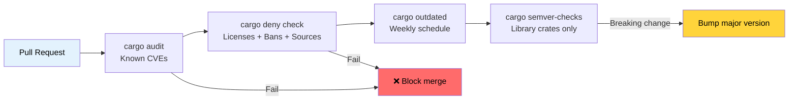

# 依赖管理和供应链安全 🟢

> **你将学到：**
> - 使用 `cargo-audit` 扫描已知漏洞
> - 使用 `cargo-deny` 强制执行许可证、公告和源码策略
> - 使用 Mozilla 的 `cargo-vet` 进行供应链信任验证
> - 跟踪过时的依赖并检测破坏性 API 变更
> - 可视化和去重你的依赖树
>
> **交叉引用：** [发布 Profiles](ch07-release-profiles-and-binary-size.md) — `cargo-udeps` 修剪在此发现的未使用依赖 · [CI/CD 流水线](ch11-putting-it-all-together-a-production-cic.md) — 流水线中的审计和拒绝作业 · [构建脚本](ch01-build-scripts-buildrs-in-depth.md) — `build-dependencies` 也是你供应链的一部分

Rust 二进制文件不仅仅包含你的代码——它包含你 `Cargo.lock` 中的每个传递依赖。
该树中任何地方的漏洞、许可证违规或恶意 crate 都成为*你的*问题。
本章涵盖了使依赖管理可审计和自动化的工具。

### cargo-audit — 已知漏洞扫描

[`cargo-audit`](https://github.com/rustsec/rustsec/tree/main/cargo-audit)
根据 [RustSec Advisory Database](https://rustsec.org/) 检查你的 `Cargo.lock`，
该数据库跟踪已发布 crate 中的已知漏洞。

```bash
# 安装
cargo install cargo-audit

# 扫描已知漏洞
cargo audit

# 输出：
# Crate:     chrono
# Version:   0.4.19
# Title:     Potential segfault in localtime_r invocations
# Date:      2020-11-10
# ID:        RUSTSEC-2020-0159
# URL:       https://rustsec.org/advisories/RUSTSEC-2020-0159
# Solution:  Upgrade to >= 0.4.20

# 检查并在存在漏洞时使 CI 失败
cargo audit --deny warnings

# 生成 JSON 输出以进行自动处理
cargo audit --json

# 通过更新 Cargo.lock 修复漏洞
cargo audit fix
```

**CI 集成：**

```yaml
# .github/workflows/audit.yml
name: Security Audit
on:
  schedule:
    - cron: '0 0 * * *'  # 每日检查 — 公告持续出现
  push:
    paths: ['Cargo.lock']

jobs:
  audit:
    runs-on: ubuntu-latest
    steps:
      - uses: actions/checkout@v4
      - uses: rustsec/audit-check@v2
        with:
          token: ${{ secrets.GITHUB_TOKEN }}
```

### cargo-deny — 综合策略执行

[`cargo-deny`](https://github.com/EmbarkStudios/cargo-deny) 远远超越漏洞扫描。
它在四个维度强制执行策略：

1. **公告** — 已知漏洞（类似 cargo-audit）
2. **许可证** — 允许/拒绝的许可证列表
3. **禁令** — 禁止的 crate 或重复版本
4. **来源** — 允许的注册表和 git 源

```bash
# 安装
cargo install cargo-deny

# 初始化配置
cargo deny init
# 创建带有记录默认值的 deny.toml

# 运行所有检查
cargo deny check

# 运行特定检查
cargo deny check advisories
cargo deny check licenses
cargo deny check bans
cargo deny check sources
```

**示例 `deny.toml`：**

```toml
# deny.toml

[advisories]
vulnerability = "deny"        # 已知漏洞则失败
unmaintained = "warn"         # 未维护的 crate 则警告
yanked = "deny"               # 被撤回的 crate 则失败
notice = "warn"               # 信息性公告则警告

[licenses]
unlicensed = "deny"           # 所有 crate 必须有许可证
allow = [
    "MIT",
    "Apache-2.0",
    "BSD-2-Clause",
    "BSD-3-Clause",
    "ISC",
    "Unicode-DFS-2016",
]
copyleft = "deny"             # 本项目无 GPL/LGPL/AGPL
default = "deny"              # 拒绝任何未明确允许的

[bans]
multiple-versions = "warn"    # 如果相同 crate 出现 2 个版本则警告
wildcards = "deny"            # 依赖中无 path = "*"
highlight = "all"             # 显示所有重复项，而不仅仅是第一个

# 禁止特定有问题的 crate
deny = [
    # openssl-sys 引入 C OpenSSL — 首选 rustls
    { name = "openssl-sys", wrappers = ["native-tls"] },
]

# 允许特定重复版本（当不可避免时）
[[bans.skip]]
name = "syn"
version = "1.0"               # syn 1.x 和 2.x 通常共存

[sources]
unknown-registry = "deny"     # 只允许 crates.io
unknown-git = "deny"          # 不允许随机 git 依赖
allow-registry = ["https://github.com/rust-lang/crates.io-index"]
```

**许可证执行**对于商业项目特别有价值：

```bash
# 检查你的依赖树中有哪些许可证
cargo deny list

# 输出：
# MIT          — 127 crates
# Apache-2.0   — 89 crates
# BSD-3-Clause — 12 crates
# MPL-2.0      — 3 crates   ← 可能需要法律审查
# Unicode-DFS  — 1 crate
```

### cargo-vet — 供应链信任验证

[`cargo-vet`](https://github.com/mozilla/cargo-vet)（来自 Mozilla）解决了一个不同的问题：
不是"这个 crate 有已知的 bug 吗？"而是"一个受信任的人实际上审查过这个代码吗？"

```bash
# 安装
cargo install cargo-vet

# 初始化（创建 supply-chain/ 目录）
cargo vet init

# 检查哪些 crate 需要审查
cargo vet

# 审查一个 crate 后，认证它：
cargo vet certify serde 1.0.203
# 记录你已根据你的标准审计了 serde 1.0.203

# 从受信任的组织导入审计
cargo vet import mozilla
cargo vet import google
cargo vet import bytecode-alliance
```

**它如何工作：**

```text
supply-chain/
├── audits.toml       ← 你团队的审计认证
├── config.toml       ← 信任配置和标准
└── imports.lock      ← 从其他组织导入的固定版本
```

`cargo-vet` 对于有严格供应链要求的组织（政府、金融、基础设施）最有价值。
对于大多数团队，`cargo-deny` 提供足够的保护。

### cargo-outdated 和 cargo-semver-checks

**`cargo-outdated`** — 查找有新版本的依赖：

```bash
cargo install cargo-outdated

cargo outdated --workspace
# 输出：
# Name        Project  Compat  Latest   Kind
# serde       1.0.193  1.0.203 1.0.203  Normal
# regex       1.9.6    1.10.4  1.10.4   Normal
# thiserror   1.0.50   1.0.61  2.0.3    Normal  ← 有主版本可用
```

**`cargo-semver-checks`** — 在发布前检测破坏性 API 变更。
对于库 crate 必不可少：

```bash
cargo install cargo-semver-checks

# 检查你的变更是否兼容 semver
cargo semver-checks

# 输出：
# ✗ Function `parse_gpu_csv` is now private (was public)
#   → This is a BREAKING change. Bump MAJOR version.
#
# ✗ Struct `GpuInfo` has a new required field `power_limit_w`
#   → This is a BREAKING change. Bump MAJOR version.
#
# ✓ Function `parse_gpu_csv_v2` was added (non-breaking)
```

### cargo-tree — 依赖可视化与去重

`cargo tree` 内置于 Cargo（无需安装），对于理解你的依赖图 invaluable：

```bash
# 完整依赖树
cargo tree

# 查找为什么包含特定 crate
cargo tree --invert --package openssl-sys
# 显示从你的 crate 到 openssl-sys 的所有路径

# 查找重复版本
cargo tree --duplicates
# 输出：
# syn v1.0.109
# └── serde_derive v1.0.193
#
# syn v2.0.48
# ├── thiserror-impl v1.0.56
# └── tokio-macros v2.2.0

# 只显示直接依赖
cargo tree --depth 1

# 显示依赖特性
cargo tree --format "{p} {f}"

# 计算总依赖数
cargo tree | wc -l
```

**去重策略**：当 `cargo tree --duplicates` 显示同一 crate 有两个主版本时，
检查是否可以更新依赖链以统一它们。每个重复都会增加编译时间和二进制文件大小。

### 应用：多 crate 依赖卫生

工作空间使用 `[workspace.dependencies]` 进行集中式版本管理——这是一个优秀的实践。
结合用于大小分析的 [`cargo tree --duplicates`](ch07-release-profiles-and-binary-size.md)，
这可以防止版本漂移并减少二进制文件膨胀：

```toml
# 根 Cargo.toml — 所有版本集中在一个地方
[workspace.dependencies]
serde = { version = "1.0", features = ["derive"] }
serde_json = { version = "1.0", features = ["preserve_order"] }
regex = "1.10"
thiserror = "1.0"
anyhow = "1.0"
rayon = "1.8"
```

**项目的建议添加：**

```bash
# 添加到 CI 流水线：
cargo deny init              # 一次性设置
cargo deny check             # 每个 PR — 许可证、公告、禁令
cargo audit --deny warnings  # 每次推送 — 漏洞扫描
cargo outdated --workspace   # 每周 — 跟踪可用更新
```

**项目建议的 `deny.toml`：**

```toml
[advisories]
vulnerability = "deny"
yanked = "deny"

[licenses]
allow = ["MIT", "Apache-2.0", "BSD-2-Clause", "BSD-3-Clause", "ISC", "Unicode-DFS-2016"]
copyleft = "deny"     # 硬件诊断工具 — 无 copyleft

[bans]
multiple-versions = "warn"   # 跟踪重复项，暂不阻止
wildcards = "deny"

[sources]
unknown-registry = "deny"
unknown-git = "deny"
```

### 供应链审计流水线



### 🏋️ 练习

#### 🟢 练习 1：审计你的依赖

在任何 Rust 项目上运行 `cargo audit` 和 `cargo deny init && cargo deny check`。
找到了多少公告？你的树中有多少许可证类别？

<details>
<summary>解决方案</summary>

```bash
cargo audit
# 注意任何公告 — 通常是 chrono、time 或较旧的 crate

cargo deny init
cargo deny list
# 显示许可证细分：MIT (N)、Apache-2.0 (N) 等

cargo deny check
# 显示全部四个维度的完整审计
```
</details>

#### 🟡 练习 2：查找并消除重复依赖

在工作空间上运行 `cargo tree --duplicates`。找到以两个版本出现的 crate。
你能更新 `Cargo.toml` 来统一它们吗？测量编译时间和二进制文件大小的影响。

<details>
<summary>解决方案</summary>

```bash
cargo tree --duplicates
# 典型：syn 1.x 和 syn 2.x

# 找出谁引入了旧版本：
cargo tree --invert --package syn@1.0.109
# 输出：serde_derive 1.0.xxx -> syn 1.0.109

# 检查更新版本的 serde_derive 是否使用 syn 2.x：
cargo update -p serde_derive
cargo tree --duplicates
# 如果 syn 1.x 消失了，你就消除一个重复

# 测量影响：
time cargo build --release  # 前后对比
cargo bloat --release --crates | head -20
```
</details>

### 关键要点

- `cargo audit` 捕获已知 CVE — 在每次推送和每日日程上运行
- `cargo deny` 在四个维度强制执行策略：公告、许可证、禁令 和 来源
- 使用 `[workspace.dependencies]` 在多 crate 工作空间中集中管理版本
- `cargo tree --duplicates` 揭示膨胀；每个重复都会增加编译时间和二进制文件大小
- `cargo-vet` 用于高安全环境；`cargo-deny` 对大多数团队来说足够了

---

