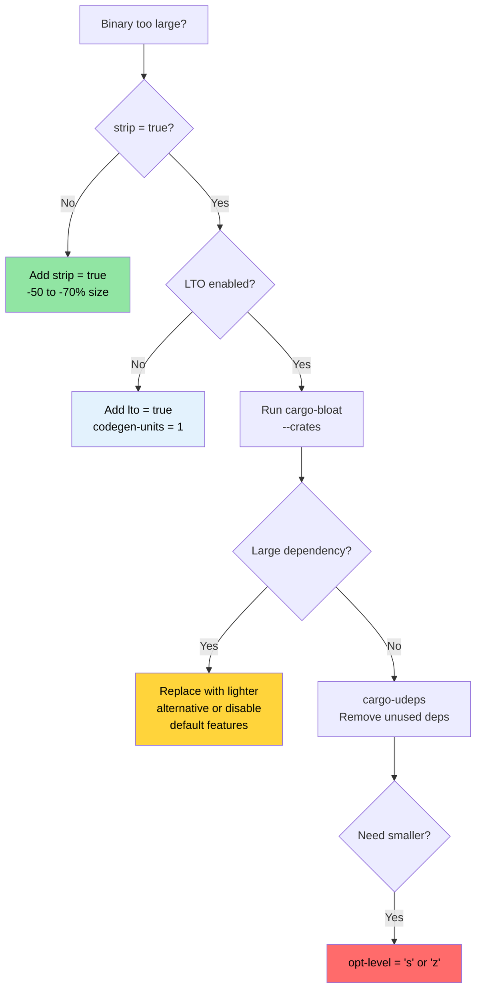

# 发布 Profiles 和二进制文件大小 🟡

> **你将学到：**
> - 发布 profile 解剖：LTO、codegen-units、panic 策略、strip、opt-level
> - Thin vs Fat vs 跨语言 LTO 权衡
> - 使用 `cargo-bloat` 进行二进制文件大小分析
> - 使用 `cargo-udeps` 和 `cargo-machete` 进行依赖修剪
>
> **交叉引用：** [编译时工具](ch08-compile-time-and-developer-tools.md) — 优化的另一半 · [基准测试](ch03-benchmarking-measuring-what-matters.md) — 在优化前测量运行时 · [依赖管理](ch06-dependency-management-and-supply-chain-s.md) — 修剪依赖同时减少大小和编译时间

默认的 `cargo build --release` 已经不错了。但对于生产部署——
尤其是部署到数千台服务器的单一二进制工具——
"不错"和"已优化"之间存在显著差距。本章涵盖 profile 旋钮和测量二进制文件大小的工具。

### 发布 Profile 解剖

Cargo profiles 控制 `rustc` 如何编译你的代码。默认是保守的——
为广泛兼容性设计，而不是最大性能：

```toml
# Cargo.toml — Cargo 的内置默认值（如果你什么都不指定，获得的就是这个）

[profile.release]
opt-level = 3        # 优化级别（0=无，1=基本，2=良好，3=激进）
lto = false          # 链接时优化关闭
codegen-units = 16   # 并行编译单元（编译更快，优化更少）
panic = "unwind"     # panic 时栈展开（更大的二进制文件，catch_unwind 工作）
strip = "none"       # 保留所有符号和调试信息
overflow-checks = false  # release 中没有整数溢出检查
debug = false        # release 中没有调试信息
```

**生产优化 profile**（项目已经使用的）：

```toml
[profile.release]
lto = true           # 完整跨 crate 优化
codegen-units = 1    # 单一 codegen 单元 — 最大优化机会
panic = "abort"      # 无展开开销 — 更小、更快
strip = true         # 移除所有符号 — 更小的二进制文件
```

**每个设置的影响：**

| 设置 | 默认 → 优化 | 二进制文件大小 | 运行时速度 | 编译时间 |
|---------|---------------------|-------------|---------------|--------------|
| `lto = false → true` | — | -10% 到 -20% | +5 到 +20% | 2-5× 更慢 |
| `codegen-units = 16 → 1` | — | -5% 到 -10% | +5% 到 +10% | 1.5-2× 更慢 |
| `panic = "unwind" → "abort"` | — | -5% 到 -10% | 可忽略 | 可忽略 |
| `strip = "none" → true` | — | -50% 到 -70% | 无 | 无 |
| `opt-level = 3 → "s"` | — | -10% 到 -30% | -5% 到 -10% | 相似 |
| `opt-level = 3 → "z"` | — | -15% 到 -40% | -10% 到 -20% | 相似 |

**额外的 profile 调整：**

```toml
[profile.release]
# 以上所有，加上：
overflow-checks = true    # 即使在 release 中也保持溢出检查（安全 > 速度）
debug = "line-tables-only" # 用于 backtrace 的最小调试信息，无需完整 DWARF
rpath = false             # 不嵌入运行时库路径
incremental = false       # 禁用增量编译（更干净的构建）

# 用于大小优化的构建（嵌入式、WASM）：
# opt-level = "z"         # 激进地为大小优化
# strip = "symbols"       # 剥离符号但保留调试部分
```

**每个 crate 的 profile 覆盖** — 优化热点 crate，其他保持不变：

```toml
# 开发构建：优化依赖但不优化你的代码（快速重新编译）
[profile.dev.package."*"]
opt-level = 2          # 在 dev 模式下优化所有依赖

# 发布构建：覆盖特定 crate 优化
[profile.release.package.serde_json]
opt-level = 3          # JSON 解析的最大优化
codegen-units = 1

# 测试 profile：匹配 release 行为以获得准确的集成测试
[profile.test]
opt-level = 1          # 一些优化以避免慢速测试超时
```

### LTO 深入 — Thin vs Fat vs 跨语言

链接时优化让 LLVM 跨 crate 边界进行优化——将 `serde_json` 中的函数内联到你的解析代码中，
从 `regex` 中移除死代码等。没有 LTO，每个 crate 都是一个独立的优化 island。

```toml
[profile.release]
# 选项 1：Fat LTO（当 lto = true 时的默认）
lto = true
# 所有代码合并到一个 LLVM 模块 → 最大优化
# 编译最慢，二进制文件最小/最快

# 选项 2：Thin LTO
lto = "thin"
# 每个 crate 保持独立但 LLVM 进行跨模块优化
# 比 fat LTO 编译更快，优化效果几乎一样
# 对大多数项目来说是最佳权衡

# 选项 3：无 LTO
lto = false
# 只有 crate 内部优化
# 编译最快，二进制文件更大

# 选项 4：关闭（显式）
lto = "off"
# 与 false 相同
```

**Fat LTO vs Thin LTO：**

| 方面 | Fat LTO (`true`) | Thin LTO (`"thin"`) |
|--------|-------------------|----------------------|
| 优化质量 | 最佳 | ~fat 的 95% |
| 编译时间 | 慢（所有代码在一个模块中） | 中等（并行模块） |
| 内存使用 | 高（所有 LLVM IR 在内存中） | 较低（流式） |
| 并行性 | 无（单模块） | 好（按模块） |
| 推荐用于 | 最终发布构建 | CI 构建、开发 |

**跨语言 LTO** — 跨 Rust 和 C 边界优化：

```toml
[profile.release]
lto = true

# Cargo.toml — 用于使用 cc crate 的 crate
[build-dependencies]
cc = "1.0"
```

```rust
// build.rs — 启用跨语言（链接器插件）LTO
fn main() {
    // cc crate 尊重环境中的 CFLAGS。
    // 对于跨语言 LTO，用以下方式编译 C 代码：
    //   -flto=thin -O2
    cc::Build::new()
        .file("csrc/fast_parser.c")
        .flag("-flto=thin")
        .opt_level(2)
        .compile("fast_parser");
}
```

```bash
# 启用链接器插件 LTO（需要兼容的 LLD 或 gold 链接器）
RUSTFLAGS="-Clinker-plugin-lto -Clinker=clang -Clink-arg=-fuse-ld=lld" \
    cargo build --release
```

跨语言 LTO 允许 LLVM 将 C 函数内联到 Rust 调用者中，反之亦然。
这对于 FFI 重代码影响最大，其中小型 C 函数被频繁调用（例如 IPMI ioctl 包装器）。

### 使用 cargo-bloat 进行二进制文件大小分析

[`cargo-bloat`](https://github.com/RazrFalcon/cargo-bloat) 回答：
"我的二进制文件中哪些函数和 crate 占用了最多空间？"

```bash
# 安装
cargo install cargo-bloat

# 显示最大的函数
cargo bloat --release -n 20
# 输出：
#  File  .text     Size          Crate    Name
#  2.8%   5.1%  78.5KiB  serde_json       serde_json::de::Deserializer::parse_...
#  2.1%   3.8%  58.2KiB  regex_syntax     regex_syntax::ast::parse::ParserI::p...
#  1.5%   2.7%  42.1KiB  accel_diag         accel_diag::vendor::parse_smi_output
#  ...

# 按 crate 显示（哪些依赖最大）
cargo bloat --release --crates
# 输出：
#  File  .text     Size Crate
# 12.3%  22.1%  340KiB serde_json
#  8.7%  15.6%  240KiB regex
#  6.2%  11.1%  170KiB std
#  5.1%   9.2%  141KiB accel_diag
#  ...

# 比较两个构建（优化前后）
cargo bloat --release --crates > before.txt
# ... 做出变更 ...
cargo bloat --release --crates > after.txt
diff before.txt after.txt
```

**常见的膨胀来源和修复：**

| 膨胀来源 | 典型大小 | 修复 |
|-------------|-------------|---------|
| `regex`（完整引擎） | 200-400 KB | 如果不需要 Unicode 使用 `regex-lite` |
| `serde_json`（完整） | 200-350 KB | 如果性能重要考虑 `simd-json` 或 `sonic-rs` |
| 泛型单态化 | 变化 | 在 API 边界使用 `dyn Trait` |
| 格式 machinery（`Display`、`Debug`） | 50-150 KB | 在大枚举上 `#[derive(Debug)]` 会累积 |
| Panic 消息字符串 | 20-80 KB | `panic = "abort"` 移除展开，`strip` 移除字符串 |
| 未使用的特性 | 变化 | 禁用默认特性：`serde = { version = "1", default-features = false }` |

### 使用 cargo-udeps 修剪依赖

[`cargo-udeps`](https://github.com/est31/cargo-udeps) 查找 `Cargo.toml` 中声明但你的代码实际未使用的依赖：

```bash
# 安装（需要 nightly）
cargo install cargo-udeps

# 查找未使用的依赖
cargo +nightly udeps --workspace
# 输出：
# unused dependencies:
# `diag_tool v0.1.0`
# └── "tempfile" (dev-dependency)
#
# `accel_diag v0.1.0`
# └── "once_cell"    ← 在 LazyLock 之前需要，现在已死
```

每个未使用的依赖：
- 增加编译时间
- 增加二进制文件大小
- 增加供应链风险
- 增加潜在的许可证复杂性

**替代方案：`cargo-machete`** — 更快，基于启发式的方法：

```bash
cargo install cargo-machete
cargo machete
# 更快但可能有误报（启发式，不是基于编译的）
```

### 大小优化决策树



### 🏋️ 练习

#### 🟢 练习 1：测量 LTO 影响

用默认发布设置构建一个项目，然后用 `lto = true` + `codegen-units = 1` + `strip = true` 构建。
比较二进制文件大小和编译时间。

<details>
<summary>解决方案</summary>

```bash
# 默认 release
cargo build --release
ls -lh target/release/my-binary
time cargo build --release  # 记录时间

# 优化 release — 添加到 Cargo.toml：
# [profile.release]
# lto = true
# codegen-units = 1
# strip = true
# panic = "abort"

cargo clean
cargo build --release
ls -lh target/release/my-binary  # 通常小 30-50%
time cargo build --release       # 通常编译慢 2-3×
```
</details>

#### 🟡 练习 2：找到你最大的 Crate

在项目上运行 `cargo bloat --release --crates`。识别最大的依赖。
你能通过禁用默认特性或切换到更轻量的替代方案来减少它吗？

<details>
<summary>解决方案</summary>

```bash
cargo install cargo-bloat
cargo bloat --release --crates
# 输出：
#  File  .text     Size Crate
# 12.3%  22.1%  340KiB serde_json
#  8.7%  15.6%  240KiB regex

# 对于 regex — 如果不需要 Unicode 尝试 regex-lite：
# regex-lite = "0.1"  # 比完整 regex 小约 10×

# 对于 serde — 如果不需要 std 则禁用默认特性：
# serde = { version = "1", default-features = false, features = ["derive"] }

cargo bloat --release --crates  # 变更后比较
```
</details>

### 关键要点

- `lto = true` + `codegen-units = 1` + `strip = true` + `panic = "abort"` 是生产发布 profile
- Thin LTO（`lto = "thin"`）以很小一部分的编译成本获得 Fat LTO 80% 的收益
- `cargo-bloat --crates` 准确告诉你哪些依赖占用了二进制空间
- `cargo-udeps` 和 `cargo-machete` 找到浪费编译时间和二进制文件大小的死依赖
- 每个 crate 的 profile 覆盖让你可以优化热点 crate 而不减慢整个构建

---

