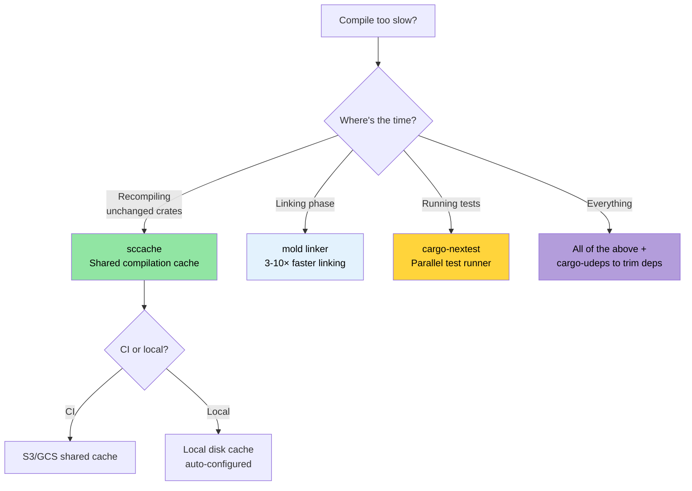

# 编译时和开发者工具 🟡

> **你将学到：**
> - 使用 `sccache` 进行本地和 CI 构建的编译缓存
> - 使用 `mold` 进行更快链接（比默认链接器快 3-10 倍）
> - `cargo-nextest`：更快、更多信息量的测试运行器
> - 开发者可见性工具：`cargo-expand`、`cargo-geiger`、`cargo-watch`
> - 工作空间 lint、MSRV 策略和文档即 CI
>
> **交叉引用：** [发布 Profiles](ch07-release-profiles-and-binary-size.md) — LTO 和二进制文件大小优化 · [CI/CD 流水线](ch11-putting-it-all-together-a-production-cic.md) — 这些工具集成到你的流水线中 · [依赖管理](ch06-dependency-management-and-supply-chain-s.md) — 更少的依赖 = 更快的编译

长编译时间是 Rust 中排名第一的开发者痛点。这些工具加起来可以减少 50-80% 的迭代时间：

### 编译时优化：sccache、mold、cargo-nextest

**`sccache` — 共享编译缓存：**

```bash
# 安装
cargo install sccache

# 配置为 Rust 包装器
export RUSTC_WRAPPER=sccache

# 或在 .cargo/config.toml 中永久设置：
# [build]
# rustc-wrapper = "sccache"

# 第一次构建：正常速度（填充缓存）
cargo build --release  # 3 分钟

# 清理 + 重建：未更改 crate 的缓存命中
cargo clean && cargo build --release  # 45 秒

# 检查缓存统计
sccache --show-stats
# Compile requests        1,234
# Cache hits               987 (80%)
# Cache misses             247
```

`sccache` 支持共享缓存（S3、GCS、Azure Blob）以实现团队范围和 CI 缓存共享。

**`mold` — 更快的链接器：**

链接通常是最慢的阶段。`mold` 比 `lld` 快 3-5 倍，比默认 GNU `ld` 快 10-20 倍：

```bash
# 安装
sudo apt install mold  # Ubuntu 22.04+
# 注意：mold 用于 ELF 目标（Linux）。macOS 使用 Mach-O，不是 ELF。
# macOS 链接器（ld64）已经相当快；如果需要更快：
# brew install sold     # sold = Mach-O 的 mold（实验性，不太成熟）
# 实际上，macOS 链接时间很少是瓶颈。

# 使用 mold 进行链接
# .cargo/config.toml
[target.x86_64-unknown-linux-gnu]
rustflags = ["-C", "link-arg=-fuse-ld=mold"]

# 验证 mold 正在使用
cargo build -v 2>&1 | grep mold
```

**`cargo-nextest` — 更快的测试运行器：**

```bash
# 安装
cargo install cargo-nextest

# 运行测试（默认并行，每个测试超时，重试）
cargo nextest run

# 相对于 cargo test 的关键优势：
# - 每个测试在自己的进程中运行 → 更好的隔离
# - 具有智能调度的并行执行
# - 每个测试超时（不再有挂起的 CI）
# - JUnit XML 输出用于 CI
# - 重试失败的测试

# 配置
cargo nextest run --retries 2 --fail-fast

# 存档测试二进制文件（对 CI 有用：构建一次，在多台机器上测试）
cargo nextest archive --archive-file tests.tar.zst
cargo nextest run --archive-file tests.tar.zst
```

```toml
# .config/nextest.toml
[profile.default]
retries = 0
slow-timeout = { period = "60s", terminate-after = 3 }
fail-fast = true

[profile.ci]
retries = 2
fail-fast = false
junit = { path = "test-results.xml" }
```

**组合开发配置：**

```toml
# .cargo/config.toml — 优化开发内循环
[build]
rustc-wrapper = "sccache"       # 缓存编译产物

[target.x86_64-unknown-linux-gnu]
rustflags = ["-C", "link-arg=-fuse-ld=mold"]  # 更快链接

# Dev profile：优化依赖但不优化你的代码
# （放入 Cargo.toml）
# [profile.dev.package."*"]
# opt-level = 2
```

### cargo-expand 和 cargo-geiger — 可见性工具

**`cargo-expand`** — 查看宏生成的内容：

```bash
cargo install cargo-expand

# 展开特定模块中的所有宏
cargo expand --lib accel_diag::vendor

# 展开特定 derive
# 给定：#[derive(Debug, Serialize, Deserialize)]
# cargo expand 显示生成的 impl 块
cargo expand --lib --tests
```

对于调试 `#[derive]` 宏输出、`macro_rules!` 扩展以及理解 `serde` 为你的类型生成的内容 invaluable。

**`cargo-geiger`** — 统计你的依赖树中 `unsafe` 的使用情况：

```bash
cargo install cargo-geiger

cargo geiger
# 输出：
# Metric output format: x/y
#   x = 构建使用的 unsafe 代码
#   y = crate 中找到的 unsafe 代码总量
#
# Functions  Expressions  Impls  Traits  Methods
# 0/0        0/0          0/0    0/0     0/0      ✅ my_crate
# 0/5        0/23         0/2    0/0     0/3      ✅ serde
# 3/3        14/14        0/0    0/0     2/2      ❗ libc
# 15/15      142/142      4/4    0/0     12/12    ☢️ ring

# 符号：
# ✅ = 未使用 unsafe
# ❗ = 使用了一些 unsafe
# ☢️ = 大量使用 unsafe
```

对于项目的零 unsafe 策略，`cargo geiger` 验证没有依赖将实际使用的 unsafe 代码引入调用图中。

### 工作空间 Lint — `[workspace.lints]`

自 Rust 1.74 起，你可以集中配置 Clippy 和编译器 lint 在
`Cargo.toml` 中——不再需要在每个 crate 顶部加 `#![deny(...)]`：

```toml
# 根 Cargo.toml — 所有 crate 的 lint 配置
[workspace.lints.clippy]
unwrap_used = "warn"         # 优先使用 ? 或 expect("reason")
dbg_macro = "deny"           # 提交代码中不允许 dbg!()
todo = "warn"                # 跟踪不完整的实现
large_enum_variant = "warn"  # 捕获意外的大小膨胀

[workspace.lints.rust]
unsafe_code = "deny"         # 强制执行零 unsafe 策略
missing_docs = "warn"        # 鼓励文档
```

```toml
# 每个 crate 的 Cargo.toml — 加入工作空间 lint
[lints]
workspace = true
```

这取代了分散的 `#![deny(clippy::unwrap_used)]` 属性，并确保整个工作空间的一致策略。

**自动修复 Clippy 警告：**

```bash
# 让 Clippy 自动修复机器可应用的建议
cargo clippy --fix --workspace --all-targets --allow-dirty

# 修复并应用可能改变行为的建议（仔细审查！）
cargo clippy --fix --workspace --all-targets --allow-dirty -- -W clippy::pedantic
```

> **提示**：在提交前运行 `cargo clippy --fix`。它处理繁琐的
> 问题（未使用的导入、冗余的克隆、类型简化），手动修复很乏味。

### MSRV 策略和 rust-version

最低支持 Rust 版本（MSRV）确保你的 crate 在较旧的工具链上编译。
当部署到具有冻结 Rust 版本的系统时，这很重要。

```toml
# Cargo.toml
[package]
name = "diag_tool"
version = "0.1.0"
rust-version = "1.75"    # 所需的最低 Rust 版本
```

```bash
# 验证 MSRV 合规性
cargo +1.75.0 check --workspace

# 自动 MSRV 发现
cargo install cargo-msrv
cargo msrv find
# 输出：Minimum Supported Rust Version is 1.75.0

# 在 CI 中验证
cargo msrv verify
```

**CI 中的 MSRV：**

```yaml
jobs:
  msrv:
    name: Check MSRV
    runs-on: ubuntu-latest
    steps:
      - uses: actions/checkout@v4
      - uses: dtolnay/rust-toolchain@master
        with:
          toolchain: "1.75.0"    # 与 Cargo.toml 中的 rust-version 匹配
      - run: cargo check --workspace
```

**MSRV 策略：**
- **二进制应用程序**（如大型项目）：使用最新稳定版。不需要 MSRV。
- **库 crate**（发布到 crates.io）：将 MSRV 设置为支持你使用的所有特性的最旧 Rust 版本。通常是 `N-2`（当前版本后两个）。
- **企业部署**：将 MSRV 设置为与你的集群上安装的最旧 Rust 版本匹配。

### 应用：生产二进制文件 Profile

该项目已经有优秀的[发布 profile](ch07-release-profiles-and-binary-size.md)：

```toml
# 当前工作空间 Cargo.toml
[profile.release]
lto = true           # ✅ 完整跨 crate 优化
codegen-units = 1    # ✅ 最大优化
panic = "abort"      # ✅ 无展开开销
strip = true         # ✅ 移除符号用于部署

[profile.dev]
opt-level = 0        # ✅ 快速编译
debug = true         # ✅ 完整调试信息
```

**建议的添加：**

```toml
# 在 dev 模式下优化依赖（更快的测试执行）
[profile.dev.package."*"]
opt-level = 2

# 测试 profile：一些优化以防止慢速测试超时
[profile.test]
opt-level = 1

# 在 release 中保持溢出检查（安全）
[profile.release]
lto = true
codegen-units = 1
panic = "abort"
strip = true
overflow-checks = true    # ← 添加这个：捕获整数溢出
debug = "line-tables-only" # ← 添加这个：无完整 DWARF 的 backtrace
```

**建议的开发者工具：**

```toml
# .cargo/config.toml（提议）
[build]
rustc-wrapper = "sccache"  # 首次构建后 80%+ 缓存命中率

[target.x86_64-unknown-linux-gnu]
rustflags = ["-C", "link-arg=-fuse-ld=mold"]  # 链接快 3-5 倍
```

**对项目的预期影响：**

| 指标 | 当前 | 添加后 |
|--------|---------|----------------|
| Release 二进制文件 | ~10 MB（剥离、LTO） | 相同 |
| Dev 构建时间 | ~45s | ~25s（sccache + mold） |
| 重建（1 个文件更改） | ~15s | ~5s（sccache + mold） |
| 测试执行 | `cargo test` | `cargo nextest` — 快 2 倍 |
| 依赖漏洞扫描 | 无 | CI 中 `cargo audit` |
| 许可证合规性 | 手动 | `cargo deny` 自动化 |
| 未使用依赖检测 | 手动 | CI 中 `cargo udeps` |

### `cargo-watch` — 文件更改时自动重建

[`cargo-watch`](https://github.com/watchexec/cargo-watch) 每次源文件更改时重新运行命令——
对于紧密反馈循环必不可少：

```bash
# 安装
cargo install cargo-watch

# 每次保存时重新检查（即时反馈）
cargo watch -x check

# 更改时运行 clippy + 测试
cargo watch -x 'clippy --workspace --all-targets' -x 'test --workspace --lib'

# 只监视特定 crate（对大型工作空间更快）
cargo watch -w accel_diag/src -x 'test -p accel_diag'

# 在运行之间清除屏幕
cargo watch -c -x check
```

> **提示**：与上面的 `mold` + `sccache` 结合使用，增量更改的重新检查时间可低于一秒。

### `cargo doc` 和工作空间文档

对于大型工作空间，生成的文档对可发现性必不可少。
`cargo doc` 使用 rustdoc 从文档注释和类型签名生成 HTML 文档：

```bash
# 为所有工作空间 crate 生成文档（在浏览器中打开）
cargo doc --workspace --no-deps --open

# 包含私有项（开发期间有用）
cargo doc --workspace --no-deps --document-private-items

# 检查 doc-links 而不生成 HTML（快速 CI 检查）
cargo doc --workspace --no-deps 2>&1 | grep -E 'warning|error'
```

**文档内链接** — 跨 crate 链接类型，无需 URL：

```rust
/// 使用 [`GpuConfig`] 设置运行 GPU 诊断。
///
/// 参见 [`crate::accel_diag::run_diagnostics`] 获取实现。
/// 返回 [`DiagResult`]，可以序列化为
/// [`DerReport`](crate::core_lib::DerReport) 格式。
pub fn run_accel_diag(config: &GpuConfig) -> DiagResult {
    // ...
}
```

**在文档中显示平台特定 API：**

```rust
// Cargo.toml: [package.metadata.docs.rs]
// all-features = true
// rustdoc-args = ["--cfg", "docsrs"]

/// 仅限 Windows：通过 Win32 API 读取电池状态。
///
/// 仅在 `cfg(windows)` 构建上可用。
#[cfg(windows)]
#[doc(cfg(windows))]  // 在文档中显示"仅在 Windows 上可用"徽章
pub fn get_battery_status() -> Option<u8> {
    // ...
}
```

**CI 文档检查：**

```yaml
# 添加到 CI 工作流
- name: Check documentation
  run: RUSTDOCFLAGS="-D warnings" cargo doc --workspace --no-deps
  # 将损坏的文档内链接视为错误
```

> **对于项目**：对于多个 crate，`cargo doc --workspace` 是新团队成员发现 API surface 的最佳方式。
> 在合并前将 `RUSTDOCFLAGS="-D warnings"` 添加到 CI 以捕获损坏的文档内链接。

### 编译时决策树



### 🏋️ 练习

#### 🟢 练习 1：设置 sccache + mold

安装 `sccache` 和 `mold`，在 `.cargo/config.toml` 中配置它们，
然后测量清理重建的编译时间改进。

<details>
<summary>解决方案</summary>

```bash
# 安装
cargo install sccache
sudo apt install mold  # Ubuntu 22.04+

# 配置 .cargo/config.toml：
cat > .cargo/config.toml << 'EOF'
[build]
rustc-wrapper = "sccache"

[target.x86_64-unknown-linux-gnu]
linker = "clang"
rustflags = ["-C", "link-arg=-fuse-ld=mold"]
EOF

# 第一次构建（填充缓存）
time cargo build --release  # 例如 180s

# 清理 + 重建（缓存命中）
cargo clean
time cargo build --release  # 例如 45s

sccache --show-stats
# 缓存命中率应该是 60-80%+
```
</details>

#### 🟡 练习 2：切换到 cargo-nextest

安装 `cargo-nextest` 并运行你的测试套件。
与 `cargo test` 比较墙上时间。加速是多少？

<details>
<summary>解决方案</summary>

```bash
cargo install cargo-nextest

# 标准测试运行器
time cargo test --workspace 2>&1 | tail -5

# nextest（每个测试二进制文件并行执行）
time cargo nextest run --workspace 2>&1 | tail -5

# 大型工作空间的典型加速：2-5 倍
# nextest 还提供：
# - 每个测试的计时
# - 闪烁测试的重试
# - 用于 CI 的 JUnit XML 输出
cargo nextest run --workspace --retries 2
```
</details>

### 关键要点

- 带有 S3/GCS 后端的 `sccache` 在团队和 CI 之间共享编译缓存
- `mold` 是最快的 ELF 链接器 — 链接时间从秒降到毫秒
- `cargo-nextest` 以更好的输出和重试支持并行运行每个二进制文件的测试
- `cargo-geiger` 统计 `unsafe` 使用情况 — 在接受新依赖之前运行它
- `[workspace.lints]` 在多 crate 工作空间中集中 Clippy 和 rustc lint 配置

---

