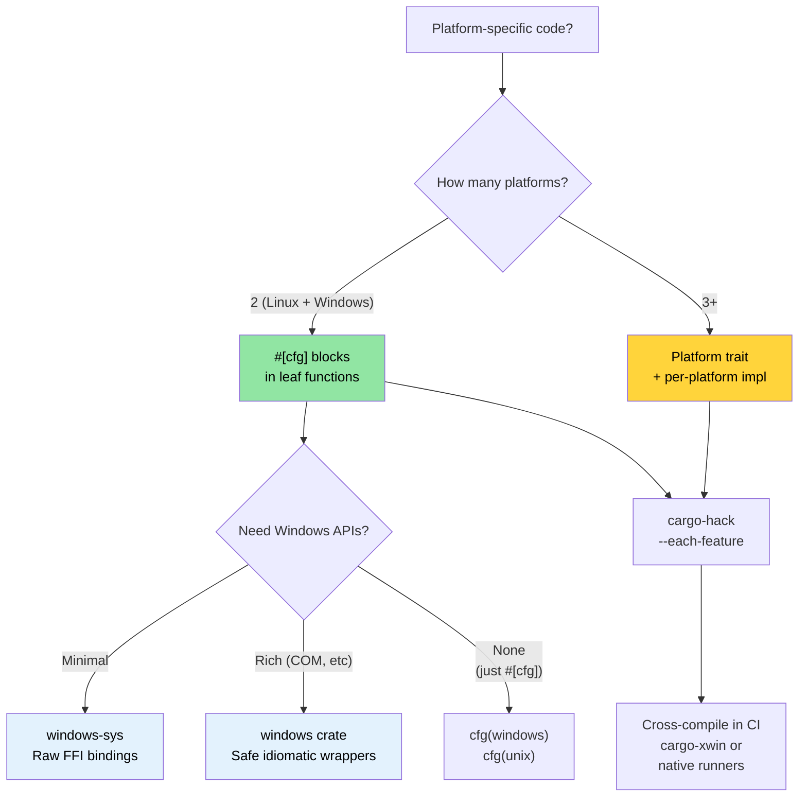

# Windows 和条件编译 🟡

> **你将学到：**
> - Windows 支持模式：`windows-sys`/`windows` crate、`cargo-xwin`
> - 使用 `#[cfg]` 进行条件编译 — 由编译器检查，而非预处理器
> - 平台抽象架构：何时 `#[cfg]` 块足够 vs 何时使用 traits
> - 从 Linux 交叉编译到 Windows
>
> **交叉引用：** [`no_std` 和特性](ch09-no-std-and-feature-verification.md) — `cargo-hack` 和特性验证 · [交叉编译](ch02-cross-compilation-one-source-many-target.md) — 一般交叉构建设置 · [构建脚本](ch01-build-scripts-buildrs-in-depth.md) — `build.rs` 发出的 `cfg` 标志

### Windows 支持 — 平台抽象

Rust 的 `#[cfg()]` 属性和 Cargo 特性允许单一代码库干净地同时面向 Linux 和 Windows。
该项目在 `platform::run_command` 中已经演示了这个模式：

```rust
// 项目中的真实模式 — 平台特定的 shell 调用
pub fn exec_cmd(cmd: &str, timeout_secs: Option<u64>) -> Result<CommandResult, CommandError> {
    #[cfg(windows)]
    let mut child = Command::new("cmd")
        .args(["/C", cmd])
        .stdout(Stdio::piped())
        .stderr(Stdio::piped())
        .spawn()?;

    #[cfg(not(windows))]
    let mut child = Command::new("sh")
        .args(["-c", cmd])
        .stdout(Stdio::piped())
        .stderr(Stdio::piped())
        .spawn()?;

    // ... 其余是平台无关的 ...
}
```

**可用的 `cfg` 谓词：**

```rust
// 操作系统
#[cfg(target_os = "linux")]         // 专门针对 Linux
#[cfg(target_os = "windows")]       // Windows
#[cfg(target_os = "macos")]         // macOS
#[cfg(unix)]                        // Linux、macOS、BSD 等
#[cfg(windows)]                     // Windows（简写）

// 架构
#[cfg(target_arch = "x86_64")]      // x86 64 位
#[cfg(target_arch = "aarch64")]     // ARM 64 位
#[cfg(target_arch = "x86")]         // x86 32 位

// 指针宽度（架构的可移植替代）
#[cfg(target_pointer_width = "64")] // 任何 64 位平台
#[cfg(target_pointer_width = "32")] // 任何 32 位平台

// 环境 / C 库
#[cfg(target_env = "gnu")]          // glibc
#[cfg(target_env = "musl")]         // musl libc
#[cfg(target_env = "msvc")]         // Windows 上的 MSVC

// 字节序
#[cfg(target_endian = "little")]
#[cfg(target_endian = "big")]

// 与 any()、all()、not() 组合
#[cfg(all(target_os = "linux", target_arch = "x86_64"))]
#[cfg(any(target_os = "linux", target_os = "macos"))]
#[cfg(not(windows))]
```

### `windows-sys` 和 `windows` Crate

用于直接调用 Windows API：

```toml
# Cargo.toml — 使用 windows-sys 进行原始 FFI（更轻量，无抽象）
[target.'cfg(windows)'.dependencies]
windows-sys = { version = "0.59", features = [
    "Win32_Foundation",
    "Win32_System_Services",
    "Win32_System_Registry",
    "Win32_System_Power",
] }
# 注意：windows-sys 使用不符合 semver 的版本（0.48 → 0.52 → 0.59）。
# 固定到单个次版本 — 每个版本可能删除或重命名 API 绑定。
# 在开始新项目之前检查 https://github.com/microsoft/windows-rs 获取最新版本。

# 或使用 windows crate 获取安全包装器（更重，更符合人体工程学）
# windows = { version = "0.59", features = [...] }
```

```rust
// src/platform/windows.rs
#[cfg(windows)]
mod win {
    use windows_sys::Win32::System::Power::{
        GetSystemPowerStatus, SYSTEM_POWER_STATUS,
    };

    pub fn get_battery_status() -> Option<u8> {
        let mut status = SYSTEM_POWER_STATUS::default();
        // SAFETY: GetSystemPowerStatus 写入提供的缓冲区。
        // 缓冲区大小和对齐正确。
        let ok = unsafe { GetSystemPowerStatus(&mut status) };
        if ok != 0 {
            Some(status.BatteryLifePercent)
        } else {
            None
        }
    }
}
```

**`windows-sys` vs `windows` crate：**

| 方面 | `windows-sys` | `windows` |
|--------|---------------|----------|
| API 风格 | 原始 FFI（`unsafe` 调用） | 安全 Rust 包装器 |
| 二进制文件大小 | 最小（只是 extern 声明） | 更大（包装器代码） |
| 编译时间 | 快 | 更慢 |
| 人体工程学 | C 风格，手动安全 | 符合 Rust 习惯 |
| 错误处理 | 原始 `BOOL` / `HRESULT` | `Result<T, windows::core::Error>` |
| 何时使用 | 性能关键，薄包装器 | 应用程序代码，易用性 |

### 从 Linux 交叉编译到 Windows

```bash
# 选项 1：MinGW（GNU ABI）
rustup target add x86_64-pc-windows-gnu
sudo apt install gcc-mingw-w64-x86-64
cargo build --target x86_64-pc-windows-gnu
# 生成 .exe — 在 Windows 上运行，链接到 msvcrt

# 选项 2：通过 xwin 的 MSVC ABI（完全 MSVC 兼容性）
cargo install cargo-xwin
cargo xwin build --target x86_64-pc-windows-msvc
# 使用自动下载的 Microsoft CRT 和 SDK 头文件

# 选项 3：基于 Zig 的交叉编译
cargo zigbuild --target x86_64-pc-windows-gnu
```

**Windows 上的 GNU vs MSVC ABI：**

| 方面 | `x86_64-pc-windows-gnu` | `x86_64-pc-windows-msvc` |
|--------|-------------------------|---------------------------|
| 链接器 | MinGW `ld` | MSVC `link.exe` 或 `lld-link` |
| C 运行时 | `msvcrt.dll`（通用） | `ucrtbase.dll`（现代） |
| C++ 互操作 | GCC ABI | MSVC ABI |
| 从 Linux 交叉编译 | 简单（MinGW） | 可能（`cargo-xwin`） |
| Windows API 支持 | 完整 | 完整 |
| 调试信息格式 | DWARF | PDB |
| 推荐用于 | 简单工具、CI 构建 | 完全 Windows 集成 |

### 条件编译模式

**模式 1：平台模块选择**

```rust
// src/platform/mod.rs — 每个 OS 编译不同模块
#[cfg(target_os = "linux")]
mod linux;
#[cfg(target_os = "linux")]
pub use linux::*;

#[cfg(target_os = "windows")]
mod windows;
#[cfg(target_os = "windows")]
pub use windows::*;

// 两个模块实现相同的公共 API：
// pub fn get_cpu_temperature() -> Result<f64, PlatformError>
// pub fn list_pci_devices() -> Result<Vec<PciDevice>, PlatformError>
```

**模式 2：特性门控平台支持**

```toml
# Cargo.toml
[features]
default = ["linux"]
linux = []              # Linux 特定硬件访问
windows = ["dep:windows-sys"]  # Windows 特定 API

[target.'cfg(windows)'.dependencies]
windows-sys = { version = "0.59", features = [...], optional = true }
```

```rust
// 如果有人尝试在没有特性的情况下为 Windows 构建，编译错误：
#[cfg(all(target_os = "windows", not(feature = "windows")))]
compile_error!("Enable the 'windows' feature to build for Windows");
```

**模式 3：基于 trait 的平台抽象**

```rust
/// 硬件访问的平台无关接口。
pub trait HardwareAccess {
    type Error: std::error::Error;

    fn read_cpu_temperature(&self) -> Result<f64, Self::Error>;
    fn read_gpu_temperature(&self, gpu_index: u32) -> Result<f64, Self::Error>;
    fn list_pci_devices(&self) -> Result<Vec<PciDevice>, Self::Error>;
    fn send_ipmi_command(&self, cmd: &IpmiCmd) -> Result<IpmiResponse, Self::Error>;
}

#[cfg(target_os = "linux")]
pub struct LinuxHardware;

#[cfg(target_os = "linux")]
impl HardwareAccess for LinuxHardware {
    type Error = LinuxHwError;

    fn read_cpu_temperature(&self) -> Result<f64, Self::Error> {
        // 从 /sys/class/thermal/thermal_zone0/temp 读取
        let raw = std::fs::read_to_string("/sys/class/thermal/thermal_zone0/temp")?;
        Ok(raw.trim().parse::<f64>()? / 1000.0)
    }
    // ...
}

#[cfg(target_os = "windows")]
pub struct WindowsHardware;

#[cfg(target_os = "windows")]
impl HardwareAccess for WindowsHardware {
    type Error = WindowsHwError;

    fn read_cpu_temperature(&self) -> Result<f64, Self::Error> {
        // 通过 WMI (Win32_TemperatureProbe) 或 Open Hardware Monitor 读取
        todo!("WMI temperature query")
    }
    // ...
}

/// 创建平台适当的实现
pub fn create_hardware() -> impl HardwareAccess {
    #[cfg(target_os = "linux")]
    { LinuxHardware }
    #[cfg(target_os = "windows")]
    { WindowsHardware }
}
```

### 平台抽象架构

对于面向多个平台的项目，将代码组织成三层：

```text
┌──────────────────────────────────────────────────┐
│ 应用程序逻辑（平台无关）                               │
│  diag_tool, accel_diag, network_diag, event_log, 等.     │
│  只使用平台抽象 trait                                │
├──────────────────────────────────────────────────┤
│ 平台抽象层（trait 定义）                              │
│  trait HardwareAccess { ... }                      │
│  trait CommandRunner { ... }                      │
│  trait FileSystem { ... }                         │
├──────────────────────────────────────────────────┤
│ 平台实现（cfg 门控）                                  │
│  ┌──────────────┐  ┌──────────────┐              │
│  │ Linux impl   │  │ Windows impl │              │
│  │ /sys, /proc  │  │ WMI, Registry│              │
│  │ ipmitool     │  │ ipmiutil     │              │
│  │ lspci        │  │ devcon       │              │
│  └──────────────┘  └──────────────┘              │
└──────────────────────────────────────────────────┘
```

**测试抽象**：为单元测试 mock 平台 trait：

```rust
#[cfg(test)]
mod tests {
    use super::*;

    struct MockHardware {
        cpu_temp: f64,
        gpu_temps: Vec<f64>,
    }

    impl HardwareAccess for MockHardware {
        type Error = std::io::Error;

        fn read_cpu_temperature(&self) -> Result<f64, Self::Error> {
            Ok(self.cpu_temp)
        }

        fn read_gpu_temperature(&self, index: u32) -> Result<f64, Self::Error> {
            self.gpu_temps.get(index as usize)
                .copied()
                .ok_or_else(|| std::io::Error::new(
                    std::io::ErrorKind::NotFound,
                    format!("GPU {index} not found")
                ))
        }

        fn list_pci_devices(&self) -> Result<Vec<PciDevice>, Self::Error> {
            Ok(vec![]) // Mock 返回空
        }

        fn send_ipmi_command(&self, _cmd: &IpmiCmd) -> Result<IpmiResponse, Self::Error> {
            Ok(IpmiResponse::default())
        }
    }

    #[test]
    fn test_thermal_check_with_mock() {
        let hw = MockHardware {
            cpu_temp: 75.0,
            gpu_temps: vec![82.0, 84.0],
        };
        let result = run_thermal_diagnostic(&hw);
        assert!(result.is_ok());
    }
}
```

### 应用：Linux 优先，Windows 就绪

该项目已经部分 Windows 就绪。使用
[`cargo-hack`](ch09-no-std-and-feature-verification.md) 验证所有特性组合，
并从 [交叉编译](ch02-cross-compilation-one-source-many-target.md) 在 Linux 上测试 Windows：

**已完成：**
- `platform::run_command` 使用 `#[cfg(windows)]` 进行 shell 选择
- 测试使用 `#[cfg(windows)]` / `#[cfg(not(windows))]` 进行平台适当的测试命令

**Windows 支持的建议演进路径：**

```text
阶段 1：提取平台抽象 trait（当前 → 2 周）
  ├─ 在 core_lib 中定义 HardwareAccess trait
  ├─ 将当前 Linux 代码包装在 LinuxHardware impl 后面
  └─ 所有诊断模块依赖 trait，而非 Linux 特定

阶段 2：添加 Windows 存根（2 周）
  ├─ 用 TODO 存根实现 WindowsHardware
  ├─ CI 为 x86_64-pc-windows-msvc 构建（仅编译检查）
  └─ 测试在所有平台上通过 MockHardware

阶段 3：Windows 实现（进行中）
  ├─ 通过 ipmiutil.exe 或 OpenIPMI Windows 驱动程序的 IPMI
  ├─ 通过 accel-mgmt (accel-api.dll) 的 GPU — 与 Linux 相同的 API
  ├─ 通过 Windows Setup API (SetupDiEnumDeviceInfo) 的 PCIe
  └─ 通过 WMI (Win32_NetworkAdapter) 的 NIC
```

**跨平台 CI 添加：**

```yaml
# 添加到 CI 矩阵
- target: x86_64-pc-windows-msvc
  os: windows-latest
  name: windows-x86_64
```

这确保代码库即使在完整的 Windows 实现完成之前也能在 Windows 上编译 —
及早捕获 `cfg` 错误。

> **关键见解**：抽象在第一天不需要是完美的。
> 从叶函数中的 `#[cfg]` 块开始（如 `exec_cmd` 已经做的），
> 然后当有两个或更多平台实现时重构为 traits。
> 过早抽象比 `#[cfg]` 块更糟糕。

### 条件编译决策树



### 🏋️ 练习

#### 🟢 练习 1：平台条件模块

创建一个带有 `#[cfg(unix)]` 和 `#[cfg(windows)]` 实现的 `get_hostname()` 函数模块。
用 `cargo check` 和 `cargo check --target x86_64-pc-windows-msvc` 验证两者都编译。

<details>
<summary>解决方案</summary>

```rust
// src/hostname.rs
#[cfg(unix)]
pub fn get_hostname() -> String {
    use std::fs;
    fs::read_to_string("/etc/hostname")
        .unwrap_or_else(|_| "unknown".to_string())
        .trim()
        .to_string()
}

#[cfg(windows)]
pub fn get_hostname() -> String {
    use std::env;
    env::var("COMPUTERNAME").unwrap_or_else(|_| "unknown".to_string())
}

#[cfg(test)]
mod tests {
    use super::*;

    #[test]
    fn hostname_is_not_empty() {
        let name = get_hostname();
        assert!(!name.is_empty());
    }
}
```

```bash
# 验证 Linux 编译
cargo check

# 验证 Windows 编译（交叉检查）
rustup target add x86_64-pc-windows-msvc
cargo check --target x86_64-pc-windows-msvc
```
</details>

#### 🟡 练习 2：使用 cargo-xwin 交叉编译到 Windows

安装 `cargo-xwin` 并从 Linux 为 `x86_64-pc-windows-msvc` 构建一个简单二进制文件。
验证输出是 `.exe`。

<details>
<summary>解决方案</summary>

```bash
cargo install cargo-xwin
rustup target add x86_64-pc-windows-msvc

cargo xwin build --release --target x86_64-pc-windows-msvc
# 自动下载 Windows SDK 头文件/库

file target/x86_64-pc-windows-msvc/release/my-binary.exe
# Output: PE32+ executable (console) x86-64, for MS Windows

# 你也可以用 Wine 测试：
wine target/x86_64-pc-windows-msvc/release/my-binary.exe
```
</details>

### 关键要点

- 从叶函数中的 `#[cfg]` 块开始；只有当三个或更多平台分化时才重构为 traits
- `windows-sys` 用于原始 FFI；`windows` crate 提供安全的、符合习惯的包装器
- `cargo-xwin` 从 Linux 交叉编译到 Windows MSVC ABI — 无需 Windows 机器
- 即使你只在 Linux 上发布，始终在 CI 中检查 `--target x86_64-pc-windows-msvc`
- 将 `#[cfg]` 与 Cargo 特性结合用于可选平台支持（例如 `feature = "windows"`）

---

