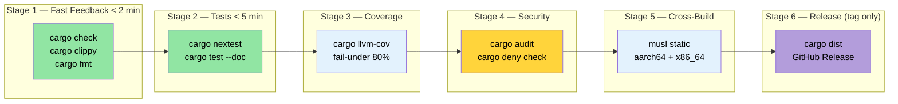

# 整合一切 — 生产 CI/CD 流水线 🟡

> **你将学到：**
> - 构建多阶段 GitHub Actions CI 工作流（check → test → coverage → security → cross → release）
> - 使用 `rust-cache` 和 `save-if` 调优的缓存策略
> - 在 nightly 计划上运行 Miri 和 sanitizer
> - 使用 Makefile.toml 和 pre-commit hooks 进行任务自动化
> - 使用 `cargo-dist` 自动发布
>
> **交叉引用：** [构建脚本](ch01-build-scripts-buildrs-in-depth.md) · [交叉编译](ch02-cross-compilation-one-source-many-target.md) · [基准测试](ch03-benchmarking-measuring-what-matters.md) · [覆盖率](ch04-code-coverage-seeing-what-tests-miss.md) · [Miri/Sanitizer](ch05-miri-valgrind-and-sanitizers-verifying-u.md) · [依赖管理](ch06-dependency-management-and-supply-chain-s.md) · [发布 Profiles](ch07-release-profiles-and-binary-size.md) · [编译时工具](ch08-compile-time-and-developer-tools.md) · [`no_std`](ch09-no-std-and-feature-verification.md) · [Windows](ch10-windows-and-conditional-compilation.md)

单独的工具有用。在每次推送时自动编排它们的流水线是变革性的。
本章将第 1-10 章的工具组装成一个内聚的 CI/CD 工作流。

### 完整的 GitHub Actions 工作流

一个在并行运行所有验证阶段的单一工作流文件：

```yaml
# .github/workflows/ci.yml
name: CI

on:
  push:
    branches: [main]
  pull_request:
    branches: [main]

env:
  CARGO_TERM_COLOR: always
  CARGO_ENCODED_RUSTFLAGS: "-Dwarnings"  # 将警告视为错误（仅顶层 crate）
  # 注意：与 RUSTFLAGS 不同，CARGO_ENCODED_RUSTFLAGS 不影响构建脚本
  # 或 proc-macros，这避免了对第三方警告的虚假失败。
  # 如果也想对构建脚本强制执行，使用 RUSTFLAGS="-Dwarnings"。

jobs:
  # ─── 阶段 1：快速反馈（< 2 分钟） ───
  check:
    name: Check + Clippy + Format
    runs-on: ubuntu-latest
    steps:
      - uses: actions/checkout@v4
      - uses: dtolnay/rust-toolchain@stable
        with:
          components: clippy, rustfmt

      - uses: Swatinem/rust-cache@v2  # 缓存依赖

      - name: 检查编译
        run: cargo check --workspace --all-targets --all-features

      - name: Clippy lints
        run: cargo clippy --workspace --all-targets --all-features -- -D warnings

      - name: 格式化
        run: cargo fmt --all -- --check

  # ─── 阶段 2：测试（< 5 分钟） ───
  test:
    name: Test (${{ matrix.os }})
    needs: check
    strategy:
      matrix:
        os: [ubuntu-latest, windows-latest]
    runs-on: ${{ matrix.os }}
    steps:
      - uses: actions/checkout@v4
      - uses: dtolnay/rust-toolchain@stable
      - uses: Swatinem/rust-cache@v2

      - name: 运行测试
        run: cargo test --workspace

      - name: 运行文档测试
        run: cargo test --workspace --doc

  # ─── 阶段 3：交叉编译（< 10 分钟） ───
  cross:
    name: Cross (${{ matrix.target }})
    needs: check
    strategy:
      matrix:
        include:
          - target: x86_64-unknown-linux-musl
            os: ubuntu-latest
          - target: aarch64-unknown-linux-gnu
            os: ubuntu-latest
            use_cross: true
    runs-on: ${{ matrix.os }}
    steps:
      - uses: actions/checkout@v4
      - uses: dtolnay/rust-toolchain@stable
        with:
          targets: ${{ matrix.target }}

      - name: 安装 musl-tools
        if: contains(matrix.target, 'musl')
        run: sudo apt-get install -y musl-tools

      - name: 安装 cross
        if: matrix.use_cross
        uses: taiki-e/install-action@cross

      - name: 构建（原生）
        if: "!matrix.use_cross"
        run: cargo build --release --target ${{ matrix.target }}

      - name: 构建（交叉）
        if: matrix.use_cross
        run: cross build --release --target ${{ matrix.target }}

      - name: 上传产物
        uses: actions/upload-artifact@v4
        with:
          name: binary-${{ matrix.target }}
          path: target/${{ matrix.target }}/release/diag_tool

  # ─── 阶段 4：覆盖率（< 10 分钟） ───
  coverage:
    name: Code Coverage
    needs: check
    runs-on: ubuntu-latest
    steps:
      - uses: actions/checkout@v4
      - uses: dtolnay/rust-toolchain@stable
        with:
          components: llvm-tools-preview
      - uses: taiki-e/install-action@cargo-llvm-cov

      - name: 生成覆盖率
        run: cargo llvm-cov --workspace --lcov --output-path lcov.info

      - name: 执行最低覆盖率
        run: cargo llvm-cov --workspace --fail-under-lines 75

      - name: 上传到 Codecov
        uses: codecov/codecov-action@v4
        with:
          files: lcov.info
          token: ${{ secrets.CODECOV_TOKEN }}

  # ─── 阶段 5：安全验证（< 15 分钟） ───
  miri:
    name: Miri
    needs: check
    runs-on: ubuntu-latest
    steps:
      - uses: actions/checkout@v4
      - uses: dtolnay/rust-toolchain@nightly
        with:
          components: miri

      - name: 运行 Miri
        run: cargo miri test --workspace
        env:
          MIRIFLAGS: "-Zmiri-backtrace=full"

  # ─── 阶段 6：基准测试（仅 PR，< 10 分钟） ───
  bench:
    name: Benchmarks
    if: github.event_name == 'pull_request'
    needs: check
    runs-on: ubuntu-latest
    steps:
      - uses: actions/checkout@v4
      - uses: dtolnay/rust-toolchain@stable

      - name: 运行基准测试
        run: cargo bench -- --output-format bencher | tee bench.txt

      - name: 与基线比较
        uses: benchmark-action/github-action-benchmark@v1
        with:
          tool: 'cargo'
          output-file-path: bench.txt
          github-token: ${{ secrets.GITHUB_TOKEN }}
          alert-threshold: '115%'
          comment-on-alert: true
```

**流水线执行流程：**

```text
                    ┌─────────┐
                    │  check  │  ← clippy + fmt + cargo check (2 min)
                    └────┬────┘
           ┌─────────┬──┴──┬──────────┬──────────┐
           ▼         ▼     ▼          ▼          ▼
       ┌──────┐  ┌──────┐ ┌────────┐ ┌──────┐ ┌──────┐
       │ test │  │cross │ │coverage│ │ miri │ │bench │
       │ (2×) │  │ (2×) │ │        │ │      │ │(PR)  │
       └──────┘  └──────┘ └────────┘ └──────┘ └──────┘
         3 min    8 min     8 min     12 min    5 min

总墙上时间：~14 分钟（通过检查门控后的并行）
```

### CI 缓存策略

[`Swatinem/rust-cache@v2`](https://github.com/Swatinem/rust-cache) 是标准的 Rust CI 缓存 action。
它缓存 `~/.cargo` 和 `target/` 在运行之间，但大型工作空间需要调优：

```yaml
# 基本（我们在上面使用的）
- uses: Swatinem/rust-cache@v2

# 为大型工作空间调优：
- uses: Swatinem/rust-cache@v2
  with:
    # 每个作业独立缓存 — 防止测试产物使构建缓存膨胀
    prefix-key: "v1-rust"
    key: ${{ matrix.os }}-${{ matrix.target || 'default' }}
    # 只在 main 分支保存缓存（PR 读取但不写入）
    save-if: ${{ github.ref == 'refs/heads/main' }}
    # 缓存 Cargo registry + git checkouts + target 目录
    cache-targets: true
    cache-all-crates: true
```

**缓存失效注意事项：**

| 问题 | 修复 |
|---------|-----|
| 缓存无限增长（>5 GB） | 设置 `prefix-key: "v2-rust"` 强制刷新缓存 |
| 不同特性污染缓存 | 使用 `key: ${{ hashFiles('**/Cargo.lock') }}` |
| PR 缓存覆盖 main | 设置 `save-if: ${{ github.ref == 'refs/heads/main' }}` |
| 交叉编译目标膨胀 | 为每个目标三元组使用独立的 `key` |

**在作业之间共享缓存：**

`check` 作业保存缓存；下游作业（`test`、`cross`、`coverage`）读取它。
使用 `save-if` 仅在 `main` 上，PR 运行获得缓存依赖的好处而不写入过时缓存。

> **在大型工作空间上的测量影响**：冷构建 ~4 分钟 → 缓存构建 ~45 秒。
> 仅缓存 action 每次流水线运行（跨所有并行作业）节省约 25 分钟 CI 时间。

### 使用 cargo-make 的 Makefile.toml

[`cargo-make`](https://sagiegurari.github.io/cargo-make/) 提供了一个跨平台的可移植任务运行器
（与 `make`/`Makefile` 不同）：

```bash
# 安装
cargo install cargo-make
```

```toml
# Makefile.toml — 在工作空间根目录

[config]
default_to_workspace = false

# ─── 开发者工作流 ───

[tasks.dev]
description = "完整本地验证（与 CI 相同）"
dependencies = ["check", "test", "clippy", "fmt-check"]

[tasks.check]
command = "cargo"
args = ["check", "--workspace", "--all-targets"]

[tasks.test]
command = "cargo"
args = ["test", "--workspace"]

[tasks.clippy]
command = "cargo"
args = ["clippy", "--workspace", "--all-targets", "--", "-D", "warnings"]

[tasks.fmt]
command = "cargo"
args = ["fmt", "--all"]

[tasks.fmt-check]
command = "cargo"
args = ["fmt", "--all", "--", "--check"]

# ─── 覆盖率 ───

[tasks.coverage]
description = "生成 HTML 覆盖率报告"
install_crate = "cargo-llvm-cov"
command = "cargo"
args = ["llvm-cov", "--workspace", "--html", "--open"]

[tasks.coverage-ci]
description = "生成用于 CI 上传的 LCOV"
install_crate = "cargo-llvm-cov"
command = "cargo"
args = ["llvm-cov", "--workspace", "--lcov", "--output-path", "lcov.info"]

# ─── 基准测试 ───

[tasks.bench]
description = "运行所有基准测试"
command = "cargo"
args = ["bench"]

# ─── 交叉编译 ───

[tasks.build-musl]
description = "构建静态二进制文件（musl）"
command = "cargo"
args = ["build", "--release", "--target", "x86_64-unknown-linux-musl"]

[tasks.build-arm]
description = "为 aarch64 构建（需要 cross）"
command = "cross"
args = ["build", "--release", "--target", "aarch64-unknown-linux-gnu"]

[tasks.build-all]
description = "为所有部署目标构建"
dependencies = ["build-musl", "build-arm"]

# ─── 安全验证 ───

[tasks.miri]
description = "在所有测试上运行 Miri"
toolchain = "nightly"
command = "cargo"
args = ["miri", "test", "--workspace"]

[tasks.audit]
description = "检查已知漏洞"
install_crate = "cargo-audit"
command = "cargo"
args = ["audit"]

# ─── 发布 ───

[tasks.release-dry]
description = "预览 cargo-release 会做什么"
install_crate = "cargo-release"
command = "cargo"
args = ["release", "--workspace", "--dry-run"]
```

**用法：**

```bash
# 在本地等同于 CI 流水线
cargo make dev

# 生成并查看覆盖率
cargo make coverage

# 为所有目标构建
cargo make build-all

# 运行安全检查
cargo make miri

# 检查漏洞
cargo make audit
```

### Pre-Commit Hooks：自定义脚本和 `cargo-husky`

在问题到达 CI 之前捕获它们。推荐的方法是自定义 git hook —
它简单、透明，没有外部依赖：

```bash
#!/bin/sh
# .githooks/pre-commit

set -e

echo "=== Pre-commit checks ==="

# 首先是快速检查
echo "→ cargo fmt --check"
cargo fmt --all -- --check

echo "→ cargo check"
cargo check --workspace --all-targets

echo "→ cargo clippy"
cargo clippy --workspace --all-targets -- -D warnings

echo "→ cargo test (lib only, fast)"
cargo test --workspace --lib

echo "=== All checks passed ==="
```

```bash
# 安装 hook
git config core.hooksPath .githooks
chmod +x .githooks/pre-commit
```

**替代方案：`cargo-husky`**（通过构建脚本自动安装 hooks）：

> ⚠️ **注意**：`cargo-husky` 自 2022 年以来未更新。它仍然工作，
> 但实际上已不再维护。对于新项目，请考虑上面的自定义 hook 方法。

```bash
cargo install cargo-husky
```

```toml
# Cargo.toml — 添加到根 crate 的 dev-dependencies
[dev-dependencies]
cargo-husky = { version = "1", default-features = false, features = [
    "precommit-hook",
    "run-cargo-check",
    "run-cargo-clippy",
    "run-cargo-fmt",
    "run-cargo-test",
] }
```

### 发布工作流：`cargo-release` 和 `cargo-dist`

**`cargo-release`** — 自动化版本递增、打标签和发布：

```bash
# 安装
cargo install cargo-release
```

```toml
# release.toml — 在工作空间根目录
[workspace]
consolidate-commits = true
pre-release-commit-message = "chore: release {{version}}"
tag-message = "v{{version}}"
tag-name = "v{{version}}"

# 不发布内部 crate
[[package]]
name = "core_lib"
release = false

[[package]]
name = "diag_framework"
release = false

# 只发布主二进制文件
[[package]]
name = "diag_tool"
release = true
```

```bash
# 预览发布
cargo release patch --dry-run

# 执行发布（递增版本、提交、标签、可选发布）
cargo release patch --execute
# 0.1.0 → 0.1.1

cargo release minor --execute
# 0.1.1 → 0.2.0
```

**`cargo-dist`** — 为 GitHub Releases 生成可下载的发布二进制文件：

```bash
# 安装
cargo install cargo-dist

# 初始化（创建 CI 工作流 + 元数据）
cargo dist init

# 预览将要构建的内容
cargo dist plan

# 生成发布（通常在标签推送时由 CI 完成）
cargo dist build
```

```toml
# 从 `cargo dist init` 添加到 Cargo.toml
[workspace.metadata.dist]
cargo-dist-version = "0.28.0"
ci = "github"
targets = [
    "x86_64-unknown-linux-gnu",
    "x86_64-unknown-linux-musl",
    "aarch64-unknown-linux-gnu",
    "x86_64-pc-windows-msvc",
]
install-path = "CARGO_HOME"
```

这会生成一个 GitHub Actions 工作流，在标签推送时：
1. 为所有目标平台构建二进制文件
2. 创建带有可下载 `.tar.gz` / `.zip` 存档的 GitHub Release
3. 生成 shell/PowerShell 安装脚本
4. 发布到 crates.io（如果已配置）

### 亲身体验 — 顶点练习

这个练习将每章内容联系在一起。你将为全新的 Rust 工作空间构建一个完整的工程流水线：

1. **创建一个新工作空间**，包含两个 crate：一个库（`core_lib`）和一个二进制文件（`cli`）。
   添加一个使用 `SOURCE_DATE_EPOCH` 嵌入 git 哈希和构建时间戳的 `build.rs`（ch01）。

2. **设置交叉编译**，为 `x86_64-unknown-linux-musl` 和 `aarch64-unknown-linux-gnu` 构建。
   用 `cargo zigbuild` 或 `cross` 验证两个目标都构建（ch02）。

3. **添加基准测试**，使用 Criterion 或 Divan 对 `core_lib` 中的函数进行基准测试。
   在本地运行并记录基线（ch03）。

4. **测量代码覆盖率**，使用 `cargo llvm-cov`。设置 80% 的最低阈值并验证通过（ch04）。

5. **运行 `cargo +nightly careful test`** 和 `cargo miri test`。
   如果你有任何 `unsafe` 代码，添加一个测试来练习它（ch05）。

6. **配置 `cargo-deny`**，使用 `deny.toml` 禁止 `openssl` 并强制 MIT/Apache-2.0 许可（ch06）。

7. **优化发布 profile**，使用 `lto = "thin"`、`strip = true` 和 `codegen-units = 1`。
   用 `cargo bloat` 测量二进制文件大小前后的变化（ch07）。

8. **添加 `cargo hack --each-feature`** 验证。创建一个可选依赖的特性标志，
   并确保它单独编译（ch09）。

9. **编写 GitHub Actions 工作流**（本章），包含所有 6 个阶段。
   添加 `Swatinem/rust-cache@v2` 和 `save-if` 调优。

**成功标准**：推送到 GitHub → 所有 CI 阶段绿色 → `cargo dist plan`
显示你的发布目标。你现在拥有了一个生产级 Rust 流水线。

### CI 流水线架构



### 关键要点

- 将 CI 构建为并行阶段：首先进行快速检查，昂贵的作业在门控后面
- 使用 `save-if: ${{ github.ref == 'refs/heads/main' }}` 的 `Swatinem/rust-cache@v2` 防止 PR 缓存抖动
- 在 nightly `schedule:` 触发器上运行 Miri 和更重的 sanitizer，而不是在每次推送时
- `Makefile.toml`（`cargo make`）将多工具工作流捆绑为单个命令用于本地开发
- `cargo-dist` 自动化跨平台发布构建 — 停止手动编写平台矩阵 YAML

---

