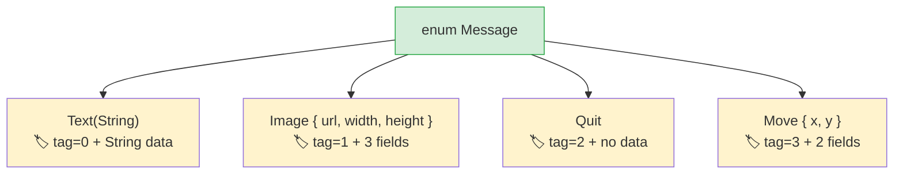

## 代数数据类型 vs 联合类型

> **你将学到：** 带数据的 Rust 枚举 vs Python `Union` 类型、穷尽性 `match` vs `match/case`、
> `Option<T>` 作为 `None` 的编译时替代品，以及守卫模式。
>
> **难度：** 🟡 中级

Python 3.10 引入了 `match` 语句和类型联合。Rust 的枚举更进一步 ——
每个变体可以携带不同的数据，编译器确保你处理每种情况。

### Python 联合类型和 Match
```python
# Python 3.10+ — 结构化模式匹配
from typing import Union
from dataclasses import dataclass

@dataclass
class Circle:
    radius: float

@dataclass
class Rectangle:
    width: float
    height: float

@dataclass
class Triangle:
    base: float
    height: float

Shape = Union[Circle, Rectangle, Triangle]  # 类型别名

def area(shape: Shape) -> float:
    match shape:
        case Circle(radius=r):
            return 3.14159 * r * r
        case Rectangle(width=w, height=h):
            return w * h
        case Triangle(base=b, height=h):
            return 0.5 * b * h
        # 漏掉情况也不会有编译器警告！
        # 添加新形状？搜索整个代码库，希望找到所有 match 块。
```

### Rust 枚举 — 带数据的变体
```rust
// Rust — 枚举变体携带数据，编译器强制穷尽匹配
enum Shape {
    Circle(f64),                // Circle 携带半径
    Rectangle(f64, f64),        // Rectangle 携带宽度、高度
    Triangle { base: f64, height: f64 }, // 命名字段也可以
}

fn area(shape: &Shape) -> f64 {
    match shape {
        Shape::Circle(r) => std::f64::consts::PI * r * r,
        Shape::Rectangle(w, h) => w * h,
        Shape::Triangle { base, height } => 0.5 * base * height,
        // ❌ 如果你添加了 Shape::Pentagon 但忘记在这里处理它，
        //    编译器拒绝构建。无需 grep。
    }
}
```

> **关键洞察**：Rust 的 `match` 是**穷尽性**的 — 编译器验证你处理了每个变体。
> 向枚举添加新变体，编译器会精确告诉你哪些 `match` 块需要更新。
> Python 的 `match` 没有这种保证。

### 枚举替换多种 Python 模式

```python
# Python — Rust 枚举替换的几种模式：

# 1. 字符串常量
STATUS_PENDING = "pending"
STATUS_ACTIVE = "active"
STATUS_CLOSED = "closed"

# 2. Python Enum（无数据）
from enum import Enum
class Status(Enum):
    PENDING = "pending"
    ACTIVE = "active"
    CLOSED = "closed"

# 3. 标签联合（类 + 类型字段）
class Message:
    def __init__(self, kind, **data):
        self.kind = kind
        self.data = data
# Message(kind="text", content="hello")
# Message(kind="image", url="...", width=100)
```

```rust
// Rust — 一个枚举做所有三种及更多

// 1. 简单枚举（类似 Python 的 Enum）
enum Status {
    Pending,
    Active,
    Closed,
}

// 2. 带数据的枚举（标签联合 — 类型安全！）
enum Message {
    Text(String),
    Image { url: String, width: u32, height: u32 },
    Quit,                    // 无数据
    Move { x: i32, y: i32 },
}
```



> **内存洞察**：Rust 枚举是"标签联合" — 编译器存储判别标签 + 最大变体所需空间。
> Python 的等价物（`Union[str, dict, None]`）没有紧凑表示。
>
> 📌 **另见**：[第 9 章 — 错误处理](ch09-error-handling.md) 大量使用枚举 — `Result<T, E>` 和 `Option<T>` 就是带 `match` 的枚举。

```rust
fn process(msg: &Message) {
    match msg {
        Message::Text(content) => println!("Text: {content}"),
        Message::Image { url, width, height } => {
            println!("Image: {url} ({width}x{height})")
        }
        Message::Quit => println!("Quitting"),
        Message::Move { x, y } => println!("Moving to ({x}, {y})"),
    }
}
```

***

## 穷尽性模式匹配

### Python 的 match — 非穷尽性
```python
# Python — 通配符是可选的，没有编译器帮助
def describe(value):
    match value:
        case 0:
            return "zero"
        case 1:
            return "one"
        # 如果忘记默认情况，Python 静默返回 None。
        # 没有警告，没有错误。

describe(42)  # 返回 None — 静默 bug
```

### Rust 的 match — 编译器强制
```rust
// Rust — 必须处理每种可能的情况
fn describe(value: i32) -> &'static str {
    match value {
        0 => "zero",
        1 => "one",
        // ❌ 编译错误：非穷尽模式：`i32::MIN..=-1_i32`
        //    和 `2_i32..=i32::MAX` 未覆盖
        _ => "other",   // _ = 捕获全部（对于开放类型是必需的）
    }
}

// 对于枚举，不需要捕获全部 — 编译器知道所有变体：
enum Color { Red, Green, Blue }

fn color_hex(c: Color) -> &'static str {
    match c {
        Color::Red => "#ff0000",
        Color::Green => "#00ff00",
        Color::Blue => "#0000ff",
        // 不需要 _ — 所有变体都已覆盖
        // 之后添加 Color::Yellow → 编译器在这里报错
    }
}
```

### 模式匹配特性
```rust
// 多个值（类似 Python 的 case 1 | 2 | 3:）
match value {
    1 | 2 | 3 => println!("small"),
    4..=9 => println!("medium"),    // 范围模式
    _ => println!("large"),
}

// 守卫（类似 Python 的 case x if x > 0:）
match temperature {
    t if t > 100 => println!("boiling"),
    t if t < 0 => println!("freezing"),
    t => println!("normal: {t}°"),
}

// 嵌套解构
let point = (3, (4, 5));
match point {
    (0, _) => println!("on y-axis"),
    (_, (0, _)) => println!("y=0"),
    (x, (y, z)) => println!("x={x}, y={y}, z={z}"),
}
```

***

## Option 实现 None 安全

`Option<T>` 是对 Python 开发者最重要的 Rust 枚举。它用类型安全的替代品替换了 `None`。

### Python None

```python
# Python — None 是一个可以出现在任何地方的值
def find_user(user_id: int) -> dict | None:
    users = {1: {"name": "Alice"}}
    return users.get(user_id)

user = find_user(999)
# user 是 None — 但没有强制你检查！
print(user["name"])  # 💥 运行时 TypeError
```

### Rust Option

```rust
// Rust — Option<T> 强制你处理 None 的情况
fn find_user(user_id: i64) -> Option<User> {
    let users = HashMap::from([(1, User { name: "Alice".into() })]);
    users.get(&user_id).cloned()
}

let user = find_user(999);
// user 是 Option<User> — 你不能在不处理 None 的情况下使用它

// 方法 1: match
match find_user(999) {
    Some(user) => println!("Found: {}", user.name),
    None => println!("Not found"),
}

// 方法 2: if let（类似 Python 的 if (x := expr) is not None）
if let Some(user) = find_user(1) {
    println!("Found: {}", user.name);
}

// 方法 3: unwrap_or
let name = find_user(999)
    .map(|u| u.name)
    .unwrap_or_else(|| "Unknown".to_string());

// 方法 4: ? 运算符（在返回 Option 的函数中）
fn get_user_name(id: i64) -> Option<String> {
    let user = find_user(id)?;     // 如果未找到，提前返回 None
    Some(user.name)
}
```

### Option 方法 — Python 等价物

| 模式 | Python | Rust |
|--------|--------|------|
| 检查是否存在 | `if x is not None:` | `if let Some(x) = opt {` |
| 默认值 | `x or default` | `opt.unwrap_or(default)` |
| 默认工厂 | `x or compute()` | `opt.unwrap_or_else(\|\| compute())` |
| 存在时转换 | `f(x) if x else None` | `opt.map(f)` |
| 链式查找 | `x and x.attr and x.attr.method()` | `opt.and_then(\|x\| x.method())` |
| None 时崩溃 | 无法防止 | `opt.unwrap()`（panic）或 `opt.expect("msg")` |
| 获取或抛出 | `x if x else raise` | `opt.ok_or(Error)?` |

---

## 练习

<details>
<summary><strong>🏋️ 练习：形状面积计算器</strong>（点击展开）</summary>

**挑战**：定义一个枚举 `Shape`，带有变体 `Circle(f64)`（半径）、`Rectangle(f64, f64)`（宽度、高度）和 `Triangle(f64, f64)`（底边、高度）。使用 `match` 实现方法 `fn area(&self) -> f64`。创建每种形状各一个并打印面积。

<details>
<summary>🔑 解答</summary>

```rust
use std::f64::consts::PI;

enum Shape {
    Circle(f64),
    Rectangle(f64, f64),
    Triangle(f64, f64),
}

impl Shape {
    fn area(&self) -> f64 {
        match self {
            Shape::Circle(r) => PI * r * r,
            Shape::Rectangle(w, h) => w * h,
            Shape::Triangle(b, h) => 0.5 * b * h,
        }
    }
}

fn main() {
    let shapes = [
        Shape::Circle(5.0),
        Shape::Rectangle(4.0, 6.0),
        Shape::Triangle(3.0, 8.0),
    ];
    for shape in &shapes {
        println!("Area: {:.2}", shape.area());
    }
}
```

**关键收获**：Rust 枚举替换了 Python 的 `Union[Circle, Rectangle, Triangle]` + `isinstance()` 检查。
编译器确保你处理每个变体 — 添加新形状但不更新 `area()` 是编译错误。

</details>
</details>

***

