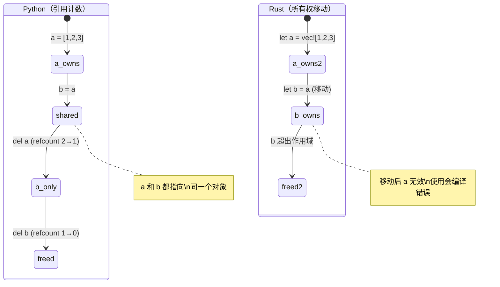
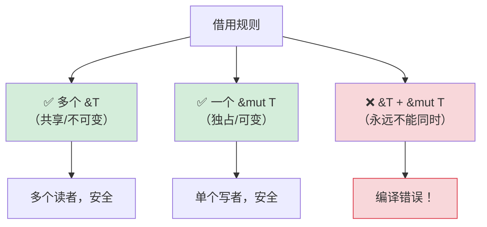

## 理解所有权

> **你将学到：** 为什么 Rust 有所有权（无 GC！）、移动语义 vs Python 的引用计数、
> 借用（`&` 和 `&mut`）、生命周期基础，以及智能指针（`Box`、`Rc`、`Arc`）。
>
> **难度：** 🟡 中级

这是对 Python 开发者最难的概念。在 Python 中，你从不考虑谁"拥有"数据 — 垃圾回收器处理它。
在 Rust 中，每个值有且只有一个所有者，编译器在编译时追踪这一点。

### Python：到处都是共享引用
```python
# Python — 一切都是引用，gc 清理
a = [1, 2, 3]
b = a              # b 和 a 指向同一个列表
b.append(4)
print(a)            # [1, 2, 3, 4] — 惊讶！a 也变了

# 谁拥有这个列表？a 和 b 都引用它。
# 当没有引用剩余时，垃圾回收器释放它。
# 你从不考虑这个。
```

### Rust：单一所有权
```rust
// Rust — 每个值有且只有一个所有者
let a = vec![1, 2, 3];
let b = a;           // 所有权从 a 移动到 b
// println!("{:?}", a); // ❌ 编译错误：移动后使用值

// a 不再存在。b 是唯一所有者。
println!("{:?}", b); // ✅ [1, 2, 3]

// 当 b 超出作用域时，Vec 被释放。确定性的。无 GC。
```

### 三个所有权规则
```rust
1. 每个值有且只有一个所有者变量。
2. 当所有者超出作用域时，值被丢弃（释放）。
3. 所有权可以转移（移动）但不能复制（除非 Clone）。
```

### 移动语义 — 最大的 Python 冲击
```python
# Python — 赋值复制引用，不复制数据
def process(data):
    data.append(42)
    # 原始列表被修改！

my_list = [1, 2, 3]
process(my_list)
print(my_list)       # [1, 2, 3, 42] — 被 process 修改了！
```

```rust
// Rust — 传递给函数会移动所有权（对于非 Copy 类型）
fn process(mut data: Vec<i32>) -> Vec<i32> {
    data.push(42);
    data  # 必须返回它才能拿回所有权！
}

let my_vec = vec![1, 2, 3];
let my_vec = process(my_vec);  # 所有权移入又移出
println!("{:?}", my_vec);      # [1, 2, 3, 42]

// 或者更好 — 借用而不是移动：
fn process_borrowed(data: &mut Vec<i32>) {
    data.push(42);
}

let mut my_vec = vec![1, 2, 3];
process_borrowed(&mut my_vec);  # 临时借出
println!("{:?}", my_vec);       # [1, 2, 3, 42] — 仍然是我们的
```

### 所有权可视化

```text
Python:                              Rust:

  a ──────┐                           a ──→ [1, 2, 3]
           ├──→ [1, 2, 3]
  b ──────┚                           之后：let b = a;

  (a 和 b 共享一个对象)                  a  (无效，已移动)
  (refcount = 2)                      b ──→ [1, 2, 3]
                                      (只有 b 拥有数据)

  del a → refcount = 1                drop(b) → 数据释放
  del b → refcount = 0 → 释放          (确定性的，无 GC)
```



***

## 移动语义 vs 引用计数

### Copy vs Move
```rust
// 简单类型（整数、浮点数、布尔、字符）是复制的，不是移动的
let x = 42;
let y = x;    // x 复制到 y（两者都有效）
println!("{x} {y}");  // ✅ 42 42

// 堆分配类型（String、Vec、HashMap）是移动的
let s1 = String::from("hello");
let s2 = s1;  // s1 移动到 s2
// println!("{s1}");  // ❌ 错误：移动后使用值

// 要显式复制堆数据，使用 .clone()
let s1 = String::from("hello");
let s2 = s1.clone();  // 深拷贝
println!("{s1} {s2}");  // ✅ hello hello（两者都有效）
```

### Python 开发者的心智模型
```text
Python:                    Rust:
─────────                  ─────
int, float, bool           Copy 类型（i32, f64, bool, char）
→ 赋值时复制               → 赋值时复制（行为相似）
                           （注意：Python 缓存小整数；Rust 复制总是可预测的）

list, dict, str            Move 类型（Vec, HashMap, String）
→ 共享引用                → 所有权转移（行为不同！）
→ gc 清理                 → 所有者丢弃数据
→ 用 list(x) 克隆          → 用 x.clone() 克隆
   或 copy.deepcopy(x)
```

### Python 共享模型何时导致 Bug

```python
# Python — 意外的别名
def remove_duplicates(items):
    seen = set()
    result = []
    for item in items:
        if item not in seen:
            seen.add(item)
            result.append(item)
    return result

original = [1, 2, 2, 3, 3, 3]
alias = original          # 别名，不是拷贝
unique = remove_duplicates(alias)
# original 仍然是 [1, 2, 2, 3, 3, 3] — 但只是因为我们没有修改它
# 如果 remove_duplicates 修改了输入，original 也会受影响
```

```rust
use std::collections::HashSet;

// Rust — 所有权防止意外别名
fn remove_duplicates(items: &[i32]) -> Vec<i32> {
    let mut seen = HashSet::new();
    items.iter()
        .filter(|&&item| seen.insert(item))
        .copied()
        .collect()
}

let original = vec![1, 2, 2, 3, 3, 3];
let unique = remove_duplicates(&original); // 借用 — 不能修改
// original 保证不变 — 编译器通过 & 防止了修改
```

***

## 借用和生命周期

### 借用 = 借书
```rust
把所有权想象成一本书：

Python:  每个人都有复印件（共享引用 + GC）
Rust:    一个人拥有这本书。其他人可以：
         - &book     = 看一看（不可变借用，允许多个）
         - &mut book = 在上面写（可变借用，独占）
         - book      = 送出去（移动）
```

### 借用规则



```rust
// 规则 1：你可以有多个不可变借用，或一个可变借用（不能两者都有）

let mut data = vec![1, 2, 3];

// 多个不可变借用 — 没问题
let a = &data;
let b = &data;
println!("{:?} {:?}", a, b);  // ✅

// 可变借用 — 必须是独占的
let c = &mut data;
c.push(4);
// println!("{:?}", a);  // ❌ 错误：可变借用存在时不能使用不可变借用

// 这在编译时防止了数据竞争！
// Python 没有等价物 — 这就是为什么 Python 在迭代时修改 dict 会在运行时崩溃。
```

### 生命周期 — 简要介绍
```rust
// 生命周期回答："这个引用活多久？"
// 通常编译器推断。你很少需要显式写。

// 简单情况 — 编译器处理：
fn first_word(s: &str) -> &str {
    s.split_whitespace().next().unwrap_or("")
}
// 编译器知道：返回的 &str 与输入的 &str 存活一样久

// 当你需要显式生命周期时（很少）：
fn longest<'a>(a: &'a str, b: &'a str) -> &'a str {
    if a.len() > b.len() { a } else { b }
}
// 'a 表示："返回值与两个输入活得一样久"
```

> **对 Python 开发者**：最初不要担心生命周期。编译器会在你需要时告诉你，
> 而且 95% 的情况它会自动推断。把生命周期注解看作是你给编译器的提示，
> 当它自己无法弄清楚关系时。

***

## 智能指针

当单一所有权限制太多时，Rust 提供了智能指针。
这些更接近 Python 的引用模型 — 但是显式的且可选择的。

```rust
// Box<T> — 堆分配，单一所有者（像 Python 的普通分配）
let boxed = Box::new(42);  // 堆分配的 i32

// Rc<T> — 引用计数（像 Python 的 refcount！）
use std::rc::Rc;
let shared = Rc::new(vec![1, 2, 3]);
let clone1 = Rc::clone(&shared);  // 增加引用计数
let clone2 = Rc::clone(&shared);  // 增加引用计数
// 三个都指向同一个 Vec。全部被丢弃时，Vec 被释放。
// 类似于 Python 的引用计数，但 Rc 不处理循环 —
// 使用 Weak<T> 打破循环（Python 的 GC 自动处理循环）

// Arc<T> — 原子引用计数（多线程代码的 Rc）
use std::sync::Arc;
let thread_safe = Arc::new(vec![1, 2, 3]);
// 跨线程共享时使用 Arc（Rc 是单线程的）

// RefCell<T> — 运行时借用检查（像 Python 的"随便改"模型）
use std::cell::RefCell;
let cell = RefCell::new(42);
*cell.borrow_mut() = 99;  // 运行时可变借用（双重借用时 panic）
```

### 何时使用哪种

| 智能指针 | Python 类比 | 使用场景 |
|---------------|----------------|----------|
| `Box<T>` | 普通分配 | 大数据、递归类型、trait 对象 |
| `Rc<T>` | Python 默认 refcount | 共享所有权、单线程 |
| `Arc<T>` | 线程安全 refcount | 共享所有权、多线程 |
| `RefCell<T>` | Python 的"直接改" | 内部可变性（逃生舱） |
| `Rc<RefCell<T>>` | Python 普通对象模型 | 共享 + 可变（图结构） |

> **关键洞察**：`Rc<RefCell<T>>` 给你 Python 般的语义（共享、可变数据），
> 但你必须显式选择加入。Rust 默认（拥有、移动）更快，避免引用计数开销。
> 对于有循环的图状结构，使用 `Weak<T>` 打破引用循环 — 与 Python 不同，
> Rust 的 `Rc` 没有循环收集器。

> 📌 **另见**：[第 13 章 — 并发](ch13-concurrency.md) 涵盖 `Arc<Mutex<T>>` 用于多线程共享状态。

---

## 练习

<details>
<summary><strong>🏋️ 练习：找出借用检查器错误</strong>（点击展开）</summary>

**挑战**：以下代码有 3 个借用检查器错误。识别每一个并修复它们，不使用 `.clone()`：

```rust
fn main() {
    let mut names = vec!["Alice".to_string(), "Bob".to_string()];
    let first = &names[0];
    names.push("Charlie".to_string());
    println!("First: {first}");

    let greeting = make_greeting(names[0]);
    println!("{greeting}");
}

fn make_greeting(name: String) -> String {
    format!("Hello, {name}!")
}
```

<details>
<summary>🔑 解答</summary>

```rust
fn main() {
    let mut names = vec!["Alice".to_string(), "Bob".to_string()];
    let first = &names[0];
    println!("First: {first}"); // 在修改前使用借用
    names.push("Charlie".to_string()); // 现在安全了 — 没有活跃的不可变借用

    let greeting = make_greeting(&names[0]); // 传引用，不是拥有
    println!("{greeting}");
}

fn make_greeting(name: &str) -> String { // 接受 &str，不是 String
    format!("Hello, {name}!")
}
```

**修复的错误**：
1. **不可变借用 + 修改**：`first` 借用了 `names`，然后 `push` 修改它。修复：在 push 之前使用 `first`。
2. **从 Vec 移出**：`names[0]` 尝试从 Vec 移出 String（不允许）。修复：用 `&names[0]` 借用。
3. **函数获取所有权**：`make_greeting(String)` 消费了值。修复：改为接受 `&str`。

</details>
</details>

***

