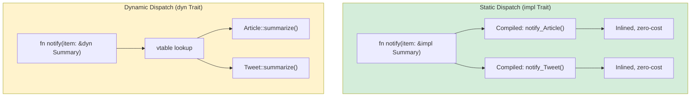

## Trait 入门

> **What you'll learn:** Trait 作为显式契约（vs Python 鸭子类型），`Protocol`（PEP 544）≈ Trait，
> 带 `where` 子句的泛型约束，`dyn Trait` trait 对象 vs 静态分发，以及常见的 std trait。
>
> **Difficulty:** 🟡 Intermediate

This is where Rust's type system really shines for Python developers. Python's
"duck typing" says: "if it walks like a duck and quacks like a duck, it's a duck."
Rust's traits say: "I'll tell you exactly which duck behaviors I need, at compile time."

### Python Duck Typing
```python
# Python — duck typing: anything with the right methods works
def total_area(shapes):
    """Works with anything that has an .area() method."""
    return sum(shape.area() for shape in shapes)

class Circle:
    def __init__(self, radius): self.radius = radius
    def area(self): return 3.14159 * self.radius ** 2

class Rectangle:
    def __init__(self, w, h): self.w, self.h = w, h
    def area(self): return self.w * self.h

# Works at runtime — no inheritance needed!
shapes = [Circle(5), Rectangle(3, 4)]
print(total_area(shapes))  # 90.54

# But what if something doesn't have .area()?
class Dog:
    def bark(self): return "Woof!"

total_area([Dog()])  # 💥 AttributeError: 'Dog' has no attribute 'area'
# Error happens at RUNTIME, not at definition time
```

### Rust Traits — Explicit Duck Typing
```rust
// Rust — traits make the "duck" contract explicit
trait HasArea {
    fn area(&self) -> f64;      // Any type that implements this trait has .area()
}

struct Circle { radius: f64 }
struct Rectangle { width: f64, height: f64 }

impl HasArea for Circle {
    fn area(&self) -> f64 {
        std::f64::consts::PI * self.radius * self.radius
    }
}

impl HasArea for Rectangle {
    fn area(&self) -> f64 {
        self.width * self.height
    }
}

// The trait constraint is explicit — compiler checks at compile time
fn total_area(shapes: &[&dyn HasArea]) -> f64 {
    shapes.iter().map(|s| s.area()).sum()
}

// Using it:
let shapes: Vec<&dyn HasArea> = vec![&Circle { radius: 5.0 }, &Rectangle { width: 3.0, height: 4.0 }];
println!("{}", total_area(&shapes));  // 90.54

// struct Dog;
// total_area(&[&Dog {}]);  // ❌ Compile error: Dog doesn't implement HasArea
```

> **Key insight**: Python's duck typing defers errors to runtime. Rust's traits catch
> them at compile time. Same flexibility, earlier error detection.

***

## Protocols (PEP 544) vs Traits

Python 3.8 introduced `Protocol` (PEP 544) for structural subtyping — it's the
closest Python concept to Rust traits.

### Python Protocol
```python
# Python — Protocol (structural typing, like Rust traits)
from typing import Protocol, runtime_checkable

@runtime_checkable
class Printable(Protocol):
    def to_string(self) -> str: ...

class User:
    def __init__(self, name: str):
        self.name = name
    def to_string(self) -> str:
        return f"User({self.name})"

class Product:
    def __init__(self, name: str, price: float):
        self.name = name
        self.price = price
    def to_string(self) -> str:
        return f"Product({self.name}, ${self.price:.2f})"

def print_all(items: list[Printable]) -> None:
    for item in items:
        print(item.to_string())

# Works because User and Product both have to_string()
print_all([User("Alice"), Product("Widget", 9.99)])

# BUT: mypy checks this, Python runtime does NOT enforce it
# print_all([42])  # mypy warns, but Python runs it and crashes
```

### Rust Trait (Equivalent, but enforced!)
```rust
// Rust — traits are enforced at compile time
trait Printable {
    fn to_string(&self) -> String;
}

struct User { name: String }
struct Product { name: String, price: f64 }

impl Printable for User {
    fn to_string(&self) -> String {
        format!("User({})", self.name)
    }
}

impl Printable for Product {
    fn to_string(&self) -> String {
        format!("Product({}, ${:.2})", self.name, self.price)
    }
}

fn print_all(items: &[&dyn Printable]) {
    for item in items {
        println!("{}", item.to_string());
    }
}

// print_all(&[&42i32]);  // ❌ Compile error: i32 doesn't implement Printable
```

### Comparison Table

| Feature | Python Protocol | Rust Trait |
|---------|-----------------|------------|
| Structural typing | ✅ (implicit) | ❌ (explicit `impl`) |
| Checked at | Runtime (or mypy) | Compile time (always) |
| Default implementations | ❌ | ✅ |
| Can add to foreign types | ❌ | ✅ (within limits) |
| Multiple protocols | ✅ | ✅ (multiple traits) |
| Associated types | ❌ | ✅ |
| Generic constraints | ✅ (with `TypeVar`) | ✅ (trait bounds) |

***

## Generic Constraints

### Python Generics
```python
# Python — TypeVar for generic functions
from typing import TypeVar, Sequence

T = TypeVar('T')

def first(items: Sequence[T]) -> T | None:
    return items[0] if items else None

# Bounded TypeVar
from typing import SupportsFloat
T = TypeVar('T', bound=SupportsFloat)

def average(items: Sequence[T]) -> float:
    return sum(float(x) for x in items) / len(items)
```

### Rust Generics with Trait Bounds
```rust
// Rust — generics with trait bounds
fn first<T>(items: &[T]) -> Option<&T> {
    items.first()
}

// With trait bounds — "T must implement these traits"
fn average<T>(items: &[T]) -> f64
where
    T: Into<f64> + Copy,   // T must convert to f64 and be copyable
{
    let sum: f64 = items.iter().map(|&x| x.into()).sum();
    sum / items.len() as f64
}

// Multiple bounds — "T must implement Display AND Debug AND Clone"
fn log_and_clone<T: std::fmt::Display + std::fmt::Debug + Clone>(item: &T) -> T {
    println!("Display: {}", item);
    println!("Debug: {:?}", item);
    item.clone()
}

// Shorthand with impl Trait (for simple cases)
fn print_it(item: &impl std::fmt::Display) {
    println!("{}", item);
}
```

### Generics Quick Reference

| Python | Rust | Notes |
|--------|------|-------|
| `TypeVar('T')` | `<T>` | Unbounded generic |
| `TypeVar('T', bound=X)` | `<T: X>` | Bounded generic |
| `Union[int, str]` | `enum` or trait object | Rust has no union types |
| `Sequence[T]` | `&[T]` (slice) | Borrowed sequence |
| `Callable[[A], R]` | `Fn(A) -> R` | Function trait |
| `Optional[T]` | `Option<T>` | Built into the language |

***

## Common Standard Library Traits

These are Rust's version of Python's "dunder methods" — they define how types
behave in common situations.

### Display and Debug (Printing)
```rust
use std::fmt;

// Debug — like __repr__ (auto-derivable)
#[derive(Debug)]
struct Point { x: f64, y: f64 }
// Now you can: println!("{:?}", point);

// Display — like __str__ (must implement manually)
impl fmt::Display for Point {
    fn fmt(&self, f: &mut fmt::Formatter<'_>) -> fmt::Result {
        write!(f, "({}, {})", self.x, self.y)
    }
}
// Now you can: println!("{}", point);
```

### Comparison Traits
```rust
// PartialEq — like __eq__
// Eq — total equality (f64 is PartialEq but not Eq because NaN != NaN)
// PartialOrd — like __lt__, __le__, etc.
// Ord — total ordering

#[derive(Debug, PartialEq, Eq, PartialOrd, Ord, Hash, Clone)]
struct Student {
    name: String,
    grade: i32,
}

// Now students can be: compared, sorted, used as HashMap keys, cloned
let mut students = vec![
    Student { name: "Charlie".into(), grade: 85 },
    Student { name: "Alice".into(), grade: 92 },
];
students.sort();  // Uses Ord — sorts by name then grade (struct field order)
```

### Iterator Trait
```rust
// Implementing Iterator — like Python's __iter__/__next__
struct Countdown { value: i32 }

impl Iterator for Countdown {
    type Item = i32;       // What the iterator yields

    fn next(&mut self) -> Option<Self::Item> {
        if self.value > 0 {
            self.value -= 1;
            Some(self.value + 1)
        } else {
            None             // Iteration complete
        }
    }
}

// Usage:
for n in (Countdown { value: 5 }) {
    println!("{n}");  // 5, 4, 3, 2, 1
}
```

### Common Traits at a Glance

| Rust Trait | Python Equivalent | Purpose |
|-----------|-------------------|---------|
| `Display` | `__str__` | Human-readable string |
| `Debug` | `__repr__` | Debug string (derivable) |
| `Clone` | `copy.deepcopy` | Deep copy |
| `Copy` | (int/float auto-copy) | Implicit copy for simple types |
| `PartialEq` / `Eq` | `__eq__` | Equality comparison |
| `PartialOrd` / `Ord` | `__lt__` etc. | Ordering |
| `Hash` | `__hash__` | Hashable (for dict keys) |
| `Default` | Default `__init__` | Default values |
| `From` / `Into` | `__init__` overloads | Type conversions |
| `Iterator` | `__iter__` / `__next__` | Iteration |
| `Drop` | `__del__` / `__exit__` | Cleanup |
| `Add`, `Sub`, `Mul` | `__add__`, `__sub__`, `__mul__` | Operator overloading |
| `Index` | `__getitem__` | Indexing with `[]` |
| `Deref` | (no equivalent) | Smart pointer dereferencing |
| `Send` / `Sync` | (no equivalent) | Thread safety markers |



> **Python equivalent**: Python *always* uses dynamic dispatch (`getattr` at runtime). Rust defaults to static dispatch (monomorphization — the compiler generates specialized code for each concrete type). Use `dyn Trait` only when you need runtime polymorphism.
>
> 📌 **See also**: [Ch. 11 — From/Into Traits](ch11-from-and-into-traits.md) covers the conversion traits (`From`, `Into`, `TryFrom`) in depth.

### Associated Types

Rust traits can define *associated types* — type placeholders that each implementor fills in. Python has no equivalent:

```rust
// Iterator defines an associated type 'Item'
trait Iterator {
    type Item;
    fn next(&mut self) -> Option<Self::Item>;
}

struct Countdown { remaining: u32 }

impl Iterator for Countdown {
    type Item = u32;  // This iterator yields u32 values
    fn next(&mut self) -> Option<u32> {
        if self.remaining > 0 {
            self.remaining -= 1;
            Some(self.remaining)
        } else {
            None
        }
    }
}
```

In Python, `__iter__` / `__next__` return `Any` — there's no way to declare "this iterator yields `int`" and have it enforced (type hints with `Iterator[int]` are advisory only).

### Operator Overloading: `__add__` → `impl Add`

Python uses magic methods (`__add__`, `__mul__`). Rust uses trait implementations — same idea, but type-checked at compile time:

```python
# Python
class Vec2:
    def __init__(self, x, y):
        self.x, self.y = x, y
    def __add__(self, other):
        return Vec2(self.x + other.x, self.y + other.y)  # No type checking on 'other'
```

```rust
use std::ops::Add;

#[derive(Debug, Clone, Copy)]
struct Vec2 { x: f64, y: f64 }

impl Add for Vec2 {
    type Output = Vec2;  // Associated type: what does + return?
    fn add(self, rhs: Vec2) -> Vec2 {
        Vec2 { x: self.x + rhs.x, y: self.y + rhs.y }
    }
}

let a = Vec2 { x: 1.0, y: 2.0 };
let b = Vec2 { x: 3.0, y: 4.0 };
let c = a + b;  // Type-safe: only Vec2 + Vec2 is allowed
```

Key difference: Python's `__add__` accepts *any* `other` at runtime (you check types manually or get a `TypeError`). Rust's `Add` trait enforces the operand types at compile time — `Vec2 + i32` is a compile error unless you explicitly `impl Add<i32> for Vec2`.

---

## Exercises

<details>
<summary><strong>🏋️ Exercise: Generic Summary Trait</strong> (click to expand)</summary>

**Challenge**: Define a trait `Summary` with a method `fn summarize(&self) -> String`. Implement it for two structs: `Article { title: String, body: String }` and `Tweet { username: String, content: String }`. Then write a function `fn notify(item: &impl Summary)` that prints the summary.

<details>
<summary>🔑 Solution</summary>

```rust
trait Summary {
    fn summarize(&self) -> String;
}

struct Article { title: String, body: String }
struct Tweet { username: String, content: String }

impl Summary for Article {
    fn summarize(&self) -> String {
        format!("{} — {}...", self.title, &self.body[..20.min(self.body.len())])
    }
}

impl Summary for Tweet {
    fn summarize(&self) -> String {
        format!("@{}: {}", self.username, self.content)
    }
}

fn notify(item: &impl Summary) {
    println!("📢 {}", item.summarize());
}

fn main() {
    let article = Article {
        title: "Rust is great".into(),
        body: "Here is why Rust beats Python for systems...".into(),
    };
    let tweet = Tweet {
        username: "rustacean".into(),
        content: "Just shipped my first crate!".into(),
    };
    notify(&article);
    notify(&tweet);
}
```

**Key takeaway**: `&impl Summary` is the Rust equivalent of Python's `Protocol` with a `summarize` method. But Rust checks it at compile time — passing a type that doesn't implement `Summary` is a compile error, not a runtime `AttributeError`.

</details>
</details>

***


