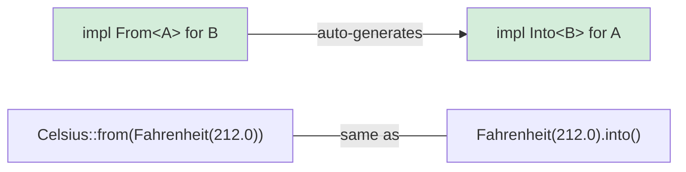

## Rust 中的类型转换

> **What you'll learn:** `From` and `Into` traits for zero-cost type conversions, `TryFrom` for fallible conversions,
> how `impl From<A> for B` auto-generates `Into`, and string conversion patterns.
>
> **Difficulty:** 🟡 Intermediate

Python handles type conversions with constructor calls (`int("42")`, `str(42)`,
`float("3.14")`). Rust uses the `From` and `Into` traits for type-safe conversions.

### Python Type Conversion
```python
# Python — explicit constructors for conversion
x = int("42")           # str → int (can raise ValueError)
s = str(42)             # int → str
f = float("3.14")       # str → float
lst = list((1, 2, 3))   # tuple → list

# Custom conversion via __init__ or class methods
class Celsius:
    def __init__(self, temp: float):
        self.temp = temp

    @classmethod
    def from_fahrenheit(cls, f: float) -> "Celsius":
        return cls((f - 32.0) * 5.0 / 9.0)

c = Celsius.from_fahrenheit(212.0)  # 100.0°C
```

### Rust From/Into
```rust
// Rust — From trait defines conversions
// Implementing From<T> gives you Into<U> automatically!

struct Celsius(f64);
struct Fahrenheit(f64);

impl From<Fahrenheit> for Celsius {
    fn from(f: Fahrenheit) -> Self {
        Celsius((f.0 - 32.0) * 5.0 / 9.0)
    }
}

// Now both work:
let c1 = Celsius::from(Fahrenheit(212.0));    // Explicit From
let c2: Celsius = Fahrenheit(212.0).into();   // Into (automatically derived)

// String conversions:
let s: String = String::from("hello");         // &str → String
let s: String = "hello".to_string();           // Same thing
let s: String = "hello".into();                // Also works (From is implemented)

let num: i64 = 42i32.into();                   // i32 → i64 (lossless, so From exists)
// let small: i32 = 42i64.into();              // ❌ i64 → i32 might lose data — no From

// For fallible conversions, use TryFrom:
let n: Result<i32, _> = "42".parse();          // str → i32 (might fail)
let n: i32 = "42".parse().unwrap();            // Panic if not a number
let n: i32 = "42".parse()?;                    // Propagate error with ?
```

### The From/Into Relationship



> **Rule of thumb**: Always implement `From`, never implement `Into` directly. Implementing `From<A> for B` gives you `Into<B> for A` for free.

***

### When to Use From/Into

```rust
// Implement From<T> for your types to enable ergonomic API design:

#[derive(Debug)]
struct UserId(i64);

impl From<i64> for UserId {
    fn from(id: i64) -> Self {
        UserId(id)
    }
}

// Now functions can accept anything convertible to UserId:
fn find_user(id: impl Into<UserId>) -> Option<String> {
    let user_id = id.into();
    // ... lookup logic
    Some(format!("User #{:?}", user_id))
}

find_user(42i64);              // ✅ i64 auto-converts to UserId
find_user(UserId(42));         // ✅ UserId stays as-is
```

***

## TryFrom — Fallible Conversions

Not all conversions can succeed. Python raises exceptions; Rust uses `TryFrom` which returns a `Result`:

```python
# Python — fallible conversions raise exceptions
try:
    port = int("not_a_number")   # ValueError
except ValueError as e:
    print(f"Invalid: {e}")

# Custom validation in __init__
class Port:
    def __init__(self, value: int):
        if not (1 <= value <= 65535):
            raise ValueError(f"Invalid port: {value}")
        self.value = value

try:
    p = Port(99999)  # ValueError at runtime
except ValueError:
    pass
```

```rust
use std::num::ParseIntError;

// TryFrom for built-in types
let n: Result<i32, ParseIntError> = "42".try_into();   // Ok(42)
let n: Result<i32, ParseIntError> = "bad".try_into();  // Err(...)

// Custom TryFrom for validation
#[derive(Debug)]
struct Port(u16);

#[derive(Debug)]
enum PortError {
    OutOfRange(u16),
    Zero,
}

impl TryFrom<u16> for Port {
    type Error = PortError;

    fn try_from(value: u16) -> Result<Self, Self::Error> {
        match value {
            0 => Err(PortError::Zero),
            1..=65535 => Ok(Port(value)),
            // Note: u16 max is 65535, so this covers all cases
        }
    }
}

impl std::fmt::Display for PortError {
    fn fmt(&self, f: &mut std::fmt::Formatter<'_>) -> std::fmt::Result {
        match self {
            PortError::Zero => write!(f, "port cannot be zero"),
            PortError::OutOfRange(v) => write!(f, "port {v} out of range"),
        }
    }
}

// Usage:
let p: Result<Port, _> = 8080u16.try_into();   // Ok(Port(8080))
let p: Result<Port, _> = 0u16.try_into();       // Err(PortError::Zero)
```

> **Python → Rust mental model**: `TryFrom` = `__init__` that validates and can fail. But instead of raising an exception, it returns `Result` — so callers **must** handle the error case.

***

## String Conversion Patterns

Strings are the most common source of conversion confusion for Python developers:

```rust
// String → &str (borrowing, free)
let s = String::from("hello");
let r: &str = &s;              // Automatic Deref coercion
let r: &str = s.as_str();     // Explicit

// &str → String (allocating, costs memory)
let r: &str = "hello";
let s1 = String::from(r);     // From trait
let s2 = r.to_string();       // ToString trait (via Display)
let s3: String = r.into();    // Into trait

// Number → String
let s = 42.to_string();       // "42" — like Python's str(42)
let s = format!("{:.2}", 3.14); // "3.14" — like Python's f"{3.14:.2f}"

// String → Number
let n: i32 = "42".parse().unwrap();       // like Python's int("42")
let f: f64 = "3.14".parse().unwrap();     // like Python's float("3.14")

// Custom types → String (implement Display)
use std::fmt;

struct Point { x: f64, y: f64 }

impl fmt::Display for Point {
    fn fmt(&self, f: &mut fmt::Formatter<'_>) -> fmt::Result {
        write!(f, "({}, {})", self.x, self.y)
    }
}

let p = Point { x: 1.0, y: 2.0 };
println!("{p}");                // (1, 2) — like Python's __str__
let s = p.to_string();         // Also works! Display gives you ToString for free.
```

### Conversion Quick Reference

| Python | Rust | Notes |
|--------|------|-------|
| `str(x)` | `x.to_string()` | Requires `Display` impl |
| `int("42")` | `"42".parse::<i32>()` | Returns `Result` |
| `float("3.14")` | `"3.14".parse::<f64>()` | Returns `Result` |
| `list(iter)` | `iter.collect::<Vec<_>>()` | Type annotation needed |
| `dict(pairs)` | `pairs.collect::<HashMap<_,_>>()` | Type annotation needed |
| `bool(x)` | No direct equivalent | Use explicit checks |
| `MyClass(x)` | `MyClass::from(x)` | Implement `From<T>` |
| `MyClass(x)` (validates) | `MyClass::try_from(x)?` | Implement `TryFrom<T>` |

***

## Conversion Chains and Error Handling

Real-world code often chains multiple conversions. Compare the approaches:

```python
# Python — chain of conversions with try/except
def parse_config(raw: str) -> tuple[str, int]:
    try:
        host, port_str = raw.split(":")
        port = int(port_str)
        if not (1 <= port <= 65535):
            raise ValueError(f"Bad port: {port}")
        return (host, port)
    except (ValueError, AttributeError) as e:
        raise ConfigError(f"Invalid config: {e}") from e
```

```rust
fn parse_config(raw: &str) -> Result<(String, u16), String> {
    let (host, port_str) = raw
        .split_once(':')
        .ok_or_else(|| "missing ':' separator".to_string())?;

    let port: u16 = port_str
        .parse()
        .map_err(|e| format!("invalid port: {e}"))?;

    if port == 0 {
        return Err("port cannot be zero".to_string());
    }

    Ok((host.to_string(), port))
}

fn main() {
    match parse_config("localhost:8080") {
        Ok((host, port)) => println!("Connecting to {host}:{port}"),
        Err(e) => eprintln!("Config error: {e}"),
    }
}
```

> **Key insight**: Each `?` is a visible exit point. In Python, any line inside `try` could be the one that throws — in Rust, only lines ending with `?` can fail.
>
> 📌 **See also**: [Ch. 9 — Error Handling](ch09-error-handling.md) covers `Result`, `?`, and custom error types with `thiserror` in depth.

---

## Exercises

<details>
<summary><strong>🏋️ Exercise: Temperature Conversion Library</strong> (click to expand)</summary>

**Challenge**: Build a mini temperature conversion library:
1. Define `Celsius(f64)`, `Fahrenheit(f64)`, and `Kelvin(f64)` structs
2. Implement `From<Celsius> for Fahrenheit` and `From<Celsius> for Kelvin`
3. Implement `TryFrom<f64> for Kelvin` that rejects values below absolute zero (-273.15°C = 0K)
4. Implement `Display` for all three types (e.g., `"100.00°C"`)

<details>
<summary>🔑 Solution</summary>

```rust
use std::fmt;

struct Celsius(f64);
struct Fahrenheit(f64);
struct Kelvin(f64);

impl From<Celsius> for Fahrenheit {
    fn from(c: Celsius) -> Self {
        Fahrenheit(c.0 * 9.0 / 5.0 + 32.0)
    }
}

impl From<Celsius> for Kelvin {
    fn from(c: Celsius) -> Self {
        Kelvin(c.0 + 273.15)
    }
}

#[derive(Debug)]
struct BelowAbsoluteZero;

impl fmt::Display for BelowAbsoluteZero {
    fn fmt(&self, f: &mut fmt::Formatter<'_>) -> fmt::Result {
        write!(f, "temperature below absolute zero")
    }
}

impl TryFrom<f64> for Kelvin {
    type Error = BelowAbsoluteZero;

    fn try_from(value: f64) -> Result<Self, Self::Error> {
        if value < 0.0 {
            Err(BelowAbsoluteZero)
        } else {
            Ok(Kelvin(value))
        }
    }
}

impl fmt::Display for Celsius    { fn fmt(&self, f: &mut fmt::Formatter<'_>) -> fmt::Result { write!(f, "{:.2}°C", self.0) } }
impl fmt::Display for Fahrenheit { fn fmt(&self, f: &mut fmt::Formatter<'_>) -> fmt::Result { write!(f, "{:.2}°F", self.0) } }
impl fmt::Display for Kelvin     { fn fmt(&self, f: &mut fmt::Formatter<'_>) -> fmt::Result { write!(f, "{:.2}K",  self.0) } }

fn main() {
    let boiling = Celsius(100.0);
    let f: Fahrenheit = Celsius(100.0).into();
    let k: Kelvin = Celsius(100.0).into();
    println!("{boiling} = {f} = {k}");

    match Kelvin::try_from(-10.0) {
        Ok(k) => println!("{k}"),
        Err(e) => println!("Error: {e}"),
    }
}
```

**Key takeaway**: `From` handles infallible conversions (Celsius→Fahrenheit always works). `TryFrom` handles fallible ones (negative Kelvin is impossible). Python conflates both in `__init__` — Rust makes the distinction explicit in the type system.

</details>
</details>

***


