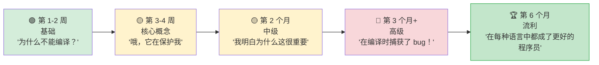

## Python 开发者的 Rust 惯用写法

> **你将学到：** 需要培养的 10 个最佳习惯，常见陷阱及修复方法，结构化的 3 个月学习路径，
> 完整的 Python→Rust "Rosetta Stone" 参考表，以及推荐的学习资源。
>
> **难度：** 🟡 中级



### 需要培养的 10 个最佳习惯

1. **用 `match` 处理枚举而不是 `if isinstance()`**
   ```python
   # Python                              # Rust
   if isinstance(shape, Circle): ...     match shape { Shape::Circle(r) => ... }
   ```

2. **让编译器引导你** — 仔细阅读错误消息。Rust 的编译器是所有语言中最好的。它告诉你哪里错了以及如何修复。

3. **函数参数优先使用 `&str` 而不是 `String`** — 接受最泛化的类型。`&str` 对 `String` 和字符串字面量都适用。

4. **使用迭代器而不是索引循环** — 迭代器链更符合习惯，有时比 `for i in 0..vec.len()` 更快。

5. **拥抱 `Option` 和 `Result`** — 不要什么都 `.unwrap()`。使用 `?`、`map`、`and_then`、`unwrap_or_else`。

6. **自由地派生 trait** — `#[derive(Debug, Clone, PartialEq)]` 应该放在大多数结构体上。这是免费的，而且让测试更容易。

7. **虔诚地使用 `cargo clippy`** — 它能捕获数百种样式和正确性问题。把它当作 Rust 的 `ruff`。

8. **不要与借用检查器作斗争** — 如果你在与它斗争，你可能数据结构搞错了。重构以使所有权清晰。

9. **用枚举表示状态机** — 不要用字符串标志或布尔值，用枚举。编译器确保你处理每种状态。

10. **先克隆，优化在后** — 学习时，自由地使用 `.clone()` 来避免所有权复杂性。只有在性能分析表明需要时才优化。

### Python 开发者的常见错误

| 错误 | 原因 | 修复 |
|---------|-----|------|
| 到处 `.unwrap()` | 运行时 panic | 使用 `?` 或 `match` |
| String 而不是 &str | 不必要的分配 | 参数使用 `&str` |
| `for i in 0..vec.len()` | 不符合习惯 | `for item in &vec` |
| 忽略 clippy 警告 | 错过简单改进 | `cargo clippy` |
| 太多 `.clone()` 调用 | 性能开销 | 重构所有权 |
| 巨大的 main() 函数 | 难以测试 | 提取到 lib.rs |
| 不使用 `#[derive()]` | 重复造轮子 | 派生常见 trait |
| 对错误 panic | 不可恢复 | 返回 `Result<T, E>` |

***

## 性能对比

### 常见操作基准测试
```text
操作                  Python 3.12    Rust（发布版）    加速比
─────────────────────  ────────────   ──────────────    ─────────
Fibonacci(40)          约 25s          约 0.3s           约 80x
排序 1000 万整数       约 5.2s         约 0.6s           约 9x
解析 100MB JSON        约 8.5s         约 0.4s           约 21x
正则匹配 100 万次      约 3.1s         约 0.3s           约 10x
HTTP 服务器（请求/秒） 约 5,000        约 150,000         约 30x
SHA-256 1GB 文件       约 12s          约 1.2s           约 10x
解析 100 万行 CSV     约 4.5s         约 0.2s           约 22x
字符串拼接            约 2.1s         约 0.05s          约 42x
```

> **注意**：带 C 扩展的 Python（NumPy 等）会大大缩小数值工作的差距。
> 这些基准测试比较的是纯 Python 与纯 Rust。

### 内存使用
```text
Python:                                 Rust:
─────────                               ─────
- 对象头：每个对象 28 字节               - 无对象头
- int：28 字节（即使是 0）              - i32：4 字节，i64：8 字节
- str "hello"：54 字节                  - &str "hello"：16 字节（ptr + len）
- 1000 个 int 的列表：约 36 KB           - Vec<i32>：约 4 KB
  （8 KB 指针 + 28 KB int 对象）
- 100 项 dict：约 5.5 KB                - HashMap 100 项：约 2.4 KB

典型应用总内存：
- Python：50-200 MB 基线               - Rust：1-5 MB 基线
```

***

## 常见陷阱与解决方案

### 陷阱 1："借用检查器不让我过"
```rust
// 问题：尝试边迭代边修改
let mut items = vec![1, 2, 3, 4, 5];
// for item in &items {
//     if *item > 3 { items.push(*item * 2); }  // ❌ 借用 mut 时不能借用
// }

// 解决方案 1：收集更改，之后应用
let additions: Vec<i32> = items.iter()
    .filter(|&&x| x > 3)
    .map(|&x| x * 2)
    .collect();
items.extend(additions);

// 解决方案 2：使用 retain/extend
items.retain(|&x| x <= 3);
```

### 陷阱 2："太多字符串类型"
```rust
// 拿不准时：
// - 参数用 &str
// - 结构体字段和返回值用 String
// - &str 字面量（"hello"）可以在任何需要 &str 的地方使用

fn process(input: &str) -> String {    // 接受 &str，返回 String
    format!("Processed: {}", input)
}
```

### 陷阱 3："我怀念 Python 的简洁"
```rust
// Python 一行代码：
// result = [x**2 for x in data if x > 0]

// Rust 等价：
let result: Vec<i32> = data.iter()
    .filter(|&&x| x > 0)
    .map(|&x| x * x)
    .collect();

// 它更冗长，但：
// - 编译时类型安全
// - 快 10-100 倍
// - 不可能有运行时类型错误
// - 内存分配显式（.collect()）
```

### 陷阱 4："我的 REPL 在哪？"
```rust
// Rust 没有 REPL。替代方案：
// 1. 用 `cargo test` 作为你的 REPL — 写小测试来尝试
// 2. 使用 Rust Playground (play.rust-lang.org) 快速实验
// 3. 使用 `dbg!()` 宏快速调试输出
// 4. 使用 `cargo watch -x test` 保存时自动运行测试

#[test]
fn playground() {
    // 用这个作为你的"REPL" — 用 `cargo test playground` 运行
    let result = "hello world"
        .split_whitespace()
        .map(|w| w.to_uppercase())
        .collect::<Vec<_>>();
    dbg!(&result);  // 打印：src/main.rs:5] &result = ["HELLO", "WORLD"]
}
```

***

## 学习路径与资源

### 第 1-2 周：基础
- [ ] 安装 Rust，用 rust-analyzer 设置 VS Code
- [ ] 完成本指南的第 1-4 章（类型、控制流）
- [ ] 写 5 个小程序将 Python 脚本转换为 Rust
- [ ] 熟悉 `cargo build`、`cargo test`、`cargo clippy`

### 第 3-4 周：核心概念
- [ ] 完成第 5-8 章（结构体、枚举、所有权、模块）
- [ ] 用 Rust 重写一个 Python 数据处理脚本
- [ ] 练习 `Option<T>` 和 `Result<T, E>` 直到感觉自然
- [ ] 仔细阅读编译器错误消息 — 它们在教你

### 第 2 个月：中级
- [ ] 完成第 9-12 章（错误处理、trait、迭代器）
- [ ] 用 `clap` 和 `serde` 构建一个 CLI 工具
- [ ] 为 Python 项目的热点写一个 PyO3 扩展
- [ ] 练习迭代器链直到感觉像推导式

### 第 3 个月：高级
- [ ] 完成第 13-16 章（并发、unsafe、测试）
- [ ] 用 `axum` 和 `tokio` 构建一个 Web 服务
- [ ] 为开源 Rust 项目做贡献
- [ ] 阅读《Programming Rust》（O'Reilly）深入理解

### 推荐资源
- **The Rust Book**：https://doc.rust-lang.org/book/ （官方，优秀）
- **Rust by Example**：https://doc.rust-lang.org/rust-by-example/ （边做边学）
- **Rustlings**：https://github.com/rust-lang/rustlings （练习）
- **Rust Playground**：https://play.rust-lang.org/ （在线编译器）
- **This Week in Rust**：https://this-week-in-rust.org/ （通讯）
- **PyO3 Guide**：https://pyo3.rs/ （Python ↔ Rust 桥接）
- **Comprehensive Rust**（Google）：https://google.github.io/comprehensive-rust/

### Python → Rust Rosetta Stone

| Python | Rust | 章节 |
|--------|------|------|
| `list` | `Vec<T>` | 5 |
| `dict` | `HashMap<K,V>` | 5 |
| `set` | `HashSet<T>` | 5 |
| `tuple` | `(T1, T2, ...)` | 5 |
| `class` | `struct` + `impl` | 5 |
| `@dataclass` | `#[derive(...)]` | 5, 12a |
| `Enum` | `enum` | 6 |
| `None` | `Option<T>` | 6 |
| `raise`/`try`/`except` | `Result<T,E>` + `?` | 9 |
| `Protocol`（PEP 544）| `trait` | 10 |
| `TypeVar` | 泛型 `<T>` | 10 |
| `__dunder__` 方法 | Trait（Display、Add 等）| 10 |
| `lambda` | `|args| body` | 12 |
| 生成器 `yield` | `impl Iterator` | 12 |
| 列表推导式 | `.map().filter().collect()` | 12 |
| `@decorator` | 高阶函数或宏 | 12a, 15 |
| `asyncio` | `tokio` | 13 |
| `threading` | `std::thread` | 13 |
| `multiprocessing` | `rayon` | 13 |
| `unittest.mock` | `mockall` | 14a |
| `pytest` | `cargo test` + `rstest` | 14a |
| `pip install` | `cargo add` | 8 |
| `requirements.txt` | `Cargo.lock` | 8 |
| `pyproject.toml` | `Cargo.toml` | 8 |
| `with`（上下文管理器）| 基于作用域的 `Drop` | 15 |
| `json.dumps/loads` | `serde_json` | 15 |

***

## 给 Python 开发者的最终建议

```rust
你会怀念的 Python 特性：
- REPL 和交互式探索
- 快速原型开发速度
- 丰富的 ML/AI 生态系统（PyTorch 等）
- "能用"的动态类型
- pip install 就能立即使用

你将从 Rust 获得的：
- "如果能编译，就能工作"的信心
- 10-100 倍的性能提升
- 不再有运行时类型错误
- 不再有 None/null 崩溃
- 真正的并行（无 GIL！）
- 单二进制部署
- 可预测的内存使用
- 任何语言中最好的编译器错误消息

学习历程：
第 1 周：   "为什么编译器讨厌我？"
第 2 周：   "哦，它实际上在保护我免受 bug 侵害"
第 1 个月： "我明白为什么这很重要"
第 2 个月： "我在编译时捕获了一个本会成为生产事故的 bug"
第 3 个月： "我不想回到无类型代码"
第 6 个月： "Rust 让我成为每种语言的更好的程序员"
```

---

## 练习

<details>
<summary><strong>🏋️ 练习：代码审查清单</strong>（点击展开）</summary>

**挑战**：审查这段 Rust 代码（由 Python 开发者编写）并找出 5 个符合习惯的改进：

```rust
fn get_name(names: Vec<String>, index: i32) -> String {
    if index >= 0 && (index as usize) < names.len() {
        return names[index as usize].clone();
    } else {
        return String::from("");
    }
}

fn main() {
    let mut result = String::from("");
    let names = vec!["Alice".to_string(), "Bob".to_string()];
    result = get_name(names.clone(), 0);
    println!("{}", result);
}
```

<details>
<summary>🔑 解决方案</summary>

五个改进：

```rust
// 1. 参数用 &[String] 而不是 Vec<String>（不要获取整个 vec 的所有权）
// 2. 索引用 usize 而不是 i32（索引始终非负）
// 3. 返回 Option<&str> 而不是空字符串（使用类型系统！）
// 4. 使用 .get() 而不是手动边界检查
// 5. main 中不要 clone() — 传递引用

fn get_name(names: &[String], index: usize) -> Option<&str> {
    names.get(index).map(|s| s.as_str())
}

fn main() {
    let names = vec!["Alice".to_string(), "Bob".to_string()];
    match get_name(&names, 0) {
        Some(name) => println!("{name}"),
        None => println!("Not found"),
    }
}
```

**关键要点**：在 Rust 中有害的 Python 习惯：克隆一切（使用借用）、使用哨兵值如 `""`（使用 `Option`）、可以借用时却获取所有权、以及用有符号整数做索引。

</details>
</details>

***

*Rust for Python 程序员培训指南 完*
