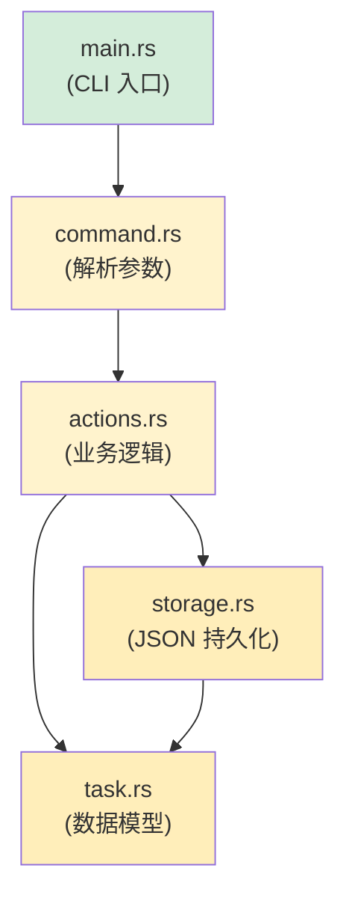

## 终极项目：构建 CLI 任务管理器

> **你将学到：** 通过构建一个完整的 Rust CLI 应用程序来串联课程中的所有内容，
> 这个应用通常是 Python 开发者用 `argparse` + `json` + `pathlib` 来写的。
>
> **难度：** 🔴 高级

这个终极项目涵盖了每个主要章节的概念：
- **第 3 章**：类型和变量（结构体、枚举）
- **第 5 章**：集合（`Vec`、`HashMap`）
- **第 6 章**：枚举和模式匹配（任务状态、命令）
- **第 7 章**：所有权和借用（传递引用）
- **第 9 章**：错误处理（`Result`、`?`、自定义错误）
- **第 10 章**：Trait（`Display`、`FromStr`）
- **第 11 章**：类型转换（`From`、`TryFrom`）
- **第 12 章**：迭代器和闭包（过滤、映射）
- **第 8 章**：模块（项目结构组织）

***

## 项目：`rustdo`

一个命令行任务管理器（类似 Python 的 `todo.txt` 工具），将任务存储在 JSON 文件中。

### Python 版等价实现（你在 Python 中会怎么写）

```python
#!/usr/bin/env python3
"""一个简单的 CLI 任务管理器 — Python 版。"""
import json
import sys
from pathlib import Path
from datetime import datetime
from enum import Enum

TASK_FILE = Path.home() / ".rustdo.json"

class Priority(Enum):
    LOW = "low"
    MEDIUM = "medium"
    HIGH = "high"

class Task:
    def __init__(self, id: int, title: str, priority: Priority, done: bool = False):
        self.id = id
        self.title = title
        self.priority = priority
        self.done = done
        self.created = datetime.now().isoformat()

def load_tasks() -> list[Task]:
    if not TASK_FILE.exists():
        return []
    data = json.loads(TASK_FILE.read_text())
    return [Task(**t) for t in data]

def save_tasks(tasks: list[Task]):
    TASK_FILE.write_text(json.dumps([t.__dict__ for t in tasks], indent=2))

# 命令：add, list, done, remove, stats
# ...（你知道用 Python 怎么写）
```

### 你的 Rust 实现

一步一步构建。每个步骤对应特定章节的概念。

***

## 步骤 1：定义数据模型（第 3、6、10、11 章）

```rust
// src/task.rs
use std::fmt;
use std::str::FromStr;
use serde::{Deserialize, Serialize};
use chrono::Local;

/// 任务优先级 — 对应 Python 的 Priority(Enum)
#[derive(Debug, Clone, Copy, PartialEq, Eq, Serialize, Deserialize)]
#[serde(rename_all = "lowercase")]
pub enum Priority {
    Low,
    Medium,
    High,
}

// Display trait（Python 的 __str__）
impl fmt::Display for Priority {
    fn fmt(&self, f: &mut fmt::Formatter<'_>) -> fmt::Result {
        match self {
            Priority::Low => write!(f, "low"),
            Priority::Medium => write!(f, "medium"),
            Priority::High => write!(f, "high"),
        }
    }
}

// FromStr trait（解析 "high" → Priority::High）
impl FromStr for Priority {
    type Err = String;

    fn from_str(s: &str) -> Result<Self, Self::Err> {
        match s.to_lowercase().as_str() {
            "low" | "l" => Ok(Priority::Low),
            "medium" | "med" | "m" => Ok(Priority::Medium),
            "high" | "h" => Ok(Priority::High),
            other => Err(format!("unknown priority: '{other}' (use low/medium/high)")),
        }
    }
}

/// 单个任务 — 对应 Python 的 Task 类
#[derive(Debug, Clone, Serialize, Deserialize)]
pub struct Task {
    pub id: u32,
    pub title: String,
    pub priority: Priority,
    pub done: bool,
    pub created: String,
}

impl Task {
    pub fn new(id: u32, title: String, priority: Priority) -> Self {
        Self {
            id,
            title,
            priority,
            done: false,
            created: Local::now().format("%Y-%m-%dT%H:%M:%S").to_string(),
        }
    }
}

impl fmt::Display for Task {
    fn fmt(&self, f: &mut fmt::Formatter<'_>) -> fmt::Result {
        let status = if self.done { "✅" } else { "⬜" };
        let priority_icon = match self.priority {
            Priority::Low => "🟢",
            Priority::Medium => "🟡",
            Priority::High => "🔴",
        };
        write!(f, "{} {} [{}] {} ({})", status, self.id, priority_icon, self.title, self.created)
    }
}
```

> **Python 对比**：在 Python 中你会用 `@dataclass` + `Enum`。在 Rust 中，`struct` + `enum` + `derive` 宏让你免费获得序列化、显示和解析能力。

***

## 步骤 2：存储层（第 9、7 章）

```rust
// src/storage.rs
use std::fs;
use std::path::PathBuf;
use crate::task::Task;

/// 获取任务文件路径（~/.rustdo.json）
fn task_file_path() -> PathBuf {
    let home = dirs::home_dir().expect("Could not determine home directory");
    home.join(".rustdo.json")
}

/// 从磁盘加载任务 — 如果文件不存在返回空 Vec
pub fn load_tasks() -> Result<Vec<Task>, Box<dyn std::error::Error>> {
    let path = task_file_path();
    if !path.exists() {
        return Ok(Vec::new());
    }
    let content = fs::read_to_string(&path)?;  // ? 传播 io::Error
    let tasks: Vec<Task> = serde_json::from_str(&content)?;  // ? 传播 serde 错误
    Ok(tasks)
}

/// 保存任务到磁盘
pub fn save_tasks(tasks: &[Task]) -> Result<(), Box<dyn std::error::Error>> {
    let path = task_file_path();
    let json = serde_json::to_string_pretty(tasks)?;
    fs::write(&path, json)?;
    Ok(())
}
```

> **Python 对比**：Python 使用 `Path.read_text()` + `json.loads()`。Rust 使用 `fs::read_to_string()` + `serde_json::from_str()`。注意 `?` — 每个错误都是显式传播的。

***

## 步骤 3：命令枚举（第 6 章）

```rust
// src/command.rs
use crate::task::Priority;

/// 所有可能的命令 — 每个动作一个枚举变体
pub enum Command {
    Add { title: String, priority: Priority },
    List { show_done: bool },
    Done { id: u32 },
    Remove { id: u32 },
    Stats,
    Help,
}

impl Command {
    /// 将命令行参数解析为 Command
    /// （生产环境你会用 `clap` — 这是教学目的）
    pub fn parse(args: &[String]) -> Result<Self, String> {
        match args.first().map(|s| s.as_str()) {
            Some("add") => {
                let title = args.get(1)
                    .ok_or("usage: rustdo add <title> [priority]")?
                    .clone();
                let priority = args.get(2)
                    .map(|p| p.parse::<Priority>())
                    .transpose()
                    .map_err(|e| e.to_string())?
                    .unwrap_or(Priority::Medium);
                Ok(Command::Add { title, priority })
            }
            Some("list") => {
                let show_done = args.get(1).map(|s| s == "--all").unwrap_or(false);
                Ok(Command::List { show_done })
            }
            Some("done") => {
                let id: u32 = args.get(1)
                    .ok_or("usage: rustdo done <id>")?
                    .parse()
                    .map_err(|_| "id must be a number")?;
                Ok(Command::Done { id })
            }
            Some("remove") => {
                let id: u32 = args.get(1)
                    .ok_or("usage: rustdo remove <id>")?
                    .parse()
                    .map_err(|_| "id must be a number")?;
                Ok(Command::Remove { id })
            }
            Some("stats") => Ok(Command::Stats),
            _ => Ok(Command::Help),
        }
    }
}
```

> **Python 对比**：Python 使用 `argparse` 或 `click`。这个手写的解析器展示了如何用 `match` 处理类似枚举的模式来替代 Python 的 if/elif 链。对于真实项目，使用 `clap` crate。

***

## 步骤 4：业务逻辑（第 5、12、7 章）

```rust
// src/actions.rs
use crate::task::{Task, Priority};
use crate::storage;

pub fn add_task(title: String, priority: Priority) -> Result<(), Box<dyn std::error::Error>> {
    let mut tasks = storage::load_tasks()?;
    let next_id = tasks.iter().map(|t| t.id).max().unwrap_or(0) + 1;
    let task = Task::new(next_id, title.clone(), priority);
    println!("Added: {task}");
    tasks.push(task);
    storage::save_tasks(&tasks)?;
    Ok(())
}

pub fn list_tasks(show_done: bool) -> Result<(), Box<dyn std::error::Error>> {
    let tasks = storage::load_tasks()?;
    let filtered: Vec<&Task> = tasks.iter()
        .filter(|t| show_done || !t.done)   // 迭代器 + 闭包（第 12 章）
        .collect();

    if filtered.is_empty() {
        println!("No tasks! 🎉");
        return Ok(());
    }

    for task in &filtered {
        println!("  {task}");   // 使用 Display trait（第 10 章）
    }
    println!("\n{} task(s) shown", filtered.len());
    Ok(())
}

pub fn complete_task(id: u32) -> Result<(), Box<dyn std::error::Error>> {
    let mut tasks = storage::load_tasks()?;
    let task = tasks.iter_mut()
        .find(|t| t.id == id)                // 迭代器::find（第 12 章）
        .ok_or(format!("No task with id {id}"))?;
    task.done = true;
    println!("Completed: {task}");
    storage::save_tasks(&tasks)?;
    Ok(())
}

pub fn remove_task(id: u32) -> Result<(), Box<dyn std::error::Error>> {
    let mut tasks = storage::load_tasks()?;
    let len_before = tasks.len();
    tasks.retain(|t| t.id != id);            // Vec::retain（第 5 章）
    if tasks.len() == len_before {
        return Err(format!("No task with id {id}").into());
    }
    println!("Removed task {id}");
    storage::save_tasks(&tasks)?;
    Ok(())
}

pub fn show_stats() -> Result<(), Box<dyn std::error::Error>> {
    let tasks = storage::load_tasks()?;
    let total = tasks.len();
    let done = tasks.iter().filter(|t| t.done).count();
    let pending = total - done;

    // 使用迭代器按优先级分组（第 12 章）
    let high = tasks.iter().filter(|t| !t.done && t.priority == Priority::High).count();
    let medium = tasks.iter().filter(|t| !t.done && t.priority == Priority::Medium).count();
    let low = tasks.iter().filter(|t| !t.done && t.priority == Priority::Low).count();

    println!("📊 Task Statistics");
    println!("   Total:   {total}");
    println!("   Done:    {done} ✅");
    println!("   Pending: {pending}");
    println!("   🔴 High:   {high}");
    println!("   🟡 Medium: {medium}");
    println!("   🟢 Low:    {low}");
    Ok(())
}
```

> **使用的关键 Rust 模式**：`iter().map().max()`、`iter().filter().collect()`、`iter_mut().find()`、`retain()`、`iter().filter().count()`。这些替代了 Python 的列表推导式、`next(x for x in ...)` 和 `Counter`。

***

## 步骤 5：连接一切（第 8 章）

```rust
// src/main.rs
mod task;
mod storage;
mod command;
mod actions;

use command::Command;

fn main() {
    let args: Vec<String> = std::env::args().skip(1).collect();
    let command = match Command::parse(&args) {
        Ok(cmd) => cmd,
        Err(e) => {
            eprintln!("Error: {e}");
            std::process::exit(1);
        }
    };

    let result = match command {
        Command::Add { title, priority } => actions::add_task(title, priority),
        Command::List { show_done } => actions::list_tasks(show_done),
        Command::Done { id } => actions::complete_task(id),
        Command::Remove { id } => actions::remove_task(id),
        Command::Stats => actions::show_stats(),
        Command::Help => {
            print_help();
            Ok(())
        }
    };

    if let Err(e) = result {
        eprintln!("Error: {e}");
        std::process::exit(1);
    }
}

fn print_help() {
    println!("rustdo — a task manager for Pythonistas learning Rust\n");
    println!("USAGE:");
    println!("  rustdo add <title> [low|medium|high]   Add a task");
    println!("  rustdo list [--all]                    List pending tasks");
    println!("  rustdo done <id>                       Mark task complete");
    println!("  rustdo remove <id>                     Remove a task");
    println!("  rustdo stats                           Show statistics");
}
```



***

## 步骤 6：Cargo.toml 依赖

```toml
[package]
name = "rustdo"
version = "0.1.0"
edition = "2021"

[dependencies]
serde = { version = "1", features = ["derive"] }
serde_json = "1"
chrono = "0.4"
dirs = "5"
```

> **Python 等价物**：这是你的 `pyproject.toml` `[project.dependencies]`。`cargo add serde serde_json chrono dirs` 类似于 `pip install`。

***

## 步骤 7：测试（第 14 章）

```rust
// src/task.rs — 在底部添加
#[cfg(test)]
mod tests {
    use super::*;

    #[test]
    fn parse_priority() {
        assert_eq!("high".parse::<Priority>().unwrap(), Priority::High);
        assert_eq!("H".parse::<Priority>().unwrap(), Priority::High);
        assert_eq!("med".parse::<Priority>().unwrap(), Priority::Medium);
        assert!("invalid".parse::<Priority>().is_err());
    }

    #[test]
    fn task_display() {
        let task = Task::new(1, "Write Rust".to_string(), Priority::High);
        let display = format!("{task}");
        assert!(display.contains("Write Rust"));
        assert!(display.contains("🔴"));
        assert!(display.contains("⬜")); // 尚未完成
    }

    #[test]
    fn task_serialization_roundtrip() {
        let task = Task::new(1, "Test".to_string(), Priority::Low);
        let json = serde_json::to_string(&task).unwrap();
        let recovered: Task = serde_json::from_str(&json).unwrap();
        assert_eq!(recovered.title, "Test");
        assert_eq!(recovered.priority, Priority::Low);
    }
}
```

> **Python 等价物**：`pytest` 测试。用 `cargo test` 而不是 `pytest` 运行。不需要测试发现魔法 — `#[test]` 显式标记测试函数。

***

## 扩展目标

基本版本工作后，尝试这些增强：

1. **添加 `clap` 进行参数解析** — 用 `clap` 的派生宏替换手写解析器：
   ```rust
   #[derive(Parser)]
   enum Command {
       Add { title: String, #[arg(default_value = "medium")] priority: Priority },
       List { #[arg(long)] all: bool },
       Done { id: u32 },
       Remove { id: u32 },
       Stats,
   }
   ```

2. **添加彩色输出** — 使用 `colored` crate 实现终端颜色（类似 Python 的 `colorama`）。

3. **添加截止日期** — 添加 `Option<NaiveDate>` 字段并过滤过期任务。

4. **添加标签/类别** — 使用 `Vec<String>` 存储标签并用 `.iter().any()` 过滤。

5. **做成库 + 二进制** — 拆分为 `lib.rs` + `main.rs`，使逻辑可复用（第 8 章模块模式）。

***

## 你练习了什么

| 章节 | 概念 | 出现位置 |
|---------|--------|-------------------|
| 第 3 章 | 类型和变量 | `Task` 结构体字段、`u32`、`String`、`bool` |
| 第 5 章 | 集合 | `Vec<Task>`、`retain()`、`push()` |
| 第 6 章 | 枚举 + match | `Priority`、`Command`、穷举匹配 |
| 第 7 章 | 所有权 + 借用 | `&[Task]` vs `Vec<Task>`、`&mut` 用于完成 |
| 第 8 章 | 模块 | `mod task; mod storage; mod command; mod actions;` |
| 第 9 章 | 错误处理 | `Result<T, E>`、`?` 运算符、`.ok_or()` |
| 第 10 章 | Trait | `Display`、`FromStr`、`Serialize`、`Deserialize` |
| 第 11 章 | From/Into | `FromStr` 用于 Priority、`.into()` 用于错误转换 |
| 第 12 章 | 迭代器 | `filter`、`map`、`find`、`count`、`collect` |
| 第 14 章 | 测试 | `#[test]`、`#[cfg(test)]`、断言宏 |

> 🎓 **恭喜！** 如果你完成了这个项目，你已经使用了本书涵盖的每个主要 Rust 概念。你不再是一个学习 Rust 的 Python 开发者 — 你是一个也懂 Python 的 Rust 开发者。

***
